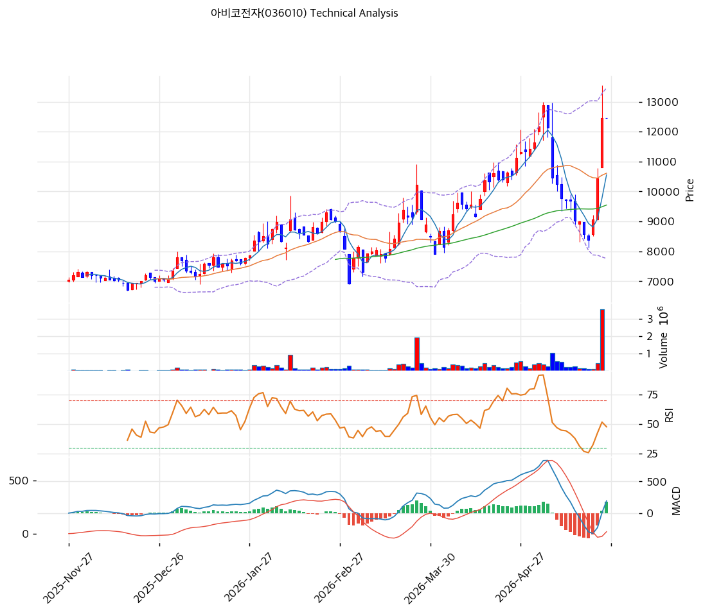

# 아비코전자(036010) 기술적 분석

2026-04-16 | T2 Technical Analysis

---

## 차트

---

## 1. 가격 현황

| 항목 | 값 |
|------|-----|
| 현재가 | 10,380원 (±0.00%) |
| 52주 고가 | 10,380원 |
| 52주 저가 | 6,710원 |
| 52주 범위 위치 | 100.0% |
| 거래량 | 20일 평균 대비 0.00x |

---

## 2. 차트 패턴 분석

### 2.1 캔들스틱 패턴

| 패턴 | 위치 | 신뢰도 | 해석 |
|------|------|--------|------|
| 52주 신고가 도달 | 최근 | 강 | 신고가 경신 자체가 상승 추세 지속의 신호이나, 상단 저항 부재로 추격 매수 시 조정 위험 존재 |
| 거래량 공백 | 최근 거래일 | 약 | 거래량 0.0x로 신고가 도달에도 거래 뒷받침 없어 추세 신뢰도 제한적 |

※ 주요 캔들 패턴: 거래량 데이터 미수신(volume=0)으로 개별 캔들 패턴 신호 확인 불가

### 2.2 가격 구조 패턴

- **52주 신고가 박스권 돌파** (신뢰도: 중)
  현재가 10,380원이 52주 고가와 동일하여 전고점 저항 없이 열린 공간에 위치해 있다. 과거 2022년 고점(약 14,000원대 추정) 대비로는 하방 여유가 있으나, 직전 박스권(7,000~9,500원 구간) 상단을 완전히 이탈한 상황이다. 단기 조정 시 9,800~9,900원(MA5 부근)이 1차 지지 역할을 할 것으로 보인다.

- **상승 추세 채널 진행 중** (신뢰도: 중)
  지지 추세선(기울기 +14.27, 현재 교차가 7,921원)과 저항 추세선(기울기 +52.76, 현재 교차가 11,639원) 사이의 상승 채널이 형성돼 있다. 지지선은 6포인트 접촉으로 신뢰도가 있으며, 채널 상단인 11,639원이 중기 목표가 구간으로 기능한다.

### 2.3 다이버전스

- **RSI 추세 순행** (신뢰도: 중)
  RSI 62.4로 중립~상단 구간에서 가격 상승과 함께 동반 상승 중. 특별한 하락 다이버전스는 미발생 상태로 추세 지속을 지지한다.

- **스토캐스틱 과매수 경고** (신뢰도: 중)
  %K 90.1, %D 75.1로 과매수 영역 진입. 골든크로스 상태이나 90선 이상에서의 유지는 단기 조정 가능성을 시사한다. 하락 다이버전스 형성 여부를 주시할 필요가 있다.

### 2.4 패턴 종합 판단

전반적으로 상승 추세가 유효하며 52주 신고가를 갱신한 상태다. 이동평균 정배열과 MACD 매수 크로스는 중기 상승 모멘텀을 뒷받침한다. 다만 스토캐스틱 과매수(%K 90.1)와 거래량 부재(0.0x)가 단기 상충 시그널로 작용하고 있어, 거래량 동반 없는 신고가 돌파의 신뢰성은 제한적이다. 단기 조정 후 재진입 또는 거래량 확인 후 추격 매수가 안전한 접근이다.

---

## 3. 이동평균선 — 정배열 (강세)

| MA | 값 | 현재가 괴리율 | 위치 |
|----|-----|--------------|------|
| MA5 | 9,852원 | +5.4% | 위 |
| MA20 | 9,248원 | +12.2% | 위 |
| MA60 | 8,590원 | +20.8% | 위 |
| MA120 | 8,025원 | +29.3% | 위 |
| MA200 | — | — | — |

**해석**: MA5 → MA20 → MA60 → MA120 순서로 완전 정배열 구성. 현재가가 모든 이동평균선 위에 위치해 중단기 강세 구조를 확인해 준다. MA20 대비 +12.2% 괴리는 단기 과열 신호로, 통상 MA20 회귀 조정이 발생할 수 있는 수준이다. MA200 데이터는 미집계.

---

## 4. 보조 지표

### RSI(14) — 62.4 (중립)

RSI 62.4는 중립 구간(30~70) 상단에 위치해 있으며, 과매수(70 이상)에 진입하기 직전 수준이다. 현재 추세 방향은 상승이며 단기 과열 전환 여부를 주시해야 한다.

### MACD(12,26,9)

| 항목 | 값 |
|------|-----|
| MACD | 412 |
| Signal | 285 |
| Histogram | +127 |
| 크로스 상태 | 매수 구간 (확대 중) |

**해석**: MACD(412)가 Signal(285)을 상회하는 매수 크로스 상태이며, 히스토그램이 +127로 확대 중이다. 상승 모멘텀이 강화되고 있음을 시사하며, 히스토그램 수축 시점이 매도 신호가 된다.

### 볼린저밴드(20, 2σ)

| 항목 | 값 |
|------|-----|
| 상단 | 10,592원 |
| 중단 (MA20) | 9,248원 |
| 하단 | 7,903원 |
| 밴드 폭 | 29.1% |
| 현재 위치 | 상단 근접 |

**해석**: 현재가 10,380원이 볼린저밴드 상단(10,592원)에 근접해 있다. 밴드 폭 29.1%는 중간 수준으로 스퀴즈 상태는 아니다. 상단 돌파 시 추가 상승 가능하나 밴드 내 회귀 가능성도 배제하지 않아야 한다.

### 스토캐스틱(14, 3, 3)

| 항목 | 값 |
|------|-----|
| Slow %K | 90.1 |
| Slow %D | 75.1 |
| 크로스 상태 | 골든크로스 |
| 판단 | 과매수 |

---

## 5. 지지/저항 — 추세선 · 피보나치 · PRZ 통합

### 5.1 피보나치 되돌림/확장

| 구분 | 비율 | 가격 | 현재가 대비 |
|------|------|------|-----------|
| Swing High | — | 10,230원 | — |
| 되돌림 | 0.236 | 8,458원 | -18.5% |
| 되돌림 | 0.382 | 8,796원 | -15.3% |
| 되돌림 | 0.5 | 9,070원 | -12.6% |
| 되돌림 | 0.618 | 9,344원 | -10.0% |
| 되돌림 | 0.786 | 9,734원 | -6.2% |
| Swing Low | — | 7,910원 | — |
| 확장 | 1.272 | 7,279원 | -29.9% |
| 확장 | 1.382 | 7,024원 | -32.3% |
| 확장 | 1.618 | 6,476원 | -37.6% |
| 확장 | 2.0 | 5,590원 | -46.1% |

※ 피보나치 기준: 하락 추세 (Swing High 10,230원 → Swing Low 7,910원). 현재가가 Swing High를 상회하므로 되돌림 구간은 하방 지지로 기능

### 5.2 추세선

| 추세선 | 방향 | 현재 교차가 | 포인트 수 | 해석 |
|--------|------|-----------|---------|------|
| 지지선 | 상승 | 7,921원 | 6개 | 장기 우상향 지지. 현재가 대비 -23.7%로 강력 하방 지지 |
| 저항선 | 상승 | 11,639원 | 6개 | 중기 목표가 역할. 현재가 대비 +12.1% 상단 |

### 5.3 PRZ (Potential Reversal Zone)

| 방향 | 가격 범위 | 신뢰도 | 근거 |
|------|---------|--------|------|
| 지지 | 10,380원 | 강 | 피봇 P·R1·R2·S1·S2 밀집, 52주 고가 |
| 지지 | 9,734~9,852원 | 약 | 피보나치 0.786 되돌림 + MA5 |
| 지지 | 9,070~9,344원 | 중 | 피보나치 0.5·0.618 되돌림 + MA20 |
| 지지 | 8,458~8,796원 | 중 | 피보나치 0.236·0.382 되돌림 + MA60 |
| 지지 | 7,921~8,025원 | 약 | 추세선 지지 + MA120 |

### 5.4 종합 지지/저항 테이블

| 구분 | 가격 | 근거 |
|------|------|------|
| 저항 | 11,639원 | 상승 저항 추세선 (6포인트) |
| 저항 | 10,592원 | 볼린저밴드 상단 |
| **현재가** | **10,380원** | — |
| 지지 | 9,793원 | PRZ (약) — 피보나치 0.786 + MA5 |
| 지지 | 9,248원 | MA20 / PRZ (중) — 피보나치 0.5·0.618 |
| 지지 | 8,615원 | PRZ (중) — 피보나치 0.236·0.382 + MA60 |
| 지지 | 7,921원 | 상승 지지 추세선 / MA120 |

---

## 6. 시그널 종합

| 지표 | 내용 | 시그널 |
|------|------|--------|
| **차트 패턴** | 52주 신고가·상승 채널 유지, 거래량 부재 | 🟢 |
| 이동평균선 | 정배열, MA20 +12.2% 괴리 | 🟢 |
| RSI | 62.4 — 중립 상단 | ⚪ |
| MACD | 매수 크로스, 히스토그램 +127 확대 | 🟢 |
| 볼린저밴드 | 상단 근접(10,592원), 밴드 폭 29.1% | ⚪ |
| 스토캐스틱 | 골든크로스이나 %K 90.1 과매수 | 🔴 |
| 거래량 | 0.0x — 약함 | ⚪ |

**종합 판단**: 🟢 매수 3개 / 🔴 매도 1개 / ⚪ 중립 3개 → **매수우위**

중기 추세(이동평균 정배열·MACD 매수 크로스)는 명확한 상승 구조를 보여준다. 다만 스토캐스틱 과매수(%K 90.1)와 거래량 부재라는 두 가지 경고 신호가 동시에 나타나고 있어, 단기적으로는 MA20(9,248원) 수준까지의 조정 가능성을 열어두어야 한다. 거래량이 동반된 11,639원(저항 추세선) 돌파가 확인된다면 추가 상승 여지가 충분하다.

---

## 7. 전략 제안

### 보유 중인 경우
- **홀드**
- 익절 라인: 11,639원 (상승 저항 추세선 — 현재가 대비 +12.1%)
- 손절 라인: 9,248원 (MA20 이탈, PRZ 중단 지지 붕괴)
- 리스크/리워드: 약 1:2.5

### 진입 대기인 경우
- **관망 후 조정 시 진입**
- 1차 진입가: 9,793원 (PRZ 약 — 피보나치 0.786 + MA5 수렴 구간)
- 2차 진입가: 9,248원 (MA20 / PRZ 중 구간)
- 진입 조건: 거래량 동반 반등 확인 후 진입. 스토캐스틱 %K 70 이하 하락 후 재반등 시 신호
