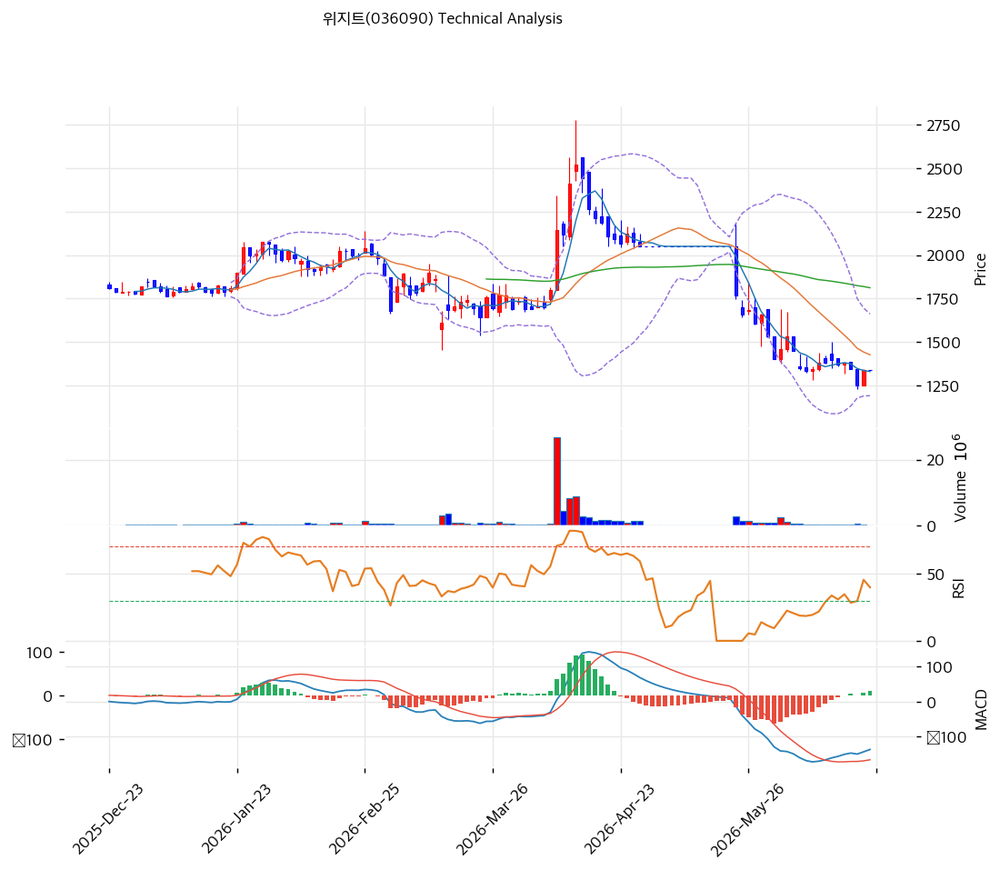

# 위지트(036090) 기술적 분석

2026-06-23 | T2 Technical Analysis

---

## 차트

---

## 1. 가격 현황

| 항목 | 값 |
|------|-----|
| 현재가 | 1,340원 (0.00%) |
| 52주 고가 | 2,517원 |
| 52주 저가 | 1,251원 |
| 52주 범위 위치 | 7.0% (저점권) |
| 거래량비 | 0.0x (한산) |
| RSI | 34.6 (중립, 과매도 근접) |

> 52주 고가(2,517원) 대비 -47% 하락해 저점(1,251원) 근접(1,340원). 단기선(MA5 1,331) 부근이나 중장기선(MA20 1,427·MA60 1,812·MA200 1,879) 아래로 **하락 추세**. RSI 34.6·스토캐 K=17.4 과매도권. 거래 한산. 액면병합·유증 부담으로 약세 지속 후 바닥 모색. **최근 테마 급등주들과 정반대로 저점권**.

---

## 2. 차트 패턴 분석

### 2.1 구조·캔들

| 패턴 | 위치 | 신뢰도 | 해석 |
|------|------|--------|------|
| 고점 후 하락·저점권 | 2,517→1,340 | 중상 | -47% 하락 |
| 52주 저점 지지 시험 | 1,251 부근 | 중 | 바닥 공방 |
| 과매도·MACD 반등 시도 | RSI 34·MACD+ | 중 | 단기 반등 여지 |

- **하락 추세 내 바닥 모색** (신뢰도: 중상): 고점 -47% 후 52주 저점(1,251) 근접. MACD 히스토그램 양(+) 전환 미약하나 과매도 해소 시도.
- **희석·수급 약세** (신뢰도: 중): 유증·CB·외국인 매도가 반등 제약. 거래 한산.

### 2.2 다이버전스

- **과매도 단기 반등 여지** (신뢰도: 중): 스토캐 과매도(K=17.4) 골든크로스·MACD 매수 전환 시도. 단 펀더(유증·둔화)가 추세 반등 제약.

---

## 3. 이동평균선 — 하락 추세·저점권

| MA | 값 | 괴리율 | 위치 |
|----|-----|--------|------|
| MA5 | 1,331 | +0.7% | 위(근접) |
| MA20 | 1,427 | -6.1% | 아래 |
| MA60 | 1,812 | -26.0% | 아래 |
| MA120 | 1,837 | -27.1% | 아래 |
| MA200 | 1,879 | -28.7% | 아래 |

**해석**: 단기선(MA5) 부근이나 중장기선(MA20·MA60·MA200) 아래로 **명확한 하락 추세**(정배열 아님). MA200 대비 -28.7%로 깊은 조정. MA20(1,427) 회복이 단기 반등 1차 관문, MA60(1,812)이 추세 전환선. 저점(1,251)이 지지.

---

## 4. 보조 지표

### RSI(14) — 34.6 (중립, 과매도 근접)
30 근접. 추가 하락 시 과매도, 단기 반등 여지.

### MACD(12,26,9)
| MACD | Signal | Hist | 크로스 |
|---|---|---|---|
| -138 | -148 | +10 | 매수 전환(미약) |

영선 아래에서 히스토그램 양(+) 전환 — 하락 모멘텀 약화·바닥 시도. 추세 전환은 미확정.

### 볼린저밴드(20,2σ)
| 상단 | 중단 | 하단 | 밴드폭 |
|---|---|---|---|
| 1,662 | 1,427 | 1,192 | 32.9% |

현재가 1,340은 중단(1,427)과 하단(1,192) 사이. 하단(1,192) 지지 시 반등, 중단 회복 시 반등 가속.

### 스토캐스틱
| %K | %D | 판단 |
|---|---|---|
| 17.4 | 15.3 | 과매도(골든크로스) |

과매도권 골든크로스 — 저점 단기 반등 신호.

---

## 5. 지지/저항

| 구분 | 가격 | 근거 |
|------|------|------|
| 저항 | 2,517 | 52주 고가 |
| 저항 | 2,003 | 피보 0.5 |
| 저항 | 1,879 | MA200 |
| 저항 | 1,821 | 피보 0.382·MA60 |
| 저항 | 1,662 | 볼린저 상단 |
| 저항 | 1,596 | 피보 0.236 |
| 저항 | 1,427 | MA20·볼린저 중단 |
| **현재가** | **1,340** | 저점권 |
| 지지 | 1,338 | PRZ(강)·MA5 |
| 지지 | 1,251 | 52주 저점 |
| 지지 | 1,192 | 볼린저 하단 |

---

## 6. 시그널 종합

| 지표 | 내용 | 시그널 |
|------|------|--------|
| 차트 패턴 | 하락 추세·저점 시험 | ⚪ |
| 이동평균선 | 중장기선 아래(하락) | 🔴 |
| RSI | 34.6 — 중립(과매도 근접) | ⚪ |
| MACD | 매수 전환(미약) | 🟢 |
| 볼린저밴드 | 중간~하단 | ⚪ |
| 스토캐스틱 | 과매도(K=17.4) | 🟢 |
| 거래량 | 한산 | ⚪ |

**종합 판단**: 🟢 매수 2개 / 🔴 매도 1개 / ⚪ 중립 4개 → **중립 (하락 후 바닥 모색)**

52주 고가 대비 -47% 하락해 저점(1,251)을 시험하는 국면. 과매도(RSI 34·스토캐 17)·MACD 매수 전환 시도로 단기 반등 여지가 있으나, 중장기선(MA60 1,812) 아래로 추세는 미전환이고 유증·CB·외국인 매도가 반등을 제약한다. **저점(1,251) 지지 + 유증 일정 소화·AI PSU 가시화**가 추세 전환의 전제. 깊은 저평가(PBR 0.36)가 하방을 일부 받침.

---

## 7. 전략 제안

### 보유 중인 경우
- **홀드 (저점 지지 주시)**
- 익절: 1,427(MA20)·1,662(볼린저 상단)·1,812(MA60) 단계 반등 시
- 손절: 1,251(52주 저점)·1,192(볼린저 하단) 이탈
- 거래 한산·희석 부담, 분할 대응

### 진입 대기인 경우
- **분할 (과매도 반등·저점 확인)**
- 1차: 1,251\~1,340 (52주 저점·현 가격대)
- 2차: 1,192 (볼린저 하단 지지)
- 진입 조건: 깊은 저평가(PBR 0.36)·과매도로 가치 매수 영역이나, 유증(2026.6.2) 일정·CB 희석·성장 둔화가 단기 부담. 유증 소화·MA20(1,427) 회복·AI PSU 가시화 확인 후 분할. 가치함정 유의.
