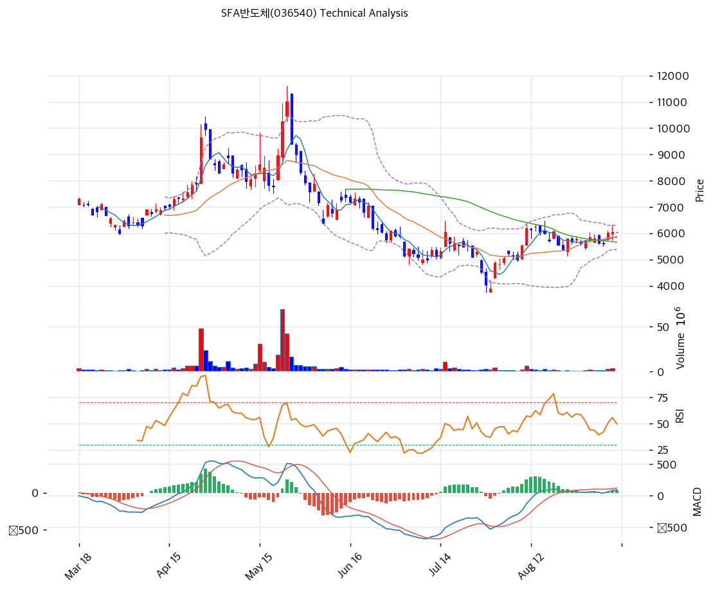

# 에스에프에이반도체(036540) 기술적 분석

---

## 가격 현황

| 항목 | 값 |
|------|-----|
| 현재가 | 6,040원 (+0.50%) |
| 52주 고가 | 11,010원 (2026-05-26 종가), 장중 11,640원 |
| 52주 저가 | 3,395원 (2025-09-08 종가), 장중 3,300원 |
| 52주 범위 위치 | 34.7% (종가 기준) |
| 고점 대비 | -45.1% |
| 2026년 저점(7/30 3,885원) 대비 | +55.5% |
| 거래량 | 3,887,790주, 20일 평균 1,996,007주 대비 1.95x |

52주 안에서 3,395원에서 11,010원까지 224% 올랐다가 3,885원까지 65% 빠지고 지금 6,040원이다. 1년 사이 세 자릿수 상승과 반토막을 한 번씩 겪은 차트이며, 현재는 그 중간 지점에서 3주째 횡보한 뒤 위쪽으로 발을 뗀 상태다.

---

## 이동평균선

| MA | 값 | 현재가 괴리율 | 위치 |
|----|-----|--------------|------|
| MA5 | 5,864원 | +3.0% | 위 |
| MA20 | 5,835원 | +3.5% | 위 |
| MA60 | 5,656원 | +6.8% | 위 |
| MA120 | 6,666원 | -9.4% | 아래 |
| MA200 | 6,247원 | -3.3% | 아래 |

배열 상태는 비정배열이다. 단기 3개 선(MA5·MA20·MA60)은 모두 현재가 아래에 붙어 있어 단기 흐름은 살아 있고, 장기 2개 선(MA120·MA200)은 현재가 위에 있어 중기 추세는 여전히 하락 국면이다. MA5와 MA20이 5,864원과 5,835원으로 29원 차이까지 붙었다는 점이 눈에 띈다. 단기선이 완전히 수렴한 상태에서 가격이 위로 이탈했으므로 방향이 정해지는 구간이다.

MA200 6,247원이 첫 관문이다. 여기를 종가로 넘기면 200일선 위 복귀이고, 다음 벽이 MA120 6,666원이다. 두 선 사이 6,247원에서 6,666원 구간이 3개월 넘게 저항으로 작동해왔다.

---

## 모멘텀 지표

### RSI(14): 56.2 (중립)

50선 위로 올라섰지만 과열권과는 거리가 멀다. 8월 24일 47.1까지 내렸다가 회복하는 흐름이며, 상방으로 70까지 여유가 있다. 5월 26일 고점 당시 RSI는 71.9였고 1월 30일에는 85.5였다.

### MACD(12,26,9)

| 항목 | 값 |
|------|-----|
| MACD | 82 |
| Signal | 58 |
| Histogram | +24 |
| 크로스 상태 | 매수 구간 (재확대 중) |

8월 13일 히스토그램이 +227까지 벌어진 뒤 9월 4일 마이너스 8까지 수축하며 데드크로스 직전까지 갔다. 9월 7일과 8일 이틀 만에 +11, +24로 되돌아왔고 MACD 본선도 41에서 82로 두 배가 됐다. 수축이 끝나고 다시 벌어지기 시작한 초기 구간이다.

### 볼린저밴드(20, 2σ)

| 항목 | 값 |
|------|-----|
| 상단 | 6,287원 |
| 중단 (MA20) | 5,835원 |
| 하단 | 5,383원 |
| 밴드 폭 | 15.5% |
| 현재 위치 | 중간 상단 |

밴드 폭 15.5%는 이 종목 기준으로 좁은 쪽이다. 5월과 7월 급변동 구간에서는 30%를 넘었다. 3주 박스 횡보가 밴드를 조인 결과이며, 폭이 좁아진 상태에서 가격이 상단 6,287원 쪽으로 붙고 있다. 스퀴즈 후 방향성 확대가 나오는 전형적 배치다.

### 스토캐스틱(14, 3, 3)

| 항목 | 값 |
|------|-----|
| Slow %K | 80.3 |
| Slow %D | 66.8 |
| 크로스 상태 | 골든크로스 |
| 판단 | 과매수 진입 |

%K가 80을 넘겨 과매수 구간에 들어왔다. %D 66.8과 13.5p 벌어져 있어 단기 과열 신호이며, 여기서 %K가 꺾이면 눌림목이 나온다.

---

## 차트 패턴

### 캔들스틱

| 패턴 | 위치 | 신뢰도 | 해석 |
|------|------|--------|------|
| 거래량 동반 장악형 | 2026-09-07 | 중 | 5,610원에서 6,010원으로 +7.1% 상승, 거래량 315만주로 20일 평균의 1.58배. 직전 3거래일 음봉 구간을 한 번에 덮었다 |
| 연속 양봉 | 2026-09-07\~09-08 | 약 | 이틀 연속 상승이지만 둘째 날 폭이 +0.5%로 작다. 거래량은 389만주로 더 늘어 매수세는 유지 |
| 십자형 도지 근접 | 2026-09-04 | 약 | 5,620원에서 5,610원으로 10원 하락, 박스 하단에서 방향 결정 대기 신호였다 |

박스권 3주(8/19\~9/4, 5,390\~6,060원) 동안 8개 음봉과 7개 양봉이 번갈아 나오며 방향이 없었고, 9월 7일 거래량이 실린 양봉 하나로 상단을 뚫었다.

### 가격 구조

- **박스권 상단 돌파** (신뢰도: 중)
  8월 19일부터 9월 4일까지 12거래일간 5,390원에서 6,060원 사이 670원(12.4%) 폭에 갇혀 있었다. 9월 7일 6,010원, 8일 6,040원으로 상단을 종가로 넘겼고 거래량도 평균의 1.58배와 1.95배로 실렸다. 돌파 폭만큼의 목표는 6,060 + 670 = 6,730원이며, 이는 MA120 6,666원과 겹친다. 실패 조건은 5,835원(MA20) 아래 종가 복귀다

- **하락 쐐기 수렴** (신뢰도: 중)
  5월 26일 고점 11,010원 이후 형성된 하락 저항선(기울기 -14.53, 6접점)과 상승 지지선(기울기 0.54, 6접점)이 좁혀지고 있다. 현재 저항선 교차가는 7,431원, 지지선은 4,778원이다. 수렴 폭이 여전히 2,650원(현재가의 44%)이므로 결론까지는 시간이 더 필요하다. 하락 쐐기는 통계적으로 상방 이탈 빈도가 높지만, 이 종목의 지지선 기울기가 거의 수평(0.54)이어서 전형적 쐐기보다는 넓은 삼각수렴에 가깝다

- **이중 바닥 미완성** (신뢰도: 약)
  2025년 9월 8일 3,395원과 2026년 7월 30일 3,885원이 10개월 간격의 두 저점이다. 두 번째 저점이 첫 저점보다 14.4% 높아 형태상 상승 이중 바닥이지만, 넥라인에 해당하는 중간 고점이 11,010원으로 너무 높아 패턴으로 기능하지 않는다

### 다이버전스

- **RSI 하락 다이버전스** (신뢰도: 강, 이미 실현)
  1월 30일 종가 7,840원에서 RSI 85.5, 5월 26일 종가 11,010원에서 RSI 71.9였다. 가격은 40.4% 높은 고점을 만들었는데 RSI는 13.6p 낮았다. MACD도 524에서 522로 제자리였다. 이 괴리 뒤 6월과 7월 두 달 동안 종가가 11,010원에서 3,885원으로 64.7% 빠졌다. 신호가 이미 작동을 마친 사례로, 현재 판단에 쓸 신호는 아니다

- **MACD 상승 다이버전스** (신뢰도: 중, 실현)
  6월 30일 종가 5,910원에서 MACD 마이너스 544, 7월 28일 종가 4,520원에서 마이너스 396이었다. 가격은 23.5% 낮은 저점을 만들었는데 MACD는 148 올라왔다. RSI는 37.7에서 34.2로 같이 내려가 확인해주지 않았으므로 MACD 단독 신호였고, 7월 31일 +25.4% 급반등으로 실현됐다

- **현재 진행 중인 다이버전스** (없음)
  9월 들어 가격과 RSI·MACD가 같은 방향으로 움직인다. 괴리 신호는 잡히지 않는다

### 패턴 종합

단기 신호는 상방으로 정렬돼 있다. 3주 박스 상단을 거래량 1.95배로 돌파했고, 볼린저 밴드 폭이 좁아진 상태에서 MACD 히스토그램이 다시 벌어지기 시작했다. 반대로 중기 구조는 미해결이다. MA120·MA200이 여전히 머리 위에 있고 5월 고점 이후 하락 저항선은 7,431원까지 내려와 있다. 스토캐스틱 %K 80.3은 단기 과열을 알린다. 정리하면 6,247원(MA200)에서 6,666원(MA120) 구간을 돌파하기 전까지는 박스 상단 돌파 이상의 의미를 부여하기 어렵다.

---

## 지지·저항

### 피보나치 되돌림

| 구분 | 비율 | 가격 | 현재가 대비 |
|------|------|------|-----------|
| Swing High | 데이터 없음 | 11,640원 | +92.7% |
| 되돌림 | 0.786 | 9,842원 | +63.0% |
| 되돌림 | 0.618 | 8,431원 | +39.6% |
| 되돌림 | 0.5 | 7,440원 | +23.2% |
| 되돌림 | 0.382 | 6,449원 | +6.8% |
| 되돌림 | 0.236 | 5,222원 | -13.5% |
| Swing Low | 데이터 없음 | 3,240원 | -46.4% |

※ 피보나치 기준: 하락 추세 (Swing High 11,640원 → Swing Low 3,240원, 진폭 8,400원)
※ 확장 레벨은 진폭이 현재가를 초과해 유효 범위를 벗어나므로 산출하지 않았다

현재가 6,040원은 0.236(5,222원)과 0.382(6,449원) 사이에 있다. 하락분의 33% 정도만 되돌린 위치다. 0.382 되돌림 6,449원은 MA200 6,247원, MA120 6,666원과 함께 6,250원에서 6,670원 저항 밴드를 형성한다.

### 추세선

| 추세선 | 방향 | 현재 교차가 | 포인트 수 | 해석 |
|--------|------|-----------|---------|------|
| 지지선 | 상승 | 4,778원 | 6개 | 기울기 0.54로 거의 수평. 현재가보다 20.9% 낮아 즉각적 지지 역할은 하지 않는다 |
| 저항선 | 하락 | 7,431원 | 6개 | 기울기 -14.53으로 하루 14.5원씩 내려온다. 5월 고점 이후 반등을 여섯 번 막았다 |

저항선이 하루 14.5원 내려오므로 가격이 제자리에 있어도 한 달 뒤 교차가는 7,140원대가 된다. 시간이 상방에 유리하게 작동하는 배치다.

### PRZ

| 방향 | 가격 범위 | 신뢰도 | 근거 |
|------|---------|--------|------|
| 지지 | 5,835\~5,864원 | 약 | MA20 5,835 + MA5 5,864 겹침. 두 선이 29원 차로 수렴 |
| 저항 | 6,247\~6,449원 | 중 | MA200 6,247 + 피보나치 0.382 6,449 겹침 |
| 저항 | 7,431\~7,440원 | 중 | 하락 추세선 7,431 + 피보나치 0.5 7,440 겹침. 두 근거가 9원 차로 일치 |

7,431원에서 7,440원 구간은 추세선과 피보나치 0.5가 사실상 같은 가격에서 만난다. 반등이 여기서 막히면 쐐기 수렴이 계속되고, 넘기면 5월 고점 이후 하락 구조가 깨진다.

### 종합 지지·저항

| 구분 | 가격 | 근거 |
|------|------|------|
| 저항 | 11,010원 | 52주 고가 (2026-05-26 종가) |
| 저항 | 8,431원 | 피보나치 0.618 |
| 저항 | 7,431\~7,440원 | 하락 추세선 + 피보나치 0.5 (PRZ 중) |
| 저항 | 6,666원 | MA120 + 박스 돌파 목표 6,730원 근접 |
| 저항 | 6,247\~6,449원 | MA200 + 피보나치 0.382 (PRZ 중) |
| **현재가** | **6,040원** | 박스권 상단 돌파 직후 |
| 지지 | 5,835\~5,864원 | MA20 + MA5 (PRZ 약) |
| 지지 | 5,656원 | MA60 |
| 지지 | 5,390원 | 8월 박스 하단 (8/24 종가) |
| 지지 | 5,222원 | 피보나치 0.236 |
| 지지 | 4,778원 | 상승 추세선 6접점 |
| 지지 | 3,885원 | 2026년 최저 종가 (7/30) |

※ 데이터 미형성으로 피봇 포인트는 사용하지 않았다. 09-09 일봉이 아직 만들어지지 않아 피봇·거래량 비율 원본값이 전부 0 또는 동일값으로 산출됐다

---

## 거래량과 수급

### 거래량이 실린 날

| 날짜 | 종가 | 거래량 | 발행주식 대비 | 유통주식 대비 |
|------|-----:|------:|----------:|----------:|
| 2026-05-22 | 10,250원 | 69,036,014주 | 42.0% | 93.9% |
| 2026-02-26 | 8,340원 | 55,449,340주 | 33.7% | 75.4% |
| 2026-04-24 | 9,640원 | 47,485,150주 | 28.9% | 64.6% |
| 2026-05-26 | 11,010원 | 42,062,040주 | 25.6% | 57.2% |
| 2026-05-15 | 데이터 없음 | 31,000,471주 | 18.9% | 42.2% |
| 2026-01-30 | 7,840원 | 27,125,815주 | 16.5% | 36.9% |

유통주식 7,352만주 기준으로 5월 22일 하루에 93.9%가 손바뀜했다. 최대주주 지분 55%와 자사주를 제외한 실질 유통물량이 하루 만에 거의 전부 돌았다는 뜻이다. 이런 회전율은 실적 기반 매매가 아니라 단기 자금이 만든 것으로 봐야 한다. 현재 거래량 389만주는 그 국면의 5.6% 수준으로, 시장의 관심 자체는 크게 식은 상태다.

### 투자자별 순매수

| 구분 | 20일 누적 | 5일 누적 |
|------|--------:|-------:|
| 외국인 | -1,259,779주 (-76억원) | +341,650주 |
| 기관 | +1,735,748주 (+109억원) | +356,717주 |

20일 기준으로 외국인이 팔고 기관이 받았다. 순매수 금액이 각각 마이너스 76억원과 플러스 109억원으로 기관 쪽이 33억원 많다. 최근 5일은 양쪽 모두 순매수로 전환해 34만주와 35만주씩 사들였다. 박스 상단 돌파에 두 주체가 함께 붙었다는 점이 단기 신호로는 긍정적이다.

---

## 월별 가격 흐름

| 월 | 종가 | MoM |
|----|-----:|----:|
| 2024-12 | 3,085원 | 데이터 없음 |
| 2025-03 | 3,010원 | -2.4% |
| 2025-06 | 3,150원 | +4.7% |
| 2025-09 | 4,095원 | +30.0% |
| 2025-12 | 4,575원 | +11.7% |
| 2026-01 | 7,840원 | +71.4% |
| 2026-02 | 7,900원 | +0.8% |
| 2026-03 | 5,990원 | -24.2% |
| 2026-04 | 8,300원 | +38.6% |
| 2026-05 | 8,320원 | +0.2% |
| 2026-06 | 5,910원 | -29.0% |
| 2026-07 | 4,870원 | -17.6% |
| 2026-08 | 5,700원 | +17.0% |
| 현재 | 6,040원 | +6.0% |

2026년 들어 월간 변동률이 -29.0%에서 +71.4% 사이를 오간다. 1월 +71.4%, 3월 -24.2%, 4월 +38.6%, 6월 -29.0%로 방향이 두 달을 못 버틴다. 일간으로도 2026년에 하루 14% 이상 움직인 날이 12거래일이다(1/5 +17.5%, 1/30 +14.3%, 2/26 +16.3%, 3/4 -14.5%, 3/5 +17.1%, 4/24 +22.2%, 5/21 +15.0%, 5/22 +14.5%, 5/27 -14.6%, 7/15 +14.2%, 7/28 -14.4%, 7/31 +25.4%). 베타 1.775가 숫자로 확인되는 흐름이다.

---

## 시그널 종합

| 지표 | 내용 | 시그널 |
|------|------|--------|
| 차트 패턴 | 박스 상단 거래량 동반 돌파, 하락 쐐기 수렴 진행 | 🟢 |
| 이동평균선 | 비정배열, MA5·MA20 수렴 후 상방 이탈, MA120·MA200은 위에 | ⚪ |
| RSI | 56.2, 중립 구간 상단 | ⚪ |
| MACD | 82 / 58 / +24, 히스토그램 재확대 초기 | 🟢 |
| 볼린저밴드 | 폭 15.5% 스퀴즈 후 상단 접근 | ⚪ |
| 스토캐스틱 | %K 80.3 과매수, %D와 13.5p 이격 | 🔴 |
| 거래량 | 1.95x, 돌파에 실렸으나 5월 대비 5.6% 수준 | 🟢 |

**종합 판단**: 🟢 매수 3개 / 🔴 매도 1개 / ⚪ 중립 3개 → **약한 매수 우위**

단기는 매수 우위, 중기는 미해결이다. 3주 박스 상단을 거래량 실린 양봉으로 넘겼고 MACD 히스토그램이 데드크로스 직전에서 되돌아섰으며 외국인·기관이 5일 동선을 함께 잡았다. 이 조합은 6,247원(MA200)에서 6,666원(MA120) 구간까지의 시도를 뒷받침한다. 그 위로는 근거가 얇다. 하락 추세선 7,431원과 피보나치 0.5 7,440원이 9원 차로 겹치는 지점을 넘겨야 5월 이후 하락 구조가 끝나기 때문이다. 스토캐스틱 과매수는 눌림목이 먼저 나올 확률을 시사한다.

---

## 전략

### 보유 중인 경우

- **홀드**
- 1차 익절 라인: 6,449원 (피보나치 0.382 + MA200 6,247원 통과 확인 후, 현재가 대비 +6.8%)
- 2차 익절 라인: 6,666\~6,730원 (MA120 + 박스 돌파 목표, 현재가 대비 +10.4%에서 +11.4%)
- 3차 익절 라인: 7,431원 (하락 추세선 + 피보나치 0.5 겹침, 현재가 대비 +23.0%)
- 손절 라인: 5,835원 (MA20 아래 종가 복귀 = 박스 돌파 실패 확정, 현재가 대비 -3.4%)
- 리스크·리워드: 1차 익절 기준 2.0 대 1, 2차 기준 3.1 대 1

### 진입 대기인 경우

- **분할 진입 가능**
- 1차 진입가: 5,835\~5,864원 (MA20·MA5 수렴 PRZ, 돌파 후 눌림목 대기)
- 2차 진입가: 5,390\~5,656원 (MA60 5,656 + 8월 박스 하단 5,390)
- 3차 진입가: 5,222원 (피보나치 0.236, 여기 이탈 시 박스 하단 재진입으로 시나리오 폐기)
- 진입 조건: MA200 6,247원 종가 돌파 또는 5,835원 눌림목에서 거래량 감소 확인. 스토캐스틱 %K 80.3이 과매수권이므로 지금 시장가 추격은 불리한 자리다
- 회피 조건: 5,835원 아래 종가 마감 시 박스 상단 돌파를 실패로 처리. 이 종목은 하루 15% 변동이 연 12회 발생하므로 손절 폭을 좁게 잡으면 노이즈에 털린다
