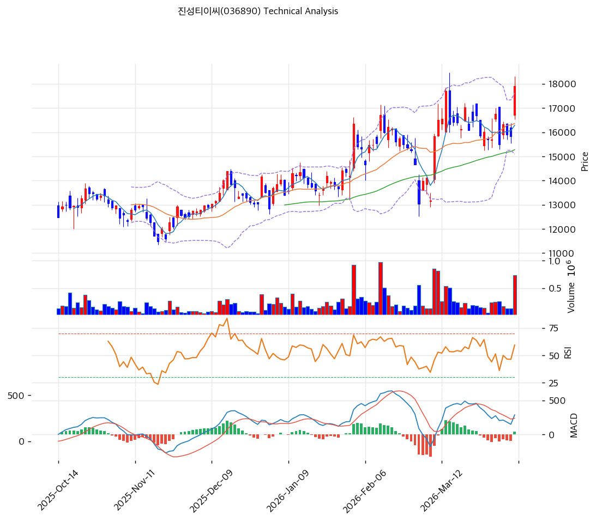

# 진성티이씨(036890) 기술적 분석

2026-04-08 | T2 Technical Analysis

---

## 차트

---

## 1. 가격 현황

| 항목 | 값 |
|------|-----|
| 현재가 | 17,900원 (+13.08%) |
| 52주 고가 | 17,900원 |
| 52주 저가 | 7,800원 |
| 52주 범위 위치 | 100.0% |
| 거래량 | 20일 평균 대비 2.91x |

---

## 2. 차트 패턴 분석

### 2.1 캔들스틱 패턴

| 패턴 | 위치 | 신뢰도 | 해석 |
|------|------|--------|------|
| 대양봉 (장대양봉) | 2026-04-08 당일 | 강 | 전일 대비 +13.08% 급등, 강력한 매수세 유입 시그널로 단기 추세 전환 확인 |
| 52주 신고가 돌파 | 2026-04-08 | 강 | 52주 고가(17,900원)와 현재가 일치, 역사적 저항 돌파 여부가 단기 관건 |

※ 주요 캔들 패턴: 망치형, 역망치형, 장악형(상승/하락), 도지, 샛별/석별, 적삼병/흑삼병, 하라미, 유성형, 교수형 등

### 2.2 가격 구조 패턴

- **상승 추세 복귀** (신뢰도: 강)
  저점 7,800원(52주 저가)에서 17,900원까지 +129% 급등하여 장기 상승 추세로 재진입한 구조. 현재 52주 고가와 현재가가 동일하여 신고가 돌파 시도 중이며, 돌파 성공 후 조정 없이 추가 상승할 경우 피봇 R1(18,630원)~R2(19,360원)가 다음 목표대가 된다.

- **볼린저밴드 상단 밀착** (신뢰도: 중)
  현재가 17,900원이 볼린저 상단(17,626원)을 상향 돌파한 상태로, 단기 과열 가능성이 있다. 밴드 폭 15.4%는 확장 추세로, 추세 지속 vs. 되돌림 분기점에 위치한다.

### 2.3 다이버전스

- **RSI 히든 상승 다이버전스 없음** (신뢰도: 해당없음)
  RSI 60.7로 중립 구간이며 뚜렷한 다이버전스가 관찰되지 않는다. 당일 급등에도 불구하고 RSI가 과매수(70 이상)에 진입하지 않아 추가 상승 여력이 남아있음을 시사한다.

- **MACD 상승 지속** (신뢰도: 중)
  히스토그램 +37로 양전환 이후 확대 중이지만 이번 세션부터 수축 전환 여부 주시 필요. 히스토그램 수축 없이 양수 유지 시 매수 구간 지속으로 해석한다.

### 2.4 패턴 종합 판단

당일 +13.08% 장대양봉과 함께 52주 신고가를 기록하는 강력한 모멘텀을 보이고 있다. RSI(60.7)가 아직 과매수 구간에 진입하지 않아 추가 상승 여력이 있으나, 볼린저 상단 돌파와 대량 거래량(2.91x)이 동반된 급등 이후 단기 조정 가능성도 배제할 수 없다. 상충 요인: 강세(거래량·신고가)와 단기 과열(볼린저 상단 이탈) 신호가 공존하므로 진입 시 단계적 접근이 권고된다.

---

## 3. 이동평균선 — 비정배열 (강세)

| MA | 값 | 현재가 괴리율 | 위치 |
|----|-----|--------------|------|
| MA5 | 16,288원 | +9.9% | 위 |
| MA20 | 16,362원 | +9.4% | 위 |
| MA60 | 15,277원 | +17.2% | 위 |
| MA120 | 14,135원 | +26.6% | 위 |
| MA200 | 13,241원 | +35.2% | 위 |

**해석**: 현재가가 5개 이동평균선 전체를 상회하는 강세 구조이나, MA5(16,288)와 MA20(16,362)이 교차 상태로 정배열 완성 직전이다. MA200 대비 +35.2% 괴리율은 단기 급등에 따른 과열 신호이며, 주요 지지선은 MA20(16,362)~MA60(15,277) 구간이다. 당일 급등 전까지 이동평균선이 수렴 상태였던 점은 이번 상승의 압축 에너지 해소로 해석된다.

---

## 4. 보조 지표

### RSI(14) — 60.7 (중립)

RSI 60.7은 중립 구간 상단으로, 과매수(70)까지 여유가 있어 단기 추가 상승 시 지표 부담은 제한적이다.

### MACD(12,26,9)

| 항목 | 값 |
|------|-----|
| MACD | 287 |
| Signal | 250 |
| Histogram | +37 |
| 크로스 상태 | 매수 구간 (수축 중) |

**해석**: MACD(287)가 Signal(250)을 상회하는 매수 구간이나, 히스토그램(+37)이 수축 국면으로 전환했을 가능성이 있어 모멘텀 지속 여부를 확인해야 한다.

### 볼린저밴드(20, 2σ)

| 항목 | 값 |
|------|-----|
| 상단 | 17,626원 |
| 중단 (MA20) | 16,362원 |
| 하단 | 15,098원 |
| 밴드 폭 | 15.4% |
| 현재 위치 | 상단 근접 (이탈) |

**해석**: 현재가(17,900원)가 볼린저 상단(17,626원)을 이탈한 상태로 단기 과열 구간. 밴드 폭 15.4%는 확장 추세이며, 이탈 후 되돌림 발생 시 중단(MA20·16,362원)이 첫 번째 지지대가 된다.

### 스토캐스틱(14, 3, 3)

| 항목 | 값 |
|------|-----|
| Slow %K | 50.0 |
| Slow %D | 40.5 |
| 크로스 상태 | 골든크로스 |
| 판단 | 중립 |

---

## 5. 지지/저항

| 구분 | 가격 | 근거 |
|------|------|------|
| 저항 | 18,630원 | 피봇 R1 |
| 저항 | 19,360원 | 피봇 R2 |
| **현재가** | **17,900원** | 52주 고가 = 현재가 |
| 지지 | 16,850원 | 피봇 S1 |
| 지지 | 16,362원 | MA20 |
| 지지 | 15,800원 | 피봇 S2 |
| 지지 | 15,277원 | MA60 |

---

## 6. 시그널 종합

| 지표 | 내용 | 시그널 |
|------|------|--------|
| **차트 패턴** | 장대양봉·52주 신고가·볼린저 상단 돌파 공존 | ⚪ |
| 이동평균선 | 비정배열, MA20 +9.4% 상회 | ⚪ |
| RSI | 60.7 — 중립 (과매수 미진입) | ⚪ |
| MACD | 매수구간, 히스토그램 수축 주시 | ⚪ |
| 볼린저밴드 | 상단 이탈, 밴드 폭 15.4% 확장 | ⚪ |
| 스토캐스틱 | 골든크로스, K=50 중립 | ⚪ |
| 거래량 | 2.91x — 강력 동반 | 🟢 |

**종합 판단**: 🟢 매수 1개 / 🔴 매도 0개 / ⚪ 중립 6개 → **매수우위**

당일 +13.08% 급등과 거래량 2.91배 동반 상승은 강력한 매수 신호지만, 대부분의 보조지표는 아직 중립 구간에 머물러 있어 추세 지속 확인이 필요하다. 52주 신고가(17,900원) 돌파 이후 추가 상승하면 피봇 R1(18,630원)까지 상승 여지가 있으며, 단기 되돌림 발생 시 MA20(16,362원)~피봇 S1(16,850원) 구간이 강한 지지대 역할을 할 것으로 판단된다.

---

## 7. 전략 제안

### 보유 중인 경우
- **홀드**
- 익절 라인: 18,258원 (피봇 R1 18,630원 하단, 리스크/리워드 고려 선제 익절 구간)
- 손절 라인: 15,800원 (피봇 S2 — 주요 지지 이탈 시)
- 리스크/리워드: 약 1:1.3 (현재가 기준)

### 진입 대기인 경우
- **진입가능 (단계적 접근)**
- 1차 진입가: 16,850원 (피봇 S1, 당일 급등 후 되돌림 시)
- 2차 진입가: 16,362원 (MA20, 강한 지지대)
- 진입 조건: 볼린저 상단 재진입 + 거래량 동반 확인, 또는 단기 조정 후 MA20 지지 확인 후 반등 캔들 형성 시
