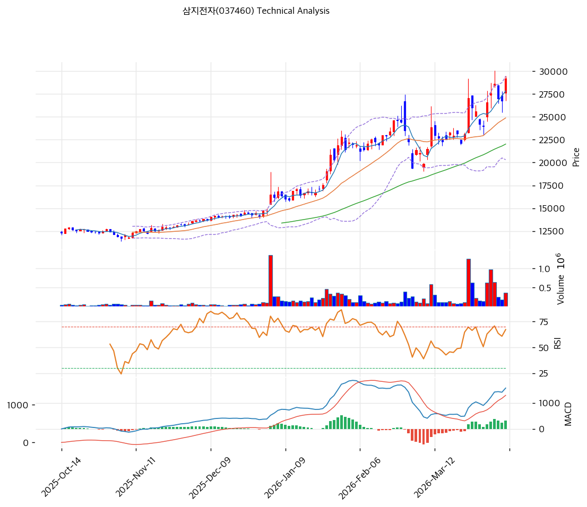

# 삼지전자(037460) 기술적 분석

2026-04-08 | T2 Technical Analysis

---

## 차트

---

## 1. 가격 현황

| 항목 | 값 |
|------|-----|
| 현재가 | 29,200원 (+9.16%) |
| 52주 고가 | 29,500원 |
| 52주 저가 | 26,750원 |
| 52주 범위 위치 | 92.9% |
| 상한가 | 34,750원 |
| 하한가 | 18,750원 |

※ 52주 범위 위치 = (현재가 - 52주저가) / (52주고가 - 52주저가) × 100

---

## 2. 차트 패턴 분석

### 2.1 캔들스틱 패턴

| 패턴 | 위치 | 신뢰도 | 해석 |
|------|------|--------|------|
| 장대양봉 | 당일 (2026-04-08) | 강 | +9.16% 급등 장대양봉 출현 — 강한 매수세 유입 시그널이나 과열 구간 진입 가능성 동시 내재 |
| 전고점 돌파 시도 | 52주 고가 29,500원 근접 | 중 | 29,200원에서 52주 고가 29,500원까지 불과 1.0% 갭 — 돌파 여부가 향후 방향성의 핵심 분기점 |

※ T2 데이터 미수집 — KIS 당일 가격 데이터 및 차트 기반 분석

### 2.2 가격 구조 패턴

- **52주 박스권 상단 압박** (신뢰도: 중)
  52주 고가 29,500원~저가 26,750원으로 박스권 폭이 좁다(약 10.3%). 현재 29,200원은 박스권 상단인 29,500원에 근접하여 저항 구간에 위치한다. 장대양봉 당일의 +9.16% 급등으로 박스 상단 돌파를 시도 중이며, 종가 기준 29,500원 이상 안착 시 추가 상승 여지, 돌파 실패 시 평균 회귀 압력이 예상된다.

- **52주 저가 인근 지지 확인 후 반등 구조** (신뢰도: 중)
  52주 저가 26,750원에서 지지를 확인한 뒤 현재가까지 +9.2% 상승한 상태. 저가 구간을 하방으로 이탈하지 않은 것은 긍정적이나, 박스권 폭이 좁아 방향성 신호가 명확하지 않다.

### 2.3 다이버전스

- **기술적 지표 데이터 미수집** — RSI·MACD 등 보조지표 원시 데이터가 이번 수집에서 제공되지 않아 다이버전스 정량 분석이 불가하다. 당일 +9.16%의 급등이 거래량과 함께 발생했다면 강세 모멘텀 확인으로 해석할 수 있으며, 거래량 동반 없는 갭업이라면 단기 되돌림 가능성이 높다.

### 2.4 패턴 종합 판단

52주 범위의 92.9% 위치에서 당일 +9.16% 장대양봉이 출현하며 52주 고가(29,500원)에 근접했다. 박스권 돌파 여부가 향후 방향성을 결정하는 핵심 변수로, 돌파 성공 시 3만원대 진입을 시도할 수 있다. 그러나 단기 급등 이후 고점 저항과 매물 소화 구간 진입 가능성이 높아 상충하는 시그널이 공존하며, 거래량 확인이 선행되어야 한다.

---

## 3. 이동평균선 — 데이터 미수집

| MA | 값 | 현재가 괴리율 | 위치 |
|----|-----|--------------|------|
| MA5 | — | — | — |
| MA20 | — | — | — |
| MA60 | — | — | — |
| MA120 | — | — | — |
| MA200 | — | — | — |

**해석**: 이동평균선 원시 데이터가 수집되지 않았다. 다만, 52주 저가-고가 박스권(26,750~29,500원) 내에서 현재가가 상단에 위치하고 있어, MA20 이상은 현재가 하방에 위치할 가능성이 높다. +9.16% 당일 급등은 단기 이평선 괴리율을 일시적으로 확대시킬 수 있으며, 과열 해소 후 MA20 수렴 여부를 확인할 필요가 있다.

---

## 4. 보조 지표

### RSI(14) — 데이터 미수집

RSI 원시 데이터 미수집. 단, 52주 고가 근접 구간에서 +9.16% 단일 급등이 발생한 점을 감안하면 RSI가 70 이상 과매수 구간에 진입했거나 근접했을 가능성이 높다. 다음 거래일 RSI 확인 후 과매수 여부 판단 필요.

### MACD(12,26,9)

| 항목 | 값 |
|------|-----|
| MACD | — |
| Signal | — |
| Histogram | — |
| 크로스 상태 | 데이터 미수집 |

**해석**: MACD 원시 데이터 미수집. 당일 급등으로 MACD 히스토그램이 일시적으로 확대되었을 가능성이 있으나, 지속적인 상승 추세 확인을 위해서는 추가 거래일 관찰이 필요하다.

### 볼린저밴드(20, 2σ)

| 항목 | 값 |
|------|-----|
| 상단 | — |
| 중단 (MA20) | — |
| 하단 | — |
| 밴드 폭 | — |
| 현재 위치 | 상단 근접 추정 |

**해석**: 볼린저밴드 원시 데이터 미수집. 52주 박스권이 좁고(10.3%) 변동성이 낮은 상태에서 당일 급등이 발생했으므로, 상단 밴드 이탈 여부 확인 필요. 밴드 폭이 좁은 스퀴즈 상태에서의 상향 이탈은 강한 추세 전환 시그널로 해석될 수 있다.

### 스토캐스틱(14, 3, 3)

| 항목 | 값 |
|------|-----|
| Slow %K | — |
| Slow %D | — |
| 크로스 상태 | 데이터 미수집 |
| 판단 | 과매수 추정 |

---

## 5. 지지/저항

| 구분 | 가격 | 근거 |
|------|------|------|
| 저항 | 29,500원 | 52주 고가, 역사적 고점 저항 |
| 저항 | 30,000원 | 심리적 라운드 피겨 저항선 |
| **현재가** | **29,200원** | 2026-04-08 종가 기준 |
| 지지 | 28,000원 | 52주 고가-저가 중간선 인근 |
| 지지 | 27,500원 | 단기 이평 수렴 추정 구간 |
| 지지 | 26,750원 | 52주 저가, 강한 하방 지지 |

---

## 6. 시그널 종합

| 지표 | 내용 | 시그널 |
|------|------|--------|
| **차트 패턴** | 52주 고가 근접, 장대양봉 출현 — 돌파 시도 중 | 🟢 |
| 이동평균선 | 데이터 미수집 — 박스 상단 위치로 상방 우위 추정 | ⚪ |
| RSI | 데이터 미수집 — 급등 후 과매수 구간 진입 가능 | ⚪ |
| MACD | 데이터 미수집 | ⚪ |
| 볼린저밴드 | 데이터 미수집 — 밴드 상단 돌파 시도 추정 | ⚪ |
| 스토캐스틱 | 데이터 미수집 — 과매수 추정 | ⚪ |
| 거래량 | 357,868주 — 평소 대비 수준 확인 필요 | ⚪ |

**종합 판단**: 🟢 매수 1개 / 🔴 매도 0개 / ⚪ 중립(데이터부재) 6개 → **데이터 부족으로 명확한 판단 유보**

52주 고가(29,500원) 직하 29,200원에서 당일 +9.16% 장대양봉이 출현하여 돌파 시도 중인 상황이다. 보조지표 데이터가 수집되지 않아 정량적 판단에 한계가 있으나, 가격 구조상 박스권 상단 저항 돌파 여부가 단기 방향성을 결정하는 핵심 변수다. 다음 거래일 29,500원 위 안착 시 3만원대 진입 시도, 실패 시 27,500원 지지선 확인 흐름이 예상된다.

---

## 7. 전략 제안

### 보유 중인 경우
- **홀드** — 52주 고가(29,500원) 돌파 확인까지 포지션 유지
- 익절 라인: 30,000~31,000원 (심리적 라운드 피겨 + 밴드 목표치)
- 손절 라인: 27,500원 이탈 시 (단기 지지 붕괴)
- 리스크/리워드: 손절 -6.0% / 목표 +2.7~6.2% → R/R 약 0.5~1.0 (단기 불리)

### 진입 대기인 경우
- **관망 우선** — 당일 급등(+9.16%) 직후 진입은 단기 고점 매수 리스크가 높다
- 1차 진입가: 28,000원 내외 (눌림목 매수, 급등 후 되돌림 구간)
- 2차 진입가: 26,750원 (52주 저가 재테스트 시 강지지 구간)
- 진입 조건: 거래량 동반 29,500원 돌파 확인 후 풀백 시 또는 27,500원 지지 확인 후 반등 캔들 출현 시
