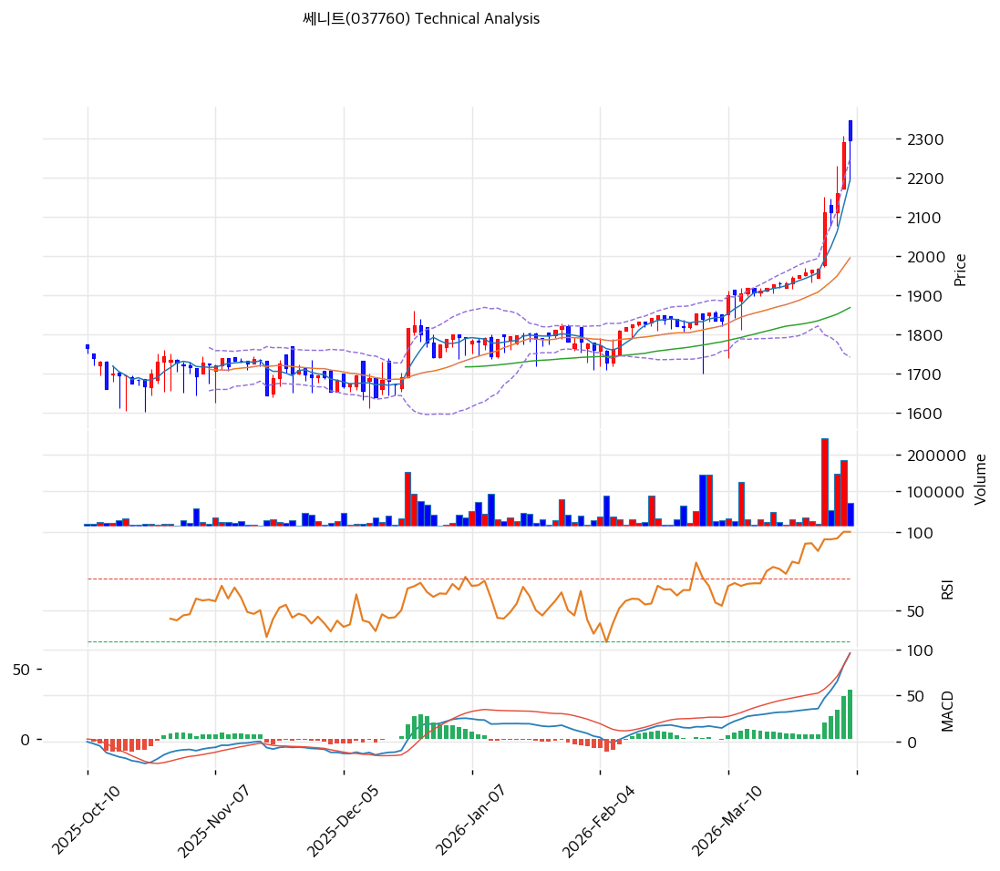

# 쎄니트(037760) 기술적 분석

2026-04-06 | T2 Technical Analysis

---

## 차트

---

## 1. 가격 현황

| 항목 | 값 |
|------|-----|
| 현재가 | 2,290원 (0.0%) |
| 52주 고가 | 2,290원 |
| 52주 저가 | 1,471원 |
| 52주 범위 위치 | 100.0% |
| 거래량 | 20일 평균 대비 1.32x |

---

## 2. 차트 패턴 분석

### 2.1 캔들스틱 패턴

| 패턴 | 위치 | 신뢰도 | 해석 |
|------|------|--------|------|
| 신고가 테스트 | 최근 | 강 | 52주 고가에 도달하며 강한 추세를 확인 |
| 짧은 몸통 캔들 | 최근 1~2거래일 | 중 | 상승 후 속도 조절 가능성 |

### 2.2 가격 구조 패턴

- **단기 급등형 돌파 패턴** (신뢰도: 강)
  중장기 박스 상단을 돌파해 신고가 구간에 진입했습니다.

- **과열 동반 상승** (신뢰도: 강)
  추세는 좋지만 RSI 93.6은 지나친 과열을 시사합니다.

### 2.3 다이버전스

- **RSI 극단적 과매수** (신뢰도: 강)
  RSI가 90을 넘는 구간은 일반적으로 추격 매수 위험이 큰 자리입니다.

- **MACD 매수 강화** (신뢰도: 중)
  히스토그램 확대는 추세 지속 가능성을 보여주지만, 과열 구간에서는 신뢰도가 낮아질 수 있습니다.

### 2.4 패턴 종합 판단

쎄니트는 **추세는 강하지만 위험도도 큰 상태**입니다. 기존 보유자는 추세를 따라갈 수 있지만, 신규 진입은 눌림이 나올 때까지 기다리는 편이 낫습니다.

---

## 3. 이동평균선 — 정배열 (강세)

| MA | 값 | 현재가 괴리율 | 위치 |
|----|-----|--------------|------|
| MA5 | 2,192원 | +4.5% | 위 |
| MA20 | 1,994원 | +14.8% | 위 |
| MA60 | 1,868원 | +22.6% | 위 |
| MA120 | 1,792원 | +27.8% | 위 |
| MA200 | 1,763원 | +29.9% | 위 |

**해석**: 완전 정배열입니다. 다만 RSI 수준을 감안하면 추세보다 과열 관리가 더 중요합니다.

---

## 4. 보조 지표

### RSI(14) — 93.6 (🔴과매수)

극단적 과매수입니다. 통상적인 추세 종목보다도 과열이 심합니다.

### MACD(12,26,9)

| 항목 | 값 |
|------|-----|
| MACD | 95.0 |
| Signal | 61.0 |
| Histogram | +35.0 |
| 크로스 상태 | 매수 구간 (확대 중) |

**해석**: MACD는 강세를 지지하지만, RSI가 너무 높아 추격 신호로 쓰기엔 부담입니다.

### 볼린저밴드(20, 2σ)

| 항목 | 값 |
|------|-----|
| 상단 | 2,246원 |
| 중단 (MA20) | 1,994원 |
| 하단 | 1,742원 |
| 밴드 폭 | 25.3% |
| 현재 위치 | 상단근접 |

**해석**: 밴드 상단을 웃도는 구간으로, 힘은 좋지만 단기 조정 압력도 큽니다.

### 스토캐스틱(14, 3, 3)

| 항목 | 값 |
|------|-----|
| Slow %K | 87.6 |
| Slow %D | 86.0 |
| 크로스 상태 | 골든크로스 |
| 판단 | 과매수 |

---

## 5. 지지/저항

| 구분 | 가격 | 근거 |
|------|------|------|
| 저항 | 2,290원 | 52주 고가 |
| 저항 | 2,360원 | 피봇 R1 |
| **현재가** | **2,290원** | — |
| 지지 | 2,205원 | 피봇 S1 |
| 지지 | 2,120원 | 피봇 S2 |
| 지지 | 1,994원 | MA20 |

---

## 6. 시그널 종합

| 지표 | 내용 | 시그널 |
|------|------|--------|
| **차트 패턴** | 신고가 돌파 | 🟢 |
| 이동평균선 | 정배열, MA20 +14.8% | 🟢 |
| RSI | 93.6 — 극단 과매수 | 🔴 |
| MACD | 매수구간, 히스토그램 확대 | ⚪ |
| 볼린저밴드 | 상단 밀착 | ⚪ |
| 스토캐스틱 | 과매수 구간 | 🔴 |
| 거래량 | 1.32x | ⚪ |

**종합 판단**: 🟢 매수 2개 / 🔴 매도 2개 / ⚪ 중립 3개 → **중립**

추세는 강하지만 과열이 심해, 신규 매수 근거로 쓰긴 어렵습니다.

---

## 7. 전략 제안

### 보유 중인 경우
- **홀드**
- 익절 라인: 2,336원
- 손절 라인: 2,120원
- 리스크/리워드: 단기 기준 보통

### 진입 대기인 경우
- **관망**
- 1차 진입가: 2,205원 (피봇 S1)
- 2차 진입가: 1,994원 (MA20)
- 진입 조건: 과열 해소 후 지지 확인
