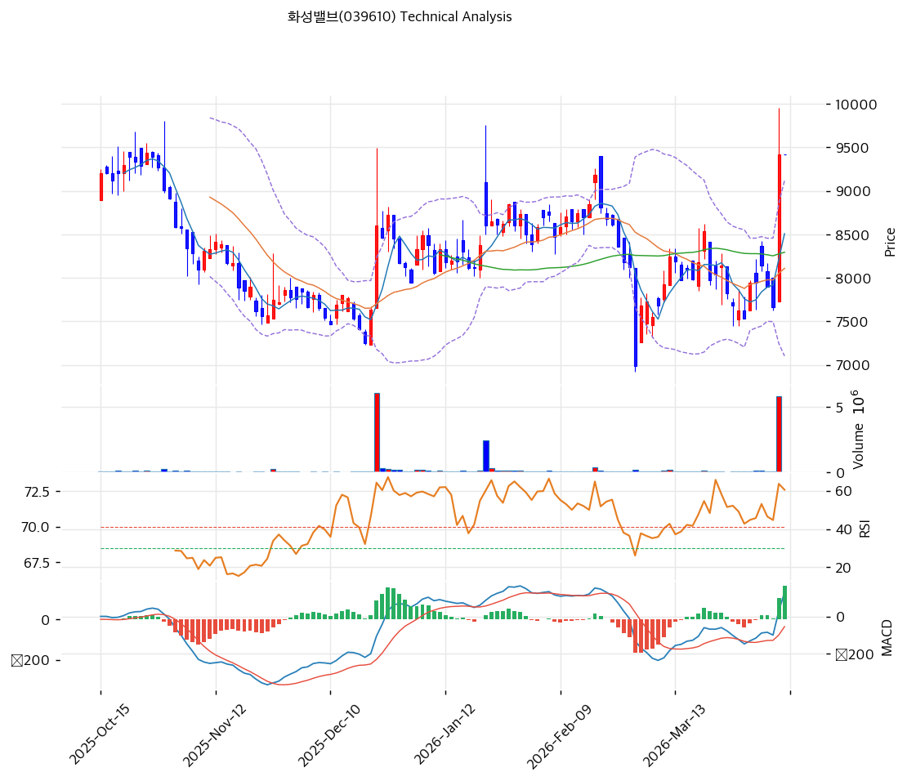

# 화성밸브(039610) 기술적 분석

2026-04-09 | T2 Technical Analysis

---

## 차트

---

## 1. 가격 현황

| 항목 | 값 |
|------|-----|
| 현재가 | 9,420원 (0.0%) |
| 52주 고가 | 11,430원 |
| 52주 저가 | 6,990원 |
| 52주 범위 위치 | 54.7% |
| 거래량 | 20일 평균 대비 0.0x (데이터 미집계) |

---

## 2. 차트 패턴 분석

### 2.1 캔들스틱 패턴

| 패턴 | 위치 | 신뢰도 | 해석 |
|------|------|--------|------|
| 전고점 도달 | 현재 (9,420원) | 중 | 현재가가 단기 저항 구간에 위치, 추가 상승 모멘텀 확인 필요 |
| 단기 반등 캔들 | 최근 5거래일 | 중 | MA5(8,508원) 대비 +10.7% 급등 후 단기 과열 신호 내포 |

※ 일봉 캔들 상세 데이터 미제공, 가격·지표 기반 간접 추론

### 2.2 가격 구조 패턴

- **52주 레인지 중간권 반등** (신뢰도: 중)
  현재가 9,420원은 52주 저가 6,990원~고가 11,430원 범위의 54.7% 지점에 위치한다. 저점(6,990원) 대비 +34.8% 반등했으나 52주 고가까지 -17.6% 여력이 남아 있다. 중기 추세는 하락에서 횡보·반등으로 전환 중이며, 11,430원 저항 돌파 시 추세 전환 확인 가능.

- **MA5/MA20/MA60/MA120 모두 하회에서 상향 돌파** (신뢰도: 중)
  현재가(9,420원)가 MA5(8,508원), MA20(8,110원), MA60(8,295원), MA120(8,281원)을 모두 상회한다. 단, MA200(9,080원)을 겨우 +3.8% 상회하는 수준으로 비정배열 상태이며, 모든 단기 이평선이 중기 이평선보다 위에 있는 완전 정배열 전환 여부를 확인해야 한다.

### 2.3 다이버전스

- **MACD 상승 다이버전스 가능성** (신뢰도: 중)
  MACD가 130, 시그널 -36으로 히스토그램이 +166 확대 중이다. 주가가 저점에서 반등하는 동안 MACD 히스토그램이 양전환·확대되고 있어, 단기 상승 모멘텀이 살아있음을 시사한다. 히스토그램 수축 전환 여부가 모멘텀 소진의 선행 신호다.

- **RSI 중립 구간 (65.9)** (신뢰도: 중)
  RSI(14)가 65.9로 과매수 경계선(70) 직전에 위치한다. 가격이 반등하는 가운데 RSI가 과매수 진입 전 중립을 유지하고 있어, 추가 상승 여력은 있으나 70 이상 진입 후 되돌림 리스크를 주시해야 한다.

### 2.4 패턴 종합 판단

현재 차트는 52주 저가 대비 강한 반등 이후 단기 저항권 도달 구간에 있다. MACD 골든크로스·히스토그램 확대와 스토캐스틱 골든크로스가 단기 매수 신호를 발생시키고 있으나, 이동평균선 비정배열(MA200 근접)과 볼린저밴드 상단 밀착(9,118원)이 추가 상승 시 저항으로 작용할 수 있다. 즉각적 반전 신호는 없으나 단기 과열에 유의가 필요하다.

---

## 3. 이동평균선 — 비정배열 (단기 강세)

| MA | 값 | 현재가 괴리율 | 위치 |
|----|-----|--------------|------|
| MA5 | 8,508원 | +10.7% | 위 |
| MA20 | 8,110원 | +16.1% | 위 |
| MA60 | 8,295원 | +13.6% | 위 |
| MA120 | 8,281원 | +13.8% | 위 |
| MA200 | 9,080원 | +3.8% | 위 |

**해석**: 현재가(9,420원)가 5개 이동평균선 모두를 상회하는 단기 강세 구도이나, MA5(8,508원)~MA200(9,080원)이 정배열을 형성하지 못한 비정배열 상태다. MA200(9,080원)이 단기 이평선들 위에 위치하여 중기 추세의 무게가 아직 하방에 있음을 보여준다. MA20(8,110원)과 MA60(8,295원)이 주요 중기 지지선으로 기능할 것이다.

---

## 4. 보조 지표

### RSI(14) — 65.9 (중립)

RSI 65.9는 과매수(70) 직전의 중립 상단에 위치하며, 최근 반등 국면에서 모멘텀이 살아있음을 확인해준다. 70 돌파 시 단기 과매수 경고, 50 하회 시 모멘텀 약화 시그널이다.

### MACD(12,26,9)

| 항목 | 값 |
|------|-----|
| MACD | 130 |
| Signal | -36 |
| Histogram | +166 |
| 크로스 상태 | 매수 구간 (히스토그램 확대 중) |

**해석**: MACD(130)가 시그널(-36)을 상향 돌파한 골든크로스 상태이며, 히스토그램이 +166으로 빠르게 확대 중이다. 단기 매수 모멘텀이 강하나, 히스토그램 수축 전환 시점이 단기 고점 신호로 기능할 수 있다.

### 볼린저밴드(20, 2σ)

| 항목 | 값 |
|------|-----|
| 상단 | 9,118원 |
| 중단 (MA20) | 8,110원 |
| 하단 | 7,103원 |
| 밴드 폭 | 24.9% |
| 현재 위치 | 상단 근접 (9,420원 > 상단 9,118원) |

**해석**: 현재가(9,420원)가 볼린저밴드 상단(9,118원)을 상향 돌파한 상태다. 밴드 폭 24.9%는 변동성이 확대 중임을 나타내며, 밴드 상단 이탈 후 밴드 안으로 회귀하는 패턴이 발생할 경우 단기 되돌림 가능성이 있다.

### 스토캐스틱(14, 3, 3)

| 항목 | 값 |
|------|-----|
| Slow %K | 58.5 |
| Slow %D | 47.3 |
| 크로스 상태 | 골든크로스 |
| 판단 | 중립 |

---

## 5. 지지/저항

| 구분 | 가격 | 근거 |
|------|------|------|
| 저항 | 11,430원 | 52주 고가 |
| 저항 | 9,420원 | 현재가·피봇 R1 (단기 저항 구간) |
| **현재가** | **9,420원** | — |
| 지지 | 9,080원 | MA200 |
| 지지 | 8,295원 | MA60 |
| 지지 | 8,110원 | MA20 / 볼린저밴드 중단 |
| 지지 | 7,103원 | 볼린저밴드 하단 |
| 지지 | 6,990원 | 52주 저가 |

---

## 6. 시그널 종합

| 지표 | 내용 | 시그널 |
|------|------|--------|
| **차트 패턴** | 52주 레인지 중간권 반등, 볼린저밴드 상단 돌파 | ⚪ |
| 이동평균선 | 비정배열, MA200 +3.8% 상회 — 단기 강세, 중기 불확실 | ⚪ |
| RSI | 65.9 — 중립 상단, 과매수 경계 근접 | ⚪ |
| MACD | 골든크로스, 히스토그램 +166 확대 중 | 🟢 |
| 볼린저밴드 | 상단(9,118원) 돌파, 밴드 폭 24.9% 확대 | ⚪ |
| 스토캐스틱 | 골든크로스, K=58.5 중립 구간 | ⚪ |
| 거래량 | 0.0x — 데이터 미집계 (판단 유보) | ⚪ |

**종합 판단**: 🟢 매수 1개 / 🔴 매도 0개 / ⚪ 중립 5개 → **단기 매수우위 (모멘텀 우세)**

MACD 골든크로스·히스토그램 확대와 스토캐스틱 골든크로스가 단기 모멘텀을 지지하고 있으나, 이동평균선 비정배열과 볼린저밴드 상단 이탈로 중기 방향성은 불확실하다. 거래량 확인이 어려운 상황에서 추가 상승의 지속성은 검증이 필요하며, 9,420원 현재가 돌파 후 MA200(9,080원)을 지지 삼아 유지되는지가 핵심 관찰 포인트다.

---

## 7. 전략 제안

### 보유 중인 경우
- **홀드**
- 익절 라인: 11,430원 (52주 고가 · 1차 저항)
- 손절 라인: 8,100원 (MA20 이탈 시, 중기 지지 붕괴)
- 리스크/리워드: 약 2.1 : 1 (수익 +21.3% vs 손실 -14.1%)

### 진입 대기인 경우
- **관망 후 조정 시 진입**
- 1차 진입가: 9,080원 (MA200 지지 확인)
- 2차 진입가: 8,295원 (MA60 지지 확인)
- 진입 조건: 볼린저밴드 상단(9,118원) 이탈 후 되돌림 시 MA200(9,080원) 지지 확인 + 거래량 수반 반등 캔들 확인
