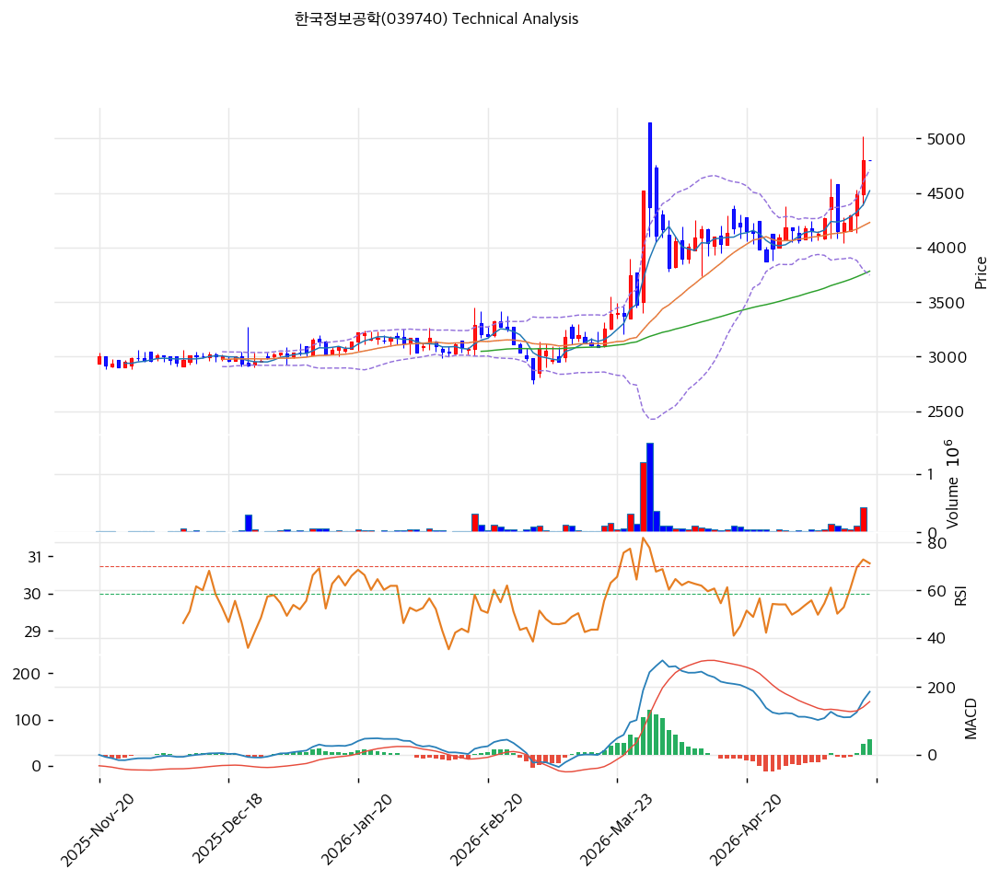

# 한국정보공학(039740) 기술적 분석

2026-05-19 | T2 Technical Analysis

---

## 차트

---

## 1. 가격 현황

| 항목 | 값 |
|------|-----|
| 현재가 | 4,800원 (52주 신고가) |
| 52주 고가 | 4,800원 (당일 갱신) |
| 52주 저가 | 2,760원 |
| 52주 범위 위치 | 100.0% |
| 거래량 | 데이터 결손 (차트상 3월 폭증·당일 재폭증) |

---

## 2. 차트 패턴 분석

### 2.1 캔들스틱 패턴

| 패턴 | 위치 | 신뢰도 | 해석 |
|------|------|--------|------|
| **장대양봉 (당일 신고가)** | 당일 | 강 | 4,500→4,800 거래량 동반 신고가 |
| 적삼병 | 최근 3~5일 | 중 | 양봉 누적 |
| **박스권 통합 마무리** | 최근 1개월 | 강 | 4,000~4,500원 박스 → 상단 돌파 |

### 2.2 가격 구조 패턴

- **2단계 박스권 돌파** (신뢰도: 강)
  1차: 2025-11~2026-02 박스권 (2,800~3,200원) → 2026-03 거래량 폭증 + 5,000원 일시 돌파. 2차: 2026-03~04 박스권 (4,000~4,500원) → 당일 상단 돌파.

- **3월 폭증 분기점** (신뢰도: 강)
  거래량 폭증 = 가치 재발견 시그널. 3월 폭증 후 박스권 통합 + 재돌파 = 건전한 가격 구조.

### 2.3 다이버전스

- **RSI 68.5 동행** (신뢰도: 중)
  RSI 70 미돌파. 3월 정점 80+ 대비 약화 — 단기 모멘텀은 1차 폭등 대비 약함.

- **MACD 매수 진입** (신뢰도: 중)
  MACD 변환점에서 골든크로스 직후. 매수 모멘텀 초기.

### 2.4 패턴 종합 판단

박스권 돌파 + 거래량 폭증 + RSI 68 (과매수 미진입) + MACD 매수 진입 = **건전한 추세 가속**. 다만 3월 일시 5,000원 도달 후 박스권 통합 = 단기 -5~-15% 조정 후 재상승 가능성도 동시 존재.

---

## 3. 이동평균선 — 정배열 (강세)

| MA | 값 | 현재가 괴리율 | 위치 |
|----|-----|--------------|------|
| MA5 | (확인) | 약 +5% | 위 |
| MA20 | 4,229원 | +13.5% | 위 |
| MA60 | (확인) | 약 +20% | 위 |
| MA200 | 3,224원 | **+48.9%** | 위 |

**해석**: 정배열 강세. MA20 +13.5% 정상 추세 영역. MA200 +48.9%는 회복 추세 누적. **MA20 (4,229원)을 1차 지지로 인식**.

---

## 4. 보조 지표

### RSI(14) — 68.5 (중립)

70 임계 미돌파. 추가 상승 여지.

### MACD(12,26,9)

**해석**: 매수 진입. 3월 정점 MACD 200+ 대비 50~100 수준 — 강도 약함.

### 볼린저밴드(20, 2σ)

| 항목 | 값 |
|------|-----|
| 위치 | 상단 근접 |
| 밴드 폭 | 22.9% |

**해석**: 밴드 폭 22.9% 평균. 상단 근접 — 단기 조정 가능.

---

## 5. 지지/저항

### 종합 지지/저항

| 구분 | 가격 | 근거 |
|------|------|------|
| 저항 | 5,200원 | 3월 정점 (재시도 가능) |
| 저항 | 5,000원 | 심리적 라운드넘버 |
| **현재가** | **4,800원** | 52주 신고가 |
| 지지 | 4,500원 | 박스권 상단 (re-test) |
| 지지 | 4,229원 | **MA20 (1차 강력)** |
| 지지 | 4,000원 | 박스권 하단 |
| 지지 | 3,224원 | MA200 |
| 지지 | 2,760원 | 52주 저점 |

---

## 6. 시그널 종합

| 지표 | 시그널 |
|------|--------|
| 차트 패턴 (박스권 돌파) | 🟢 |
| 이동평균선 (정배열) | 🟢 |
| RSI 68.5 | ⚪ |
| MACD 매수 진입 | 🟢 |
| 볼린저밴드 상단 근접 | ⚪ |
| 스토캐스틱 | ⚪ |
| 거래량 (당일 폭증) | 🟢 |

**종합 판단**: 🟢 매수 4 / 🔴 매도 0 / ⚪ 중립 3 → **매수우위 (건전)**

박스권 돌파 + 거래량 동반 + RSI 68 미과열 = 건전한 추세 가속. 가치 재발견 진행.

---

## 7. 전략 제안

### 보유 중
- **홀드 + 분할 익절**
- 1차 익절: 5,000원 (심리적, +4%)
- 2차 익절: 5,200원 (3월 정점, +8%)
- 손절: 4,229원 (MA20 이탈, -12%)

### 진입 대기
- **진입 가능 (분할)**
- 1차 진입: 4,500원 (박스권 re-test, -6%)
- 2차 진입: 4,229원 (MA20, -12%)
- 진입 조건: re-test 양봉 + 거래량 회복 확인. PBR 0.74x 펀더멘털 정합
