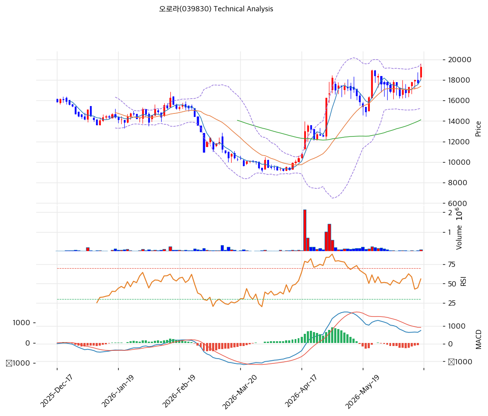

# 오로라(039830) 기술적 분석

2026-06-17 | T2 Technical Analysis

---

## 차트

---

## 1. 가격 현황

| 항목 | 값 |
|------|-----|
| 현재가 | 19,280원 (+8.62%) |
| 52주 고가 | 25,300원 |
| 52주 저가 | 6,500원 |
| 52주 범위 위치 | 68.0% |
| 거래량 | 20일 평균 대비 0.92x |

> 52주 저점(6,500원) 대비 약 3배 상승 후 고점(25,300원)에서 -24% 조정, 현재 19,280원. 당일 +8.62% 반등으로 모든 이평선 상회. MA200 대비 +17%로 과열은 제한적.

---

## 2. 차트 패턴 분석

### 2.1 캔들스틱 패턴

| 패턴 | 위치 | 신뢰도 | 해석 |
|------|------|--------|------|
| 장대양봉 반등 | 당일 (+8.62%) | 중 | 매수 — 조정 후 반등 |
| 모든 MA 상회 | 19,280 > MA5\~200 | 중 | 매수 — 중기 강세 복귀 |
| 전고(25,300) 대비 조정 | -24% | 중 | 조정 후 회복 시도 |

※ 주요 캔들 패턴: 망치형, 역망치형, 장악형, 도지, 샛별/석별, 적삼병/흑삼병, 하라미, 유성형, 교수형 등

### 2.2 가격 구조 패턴

- **조정 후 반등(전고 25,300원 대비 -24%)** (신뢰도: 중)
  고점 후 조정하다 당일 +8.62% 반등으로 MA20(17,380원) 상회 회복. 피보 0.236(21,673원)·전고(25,300원)가 상단.

- **중장기 상승 추세** (신뢰도: 중)
  MA200(16,480원) 대비 +17%로 1년 저점 대비 강세. 과열은 제한적(타 종목 대비 완만).

※ 주요 구조 패턴: 이중천정/바닥, 헤드앤숄더, 삼각수렴, 쐐기형, 깃발형, 페넌트, 컵앤핸들, 박스권 등

### 2.3 다이버전스

- **반등 전환 시도** (신뢰도: 중)
  당일 급등으로 RSI 65.1·스토캐스틱 73.7 상승. MACD는 히스토그램 -17로 매도 잔존하나 전환 시도. 펀더멘털(사상 최대 실적)이 받침.

※ RSI·MACD 기반 | 상승 다이버전스 = 가격↓ 지표↑, 하락 다이버전스 = 가격↑ 지표↓

### 2.4 패턴 종합 판단

전고(25,300원) 대비 -24% 조정 후 당일 +8.62% 반등으로 **모든 이평선을 상회 회복**한 국면이다. MA200 대비 +17%로 과열이 제한적이고, RSI 65.1·스토캐스틱 73.7로 모멘텀 회복 중이나 MACD 매도가 잔존한다. 사상 최대 실적·저평가(PER 9.5x)가 펀더멘털을 받친다. 피봇 R1(19,913원)·피보 0.236(21,673원) 돌파가 추가 상승 분기점, MA20(17,380원)이 지지.

---

## 3. 이동평균선 — 단기 강세 복귀(비정배열)

| MA | 값 | 현재가 괴리율 | 위치 |
|----|-----|--------------|------|
| MA5 | 18,030원 | +6.9% | 위 |
| MA20 | 17,380원 | +10.9% | 위 |
| MA60 | 14,118원 | +36.6% | 위 |
| MA120 | 14,093원 | +36.8% | 위 |
| MA200 | 16,480원 | +17.0% | 위 |

**해석**: 현재가가 모든 MA 위로 강세이나 **MA200(16,480원)이 MA60·MA120(14,118원)보다 높아 완전 정배열은 아님(aligned False)** — 고점 조정의 흔적. 당일 급등으로 단기 강세 복귀. MA20(17,380원)·MA200(16,480원)이 지지대. MA60·MA120(14,093\~14,118원)은 강한 하단 지지.

---

## 4. 보조 지표

### RSI(14) — 65.1 (중립, 상승)

당일 급등으로 중립 상단. 과매수(70) 미도달로 추가 상승 여지. 강한 모멘텀.

### MACD(12,26,9)

| 항목 | 값 |
|------|-----|
| MACD | 741 |
| Signal | 759 |
| Histogram | -17 |
| 크로스 상태 | 매도 (전환 시도) |

**해석**: MACD가 Signal 약간 아래(히스토그램 -17)의 매도 잔존이나, 당일 급등으로 전환 시도 중. 0선 위 강세 유지.

### 볼린저밴드(20, 2σ)

| 항목 | 값 |
|------|-----|
| 상단 | 19,523원 |
| 중단 (MA20) | 17,380원 |
| 하단 | 15,238원 |
| 밴드 폭 | 24.7% |
| 현재 위치 | 상단 근접 |

**해석**: 현재가 19,280원이 상단(19,523원) 근접. 당일 급등으로 상단 도전. 되돌림 시 중단(MA20 17,380원) 여지.

### 스토캐스틱(14, 3, 3)

| 항목 | 값 |
|------|-----|
| Slow %K | 73.7 |
| Slow %D | 66.0 |
| 크로스 상태 | 골든크로스 |
| 판단 | 중립(상승) |

---

## 5. 지지/저항 — 추세선 · 피보나치 · PRZ 통합

### 5.1 피보나치 되돌림

| 구분 | 비율 | 가격 | 현재가 대비 |
|------|------|------|-----------|
| 저항 | 0.236 | 21,673원 | +12.4% |
| **현재가** | — | 19,280원 | — |
| 지지 | 0.382 | 18,749원 | -2.8% |
| 지지 | 0.5 | 16,385원 | -15.0% |
| 지지 | 0.618 | 14,021원 | -27.3% |
| 지지 | 0.786 | 10,656원 | -44.7% |

### 5.2 종합 지지/저항 테이블

| 구분 | 가격 | 근거 |
|------|------|------|
| 저항 | 25,300원 | 52주 고가 |
| 저항 | 21,673원 | 피보 0.236 |
| 저항 | 19,913원 | 피봇 R1 |
| 저항 | 19,523원 | 볼린저 상단 |
| **현재가** | **19,280원** | — |
| 지지 | 18,323원 | 피봇 S1·MA5 (PRZ 중) |
| 지지 | 17,374\~17,380원 | MA20·피봇 S2 (PRZ) |
| 지지 | 16,432원 | MA200·피보 0.5 (PRZ) |
| 지지 | 14,077원 | MA60·MA120·피보 0.618 (PRZ 중) |

---

## 6. 시그널 종합

| 지표 | 내용 | 시그널 |
|------|------|--------|
| 차트 패턴 | 조정 후 반등, MA 상회 | 🟢 |
| 이동평균선 | 비정배열(고점 조정 흔적) | ⚪ |
| RSI | 65.1 — 중립(여유) | ⚪ |
| MACD | 매도(전환 시도) | 🔴 |
| 볼린저밴드 | 상단 근접 | ⚪ |
| 스토캐스틱 | 골든크로스, K=73.7 | ⚪ |
| 거래량 | 0.92x — 보통 | ⚪ |

**종합 판단**: 🟢 매수 0개(요약) / 🔴 매도 1개 / ⚪ 중립 5개 → **매도우위(직전 조정) → 당일 +8.62% 급등으로 회복 전환**

요약 시그널은 직전 조정의 MACD 매도를 반영해 매도우위이나, 당일 +8.62% 급등으로 모든 MA를 상회 회복했다. RSI 65.1·과열 제한(MA200 +17%)으로 추가 상승 여지. 사상 최대 실적·저평가(PER 9.5x)가 펀더멘털을 받친다. 피봇 R1(19,913원)·피보 0.236(21,673원) 돌파가 분기점, MA20(17,380원) 지지.

---

## 7. 전략 제안

### 보유 중인 경우
- **홀드 (전고 회복 주시)**
- 익절 라인: 21,673원(피보 0.236)·25,300원(전고)
- 손절 라인: 17,380원 (MA20 이탈) / 적극적으론 16,432원(MA200)
- 리스크/리워드: +8.62% 급등 직후 단기 손익비 다소 불리하나 밸류 저평가로 하방 안정

### 진입 대기인 경우
- **눌림목 분할 (밸류 저평가)**
- 1차 진입가: 18,323원 (MA5·피봇 S1 PRZ) / 17,380원 (MA20)
- 2차 진입가: 16,432원 (MA200·피보 0.5 PRZ)
- 진입 조건: 급등 추격보다 눌림목 대기. 단 PER 9.5x·PBR 1.07x 저평가·사상 최대 실적으로 하방 안정. 분기 실적·환율·레버리지 확인하며 분할. MA200(16,432원)·MA60/120(14,077원)이 강한 지지.
