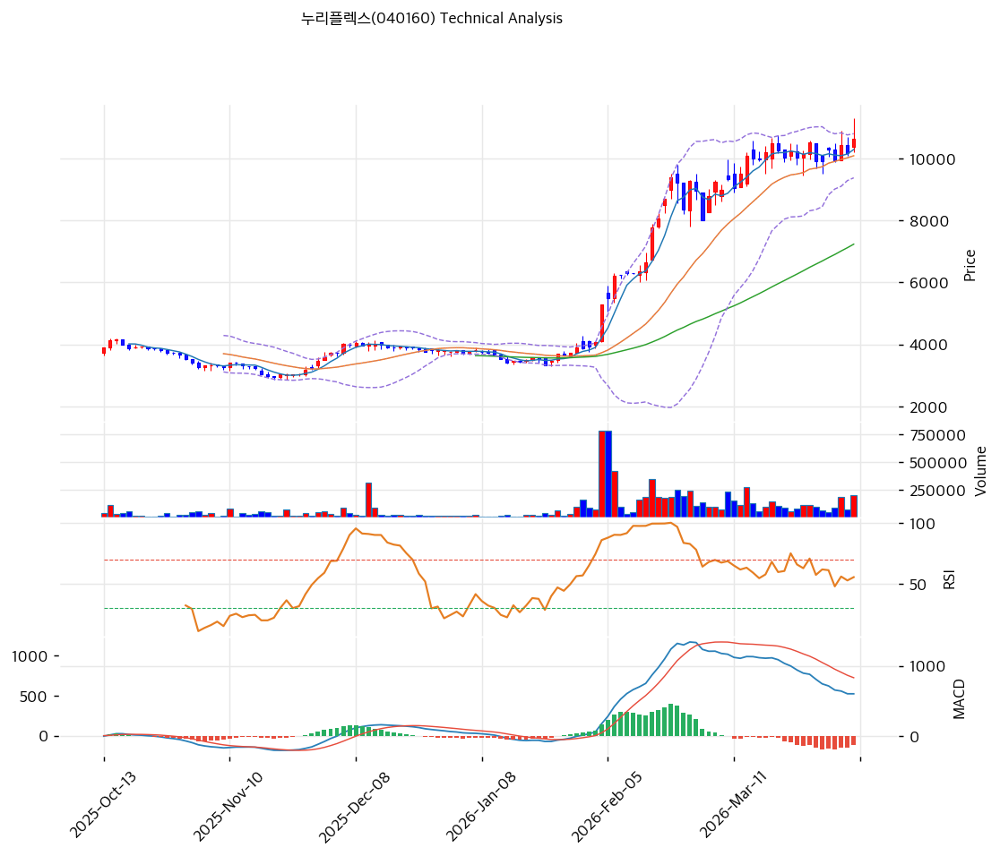

# 누리플렉스(040160) 기술적 분석

2026-04-07 | T2 Technical Analysis

---

## 차트

---

## 1. 가격 현황

| 항목 | 값 |
|------|-----|
| 현재가 | 10,640원 (+4.52%) |
| 52주 고가 | 10,640원 |
| 52주 저가 | 2,340원 |
| 52주 범위 위치 | 100.0% |
| 거래량 | 20일 평균 대비 1.75x |

---

## 2. 차트 패턴 분석

### 2.1 캔들스틱 패턴

| 패턴 | 위치 | 신뢰도 | 해석 |
|------|------|--------|------|
| 강세 장악형(상승장악) | 최근 2일 | 중 | 전일 음봉을 당일 양봉이 완전히 감싸며 단기 매수세 유입 확인. 거래량 1.75x 동반으로 신뢰도 가중. |
| 상단 저항 테스트 | 당일 | 강 | 현재가가 52주 고가(10,640원)와 일치. 고가 돌파 여부가 추세 지속의 핵심 관건. |

※ 현재가가 52주 신고가와 동일한 10,640원으로 강한 저항 구간 진입.

### 2.2 가격 구조 패턴

- **V자 반등 / 상승 추세 초기** (신뢰도: 중)
  2025년 중반 저점(2,340원) 이후 현재가 10,640원까지 약 354% 급등하며 강력한 V자 반등이 형성됐다. 단기 상승 기울기가 매우 가팔라 조정 가능성이 내재되어 있으나, 이동평균선 전 구간 정배열이 추세의 건전성을 지지한다. 52주 고가 돌파 시 신고가 경신으로 추가 모멘텀 기대 가능.

- **52주 고가 저항** (신뢰도: 강)
  현재가 10,640원이 정확히 52주 고가와 일치하여 심리적·기술적 저항선이 중첩된다. 이 구간에서 매물 소화 후 추가 상승하려면 거래량 급증(현재 1.75x 대비 3x 이상)을 동반한 강한 돌파 캔들이 필요하다.

### 2.3 다이버전스

- **RSI 히든 상승 다이버전스 가능성** (신뢰도: 약)
  RSI 62.9로 중립 구간에 위치하며 뚜렷한 다이버전스는 관찰되지 않는다. 가격이 신고가를 기록하는 반면 RSI가 과매수(70 이상)에 진입하지 않은 상태는 아직 상승 여력이 남아 있음을 시사하는 긍정적 신호다.

- **MACD 하락 다이버전스** (신뢰도: 중)
  MACD 히스토그램이 -122로 음전환 상태에서 가격이 신고가를 경신하는 구도는 단기 하락 다이버전스에 해당한다. 가격 상승 모멘텀이 MACD 레벨에서 확인되지 않아 단기 조정 가능성을 경고한다.

### 2.4 패턴 종합 판단

캔들스틱에서는 당일 양봉(+4.52%)과 거래량 증가로 단기 매수 우위가 확인된다. 가격 구조상으로는 52주 신고가 저항 구간에 정확히 위치해 있어 돌파 성공 여부가 중기 방향성을 결정한다. MACD 히스토그램이 음수로 전환된 점은 단기 모멘텀 둔화를 시사하며, 거래량 1.75x 수준이 고가 돌파에 충분한지 불확실하다. 전반적으로 **단기 강세이나 52주 고가 저항 구간에서 일시적 숨 고르기 가능성**이 공존한다.

---

## 3. 이동평균선 — 정배열 (강세)

| MA | 값 | 현재가 괴리율 | 위치 |
|----|-----|--------------|------|
| MA5 | 10,296원 | +3.3% | 위 |
| MA20 | 10,093원 | +5.4% | 위 |
| MA60 | 7,236원 | +47.0% | 위 |
| MA120 | 5,435원 | +95.8% | 위 |
| MA200 | 4,958원 | +114.6% | 위 |

**해석**: 전 구간 이동평균선이 정배열 상태로 중장기 상승 추세가 뚜렷하다. 현재가가 MA200 대비 114.6% 위에 위치하며 장기 저점 대비 극적인 반등이 이루어진 상황이다. MA5(10,296원)와 MA20(10,093원)이 지지선으로 기능하고 있으며, 단기 조정 시 MA20(10,093원) 구간이 1차 지지대 역할을 할 것으로 판단된다. 단, MA60과의 괴리율 47%는 단기 과열 신호로 해석할 수 있어 주의가 필요하다.

---

## 4. 보조 지표

### RSI(14) — 62.9 (중립)

RSI 62.9는 중립과 과매수 중간 구간으로, 추가 상승 여력이 있으면서도 과매수 진입 전 경계 구간이다. 가격이 52주 신고가를 경신했음에도 RSI가 70 미만을 유지하는 점은 상승 추세가 아직 과열 단계에 도달하지 않았음을 시사한다.

### MACD(12,26,9)

| 항목 | 값 |
|------|-----|
| MACD | 602 |
| Signal | 724 |
| Histogram | -122 |
| 크로스 상태 | 매도 구간 (수축 중) |

**해석**: MACD가 Signal 아래에 위치(매도 구간)하며 히스토그램이 -122로 음전환 상태다. 단, 히스토그램의 절대값이 크지 않고 수축 중이어서 조만간 골든크로스 재전환 가능성도 존재한다. MACD 602와 Signal 724의 격차가 좁혀지는 추이를 확인할 필요가 있다.

### 볼린저밴드(20, 2σ)

| 항목 | 값 |
|------|-----|
| 상단 | 10,806원 |
| 중단 (MA20) | 10,093원 |
| 하단 | 9,380원 |
| 밴드 폭 | 14.1% |
| 현재 위치 | 상단 근접 |

**해석**: 현재가가 볼린저밴드 상단(10,806원) 근처에 위치해 있어 단기 조정 압력이 존재한다. 밴드 폭 14.1%는 최근 변동성이 확대된 상태임을 나타내며, 상단 이탈 시 추가 강세이나 상단 저항에서 반락할 경우 중단(MA20, 10,093원)까지 되돌림 가능성이 있다.

### 스토캐스틱(14, 3, 3)

| 항목 | 값 |
|------|-----|
| Slow %K | 60.8 |
| Slow %D | 57.2 |
| 크로스 상태 | 골든크로스 |
| 판단 | 중립 |

스토캐스틱이 골든크로스 상태(K > D)로 단기 상승 모멘텀을 지지한다. K=60.8, D=57.2로 과매수(80 이상) 진입 전 구간이어서 추가 상승 여력을 시사한다.

---

## 5. 지지/저항

| 구분 | 가격 | 근거 |
|------|------|------|
| 저항 | 11,220원 | 피봇 R1 |
| 저항 | 10,806원 | 볼린저밴드 상단 |
| **현재가** | **10,640원** | 52주 고가와 동일 |
| 지지 | 10,140원 | 피봇 S1 |
| 지지 | 10,093원 | MA20 / 볼린저밴드 중단 |
| 지지 | 9,640원 | 피봇 S2 |
| 지지 | 7,236원 | MA60 (장기 지지) |

---

## 6. 시그널 종합

| 지표 | 내용 | 시그널 |
|------|------|--------|
| **차트 패턴** | 52주 신고가 도달, V자 반등 추세 지속, MACD 단기 음전환 | ⚪ |
| 이동평균선 | 전 구간 정배열, MA20 +5.4% 위 | 🟢 |
| RSI | 62.9 — 중립 (과매수 미진입) | ⚪ |
| MACD | 매도 구간, 히스토그램 -122 수축 중 | 🔴 |
| 볼린저밴드 | 상단 근접(10,806원), 밴드폭 14.1% | ⚪ |
| 스토캐스틱 | 골든크로스, K=60.8 중립 | ⚪ |
| 거래량 | 1.75x — 보통 | ⚪ |

**종합 판단**: 🟢 매수 1개 / 🔴 매도 1개 / ⚪ 중립 5개 → **중립**

이동평균선 정배열이라는 중기 강세 구조는 유효하나, 현재가가 52주 신고가(10,640원) 저항과 정확히 겹치고 MACD가 매도 구간에 있어 단기적으로 방향성이 불확실하다. 52주 고가를 거래량 급증과 함께 돌파한다면 추가 상승이 열리는 구도이나, 돌파 실패 시 MA20(10,093원) 수준까지 되돌림 조정이 예상된다. 중장기 추세는 상승으로 유지되고 있어 조정 시 매수 기회를 탐색하는 전략이 적절하다.

---

## 7. 전략 제안

### 보유 중인 경우
- **홀드** (52주 고가 돌파 확인 후 비중 유지)
- 익절 라인: 10,853원 (볼린저밴드 상단 돌파 확인 후 차익실현 고려, 피봇 R1 11,220원이 다음 목표)
- 손절 라인: 9,640원 (피봇 S2 이탈 시, MA20 붕괴 후 추가 하락 우려 구간)
- 리스크/리워드: 약 1 : 2.2 (손실 1,000원 vs 이익 2,213원 기준)

### 진입 대기인 경우
- **진입가능** (조건부 진입 — 52주 고가 돌파 확인 또는 눌림목 진입)
- 1차 진입가: 10,140원 (피봇 S1, 단기 조정 후 지지 확인 시)
- 2차 진입가: 10,093원 (MA20 지지 확인 시)
- 진입 조건: 52주 고가(10,640원) 거래량 급증 돌파 시 추격 진입 가능. 조정 시에는 MA20(10,093원) 지지 확인 후 매수. MACD 골든크로스 재진입 확인 시 신뢰도 상승.
