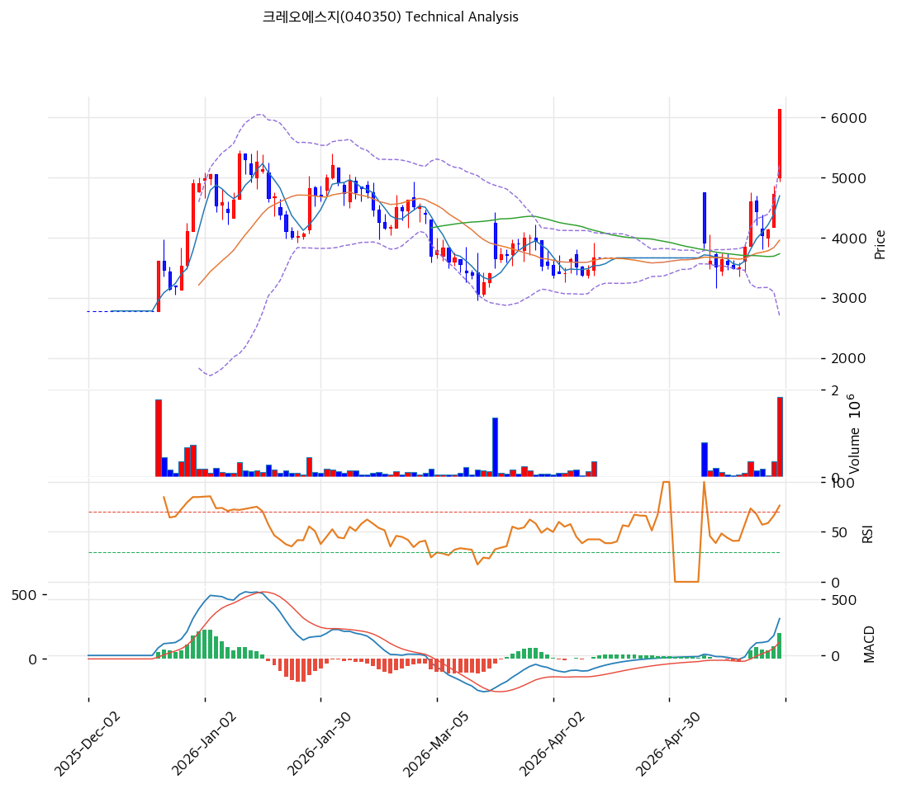

# 크레오에스지(040350) 기술적 분석 보고서

---

## 가격 위치

현재가 **6,130원** (+29.87%, 상한가) — 52주 위치 68.5% (고가 7,668 / 저가 2,779). **오늘 상한가 + 거래량 14.19배 폭증** — 바이오 테마 + 수급 급변. 외국인 -43,054 + 기관 -30,011 매도(개인 주도 급등). 펀더멘털 무관 투기적 급등. RSI 79.5 과매수.

## 이동평균선 / 모멘텀

MA5 4,690 / MA20 3,954 / MA60 3,728 / MA120 3,944 / MA200 3,998 — 현재가가 모든 이평선 대비 +30\~64% 극단 이격(상한가 급등). MA120·MA200(3,944\~3,998)이 MA60(3,728) 위 = **비정상 배열** (장기 횡보 후 급등). 단기 급등으로 이격도 극단.

**RSI 79.5 (과매수 🔴)** — 80 근접 과매수. MACD 330 / 시그널 131 / 히스토 199 = **매수 시그널 + 확장** (급등). 스토캐 K=84.4 / D=73.1 골든크로스 **과매수**. **BB 폭 63.7% 극단 + 거래량 14.19배** — 변동성 폭발, 투기적 급등 정점.

## 시그널 종합 / S&R

매수 2 / 매도 3 / 중립 2 → **매도우위**. 상한가 급등이나 과매수 다수.

- 저항: **7,668원(52주 고가)** / 6,659원(피보 0.236) / 6,532원(피봇 R1)
- 지지: 5,917원(피보 0.382) / **5,322원(PRZ 약: 피보 0.5·피봇 S1)** / 4,704원(PRZ 약: MA5·피보 0.618) / 3,954원(MA20)
- 급락 지지: 3,728원(MA60) / 3,725원(추세선)

전략: **추격 매수 강력 비추 — TP 7,821원 / SL 4,523원**. WAIT(관망) e1=5,327원 / e2=3,954원. 상한가 + 거래량 14배 + RSI 79.5는 **투기적 급등 정점** — 단기 -30%+ 급락 위험 매우 높음. 펀더멘털(5년 적자 + CB 23회차) 무관 테마 급등. **신규 진입 비추**, 보유 시 분할 익절 권고. MA20 3,954원 이탈 시 급락.
