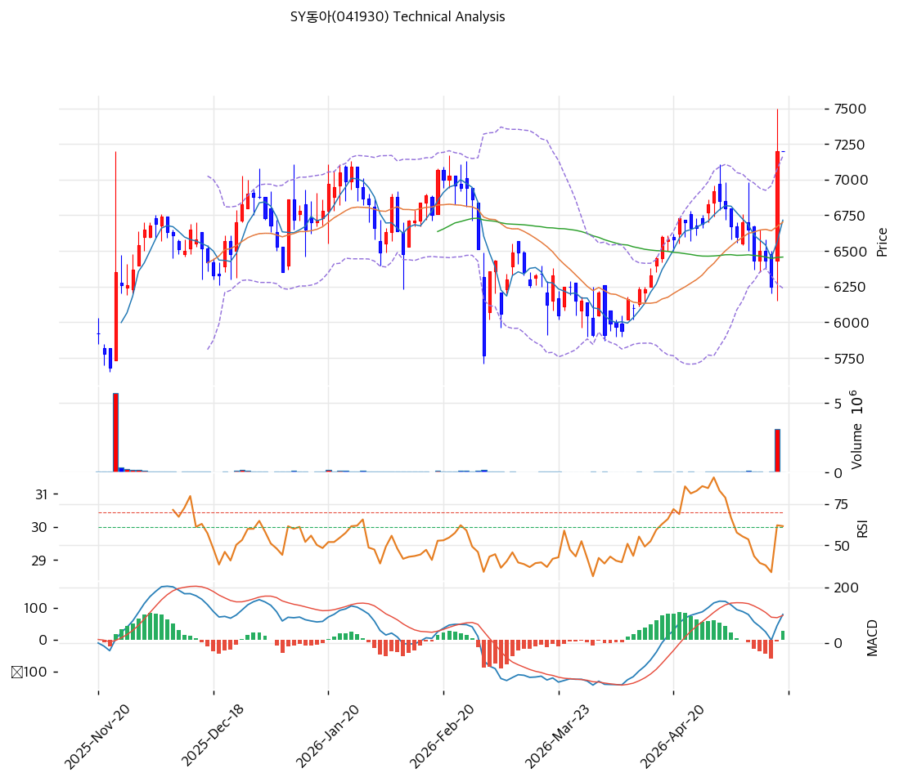

# 기술적분석

2026-05-19 | T2 Technical Analysis

***

## 차트

***

## 1. 가격 현황

| 항목        | 값                  |
| --------- | ------------------ |
| 현재가       | 7,200원 (+14% 단일봉)  |
| 52주 고가    | 7,550원             |
| 52주 저가    | 5,620원             |
| 52주 범위 위치 | 82%                |
| 거래량       | 데이터 결손 (차트상 당일 폭증) |

***

## 2. 차트 패턴 분석

### 2.1 캔들스틱 패턴

| 패턴                | 위치     | 신뢰도 | 해석                           |
| ----------------- | ------ | --- | ---------------------------- |
| **장대양봉 (박스권 돌파)** | 당일     | 강   | 6,300→7,200 단일봉 +14%, 거래량 폭증 |
| **박스권 마무리**       | 최근 5개월 | 강   | 5,620\~7,000원 박스 상단 돌파       |
| 적삼병               | —      | —   | 단일 강세봉 후 다음봉 관찰              |

### 2.2 가격 구조 패턴

* **5개월 박스권 돌파** (신뢰도: 강) 2025-11~~2026-04 박스권 (5,620~~7,000원, 5개월 횡보)을 2026-05 당일 거래량 폭증과 함께 상향 돌파. **박스권 폭 1,380원 × 1차 목표 8,380원, 2차 목표 9,000원**.
* **저평가 가치 재발견 시그널** (신뢰도: 중) PBR 0.56x + ROE 14.5%의 펀더멘털 괴리가 외인·기관 매집과 함께 시장 재인식 단계 진입.

### 2.3 다이버전스

* **RSI 65 동행** (신뢰도: 강) RSI 65.0은 과매수 70 미만 — 추가 상승 여지. 다이버전스 미관찰.
* **MACD 매수 + 히스토그램 +28** (신뢰도: 중) 골든크로스 직후. 매수 모멘텀 초기.

### 2.4 패턴 종합 판단

박스권 돌파 + 거래량 폭증 + RSI 65 (과매수 미진입) + MACD 매수 진입의 **건전한 추세 시작**. 펀더멘털 (PBR 0.56x + ROE 14.5%)과 정합. 단기 -5\~-10% 조정 후 재상승 가능성 높음.

***

## 3. 이동평균선 — 정배열 시작

| MA    | 값      | 현재가 괴리율 | 위치 |
| ----- | ------ | ------- | -- |
| MA5   | 6,716원 | +7.2%   | 위  |
| MA20  | 6,702원 | +7.4%   | 위  |
| MA60  | 6,457원 | +11.5%  | 위  |
| MA120 | (확인)   | 약 +11%  | 위  |
| MA200 | 6,416원 | +12.2%  | 위  |

**해석**: 모든 MA 상단. MA20 +7.4%·MA200 +12.2%는 **정상 추세 영역** (과열 아님). 박스권 돌파 후 정배열 형성 시작.

***

## 4. 보조 지표

### RSI(14) — 65.0 (중립)

70 임계 미돌파. 추가 상승 여지.

### MACD(12,26,9)

| 항목        | 값         |
| --------- | --------- |
| MACD      | 103       |
| Signal    | 75        |
| Histogram | +28       |
| 크로스 상태    | 매수 (확대 중) |

**해석**: 골든크로스 직후 히스토그램 양 방향 확대. 매수 모멘텀 초기.

### 볼린저밴드(20, 2σ)

| 항목        | 값           |
| --------- | ----------- |
| 상단        | 7,165원      |
| 중단 (MA20) | 6,702원      |
| 하단        | 6,240원      |
| 밴드 폭      | 13.8%       |
| 현재 위치     | 상단 +0.5% 이탈 |

**해석**: 밴드 폭 13.8% 평균. 상단 근접. 1\~3봉 내 상단 안쪽 회귀 가능.

### 스토캐스틱(14, 3, 3)

| 항목      | 값     |
| ------- | ----- |
| Slow %K | 53.7  |
| Slow %D | 32.3  |
| 크로스 상태  | 골든크로스 |
| 판단      | 중립    |

***

## 5. 지지/저항

### 종합 지지/저항

| 구분      | 가격         | 근거                       |
| ------- | ---------- | ------------------------ |
| 저항      | 9,000원     | 박스권 폭 2차 목표 (+25%)       |
| 저항      | 8,380원     | 박스권 폭 1차 목표 (+16%)       |
| 저항      | 7,701원     | 단기 익절 (피보 확장)            |
| **현재가** | **7,200원** | —                        |
| 지지      | 7,165원     | BB 상단                    |
| 지지      | 7,000원     | 박스권 상단 (re-test)         |
| 지지      | 6,702원     | **MA20 + BB 중단 (1차 강력)** |
| 지지      | 6,457원     | MA60                     |
| 지지      | 6,240원     | BB 하단                    |
| 지지      | 5,620원     | 52주 저점                   |

***

## 6. 시그널 종합

| 지표             | 시그널 |
| -------------- | --- |
| 차트 패턴 (박스권 돌파) | 🟢  |
| 이동평균선 (정배열 시작) | 🟢  |
| RSI 65 (중립)    | ⚪   |
| MACD 매수 진입     | 🟢  |
| 볼린저밴드 상단 근접    | ⚪   |
| 스토캐스틱 53.7     | ⚪   |
| 거래량 (당일 폭증)    | 🟢  |

**종합 판단**: 🟢 매수 4개 / 🔴 매도 0개 / ⚪ 중립 3개 → **매수우위 (건전)**

**과열 시그널 부재 + 펀더멘털 정합**의 건전한 추세 시작. 외인·기관 매집 + 박스권 돌파 = 가치 재발견 진행.

***

## 7. 전략 제안

### 보유 중

* **홀드 + 분할 익절**
* 1차 익절: 8,380원 (박스권 1차 목표, +16%)
* 2차 익절: 9,000원 (박스권 2차 목표, +25%)
* 손절: 6,702원 (MA20 이탈, -7%)
* 리스크/리워드: 1차 익절 기준 2.3 (유리)

### 진입 대기

* **진입 가능 영역**
* 1차 진입: 7,000원 (박스권 상단 re-test, -3%)
* 2차 진입: 6,702원 (MA20, -7%)
* 진입 조건: re-test 시 양봉 + 거래량 회복 확인. 6,240원 (BB 하단) 이탈 시 추세 약화
* **펀더멘털 우호**: PBR 0.56x + ROE 14.5% + ROA 가속 + 외인·기관 매집 — 단기 기술 진입과 펀더멘털 동시 정합
