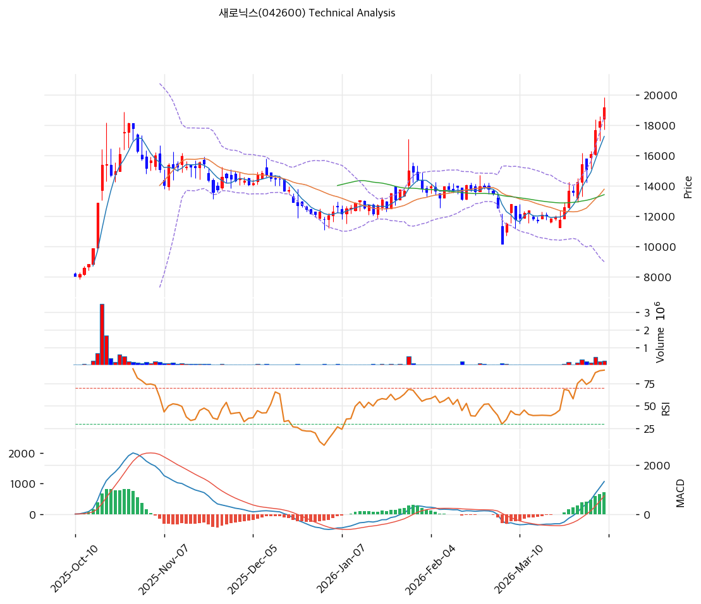

# 새로닉스(042600) 기술적 분석

2026-04-06 | T2 Technical Analysis

---

## 차트

---

## 1. 가격 현황

| 항목 | 값 |
|------|-----|
| 현재가 | 19,170원 (+4.87%) |
| 52주 고가 | 19,170원 |
| 52주 저가 | 6,590원 |
| 52주 범위 위치 | 100.0% |
| 거래량 | 20일 평균 대비 2.67x |

현재가가 정확히 52주 고가에 위치해 있다는 점이 가장 주목할 시그널이다. 52주 저가(6,590원) 대비 191% 상승한 상태에서 신고가를 경신하고 있으며, 당일 거래량도 20일 평균의 2.67배로 강력한 수급 동반이 확인된다. 가격 모멘텀 자체는 최고조이나, 동시에 단기 과열 구간 진입을 강하게 시사한다.

---

## 2. 차트 패턴 분석

### 2.1 캔들스틱 패턴

| 패턴 | 위치 | 신뢰도 | 해석 |
|------|------|--------|------|
| 강세 장악형(Bullish Engulfing) 추정 | 최근 3~5일 | 중 | 이전 조정 캔들을 완전히 감싸는 양봉이 출현하며 매수세 우위를 확인; 신고가 돌파 직전 저항 구간에서 발생하여 단기 추가 상승 모멘텀 강화 |
| 긴 윗꼬리형(Upper Shadow) 가능성 | 당일 (19,170원 종가 = 52주 고가) | 중 | 당일 종가가 52주 고가와 일치하고 있어, 이후 추가 저항 시 윗꼬리가 형성될 수 있음; 이 경우 단기 천장 형성 시그널로 전환 가능 |
| 연속 양봉(적삼병 유사) | 최근 5영업일 | 중 | MA5(17,268원)가 MA20(13,784원)을 대폭 상회한 상황에서 연속 양봉 구간이 지속되고 있어 단기 추세 강도는 강하나, 연속 상승 후 되돌림 가능성도 내포 |

※ 주요 캔들 패턴: 망치형, 역망치형, 장악형(상승/하락), 도지, 샛별/석별, 적삼병/흑삼병, 하라미, 유성형, 교수형 등

### 2.2 가격 구조 패턴

- **급격한 V자 반등 이후 박스권 상단 돌파** (신뢰도: 중)
  52주 저가(6,590원)에서 현재가(19,170원)까지 약 6개월 내외에 걸쳐 191% 상승하는 강한 V자 반등 구조가 형성되었다. 이는 KEPCO AMI 2단계 발주 기대감에 의한 투자자 센티먼트 급전환으로 해석되며, 기술적으로는 장기 하락 추세를 완전히 역전한 구조 전환 국면이다. 현재 19,170원 돌파 시 다음 저항은 피봇 R1(20,110원)과 피봇 R2(21,050원)이며, 이 구간을 안정적으로 넘으면 추가 상승 여지가 열린다.

- **비정배열 상태에서의 과열 돌파** (신뢰도: 강)
  MA5(17,268원) → MA20(13,784원) → MA60(13,422원) → MA120(13,724원) → MA200(11,513원) 순으로 이동평균선들이 장기 이평선부터 위쪽으로 수렴해 있는 가운데, 현재가가 MA5조차 11% 위에 있는 과열 상태다. 정배열이 아직 완성되지 않은(MA60 > MA120으로 역배열 일부 잔존) 상태에서의 단기 급등은 기술적 되돌림 리스크를 내포한다.

※ 주요 구조 패턴: 이중천정/바닥, 헤드앤숄더(정/역), 삼각수렴(대칭/상승/하락), 쐐기형(상승/하락), 깃발형, 페넌트, 컵앤핸들, 박스권 등

### 2.3 다이버전스

- **RSI 하락 다이버전스 (신뢰도: 중)**
  가격이 52주 신고가를 경신하는 시점에서 RSI(78.5)가 이전 고점 대비 추가 상승하고 있는지 여부를 면밀히 모니터링해야 한다. 현재 RSI 78.5는 과매수 임계(70)를 크게 상회하고 있으며, 가격이 추가 고점을 경신하는 과정에서 RSI가 신고점을 갱신하지 못할 경우(하락 다이버전스) 추세 전환의 전조가 될 수 있다. 당일 기준으로는 아직 명확한 다이버전스보다 모멘텀 지속 국면이나, 향후 1~2주 내 고점 확인이 중요하다.

- **스토캐스틱 과매수 구간 지속** (신뢰도: 강)
  스토캐스틱 K(92.8), D(91.6) 모두 극도의 과매수(80 이상) 구간에 위치하고 있다. 현재 골든크로스 상태이나, K와 D 모두 90 이상에서 수렴·데드크로스로 전환될 경우 단기 하락 시그널로 작용한다. 이 구간에서의 히든 하락 다이버전스(가격↑, 스토캐스틱↓)는 단기 고점 형성의 강력한 기술적 시그널이 될 수 있다.

※ RSI·MACD 기반 | 상승 다이버전스 = 가격↓ 지표↑ (반등 시사), 하락 다이버전스 = 가격↑ 지표↓ (하락 시사), 히든 다이버전스 = 기존 추세 지속 시사

### 2.4 패턴 종합 판단

캔들스틱(강세 양봉 지속), 가격 구조(52주 신고가 돌파), 다이버전스(RSI·스토캐스틱 과매수 경계) 세 카테고리를 종합하면, 현재 차트는 **단기 강한 상승 모멘텀과 즉각적인 과열 조정 리스크가 공존하는 양면적 국면**임을 시사한다. 신고가 경신 자체는 강세 신호이나, RSI 78.5·스토캐스틱 K 92.8이라는 극도의 과매수 상태에서 52주 고가와 현재가가 일치하는 구조는 추가 저항의 부재를 확인하기 전까지 섣부른 추격 매수의 위험성을 내포한다. 단기(1~2주) 관점에서는 피봇 R1(20,110원) 돌파 여부가 추세 지속의 분수령이며, 돌파 실패 시 빠른 되돌림(17,970원 지지선 테스트)이 예상된다.

---

## 3. 이동평균선 — 비정배열 (단기 강세/장기 과열)

| MA | 값 | 현재가 괴리율 | 위치 |
|----|-----|--------------|------|
| MA5 | 17,268원 | +11.0% | 위 |
| MA20 | 13,784원 | +39.1% | 위 |
| MA60 | 13,422원 | +42.8% | 위 |
| MA120 | 13,724원 | +39.7% | 위 |
| MA200 | 11,513원 | +66.5% | 위 |

**해석**: 현재가가 5대 이동평균선 전부를 크게 상회하고 있으나, MA60(13,422원) > MA120(13,724원)이 역배열 관계로 이동평균선이 완전한 정배열을 이루지 못한 상태다. 이는 장기 하락 추세의 흔적이 아직 이평선 체계에 남아 있음을 의미한다. MA20 대비 괴리율이 +39.1%, MA200 대비 +66.5%에 달하는 극도의 과열 상태는 평균회귀 압력을 높인다. 단기적으로는 MA5(17,268원)가 1차 지지선 역할을 하며, 조정 시 MA20(13,784원)까지 빠르게 수렴하는 시나리오도 기술적으로 가능하다.

---

## 4. 보조 지표

### RSI(14) — 78.5 (🔴과매수)

RSI 78.5는 과매수 임계치(70)를 8.5포인트 이상 상회하는 강한 과열 구간으로, 통상 이 수준에서는 추가 상승보다 조정 또는 횡보 가능성이 높아진다. 다만 강한 추세 초기 국면에서는 RSI가 80~90대를 유지하며 계속 상승하는 경우도 있어, 단독으로 매도 근거로 삼기보다 스토캐스틱·볼린저밴드와의 복합 판단이 필요하다.

### MACD(12,26,9)

| 항목 | 값 |
|------|-----|
| MACD | 1,323 |
| Signal | 599 |
| Histogram | +724 |
| 크로스 상태 | 매수 구간 (확대 중) |

**해석**: MACD(1,323)가 시그널(599)을 크게 상회하고 히스토그램(+724)이 양수이며 확대 중으로, 단기 상승 모멘텀이 가장 강한 구간에 있음을 확인해준다. MACD만 보면 강세 지속 신호이나, 히스토그램이 확대 속도를 잃고 수축으로 전환되는 시점이 고점 경계 신호가 된다.

### 볼린저밴드(20, 2σ)

| 항목 | 값 |
|------|-----|
| 상단 | 18,576원 |
| 중단 (MA20) | 13,784원 |
| 하단 | 8,993원 |
| 밴드 폭 | 69.5% |
| 현재 위치 | 상단 초과 (밴드 상단 돌파) |

**해석**: 현재가(19,170원)가 볼린저밴드 상단(18,576원)을 돌파하여 상단 밖에 위치하고 있다. 밴드 폭 69.5%는 최근 변동성이 대폭 확대된 상태임을 보여준다. 볼린저밴드 상단 돌파는 강세 추세에서 추가 상승의 신호로 해석될 수 있으나(Band Riding 현상), 동시에 밴드 중단(MA20, 13,784원)으로의 수렴 리스크도 내포한다. 강세 지속을 위해서는 상단 밴드(18,576원) 근처에서 지지가 확인되어야 한다.

### 스토캐스틱(14, 3, 3)

| 항목 | 값 |
|------|-----|
| Slow %K | 92.8 |
| Slow %D | 91.6 |
| 크로스 상태 | 골든크로스 (K > D) |
| 판단 | 과매수 |

---

## 5. 지지/저항

| 구분 | 가격 | 근거 |
|------|------|------|
| 저항 | 21,050원 | 피봇 R2 |
| 저항 | 20,110원 | 피봇 R1 |
| **현재가** | **19,170원** | — (= 52주 고가) |
| 지지 | 17,970원 | 피봇 S1 / MA5 근접 |
| 지지 | 16,770원 | 피봇 S2 / 손절 기준선 |
| 지지 | 13,784원 | MA20 / 볼린저밴드 중단 |
| 지지 | 13,422원 | MA60 |

현재가가 52주 고가이자 단기 저항선과 일치하는 상황에서, 위로 뚜렷한 역사적 저항선이 없다는 점은 모멘텀 투자 관점에서 긍정적이다. 그러나 피봇 R1(20,110원), R2(21,050원)가 수급 저항점으로 작용할 가능성이 크며, 하방으로는 피봇 S1(17,970원)과 MA5(17,268원) 부근이 1차 지지 구간이다. 이 지지선이 붕괴되면 16,770원(피봇 S2) → 13,784원(MA20) 순으로 하방 지지 테스트가 이어질 수 있다.

---

## 6. 시그널 종합

| 지표 | 내용 | 시그널 |
|------|------|--------|
| **차트 패턴** | 52주 신고가 돌파, 비정배열 과열 돌파 구조 | ⚪ |
| 이동평균선 | 전선 상회, MA20 +39.1% 과열 | ⚪ |
| RSI | 78.5 — 과매수 🔴 | 🔴 |
| MACD | 매수 구간, 히스토그램 확대 중 | 🟢 |
| 볼린저밴드 | 상단 돌파, 밴드 폭 69.5% 확대 | ⚪ |
| 스토캐스틱 | K=92.8, D=91.6, 골든크로스 — 과매수 극단 | 🔴 |
| 거래량 | 2.67x — 강력 동반 | 🟢 |

**종합 판단**: 🟢 매수 2개 / 🔴 매도 2개 / ⚪ 중립 3개 → **중립 (단기 과열 주의)**

MACD와 거래량은 단기 강세 모멘텀을 지지하고 있으나, RSI(78.5)와 스토캐스틱(K=92.8)의 극도 과매수 신호, 그리고 MA20 대비 +39.1% 괴리율은 단기 조정 리스크를 강하게 경고한다. 차트 패턴(신고가 돌파)과 이동평균선(전선 상회) 자체는 중기 강세 전환을 확인하는 구조이나, 현재 위치에서 추격 매수는 리스크/리워드 비율이 불리하다. 단기 관점(1~2주)에서는 피봇 R1(20,110원) 돌파 시 추가 상승 확인, 실패 시 17,970원 지지선 테스트의 이분 구도다. 중기 관점(1~2개월)에서는 MA20(13,784원)을 향한 수렴 가능성을 감안한 포지션 관리가 필요하다.

---

## 7. 전략 제안

### 보유 중인 경우
- **비중축소**
- 익절 라인: 19,553원 (현재가 +2%, 피봇 R1 20,110원 직전 차익실현 구간)
- 손절 라인: 16,770원 (피봇 S2, 이 수준 이탈 시 단기 모멘텀 붕괴 확인)
- 리스크/리워드: R1 목표 기준 약 1 : 0.9 (불리) — 현 위치에서 홀딩보다 익절 후 재진입 전략이 유리

### 진입 대기인 경우
- **관망 (조정 후 진입 대기)**
- 1차 진입가: 17,970원 (피봇 S1 지지 확인 후 진입 — 현재가 대비 약 -6.3%)
- 2차 진입가: 13,784원 (MA20 지지 확인 후 진입 — 더 큰 조정 시나리오)
- 진입 조건: 피봇 S1 근처에서 거래량 감소와 함께 하방 변동성 수렴 확인 후 양봉 전환 캔들 출현 시 매수 검토; 또는 피봇 R1(20,110원) 거래량 동반 돌파·종가 안착 확인 시 추격 진입 허용
