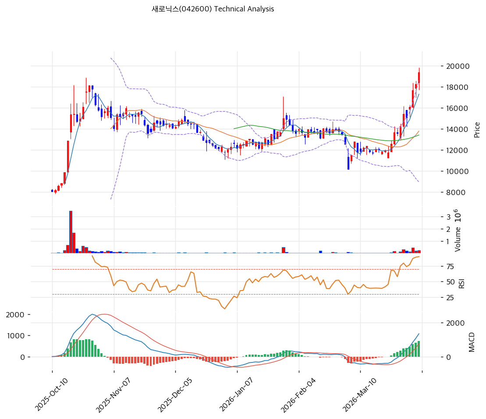

# 새로닉스(042600) 기술적 분석

2026-04-06 | T2 Technical Analysis

---

## 차트

---

## 1. 가격 현황

| 항목 | 값 |
|------|-----|
| 현재가 | 19,400원 (+6.13%) |
| 52주 고가 | 19,400원 |
| 52주 저가 | 6,590원 |
| 52주 범위 위치 | 100.0% |
| 거래량 | 20일 평균 대비 2.61x |

---

## 2. 차트 패턴 분석

### 2.1 캔들스틱 패턴

| 패턴 | 위치 | 신뢰도 | 해석 |
|------|------|--------|------|
| 신고가 돌파 양봉 | 최근 | 강 | 강한 수급이 동반된 추세 가속 신호 |
| 장대양봉 후 속도 확장 | 최근 3~5거래일 | 강 | 추세는 강하지만 단기 과열도 심화 |

### 2.2 가격 구조 패턴

- **급등 돌파형 패턴** (신뢰도: 강)
  박스 상단을 강하게 돌파했고, 52주 고가를 경신했습니다.

- **비정배열이지만 모멘텀 급강화** (신뢰도: 중)
  이평선 구조는 완벽하진 않지만, 단기 모멘텀이 매우 강합니다.

### 2.3 다이버전스

- **RSI 과매수** (신뢰도: 강)
  RSI 79.0은 추세 지속보다 과열 관리가 중요해지는 구간입니다.

- **MACD 강한 매수** (신뢰도: 중)
  히스토그램 확대가 강해 추세는 아직 살아 있습니다.

### 2.4 패턴 종합 판단

새로닉스는 **강한 돌파형 모멘텀 종목**입니다. 다만 실적 기반보다 수급 기반 성격이 강해, 차익실현 변동성도 클 수 있습니다.

---

## 3. 이동평균선 — 비정배열이지만 강한 단기 모멘텀

| MA | 값 | 현재가 괴리율 | 위치 |
|----|-----|--------------|------|
| MA5 | 17,314원 | +12.0% | 위 |
| MA20 | 13,796원 | +40.6% | 위 |
| MA60 | 13,426원 | +44.5% | 위 |
| MA120 | 13,726원 | +41.3% | 위 |
| MA200 | 11,514원 | +68.5% | 위 |

**해석**: 단기적으로 매우 강하지만 MA20 괴리율 40%는 과열 부담이 큽니다. 추세보다 과속 여부를 봐야 합니다.

---

## 4. 보조 지표

### RSI(14) — 79.0 (🔴과매수)

과매수 구간입니다. 추세 지속 가능성은 있지만, 신규 진입 리스크가 큰 자리입니다.

### MACD(12,26,9)

| 항목 | 값 |
|------|-----|
| MACD | 1,342.0 |
| Signal | 603.0 |
| Histogram | +739.0 |
| 크로스 상태 | 매수 구간 (강하게 확대) |

**해석**: MACD는 매우 강한 상승 추세를 시사합니다.

### 볼린저밴드(20, 2σ)

| 항목 | 값 |
|------|-----|
| 상단 | 18,643원 |
| 중단 (MA20) | 13,796원 |
| 하단 | 8,949원 |
| 밴드 폭 | 70.3% |
| 현재 위치 | 상단근접 |

**해석**: 밴드 상단을 넘어선 구간으로, 추세는 강하지만 과열도 분명합니다.

### 스토캐스틱(14, 3, 3)

| 항목 | 값 |
|------|-----|
| Slow %K | 93.7 |
| Slow %D | 91.9 |
| 크로스 상태 | 골든크로스 |
| 판단 | 과매수 |

---

## 5. 지지/저항

| 구분 | 가격 | 근거 |
|------|------|------|
| 저항 | 19,400원 | 52주 고가 |
| 저항 | 20,263원 | 피봇 R1 |
| **현재가** | **19,400원** | — |
| 지지 | 18,123원 | 피봇 S1 |
| 지지 | 16,847원 | 피봇 S2 |
| 지지 | 13,796원 | MA20 |

---

## 6. 시그널 종합

| 지표 | 내용 | 시그널 |
|------|------|--------|
| **차트 패턴** | 신고가 돌파형 모멘텀 | 🟢 |
| 이동평균선 | 비정배열이나 MA20 +40.6% 과열 | 🔴 |
| RSI | 79.0 — 과매수 | 🔴 |
| MACD | 매수구간, 히스토그램 확대 | 🟢 |
| 볼린저밴드 | 상단 밀착 | ⚪ |
| 스토캐스틱 | 과매수 구간 | 🔴 |
| 거래량 | 2.61x — 강력 동반 | 🟢 |

**종합 판단**: 🟢 매수 3개 / 🔴 매도 3개 / ⚪ 중립 1개 → **중립~매도우위**

모멘텀은 매우 강하지만, 지금은 추격 매수보다 차익실현 관리가 더 중요한 구간입니다.

---

## 7. 전략 제안

### 보유 중인 경우
- **비중축소**
- 익절 라인: 19,788원
- 손절 라인: 16,847원
- 리스크/리워드: 단기 기준 보수적

### 진입 대기인 경우
- **관망**
- 1차 진입가: 18,123원 (피봇 S1)
- 2차 진입가: 13,796원 (MA20)
- 진입 조건: 과열 해소 후 지지 확인 및 거래량 안정화
