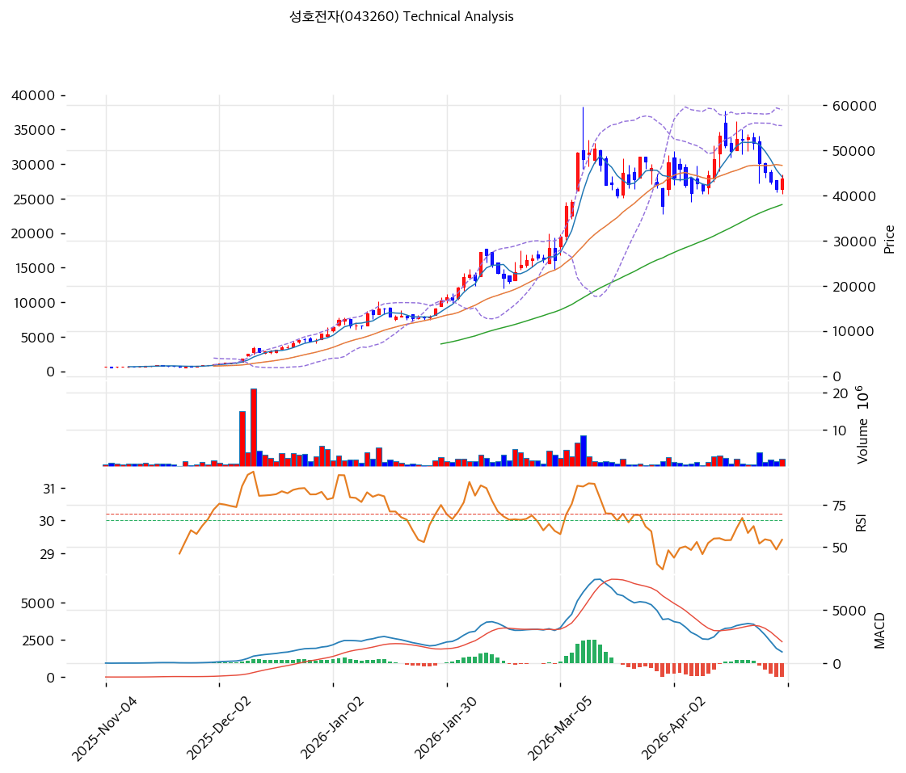

# 성호전자(043260) 기술적 분석

2026-04-29 | T2 Technical Analysis

---

## 차트

---

## 1. 가격 현황

| 항목 | 값 |
|------|-----|
| 현재가 | 43,800원 (+5.54%) |
| 52주 고가 | 53,200원 |
| 52주 저가 | 1,027원 |
| 52주 범위 위치 | 82.0% |
| 거래량 | 20일 평균 대비 1.32x |

---

## 2. 차트 패턴 분석

### 2.1 캔들스틱 패턴

| 패턴 | 위치 | 신뢰도 | 해석 |
|------|------|--------|------|
| 단기 반등 양봉 | 최근 1일 | 약 | 직전 조정 이후 양봉으로 반등했으나 MA5·MA20 아래에 있어 매수 신호는 제한적이다. |
| 특이 패턴 없음 | 최근 3~5일 | 중 | 망치형·장악형·샛별 등 강한 반전 패턴은 명확하지 않아 중립 시그널로 판단한다. |

※ 주요 캔들 패턴: 망치형, 역망치형, 장악형(상승/하락), 도지, 샛별/석별, 적삼병/흑삼병, 하라미, 유성형, 교수형 등

### 2.2 가격 구조 패턴

- **상승 추세 내 조정 채널** (신뢰도: 중)
  2025년 11월 이후 큰 상승 추세는 유지되고 있으나, 3월 고점권 급등 이후 5만 원대에서 하락하며 단기 조정 구조가 진행 중이다. 현재가는 43,800원으로 45,483~47,167원 저항대 아래에 있으며, 이 구간 회복 전까지는 반등의 연속성이 확인되지 않는다.

- **고점권 박스/분배 구간** (신뢰도: 중)
  3월 이후 주가는 대략 38,000~55,000원 범위에서 등락하며 고변동성 박스권을 형성하고 있다. 하단은 37,956~38,667원 PRZ·MA60 부근, 상단은 53,200~55,495원 저항대가 핵심이며, 박스 하단 이탈 시 중기 추세 훼손 리스크가 커진다.

※ 주요 구조 패턴: 이중천정/바닥, 헤드앤숄더(정/역), 삼각수렴(대칭/상승/하락), 쐐기형(상승/하락), 깃발형, 페넌트, 컵앤핸들, 박스권 등

### 2.3 다이버전스

- **MACD 하락 다이버전스/모멘텀 약화** (신뢰도: 중)
  3월 급등 이후 가격은 고점권을 재시도했지만 MACD 고점과 히스토그램은 이전보다 낮아지며 상승 모멘텀이 둔화됐다. 현재 MACD는 매도 구간이고 히스토그램이 -1,307로 음의 폭이 확대되어 단기 추세 전환 확인이 필요하다.

- **RSI 명확한 다이버전스 없음** (신뢰도: 약)
  RSI는 48.1로 중립권이며, 가격 조정과 함께 과열권에서 내려온 모습이다. 최근 반등에도 RSI가 강하게 회복하지 못해 상승 다이버전스보다는 중립~약세 확인 신호에 가깝다.

※ RSI·MACD 기반 | 상승 다이버전스 = 가격↓ 지표↑ (반등 시사), 하락 다이버전스 = 가격↑ 지표↓ (하락 시사), 히든 다이버전스 = 기존 추세 지속 시사

### 2.4 패턴 종합 판단

캔들스틱은 단기 반등 양봉이 있으나 강한 반전 패턴은 아니며, 가격 구조는 장기 상승 추세 위의 고점권 조정/박스권으로 해석된다. MACD 모멘텀 약화가 뚜렷해 45,500~47,200원 저항 회복 전까지는 반등보다 변동성 관리가 우선이다.

---

## 3. 이동평균선 — 비정배열 (약세)

| MA | 값 | 현재가 괴리율 | 위치 |
|----|-----|--------------|------|
| MA5 | 44,120원 | -0.7% | 아래 |
| MA20 | 46,652원 | -6.1% | 아래 |
| MA60 | 37,977원 | +15.3% | 위 |
| MA120 | 22,545원 | +94.3% | 위 |
| MA200 | 14,008원 | +212.7% | 위 |

**해석**: 현재가는 MA5와 MA20 아래에 있어 단기 조정 압력이 남아 있다. 다만 MA60·MA120·MA200 위에 위치해 중장기 상승 추세는 유지되며, 37,977원 MA60 부근이 핵심 방어선이다.

---

## 4. 보조 지표

### RSI(14) — 48.1 (중립)

RSI는 50선 근처의 중립권으로 과매수 부담은 완화됐지만, 아직 강한 상승 재개 신호도 확인되지 않는다. 다이버전스 해석은 2.3 참조.

### MACD(12,26,9)

| 항목 | 값 |
|------|-----|
| MACD | 1,055.0 |
| Signal | 2,362.0 |
| Histogram | -1,307.0 |
| 크로스 상태 | 매도 구간 (확대 중) |

**해석**: MACD가 Signal 아래에 있고 음의 Histogram이 확대 중이어서 단기 모멘텀은 약세다. 다이버전스 해석은 2.3 참조.

### 볼린저밴드(20, 2σ)

| 항목 | 값 |
|------|-----|
| 상단 | 55,456원 |
| 중단 (MA20) | 46,652원 |
| 하단 | 37,849원 |
| 밴드 폭 | 37.7% |
| 현재 위치 | 중간 |

**해석**: 밴드 폭은 37.7%로 여전히 변동성이 큰 구간이며, 현재가는 중단선 아래에서 반등을 시도하고 있다. MA20 회복 전까지는 밴드 하단 재시험 가능성을 배제하기 어렵다.

### 스토캐스틱(14, 3, 3)

| 항목 | 값 |
|------|-----|
| Slow %K | 13.0 |
| Slow %D | 20.2 |
| 크로스 상태 | 데드크로스 |
| 판단 | 과매도 |

---

## 5. 지지/저항 — 추세선 · 피보나치 · PRZ 통합

### 5.1 피보나치 되돌림/확장

| 구분 | 비율 | 가격 | 현재가 대비 |
|------|------|------|-----------|
| Swing High | — | 59,600원 | — |
| 되돌림 | 0.236 | 45,775원 | +4.5% |
| 되돌림 | 0.382 | 37,223원 | -15.0% |
| 되돌림 | 0.5 | 30,310원 | -30.8% |
| 되돌림 | 0.618 | 23,398원 | -46.6% |
| 되돌림 | 0.786 | 13,557원 | -69.0% |
| Swing Low | — | 1,021원 | — |
| 확장 | 1.272 | 75,533원 | +72.4% |
| 확장 | 1.382 | 81,977원 | +87.2% |
| 확장 | 1.618 | 95,802원 | +118.7% |
| 확장 | 2.0 | 118,179원 | +169.8% |

※ 피보나치 기준: 상승 추세 (Swing Low 1,021원 → Swing High 59,600원)
※ 되돌림 = 직전 추세에서 되돌아온 비율, 확장 = 추세 방향 목표가

### 5.2 추세선

| 추세선 | 방향 | 현재 교차가 | 포인트 수 | 해석 |
|--------|------|-----------|---------|------|
| 지지선 | 상승 | 31,784원 | 6개 | 장기 상승 추세선은 현재가보다 낮아 중장기 추세 방어선 역할을 한다. |
| 저항선 | 상승 | 55,495원 | 6개 | 52주 고가와 볼린저 상단에 가까워 고점권 돌파 확인이 필요한 저항선이다. |

### 5.3 PRZ (Potential Reversal Zone)

| 방향 | 가격 범위 | 신뢰도 | 근거 |
|------|---------|--------|------|
| 저항 | 45,483~45,775원 | 약 | 피봇 R1 + 피보나치 0.236 되돌림 |
| 저항 | 46,652~47,167원 | 약 | MA20 + 피봇 R2 |
| 지지 | 37,223~38,667원 | 중 | 피보나치 0.382 되돌림 + MA60 + 피봇 S2 |

※ PRZ = 추세선 · 피보나치 · 피봇 · MA 등 복수 지표가 겹치는 가격 구간. 겹치는 소스가 많을수록 반전 확률 상승.

### 5.4 종합 지지/저항 테이블

| 구분 | 가격 | 근거 |
|------|------|------|
| 저항 | 55,495원 | 상승 저항 추세선 및 볼린저 상단 인접 |
| 저항 | 53,200원 | 52주 고가 |
| 저항 | 46,910원 | PRZ(약) — MA20, 피봇 R2 |
| 저항 | 45,629원 | PRZ(약) — 피봇 R1, 피보나치 0.236 되돌림 |
| **현재가** | **43,800원** | — |
| 지지 | 41,233원 | 피봇 S1 |
| 지지 | 37,956원 | PRZ(중) — 피보나치 0.382, MA60, 피봇 S2 |
| 지지 | 31,784원 | 상승 추세선 지지 |

---

## 6. 시그널 종합

| 지표 | 내용 | 시그널 |
|------|------|--------|
| **차트 패턴** | 고점권 박스 조정, MACD 모멘텀 약화, 단기 반등은 저항 확인 필요 | 🔴 |
| 이동평균선 | 비정배열, MA20 -6.1% | ⚪ |
| RSI | 48.1 — 중립 | ⚪ |
| MACD | 매도구간, Histogram -1,307.0 확대 | 🔴 |
| 볼린저밴드 | 중간, 밴드 폭 37.7% | ⚪ |
| 스토캐스틱 | 데드크로스, K=13.0이나 과매도권 | 🟢 |
| 거래량 | 1.32x — 약함 | ⚪ |

**종합 판단**: 🟢 매수 1개 / 🔴 매도 2개 / ⚪ 중립 4개 → **매도우위에 가까운 중립**

장기 상승 추세는 유지되지만 단기 모멘텀은 MACD와 MA20 이탈로 약화됐다. 45,500~47,200원 회복 시 중립 복귀가 가능하나, 실패하면 41,233원 및 37,956~38,667원 지지 재확인이 필요하다.

---

## 7. 전략 제안

### 보유 중인 경우
- **홀드**
- 익절 라인: 54,264원 (상승 저항 추세선 55,495원 및 52주 고가 53,200원 사이의 목표 구간)
- 손절 라인: 38,667원 (피봇 S2 및 37,956원 중기 PRZ 하단 근접)
- 리스크/리워드: 약 2.0:1

### 진입 대기인 경우
- **진입가능**
- 1차 진입가: 41,233원 (피봇 S1 지지 확인 구간)
- 2차 진입가: 46,652원 (MA20 회복 및 피봇 R2 돌파 확인 구간)
- 진입 조건: 45,483~47,167원 저항 회복 또는 41,233원 지지 확인 후 거래량 증가가 동반되어야 한다.
