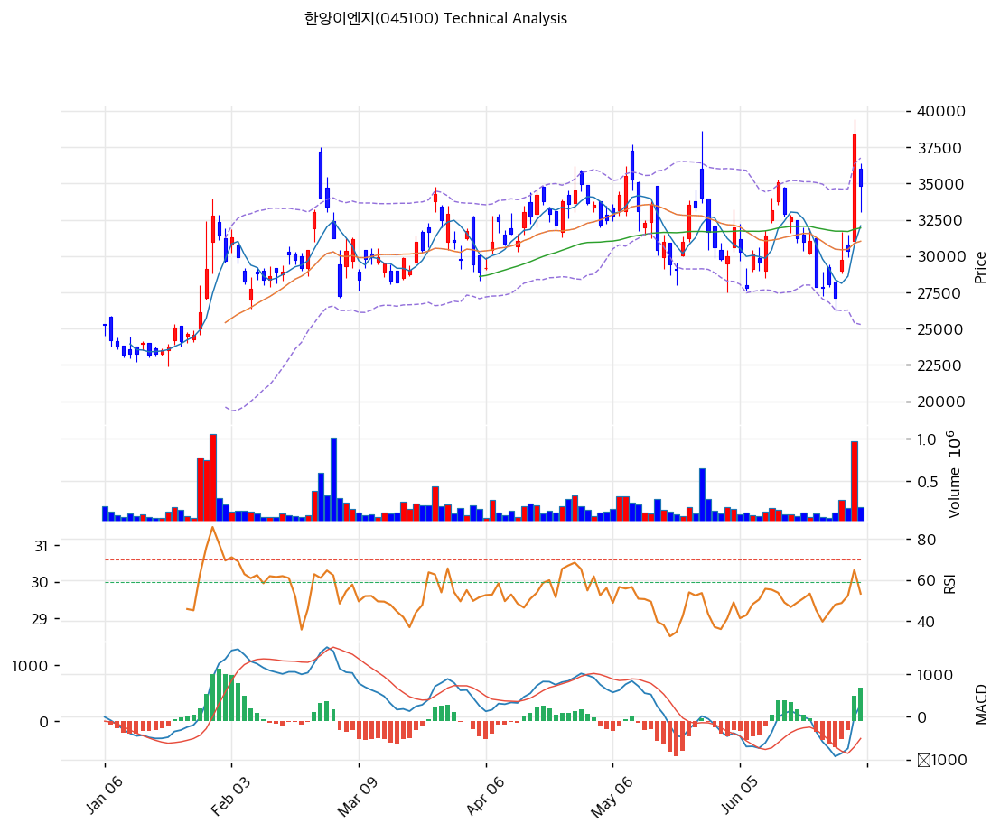

# 한양이엔지(045100) 기술적 분석

2026-07-02 | T2 Technical Analysis

---

## 차트

---

## 1. 가격 현황

| 항목 | 값 |
|------|-----|
| 현재가 | 34,800원 (-9.38%) |
| 52주 고가 | 38,400원 |
| 52주 저가 | 17,890원 |
| 52주 범위 위치 | 82.4% |
| 거래량 | 20일 평균 대비 1.11x |

---

## 2. 차트 패턴 분석

### 2.1 캔들스틱 패턴

| 패턴 | 위치 | 신뢰도 | 해석 |
|------|------|--------|------|
| 장대양봉(대량거래 동반 급등) | 전일(2026-07-01) | 강 | 20일 평균을 크게 웃도는 거래량을 동반해 하루 만에 약 +27%대 급등, 52주 신고가(38,400원) 경신. 다만 몸통 대비 짧은 위꼬리로 고점 부근 매도 압력도 일부 감지 |
| 갭다운 음봉(고점 되돌림) | 당일(2026-07-02) | 강 | 전일 종가(38,400원) 대비 갭하락 출발 후 저가권 마감(-9.38%), 전일 상승분의 약 43%를 하루 만에 반납 — 신고가 직후 차익실현 매물 출회 시그널 |

※ 주요 캔들 패턴: 망치형, 역망치형, 장악형(상승/하락), 도지, 샛별/석별, 적삼병/흑삼병, 하라미, 유성형, 교수형 등

### 2.2 가격 구조 패턴

- **이중 저항대(더블탑 후보)** (신뢰도: 중)
  5월 고점(약 38,700원대)과 이번 7월 고점(약 39,300원대, 종가 38,400원)이 거의 동일한 레벨에서 두 차례 거래되며 저항대를 형성했습니다. 두 고점 사이 저점(6월 중순 26,300원대, MA200 부근)까지 낙폭이 매우 커 전형적인 단기 더블탑보다는 넓은 박스권 상단 저항으로 해석하는 것이 적절하며, 재차 저항 돌파에 실패할 경우 PRZ(약, 25,706\~26,344원)까지 되돌림 여지가 있습니다.

- **MA200/PRZ(약) 지지대발 V자 반등** (신뢰도: 강)
  6월 중순 저가권(26,300원대)에서 MA200(26,344원)과 피보나치 1.272 확장(25,706원)이 겹치는 PRZ(약) 구간까지 낙폭을 키운 뒤, 불과 며칠 만에 52주 고가(38,400원)까지 급반등했습니다. 지지선 이탈 없이 반등해 중기 상승추세 자체는 유지되고 있으나, 반등 속도가 지나치게 가팔라 단기 되돌림(현재 진행 중) 리스크를 내포하고 있습니다.

※ 주요 구조 패턴: 이중천정/바닥, 헤드앤숄더(정/역), 삼각수렴(대칭/상승/하락), 쐐기형(상승/하락), 깃발형, 페넌트, 컵앤핸들, 박스권 등

### 2.3 다이버전스

- **RSI 하락 다이버전스** (신뢰도: 중)
  2월 고점(RSI 약 82, 주가 35,500원) → 5월 고점(RSI 약 68, 주가 38,700원대) → 이번 7월 고점(RSI 약 65, 주가 39,300원대)까지 주가는 유사~소폭 상승했으나 RSI 피크는 계단식으로 낮아지는 약세 다이버전스가 3차례 연속 확인됩니다. 상승 모멘텀이 점진적으로 약화되고 있음을 시사합니다.

- **MACD 하락 다이버전스** (신뢰도: 약)
  MACD 값도 2월 피크(약 1,600) → 5월 피크(약 800) → 현재(295)로 갈수록 낮아지는 유사한 흐름을 보여 RSI 다이버전스를 뒷받침합니다. 다만 현재는 MACD가 시그널선을 상향 돌파하며 신규 매수 크로스가 막 발생한 직후라, 단기적으로는 상충되는 신호입니다.

※ RSI·MACD 기반 | 상승 다이버전스 = 가격↓ 지표↑ (반등 시사), 하락 다이버전스 = 가격↑ 지표↓ (하락 시사), 히든 다이버전스 = 기존 추세 지속 시사

### 2.4 패턴 종합 판단

전일 대량거래를 동반한 갭업 돌파로 52주 신고가(38,400원)를 기록했으나, 당일 갭다운 출발 후 저가 마감하며 전일 상승분의 약 43%를 반납했습니다. 이는 5월 고점과 거의 동일한 레벨(38,400\~39,300원)에서 반복적으로 저항에 부딪히는 이중 저항대, 그리고 RSI·MACD 3연속 하락 다이버전스와 맞물려 단기 상승 모멘텀 소진 신호로 해석됩니다. 다만 되돌림 당일 거래량은 20일 평균 대비 1.11배로 평이한 수준이고, 5개 주요 이동평균선을 모두 상회하는 중기 상승추세 구조는 훼손되지 않았습니다. 즉 "중기 상승추세 내 단기 과열 해소" 국면으로 판단되며, PRZ(강, 29,031\~33,100원)까지의 조정은 추세 훼손이 아닌 정상 범위로 볼 수 있습니다.

---

## 3. 이동평균선 — 비정배열 (강세)

| MA | 값 | 현재가 괴리율 | 위치 |
|----|-----|--------------|------|
| MA5 | 32,080원 | +8.5% | 위 |
| MA20 | 31,020원 | +12.2% | 위 |
| MA60 | 31,938원 | +9.0% | 위 |
| MA120 | 30,265원 | +15.0% | 위 |
| MA200 | 26,344원 | +32.1% | 위 |

**해석**: 현재가(34,800원)가 5개 이동평균선을 모두 상회하는 강세 구조입니다. 다만 크기 순으로 나열하면 MA5(32,080)>MA60(31,938)>MA20(31,020)>MA120(30,265)>MA200(26,344)으로 MA20과 MA60의 순서가 뒤바뀌어 있어 완전한 정배열은 아닙니다(비정배열). MA200 대비 괴리율이 +32.1%로 가장 커 장기 추세 대비 단기 과열 부담이 있으며, 1차 지지선은 MA20(31,020원)·MA60(31,938원) 구간입니다.

---

## 4. 보조 지표

### RSI(14) — 57.1 (중립)

RSI 57.1은 과매수(70)·과매도(30) 어느 쪽에도 속하지 않는 중립 구간입니다. 6월 중순 저점(RSI 40 부근)에서 반등해 신고가 경신 시점 65권까지 올랐다가 당일 되밀리며 57권으로 낮아져, 단기 상승 모멘텀이 한 박자 쉬어가는 모습입니다. 다이버전스 해석은 2.3 참조.

### MACD(12,26,9)

| 항목 | 값 |
|------|-----|
| MACD | 295 |
| Signal | -310 |
| Histogram | +605 |
| 크로스 상태 | 매수 구간 (확대 중) |

**해석**: MACD(295)가 Signal(-310)을 상향 돌파한 매수 구간이며 히스토그램(+605)도 확대되고 있습니다. 다만 MACD 절대값 자체는 2월 고점(약 1,600), 5월 고점(약 800) 대비 뚜렷하게 낮아, 신규 매수 크로스에도 불구하고 상승 탄력은 과거 대비 둔화된 상태입니다. 다이버전스 해석은 2.3 참조.

### 볼린저밴드(20, 2σ)

| 항목 | 값 |
|------|-----|
| 상단 | 36,750원 |
| 중단 (MA20) | 31,020원 |
| 하단 | 25,290원 |
| 밴드 폭 | 36.9% |
| 현재 위치 | 중간 |

**해석**: 현재가(34,800원)는 중단(31,020원)과 상단(36,750원) 사이에서 상단에 가까운 구간(밴드 내 위치 약 66%)에 자리하고 있습니다. 밴드 폭 36.9%는 6월 저점 당시 스퀴즈 국면 대비 크게 확장된 수준으로 변동성이 커졌으며, 추가 상승 시 상단(36,750원)이 1차 저항, 되돌림 시 중단(31,020원)이 1차 지지로 작용할 가능성이 높습니다.

### 스토캐스틱(14, 3, 3)

| 항목 | 값 |
|------|-----|
| Slow %K | 67.8 |
| Slow %D | 52.9 |
| 크로스 상태 | 골든크로스 |
| 판단 | 중립 |

---

## 5. 지지/저항 — 추세선 · 피보나치 · PRZ 통합

### 5.1 피보나치 되돌림/확장

| 구분 | 비율 | 가격 | 현재가 대비 |
|------|------|------|-----------|
| Swing High | — | 35,500원 | +2.0% |
| 되돌림 | 0.236 | 29,617원 | -14.9% |
| 되돌림 | 0.382 | 30,741원 | -11.7% |
| 되돌림 | 0.5 | 31,650원 | -9.1% |
| 되돌림 | 0.618 | 32,559원 | -6.4% |
| 되돌림 | 0.786 | 33,852원 | -2.7% |
| Swing Low | — | 27,800원 | -20.1% |
| 확장 | 1.272 | 25,706원 | -26.1% |
| 확장 | 1.382 | 24,859원 | -28.6% |
| 확장 | 1.618 | 23,041원 | -33.8% |
| 확장 | 2.0 | 20,100원 | -42.2% |

※ 피보나치 기준: 하락 추세 (Swing High 35,500원 → Swing Low 27,800원) 기준 되돌림 — 2월 고점\~3월 저점 구간의 옛 하락 레그로, 현재가는 이미 이 구간 전체(되돌림 레벨 전부)를 상회하고 있어 참고용 지지대 성격이 강함
※ 되돌림 = 직전 추세에서 되돌아온 비율, 확장 = 추세 방향 목표가(현재가 하방으로 실효성 제한적)

### 5.2 추세선

| 추세선 | 방향 | 현재 교차가 | 포인트 수 | 해석 |
|--------|------|-----------|---------|------|
| 지지선 | 상승 | 29,031원 | 6개 | 6월 저점들을 연결한 상승 추세선. 현재가 대비 -16.6% 하방에 위치하며 PRZ(강) 하단과 겹쳐 유효 지지대로 작동 |
| 저항선 | 상승 | 44,297원 | 6개 | 고점들을 연결한 상승 저항선. 현재가 대비 +27.3% 상방으로 단기 저항 실효성은 낮고, 중장기 채널 상단 목표선 성격 |

### 5.3 PRZ (Potential Reversal Zone)

| 방향 | 가격 범위 | 신뢰도 | 근거 |
|------|---------|--------|------|
| 지지 | 29,031\~33,100원 | 강 | 추세선 지지, 피보나치 0.236·0.382·0.5·0.618 되돌림, MA5·MA20·MA60·MA120, 피봇 S1·S2 등 11개 지표 밀집 |
| 지지 | 25,706\~26,344원 | 약 | 피보나치 1.272 확장, MA200 — 6월 저점권과 일치 |

※ PRZ = 추세선 · 피보나치 · 피봇 · MA 등 복수 지표가 겹치는 가격 구간. 겹치는 소스가 많을수록 반전 확률 상승.

### 5.4 종합 지지/저항 테이블

| 구분 | 가격 | 근거 |
|------|------|------|
| 저항 | 44,297원 | 추세선 저항 (상승) |
| 저항 | 38,400원 | 52주 고가 |
| 저항 | 36,450원 | 피봇 R1 |
| **현재가** | **34,800원** | — |
| 지지 | 33,852원 | 피보나치 0.786 되돌림 |
| 지지 | 33,100원 | 피봇 S1 |
| 지지 | 32,559원 | 피보나치 0.618 되돌림 |
| 지지 | 31,938원 | MA60 |
| 지지 | 31,650원 | 피보나치 0.5 되돌림 |
| 지지 | 31,400원 | 피봇 S2 |
| 지지 | 31,218원 | PRZ (강) — 추세선 지지, 피보나치 0.236 되돌림, MA120 |
| 지지 | 31,020원 | MA20 / 볼린저 중단 |
| 지지 | 30,741원 | 피보나치 0.382 되돌림 |
| 지지 | 29,617원 | 피보나치 0.236 되돌림 |
| 지지 | 29,031원 | 추세선 지지 (상승) |
| 지지 | 26,025원 | PRZ (약) — 피보나치 1.272 확장, MA200 |
| 지지 | 25,706원 | 피보나치 1.272 확장 |
| 지지 | 24,859원 | 피보나치 1.382 확장 |

---

## 6. 시그널 종합

| 지표 | 내용 | 시그널 |
|------|------|--------|
| **차트 패턴** | 신고가 직후 갭다운 반락(전일 상승분 43% 반납) + RSI·MACD 3연속 하락 다이버전스 | 🔴 |
| 이동평균선 | 비정배열, MA20 +12.2% 상회 | ⚪ |
| RSI | 57.1 — 중립 | ⚪ |
| MACD | 매수구간, 히스토그램 확대 | 🟢 |
| 볼린저밴드 | 중간(상단 근접), 밴드 폭 36.9% | ⚪ |
| 스토캐스틱 | 골든크로스, K=67.8 | ⚪ |
| 거래량 | 1.11x — 약함 | ⚪ |

**종합 판단**: 🟢 매수 1개 / 🔴 매도 1개 / ⚪ 중립 5개 → **중립 (매수·매도 균형)**

이동평균선·MACD 등 추세 지표는 여전히 매수 우위를 유지하고 있으나, 신고가 직후 갭다운 되돌림과 RSI·MACD 3연속 하락 다이버전스는 단기 과열 해소 신호로 해석됩니다. 중기적으로는 5개 이동평균선을 모두 상회하는 상승추세가 유지되고 있어 PRZ(강, 29,031\~33,100원) 상단 부근에서 지지를 확인한다면 재상승 시도가 가능하나, 그렇지 못할 경우 추가 조정 가능성에 유의해야 합니다.

---

## 7. 전략 제안

### 보유 중인 경우
- **홀드 (조건부)**
- 익절 라인: 39,168원 (52주 고가 38,400원 상단 돌파 목표가)
- 손절 라인: 31,400원 (피봇 S2 — PRZ 강 하단 이탈 시)
- 리스크/리워드: 약 1:1.3 (손절 -9.8% vs 익절 +12.6%)

### 진입 대기인 경우
- **관망 후 조건부 진입**
- 1차 진입가: 33,100원 (피봇 S1)
- 2차 진입가: 31,020원 (MA20 / 볼린저 중단 / PRZ 강 핵심가)
- 진입 조건: PRZ(강, 29,031\~33,100원) 구간에서 거래량이 줄며 하락이 진정되고 반등 캔들(하락갭 메움 또는 장대양봉)이 확인될 때 분할 진입. RSI 40 이하 재진입 시 저가 매수 기회로 판단
