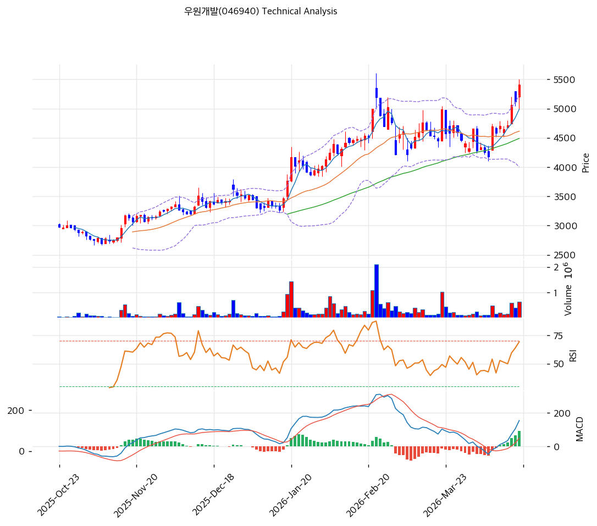

# 우원개발(046940) 기술적 분석

2026-04-18 | T2 Technical Analysis

---

## 차트

---

## 1. 가격 현황

| 항목 | 값 |
|------|-----|
| 현재가 | 5,410원 (+5.66%) |
| 52주 고가 | 5,410원 |
| 52주 저가 | 2,695원 |
| 52주 범위 위치 | 100.0% |
| 거래량 | 20일 평균 대비 2.40x |

---

## 2. 차트 패턴 분석

### 2.1 캔들스틱 패턴

| 패턴 | 위치 | 신뢰도 | 해석 |
|------|------|--------|------|
| 적삼병(유사) 상승 연속 양봉 | 최근 3~4거래일 | 중 | 2월 고점 구간 돌파 직전 양봉이 연속 등장, 매수세 강화 — 매수 시그널 |
| 장대양봉 돌파 | 당일(4/17) | 강 | 52주 신고가 경신과 함께 거래량 2.4배 동반, 추세 확장 — 매수 시그널 |
| 이전 조정 구간 하단 꼬리(롱로어섀도) | 3월 말~4월 초 | 중 | MA60 하단 구간에서 아랫꼬리 반복 발생, 지지 확인 후 반등 — 매수 시그널 |

### 2.2 가격 구조 패턴

- **상승 추세 채널 + 신고가 돌파** (신뢰도: 강)
  2025-10월 저가 2,700원대 → 2026-02 고점 5,500원대까지 이어지는 상승 추세선(하단 4,395원)이 유효하며, 2월 고점(약 5,500원) 저항을 당일 장대양봉으로 돌파하며 신고가 영역 진입. 다음 저항은 피봇 R1 5,610원 및 피보나치 1.272 확장선 6,411원.

- **컵 앤 핸들(Cup & Handle) 완성형** (신뢰도: 중)
  2월 고점 → 3월 말 저점(MA60 터치) → 4월 현재 재상승의 형태가 컵 우측 상단의 핸들 이탈 구간과 유사. 핸들 저점이 MA20·MA60 복합 지지에서 형성되어 돌파 성공 시 목표가 약 6,400~6,700원(피보 확장).

- **2월 고점 저항 재돌파** (신뢰도: 강)
  이전 고점 약 5,500원이 1차 저항이었으나 당일 강한 양봉으로 돌파, 매물대 소화 완료를 시사.

### 2.3 다이버전스

- **MACD 히든 상승 다이버전스(부분)** (신뢰도: 중)
  3월 말 가격 저점은 1월 저점보다 높은 반면 MACD는 2월 고점 이후 급락했다가 재상승, 4월 현재 MACD·시그널 동반 상승으로 확장 중 — 상승 추세 지속 시사.

- **RSI-가격 정합(다이버전스 부재)** (신뢰도: 강)
  현재 RSI 66.4는 2월 고점 당시 75선 대비 낮지만, 가격은 신고가를 경신 중. 엄밀히는 미약한 하락 다이버전스 조짐이 있으나 RSI가 과매수 영역(70)을 아직 넘지 않아 추가 상승 여력이 남아 있음.

### 2.4 패턴 종합 판단

상승 추세 채널 속 52주 신고가 돌파 + 거래량 2.4배 동반 + MACD 히스토그램 확장으로 **강한 상승 시그널**이 지배적. 다만 RSI 수준이 이전 고점 대비 낮아 미약한 하락 다이버전스 가능성과 스토캐스틱 과매수(K=88.6)가 단기 과열 경보. 컵앤핸들 완성형 돌파가 유효하면 6,400~6,700원 목표 가능.

---

## 3. 이동평균선 — 정배열 (강세)

| MA | 값 | 현재가 괴리율 | 위치 |
|----|-----|--------------|------|
| MA5 | 4,989원 | +8.4% | 위 |
| MA20 | 4,613원 | +17.3% | 위 |
| MA60 | 4,490원 | +20.5% | 위 |
| MA120 | 3,843원 | +40.8% | 위 |
| MA200 | 3,555원 | +52.2% | 위 |

**해석**: 5개 MA 모두 현재가 아래에 위치한 완전 정배열 구조. MA200 대비 +52%의 이격은 중장기 상승 추세의 신뢰도를 높이는 동시에 단기 과열 신호도 내포. MA20(4,613원)과 MA60(4,490원)이 1차·2차 지지대로 기능하며, 이 구간까지 조정 시 추세 회복 확인 후 재진입 가능.

---

## 4. 보조 지표

### RSI(14) — 66.4 (중립)

70선에 근접한 중립 상단 구간. 과매수 진입 직전이며, 52주 신고가를 경신한 가격 흐름 대비 RSI가 2월 고점 수치(약 75)에 미달해 잠재적 약한 하락 다이버전스 조짐이 있으나 현 시점에서는 매수세가 우위. 다이버전스 해석은 2.3 참조.

### MACD(12,26,9)

| 항목 | 값 |
|------|-----|
| MACD | 154.0 |
| Signal | 63.0 |
| Histogram | +91 |
| 크로스 상태 | 매수 구간 (확대 중) |

**해석**: 3월 말 데드크로스 후 빠르게 회복하여 4월 초 골든크로스 재진입, 히스토그램이 +91까지 확대되며 상승 모멘텀 가속. MACD 본선이 시그널선을 크게 상회하여 단기 강세 신호.

### 볼린저밴드(20, 2σ)

| 항목 | 값 |
|------|-----|
| 상단 | 5,227원 |
| 중단 (MA20) | 4,613원 |
| 하단 | 3,999원 |
| 밴드 폭 | 26.6% |
| 현재 위치 | 상단 이탈(돌파) |

**해석**: 현재가 5,410원이 상단(5,227원)을 상향 돌파한 상태로 워킹 더 밴드(Walking the Band) 가능성. 밴드 폭 26.6%로 확장 국면이며, 스퀴즈 이후 강한 변동성 확장 구간에 진입. 상단 재진입 전까지 강세 지속 가능.

### 스토캐스틱(14, 3, 3)

| 항목 | 값 |
|------|-----|
| Slow %K | 88.6 |
| Slow %D | 86.3 |
| 크로스 상태 | 골든크로스 |
| 판단 | 과매수 |

---

## 5. 지지/저항 — 추세선 · 피보나치 · PRZ 통합

### 5.1 피보나치 되돌림/확장

| 구분 | 비율 | 가격 | 현재가 대비 |
|------|------|------|-----------|
| Swing High | — | 5,610원 | +3.7% |
| 되돌림 | 0.236 | 4,915원 | -9.2% |
| 되돌림 | 0.382 | 4,485원 | -17.1% |
| 되돌림 | 0.5 | 4,138원 | -23.5% |
| 되돌림 | 0.618 | 3,790원 | -29.9% |
| 되돌림 | 0.786 | 3,295원 | -39.1% |
| Swing Low | — | 2,665원 | -50.7% |
| 확장 | 1.272 | 6,411원 | +18.5% |
| 확장 | 1.382 | 6,735원 | +24.5% |
| 확장 | 1.618 | 7,430원 | +37.3% |
| 확장 | 2.0 | 8,555원 | +58.1% |

※ 피보나치 기준: 상승 추세 (Swing Low 2,665원 → Swing High 5,610원)

### 5.2 추세선

| 추세선 | 방향 | 현재 교차가 | 포인트 수 | 해석 |
|--------|------|-----------|---------|------|
| 지지선 | 상승 | 4,395원 | 6개 | 6개월 상승 채널 하단, 이탈 시 추세 훼손 |
| 저항선 | 상승 | 5,988원 | 6개 | 상승 채널 상단, 당일 돌파 시 채널 확장 신호 |

### 5.3 PRZ (Potential Reversal Zone)

| 방향 | 가격 범위 | 신뢰도 | 근거 |
|------|---------|--------|------|
| 지지 | 4,915~4,989원 | 약 | 피보나치 0.236 되돌림, MA5 |
| 지지 | 4,395~4,490원 | 중 | 추세선 지지, 피보나치 0.382 되돌림, MA60 |
| 지지 | 3,790~3,843원 | 약 | 피보나치 0.618 되돌림, MA120 |

### 5.4 종합 지지/저항 테이블

| 구분 | 가격 | 근거 |
|------|------|------|
| 저항 | 6,411원 | 피보나치 1.272 확장 |
| 저항 | 5,988원 | 상승 추세선 상단 |
| 저항 | 5,610원 | 피봇 R1 / Swing High |
| **현재가** | **5,410원** | 52주 신고가 |
| 지지 | 5,100원 | 피봇 S1 |
| 지지 | 4,952원 | PRZ(약) — MA5 + 피보 0.236 |
| 지지 | 4,790원 | 피봇 S2 |
| 지지 | 4,613원 | MA20 |
| 지지 | 4,457원 | PRZ(중) — MA60 + 추세선 + 피보 0.382 |

---

## 6. 시그널 종합

| 지표 | 내용 | 시그널 |
|------|------|--------|
| **차트 패턴** | 추세 채널 + 신고가 돌파 + 컵앤핸들 | 🟢 |
| 이동평균선 | 정배열, MA20 +17.3% | 🟢 |
| RSI | 66.4 — 중립(상단) | ⚪ |
| MACD | 매수구간, 히스토그램 확대 | 🟢 |
| 볼린저밴드 | 상단 이탈, 밴드 폭 26.6% | ⚪ |
| 스토캐스틱 | 골든크로스, K=88.6 (과매수) | 🔴 |
| 거래량 | 2.4x — 강력 동반 | 🟢 |

**종합 판단**: 🟢 매수 4개 / 🔴 매도 1개 / ⚪ 중립 2개 → **매수우위**

정배열·MACD 확장·거래량 2.4배 동반 장대양봉으로 52주 신고가를 경신한 강한 상승 구조. 다만 스토캐스틱 과매수(K=88.6)와 볼린저 상단 이탈로 단기 과열 경계 필요. 2월 고점 5,500원대 저항 소화 여부가 핵심이며, 돌파가 지속되면 피봇 R1(5,610원) → 채널 상단(5,988원) → 피보 1.272(6,411원) 순차 저항이 열림. 단기 조정 시 MA5(4,989원)과 피봇 S1(5,100원)이 1차 지지.

---

## 7. 전략 제안

### 보유 중인 경우
- **홀드 + 트레일링 스탑**
- 익절 라인: 5,988원 (상승 추세선 저항, 1차) → 6,411원 (피보 1.272 확장, 2차)
- 손절 라인: 4,790원 (피봇 S2, 이탈 시 MA20 붕괴 리스크)
- 리스크/리워드: (5,988-5,410)/(5,410-4,790) = 578/620 ≈ **0.93** (1차 익절 기준) / 2차 익절 기준 1.62

### 진입 대기인 경우
- **관망 권고** (단기 과열 구간)
- 1차 진입가: 5,100원 (피봇 S1 — 과열 해소 후 MA5 근접 눌림)
- 2차 진입가: 4,613원 (MA20 — 중기 추세 재확인 구간)
- 진입 조건:
  - 조정 시 거래량 감소 확인(매도세 약화)
  - 일봉 양봉 종가 + RSI 50선 이탈 없음
  - 또는 5,500원대 돌파 후 눌림목 재진입(신고가 저항대가 지지화 확인)
