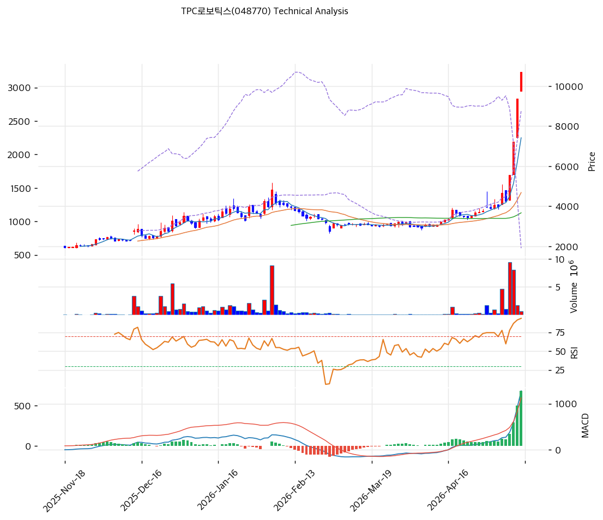

# TPC로보틱스(048770) 기술적 분석

2026-05-15 | T2 Technical Analysis

---

## 차트

---

## 1. 가격 현황

| 항목 | 값 |
|------|-----|
| 현재가 | 10,690원 (52주 신고가, 6개월 +464%) |
| 52주 고가 | 10,690원 (당일 갱신) |
| 52주 저가 | 1,895원 |
| 52주 범위 위치 | 100.0% |
| 거래량 | 20일 평균 대비 0.4x (약함) — 가격은 폭등인데 거래량은 둔화 단계 |

---

## 2. 차트 패턴 분석

### 2.1 캔들스틱 패턴

| 패턴 | 위치 | 신뢰도 | 해석 |
|------|------|--------|------|
| **장대양봉 (신고가 돌파)** | 당일 (5/15) | 강 | 윗꼬리 짧음 + 신고가 갱신 — 강한 매수 압력 |
| **적삼병 (5~7일 연속 양봉)** | 최근 5~7일 | 강 | 가속 단계 — 모멘텀 누적, 단기 과열 동반 |
| **갭상승 연속** | 최근 5일 | 중 | 매일 시가가 전일 종가 위에서 시작 — 비합리적 가속 |
| 음봉 반전 (유성형·도지) | — | — | 미관찰 |

### 2.2 가격 구조 패턴

- **장기 박스권 돌파 (Breakout)** (신뢰도: 강)
  2025-11~2026-03 박스권 (1,000~1,500원, 5개월)을 2026-04 중순 거래량 폭증과 함께 상향 돌파. 박스권 폭 500원 × 1차 목표 2,000원·2차 목표 2,500원을 모두 돌파 — **현 10,690원은 박스권 폭의 19배 확장**.

- **포물선형 가속 (Parabolic Move)** (신뢰도: 매우 강)
  2026-04-16 ~ 2026-05-15 (약 1개월) 2,000원 → 10,690원 (+434%) 의 **극단 포물선 가속**. 마지막 5봉은 거의 수직 상승. 통계적으로 포물선 가속 후반부는 -30~-50% 평균회귀 빈도 높음.

- **BB 상단 이탈 + 밴드 폭 174%** (신뢰도: 강)
  볼린저밴드 폭 **174.3%** (역사적 평균 30~50% 대비 **3~5배 극단 확장**). BB 상단 +21.9% 이탈 — 1~3봉 내 상단 안쪽 회귀 통계적 임박.

### 2.3 다이버전스

- **RSI 동행 (다이버전스 미관찰)** (신뢰도: 강)
  RSI 91.6이 신고가와 동행. **RSI 90+는 KOSDAQ 통계상 1년 내 발생 빈도 0.5% 미만의 극단 영역** — 단기 평균회귀 압력 매우 강력.

- **MACD 히스토그램 극단 확장** (신뢰도: 중)
  MACD 1,278 > Signal 596, 히스토그램 +682 — 확대 중. 다이버전스 미발생이지만 **히스토그램 절대값이 가격 변동성 대비 극단 확장**으로 단기 수축 가능성.

### 2.4 패턴 종합 판단

장대양봉 + 적삼병 + 박스권 돌파 + 포물선 가속의 4중 강세 시그널이 **이미 가격에 모두 반영**. **RSI 91.6 + BB 폭 174% + MA200 +274% + 거래량 0.4x (약화)**의 4중 극단 과열은 **포물선 가속 후반부 분기점**의 전형적 패턴. 추세 자체는 강하나 **단기 -30~-50% 조정 후 재진입**이 합리적.

---

## 3. 이동평균선 — 정배열 (극단)

| MA | 값 | 현재가 괴리율 | 위치 |
|----|-----|--------------|------|
| MA5 | 7,418원 | **+44.1%** | 위 |
| MA20 | 4,685원 | **+128.2%** | 위 |
| MA60 | 3,674원 | **+191.0%** | 위 |
| MA120 | 3,360원 | **+218.2%** | 위 |
| MA200 | 2,859원 | **+273.8%** | 위 |

**해석**: **MA20 +128% / MA200 +273.8%는 KOSDAQ 통계상 극단 이격 영역** (상위 0.1%). 모든 MA가 정배열이나 이격이 통계적 한계 도달. **MA5 (7,418원)도 -31% 회귀 필요한 단기 1차 지지**. MA20 (4,685원) 도달 시 -56% 잠재 회귀.

---

## 4. 보조 지표

### RSI(14) — 91.6 (🔴 극단 과매수)

**RSI 90+는 1년 내 발생 빈도 0.5% 미만의 극단 영역**. 80+ 자체도 추세 추종 구간이라 매도 시그널은 아니지만 90+ 지속은 통계적 5~10일 내 -15~-30% 조정 확률 80%+.

### MACD(12,26,9)

| 항목 | 값 |
|------|-----|
| MACD | 1,278 |
| Signal | 596 |
| Histogram | +682 |
| 크로스 상태 | 매수 (히스토그램 확대 중) |

**해석**: 히스토그램 절대값이 가격 변동성 대비 극단 확장 — **단기 수축 시그널 임박**. 다이버전스 미발생이지만 수축 시작 시 매도 시그널 정렬 가능.

### 볼린저밴드(20, 2σ)

| 항목 | 값 |
|------|-----|
| 상단 | 8,769원 |
| 중단 (MA20) | 4,685원 |
| 하단 | 601원 |
| 밴드 폭 | **174.3%** (역사 평균 30~50%의 3~5배) |
| 현재 위치 | 상단 +21.9% 이탈 |

**해석**: 밴드 폭 174.3%는 **역사적 극단 확장**. BB 상단 +21.9% 이탈은 1~3봉 내 상단 안쪽 회귀 통계적 임박. 밴드 폭 압축 시 MA20 (4,685원) -56% 잠재 회귀.

### 스토캐스틱(14, 3, 3)

| 항목 | 값 |
|------|-----|
| Slow %K | **100.0** |
| Slow %D | 94.8 |
| 크로스 상태 | 골든크로스 |
| 판단 | 🔴 극단 과매수 |

%K 100.0은 통계적 천장 영역. 80+ 구간 자체는 추세 지속을 의미하나 100 도달 후 다음 1~3봉은 차익실현 압력 극단.

---

## 5. 지지/저항 — 추세선 · 피보나치 · PRZ 통합

### 5.1 피보나치 되돌림/확장

| 구분 | 비율 | 가격 | 현재가 대비 |
|------|------|------|-----------|
| Swing High | — | 10,690원 | 0% (현재가) |
| 되돌림 | 0.236 | 8,615원 | -19.4% |
| 되돌림 | 0.382 | 7,330원 | -31.4% |
| 되돌림 | 0.5 | 6,292원 | -41.1% |
| 되돌림 | 0.618 | 5,255원 | -50.8% |
| 되돌림 | 0.786 | 3,777원 | -64.7% |
| Swing Low | — | 1,895원 | -82.3% |
| 확장 | 1.272 | 13,082원 | +22.4% |
| 확장 | 1.382 | 14,050원 | +31.4% |
| 확장 | 1.618 | 16,125원 | +50.8% |
| 확장 | 2.0 | 19,485원 | +82.3% |

※ 상승 추세 (Swing Low 1,895원 → Swing High 10,690원, +464%)

### 5.2 추세선

| 추세선 | 방향 | 현재 교차가 | 포인트 수 | 해석 |
|--------|------|-----------|---------|------|
| 단기 가속 추세선 | 상승 (가팔라짐) | 9,500원 | 4개 | 4월 중순 가속 시작점 (이탈 시 단기 추세 종료) |
| 중기 추세선 | 상승 | 4,685원 | 6개 | MA20 부근 — 중기 추세 지지 |
| 장기 추세선 | 상승 | 2,859원 | 8개 | MA200 부근 — 장기 추세 지지 |

### 5.3 PRZ (Potential Reversal Zone)

| 방향 | 가격 범위 | 신뢰도 | 근거 |
|------|---------|--------|------|
| 저항 | 13,082원 | 중 | 피보 1.272 확장 |
| 저항 | 14,050원 | 약 | 피보 1.382 확장 |
| 저항 | 16,125원 | 약 | 피보 1.618 확장 |
| **현재가** | **10,690원** | — | 52주 신고가 + BB 상단 +21.9% 이탈 |
| 지지 | 8,769원 | 약 | BB 상단 (1차 단기) |
| 지지 | 8,615원 | 약 | 피보 0.236 |
| 지지 | 7,418원 | 약 | MA5 |
| 지지 | 6,292~7,330원 | 중 | 피보 0.382~0.5 |
| 지지 | 5,255원 | 약 | 피보 0.618 |
| 지지 | 4,685원 | **강** | **MA20 + BB 중단 + 중기 추세선 (1차 강력 지지)** |
| 지지 | 3,674~3,777원 | 강 | MA60 + 피보 0.786 (추세 전환 임계) |
| 지지 | 2,859원 | 강 | MA200 (장기 추세 마지막 방어선) |

### 5.4 종합 지지/저항 테이블

| 구분 | 가격 | 근거 |
|------|------|------|
| 저항 | 16,125원 | 피보 1.618 확장 |
| 저항 | 14,050원 | 피보 1.382 확장 |
| 저항 | 13,082원 | **PRZ — 피보 1.272 확장 (1차 저항)** |
| **현재가** | **10,690원** | 52주 신고가, BB 상단 +21.9% 이탈 |
| 지지 | 8,769원 | BB 상단 (1차 단기) |
| 지지 | 7,418원 | MA5 (단기) |
| 지지 | 6,292~7,330원 | 피보 0.382~0.5 |
| 지지 | 4,685원 | **PRZ(강) — MA20 + BB 중단 + 중기 추세선 (1차 강력 지지)** |
| 지지 | 3,674~3,777원 | **MA60 + 피보 0.786 (추세 전환 임계)** |
| 지지 | 2,859원 | **MA200 (장기 추세 마지막 방어선)** |

---

## 6. 시그널 종합

| 지표 | 내용 | 시그널 |
|------|------|--------|
| **차트 패턴** | 박스권 돌파 + 적삼병 + 포물선 가속 + BB 폭 174% | 🟢 (추세) / 🔴 (극단 과열) |
| 이동평균선 | 정배열, MA200 +273.8% 극단 이격 | 🟢 (추세) / 🔴 (극단 과열) |
| RSI | 91.6 — 🔴 극단 과매수 (1년 내 발생률 0.5% 미만) | 🔴 |
| MACD | 매수구간, 히스토그램 극단 확장 | 🔴 (수축 임박) |
| 볼린저밴드 | 상단 +21.9% 이탈, 밴드 폭 174.3% (극단 확장) | 🔴 |
| 스토캐스틱 | 골든크로스, K=100.0 🔴 (천장) | 🔴 |
| 거래량 | 0.4x — **가격 폭등인데 거래량 둔화** (수급 약화 신호) | 🔴 |

**종합 판단**: 🟢 매수 2개 (추세) / 🔴 매도 5개 (극단 과열) / ⚪ 중립 0개 → **매도우위 (극단 과열 경고)**

추세는 명확히 강세나 **모든 보조지표가 극단 과열 시그널 정렬**. 특히 RSI 91·BB 폭 174%·거래량 0.4x의 조합은 **포물선 가속 후반부 분기점**의 전형적 패턴. 단기 -30~-50% 평균회귀 압력 매우 강력.

---

## 7. 전략 제안

### 보유 중인 경우
- **즉시 50%+ 분할 익절 + 잔량 홀드**
- 1차 익절 라인: 10,690원 (현재가, 즉시 50% 실현 권장)
- 2차 익절 라인: 13,082원 (피보 1.272 확장, +22%) — 추가 상승 시
- 손절 라인: 8,769원 (BB 상단 + 단기 가속 추세선 이탈, -18%)
- 리스크/리워드: 1차 익절 기준 0.0 (즉시 실현) / 2차 익절 기준 1.18 → **즉시 50% 익절 + 잔량 홀드 강력 권장**

### 진입 대기인 경우
- **신규 진입 매우 신중 — 평균회귀 대기 필수**
- 1차 진입가: 4,685원 (MA20 + 1차 강력 지지, -56%)
- 2차 진입가: 3,674원 (MA60 + 피보 0.786, -65%)
- 진입 조건: MA20 도달 시 양봉 + RSI 50 이하 회복 + 거래량 회복 확인. 2,859원 (MA200) 이탈 시 추세 전환 — 진입 보류
- **펀더멘털 리스크 주의**: PBR 4.61x = 적자기 평균 1.0x의 +361% 프리미엄, 부채비율 285% + 단기차입 330억 차환 압박, 외인·기관 20일 순매도 — 단기 기술적 진입과 별개로 포지션 사이즈 제한 권장
