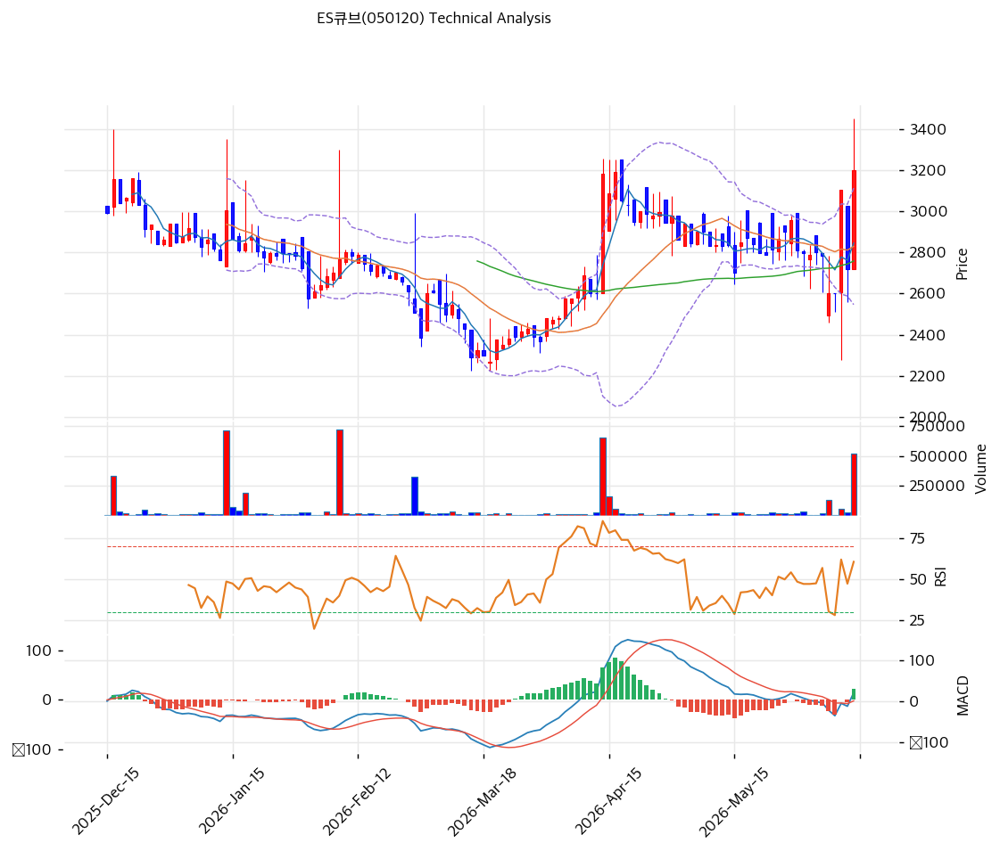

# ES큐브(050120) 기술적 분석

2026-06-15 | T2 Technical Analysis

> ⚠️ 본업 붕괴·자산주 성격의 종목으로, 거래량 22배 폭증의 투기적 급등이다. 기술적 신호는 펀더멘털·이벤트 리스크에 우선하지 못한다.

---

## 차트

---

## 1. 가격 현황

| 항목 | 값 |
|------|-----|
| 현재가 | 3,200원 (+17.65%) |
| 52주 고가 | 3,450원 |
| 52주 저가 | 2,140원 |
| 52주 범위 위치 | \~100% (신고가권) |
| 거래량 | 20일 평균 대비 **22.36x** (이상 폭증) |

> 장기간 2,700\~2,850원 박스에서 횡보하다 당일 +17.65%·**거래량 22.36배** 폭증으로 박스 상단 돌파. 비정상적 거래량으로 투기적 수급(테마·세력) 가능성.

---

## 2. 차트 패턴 분석

### 2.1 캔들스틱 패턴

| 패턴 | 위치 | 신뢰도 | 해석 |
|------|------|--------|------|
| 박스 상단 돌파 + 거래량 폭증 | 당일 (+17.65%, 22.36x) | 강 | 매수 — 분출(투기성 동반) |
| 장기 횡보 박스 이탈 | 2,758\~2,845 → 3,200 | 중 | 매수 — 베이스 돌파 |
| 거래량 22배 | — | 강 | 수급 급변(주의) |

※ 주요 캔들 패턴: 망치형, 역망치형, 장악형, 도지, 샛별/석별, 적삼병/흑삼병, 하라미, 유성형, 교수형 등

### 2.2 가격 구조 패턴

- **장기 박스 돌파 (2,850원 → 3,200원)** (신뢰도: 중)
  MA가 2,758\~2,845원에 밀집한 장기 횡보 후 거래량 22배 동반 박스 상단 돌파. 신고가권 진입. 단 거래량 이상 급증으로 지속성 미검증.

- **하락 추세선 돌파 시도** (신뢰도: 중)
  하락 추세선(3,061원) 상회. 추세 전환 시도이나 본업·펀더멘털 뒷받침 약함.

※ 주요 구조 패턴: 이중천정/바닥, 헤드앤숄더, 삼각수렴, 쐐기형, 깃발형, 페넌트, 컵앤핸들, 박스권 등

### 2.3 다이버전스

- **거래량 주도 급등 — 지속성 미검증** (신뢰도: 중)
  RSI 60.5·MACD 매수·스토캐스틱 77.4로 단기 모멘텀 발생. 다만 거래량 22배의 이상 급등은 단발성 가능성, 펀더멘털 미동반.

※ RSI·MACD 기반 | 상승 다이버전스 = 가격↓ 지표↑, 하락 다이버전스 = 가격↑ 지표↓

### 2.4 패턴 종합 판단

장기 횡보 박스를 거래량 22배 동반으로 돌파한 **투기적 급등** 국면이다. MA 밀집 베이스 이탈은 기술적 신호이나, **거래량 이상 급증·본업 붕괴**를 감안하면 지속성이 불확실하다. 펀더멘털(자산주·구조조정 옵션)과 무관한 단발 수급일 수 있어, 추격은 위험하고 박스 회귀(2,800원대) 가능성을 전제해야 한다.

---

## 3. 이동평균선 — 비정배열(박스 돌파)

| MA | 값 | 현재가 괴리율 | 위치 |
|----|-----|--------------|------|
| MA5 | 2,845원 | +12.5% | 위 |
| MA20 | 2,829원 | +13.1% | 위 |
| MA60 | 2,758원 | +16.0% | 위 |
| MA120 | 2,758원 | +16.0% | 위 |
| MA200 | 2,784원 | +14.9% | 위 |

**해석**: 모든 MA가 2,758\~2,845원에 밀집한 **장기 횡보 베이스**에서 당일 +17.65% 급등으로 모든 MA를 +12\~16% 상회. 정배열은 아니나(MA들이 거의 동일) 박스 돌파. 조정 시 MA 밀집대(2,758\~2,845원)가 강한 지지/회귀 구간.

---

## 4. 보조 지표

### RSI(14) — 60.5 (중립)

급등으로 중립 상단. 과매수(70) 미도달이나 단발 급등 특성상 변동성 큼.

### MACD(12,26,9)

| 항목 | 값 |
|------|-----|
| MACD | 20 |
| Signal | -2 |
| Histogram | +22 |
| 크로스 상태 | 매수 전환 (히스토그램 확대) |

**해석**: 횡보 후 MACD 매수 전환. 단기 모멘텀 발생이나 절대 수준 낮음(횡보 기저).

### 볼린저밴드(20, 2σ)

| 항목 | 값 |
|------|-----|
| 상단 | 3,112원 |
| 중단 (MA20) | 2,829원 |
| 하단 | 2,546원 |
| 밴드 폭 | 20.0% |
| 현재 위치 | 상단 돌파 |

**해석**: 현재가 3,200원이 밴드 상단(3,112원)을 돌파 — 급등. 밴드 폭 20%(횡보 후 확장 시작). 되돌림 시 중단(MA20 2,829원) 회귀 여지.

### 스토캐스틱(14, 3, 3)

| 항목 | 값 |
|------|-----|
| Slow %K | 77.4 |
| Slow %D | 62.7 |
| 크로스 상태 | 골든크로스 |
| 판단 | 과매수권 진입 |

---

## 5. 지지/저항 — 추세선 · 피보나치 · PRZ 통합

### 5.1 종합 지지/저항 테이블

| 구분 | 가격 | 근거 |
|------|------|------|
| 저항 | 3,527원 | 피봇 R1 |
| 저항 | 3,450원 | 52주 고가 |
| **현재가** | **3,200원** | 박스 돌파·볼린저 상단 |
| 지지 | 3,112원 | 볼린저 상단 |
| 지지 | 2,881원 | PRZ(강) — MA60·MA120·MA200 |
| 지지 | 2,829원 | MA20 |
| 지지 | 2,797원 | 피봇 S1 |
| 지지 | 2,393원 | 피봇 S2 |

※ MA 밀집대(2,758\~2,881원)가 핵심 지지·회귀 구간. 급등 전 박스 = 강한 자석.

---

## 6. 시그널 종합

| 지표 | 내용 | 시그널 |
|------|------|--------|
| 차트 패턴 | 박스 돌파 + 거래량 22배 | 🟢 |
| 이동평균선 | 비정배열(밀집), 박스 돌파 | ⚪ |
| RSI | 60.5 — 중립 | ⚪ |
| MACD | 매수 전환 | 🟢 |
| 볼린저밴드 | 상단 돌파 | ⚪ |
| 스토캐스틱 | 골든크로스, K=77.4 | ⚪ |
| 거래량 | 22.36x — 이상 폭증 | 🟢 |

**종합 판단**: 🟢 매수 2개 / 🔴 매도 0개 / ⚪ 중립 4개 → **매수우위 (투기적 급등)**

장기 박스를 거래량 22배 동반 돌파한 급등이나, **거래량 이상 급증·본업 붕괴**로 지속성이 불확실하다. MA 밀집대(2,758\~2,881원)가 강한 회귀 자석이다. 펀더멘털과 무관한 단발 수급일 수 있어 추격은 위험. 박스 회귀 가능성을 전제로 대응해야 한다.

---

## 7. 전략 제안

### 보유 중인 경우
- **분할 익절 / 단기 대응**
- 익절 라인: 3,450원(전고)·3,527원(피봇 R1) 분할
- 손절 라인: 2,881원 (MA 밀집대·PRZ 이탈)
- 리스크/리워드: 거래량 22배 단발 급등으로 되돌림 위험 큼, 익절 우선

### 진입 대기인 경우
- **신규 추격 비권장 (투기성)**
- 관찰가: 2,881원 (MA 밀집 PRZ) / 2,829원 (MA20)
- 진입 조건: 거래량 22배 이상 급등은 추격 고위험. 본업 붕괴·자산주 성격상 차트만으로 진입 부적절. **신사업·M&A 등 펀더멘털 이벤트 공시 확인** 또는 박스대(2,800원) 회귀 시에만 자산가치(PBR 0.47) 관점 소액 접근.
