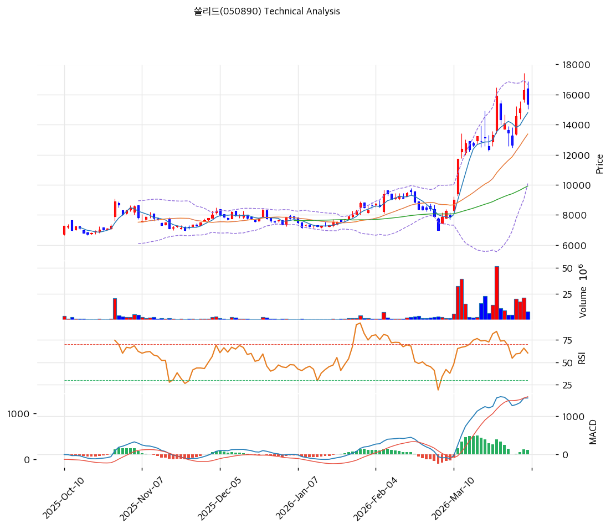

# 쏠리드(050890) 기술적 분석

2026-04-06 | T2 Technical Analysis

---

## 차트

---

## 1. 가격 현황

| 항목 | 값 |
|------|-----|
| 현재가 | 15,370원 (-5.71%) |
| 52주 고가 | 16,300원 |
| 52주 저가 | 5,920원 |
| 52주 범위 위치 | 91.0% |
| 거래량 | 20일 평균 대비 0.52x |

---

## 2. 차트 패턴 분석

### 2.1 캔들스틱 패턴

| 패턴 | 위치 | 신뢰도 | 해석 |
|------|------|--------|------|
| 급등 후 조정 음봉 | 최근 1~2거래일 | 중 | 강한 상승 이후 단기 이익실현이 나타나는 구간 |
| 추세 내 눌림 | 최근 5거래일 | 중 | 추세 훼손보다는 속도 조절 가능성이 큼 |

### 2.2 가격 구조 패턴

- **중기 상승 추세 유지** (신뢰도: 강)
  MA20·MA60·MA120이 모두 우상향하며 정배열을 형성하고 있습니다.

- **52주 신고가 근처 조정** (신뢰도: 중)
  현재가는 52주 고가 16,300원 바로 아래입니다. 이 구간을 재돌파하면 추세가 재가속될 수 있습니다.

### 2.3 다이버전스

- **RSI 중립** (신뢰도: 중)
  RSI 62.8로 과열은 아닙니다. 아직 추가 상승 여력이 남아 있습니다.

- **MACD 매수구간 유지** (신뢰도: 중)
  히스토그램은 둔화됐지만 여전히 매수구간입니다. 추세가 꺾였다고 보기엔 이릅니다.

### 2.4 패턴 종합 판단

쏠리드는 강한 상승 이후 숨 고르기 구간입니다. 피노·상신이디피처럼 과열 극단은 아니고, **추세 유지형 조정**으로 보는 편이 적절합니다.

---

## 3. 이동평균선 — 정배열 (강세)

| MA | 값 | 현재가 괴리율 | 위치 |
|----|-----|--------------|------|
| MA5 | 14,788원 | +3.9% | 위 |
| MA20 | 13,374원 | +14.9% | 위 |
| MA60 | 9,916원 | +55.0% | 위 |
| MA120 | 8,768원 | +75.3% | 위 |
| MA200 | 7,946원 | +93.4% | 위 |

**해석**: 완전 정배열입니다. MA20 괴리율도 15% 내외라, 강세 추세 안에서 아직 관리 가능한 수준입니다.

---

## 4. 보조 지표

### RSI(14) — 62.8 (중립)

과매수 직전이지만 아직은 중립권입니다. 추세가 한 번 더 이어질 수 있는 여지가 있습니다.

### MACD(12,26,9)

| 항목 | 값 |
|------|-----|
| MACD | 1,471.0 |
| Signal | 1,355.0 |
| Histogram | +116.0 |
| 크로스 상태 | 매수 구간 |

**해석**: MACD는 여전히 상승 추세를 지지합니다. 다만 히스토그램 확장이 꺾여 단기 속도는 둔화됐습니다.

### 볼린저밴드(20, 2σ)

| 항목 | 값 |
|------|-----|
| 상단 | 16,662원 |
| 중단 (MA20) | 13,374원 |
| 하단 | 10,087원 |
| 밴드 폭 | 49.2% |
| 현재 위치 | 중간 |

**해석**: 상단 과열보다는 추세 유지형 중간 영역입니다.

### 스토캐스틱(14, 3, 3)

| 항목 | 값 |
|------|-----|
| Slow %K | 68.7 |
| Slow %D | 61.4 |
| 크로스 상태 | 골든크로스 |
| 판단 | 중립 |

---

## 5. 지지/저항

| 구분 | 가격 | 근거 |
|------|------|------|
| 저항 | 16,300원 | 52주 고가 |
| 저항 | 16,493원 | 피봇 R1 |
| **현재가** | **15,370원** | — |
| 지지 | 14,633원 | 피봇 S1 |
| 지지 | 13,897원 | 피봇 S2 |
| 지지 | 13,374원 | MA20 |

---

## 6. 시그널 종합

| 지표 | 내용 | 시그널 |
|------|------|--------|
| **차트 패턴** | 상승 추세 내 조정 | ⚪ |
| 이동평균선 | 정배열, MA20 +14.9% | 🟢 |
| RSI | 62.8 — 중립 | ⚪ |
| MACD | 매수구간 유지 | ⚪ |
| 볼린저밴드 | 중간 영역 | ⚪ |
| 스토캐스틱 | 골든크로스, 중립 | ⚪ |
| 거래량 | 0.52x — 약함 | ⚪ |

**종합 판단**: 🟢 매수 1개 / 🔴 매도 0개 / ⚪ 중립 6개 → **매수우위**

공격적인 매수 신호는 아니지만, 강한 추세가 깨지지 않은 상태라 눌림목 관점에서 우호적입니다.

---

## 7. 전략 제안

### 보유 중인 경우
- **홀드**
- 익절 라인: 16,626원
- 손절 라인: 13,897원
- 리스크/리워드: 양호

### 진입 대기인 경우
- **진입가능**
- 1차 진입가: 14,633원 (피봇 S1)
- 2차 진입가: 13,374원 (MA20)
- 진입 조건: 눌림 후 거래량 회복 및 5일선 재지지 확인
