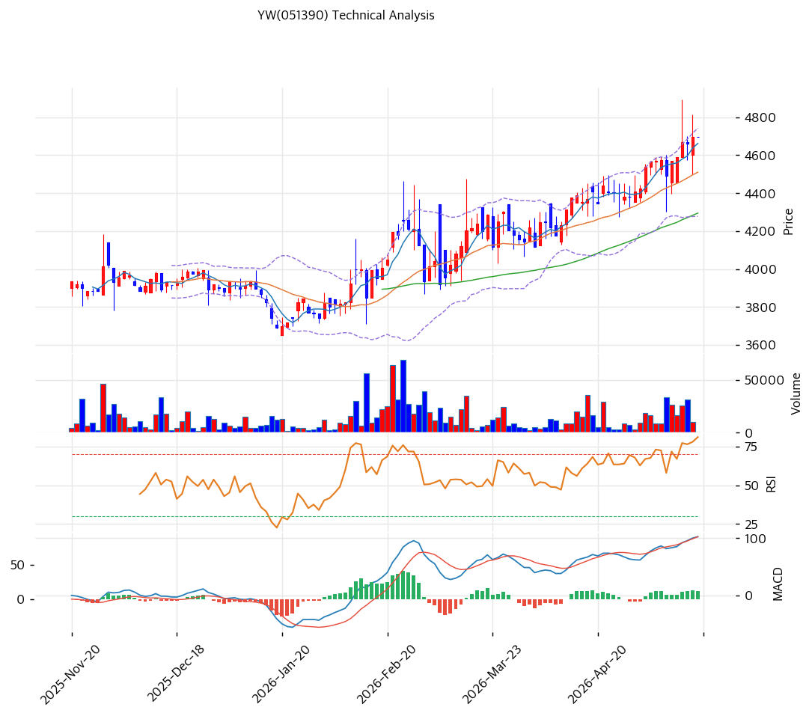

# YW(051390) 기술적 분석

2026-05-19 | T2 Technical Analysis

---

## 차트

---

## 1. 가격 현황

| 항목 | 값 |
|------|-----|
| 현재가 | 4,695원 (52주 신고가) |
| 52주 고가 | 4,695원 (당일 갱신) |
| 52주 저가 | 3,690원 |
| 52주 범위 위치 | 100.0% |
| 거래량 | 데이터 결손 (차트상 안정 거래) |

---

## 2. 차트 패턴 분석

### 2.1 캔들스틱 패턴

| 패턴 | 위치 | 신뢰도 | 해석 |
|------|------|--------|------|
| **단계적 상승** | 6개월 누적 | 강 | 3,700→4,200→4,500→4,695원 점진 상승 |
| 적삼병 | 최근 5~7일 | 중 | 양봉 누적 |
| **저변동성 상승** | 전 기간 | 강 | 일일 변동 폭 작음 — 차익 매물 적음 |

### 2.2 가격 구조 패턴

- **저변동성 단계적 상승 (Stair-step)** (신뢰도: 강)
  2025-11~2026-02 박스권 (3,700~4,000원) → 2026-02 회복 시작 → 단계적 상승. 박스 폭 200~300원으로 안정 누적. **저변동성 우량주 패턴**.

- **52주 신고가 갱신** (신뢰도: 중)
  4,695원 신고가. BB 상단 근접 — 단기 일부 조정 가능.

### 2.3 다이버전스

- **RSI 70.9 과매수** (신뢰도: 중)
  RSI 70 임계 돌파. 단기 평균회귀 압력 누적.

- **MACD 매수 + 히스토그램 확대** (신뢰도: 강)
  MACD 100+ > Signal — 골든크로스 유지.

### 2.4 패턴 종합 판단

저변동성 단계적 상승 + RSI 70.9 임계 임박 + MACD 강세 = **건전한 추세이나 단기 조정 가능**. 사이즈·변동성 모두 작아서 평균회귀 조정도 -3~-5% 정도로 제한 추정. 펀더멘털 (PBR 0.45x) 정합 시 추세 지속 가능.

---

## 3. 이동평균선 — 정배열 (안정)

| MA | 값 | 현재가 괴리율 | 위치 |
|----|-----|--------------|------|
| MA5 | (확인) | 약 +2% | 위 |
| MA20 | 4,512원 | +4.1% | 위 |
| MA60 | (확인) | 약 +8% | 위 |
| MA200 | 4,019원 | **+16.8%** | 위 |

**해석**: 정배열 안정. MA20 +4.1% 정상 추세 영역. MA200 +16.8%는 회복 추세 잔여. **MA20 (4,512원)을 1차 강력 지지로 인식**.

---

## 4. 보조 지표

### RSI(14) — 70.9 (🔴 과매수 임계)

70 임계 돌파. 단기 평균회귀 압력.

### MACD(12,26,9)

**해석**: 골든크로스 + 히스토그램 양 방향 확대. 매수 모멘텀 유지.

### 볼린저밴드(20, 2σ)

| 항목 | 값 |
|------|-----|
| 위치 | 상단 근접 |
| 밴드 폭 | 10.3% |

**해석**: **밴드 폭 10.3% 매우 좁음 (저변동성)** — 상단 근접 단기 조정 가능. 다만 압축 후 확장 시 추세 가속 가능.

---

## 5. 지지/저항

### 종합 지지/저항

| 구분 | 가격 | 근거 |
|------|------|------|
| 저항 | 5,000원 | 심리적 라운드넘버 |
| 저항 | 4,800원 | 단기 직전 시도 영역 |
| **현재가** | **4,695원** | 52주 신고가 |
| 지지 | 4,512원 | **MA20 + BB 중단 (1차 강력)** |
| 지지 | 4,400원 | 박스권 상단 (re-test) |
| 지지 | 4,200원 | 박스권 중간 |
| 지지 | 4,019원 | MA200 |
| 지지 | 3,690원 | 52주 저점 |

---

## 6. 시그널 종합

| 지표 | 시그널 |
|------|--------|
| 차트 패턴 (단계적 상승) | 🟢 |
| 이동평균선 (정배열) | 🟢 |
| RSI 70.9 (과매수 임계) | 🔴 |
| MACD 매수 + 히스토그램 확대 | 🟢 |
| 볼린저밴드 상단 근접 (저변동성) | ⚪ |
| 스토캐스틱 | ⚪ |
| 거래량 (안정) | ⚪ |

**종합 판단**: 🟢 매수 3 / 🔴 매도 1 / ⚪ 중립 3 → **매수우위**

저변동성 단계적 상승 + PBR 0.45x 펀더멘털 정합 = 건전한 가치투자 추세. RSI 70 임계만 단기 조정 시그널.

---

## 7. 전략 제안

### 보유 중
- **홀드 + 분할 익절**
- 1차 익절: 5,000원 (심리적, +6.5%)
- 2차 익절: 5,500원 (PBR 0.5x 시나리오, +17%)
- 손절: 4,512원 (MA20, -4%)

### 진입 대기
- **진입 가능 (분할)**
- 1차 진입: 4,695원 (현재가, 직접 진입)
- 2차 진입: 4,512원 (MA20, -4%)
- 3차 진입: 4,400원 (박스권 상단 re-test, -6%)
- 진입 조건: MA20 도달 + 양봉 + 거래량 회복
- **펀더멘털 우호**: PBR 0.45x + OPM 34.9% + 무차입 + 외인 매집 — 단기 조정도 -5% 이내 제한 추정
