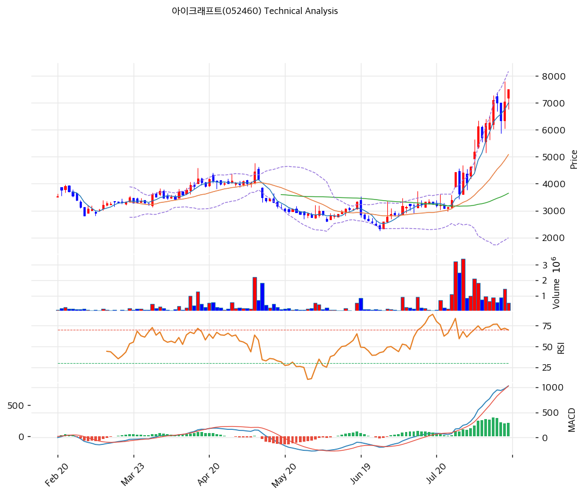

# 아이크래프트(052460) 기술적 분석

2026-08-16 | T2 Technical Analysis

---

## 차트

---

## 1. 가격 현황

| 항목 | 값 |
|------|-----|
| 현재가 | 7,500원 (+6.38%) |
| 52주 고가 | 7,800원 |
| 52주 저가 | 2,250원 |
| 52주 범위 위치 | 94.6% |
| 거래량 | 20일 평균 대비 0.47x |

---

## 2. 차트 패턴 분석

### 2.1 캔들스틱 패턴

| 패턴 | 위치 | 신뢰도 | 해석 |
|------|------|--------|------|
| 유성형(슈팅스타) 근접 | 8/13 (52주 신고가 7,800원 터치) | 중 | 매도 시그널 — 고가 대비 750원(9.6%) 윗꼬리, 신고가 직후 매물 출회 확인 |
| 하락 마루보즈 | 8/12 (시가 7,000 = 고가, 종가 6,340) | 중 | 매도 시그널 — 시가부터 종일 밀린 장대음봉, 일중 진폭 16.3% |
| 상승 마루보즈 근접 | 8/14 (종가 7,500 = 고가) | 약 | 매수 시그널 — 고가 마감이나 거래량 0.47x로 확인 강도 부족 |
| 장대음봉 후 반전 3일 | 8/12\~8/14 | 약 | 중립 — 모닝스타 변형 형태이나 거래량이 오히려 감소해 신뢰도 낮음 |

※ 주요 캔들 패턴: 망치형, 역망치형, 장악형(상승/하락), 도지, 샛별/석별, 적삼병/흑삼병, 하라미, 유성형, 교수형 등

### 2.2 가격 구조 패턴

- **포물선형(parabolic) 상승** (신뢰도: 강)
  6/26 저점 2,250원에서 8/13 고점 7,800원까지 34거래일 +247%. 특히 8/3\~8/14 10거래일 구간에서 5,190원→7,500원(+44.5%)으로 기울기가 급격히 가팔라졌다. 포물선 국면은 추세가 살아 있는 동안 저항이 무의미해지는 대신, 꺾일 때 MA20(5,082원) 수준까지 되돌림이 일어나는 것이 통례다. 상승 각도 자체가 지속 불가능한 구간이다.

- **미충족 상승 갭 (3,400\~3,895원)** (신뢰도: 중)
  7/24 종가 3,400원 → 7/27 시가 3,895원으로 14.6% 갭업 후 한 번도 메워지지 않았다. 돌파 갭(breakaway gap)으로 기능 중이며, 되돌림 시 강한 지지대로 작동할 구간. 다만 현재가 대비 -48% 위치라 단기 방어선으로는 무의미하다.

- **변동성 확장 국면** (신뢰도: 강)
  볼린저 밴드 폭 121.6%는 정상 범위를 크게 벗어난 값이다. 일중 진폭이 8/12 16.3%, 8/13 24.7%로 확대됐고, 밴드 하단이 1,992원까지 벌어져 지지 지표로서의 의미를 상실했다. 방향성보다 변동성 자체가 리스크인 구간.

※ 주요 구조 패턴: 이중천정/바닥, 헤드앤숄더(정/역), 삼각수렴(대칭/상승/하락), 쐐기형(상승/하락), 깃발형, 페넌트, 컵앤핸들, 박스권 등

### 2.3 다이버전스

- **거래량 하락 다이버전스** (신뢰도: 중)
  가격은 7/27(4,420원) → 8/14(7,500원)로 +70% 상승했으나 거래량은 320만주 → 54만주로 83% 감소했다. 신고가 부근에서 참여 자금이 빠지는 전형적 상승 동력 약화 신호. 20일 평균 대비 0.47x는 추세 지속을 확인해 주기에 명백히 부족하다.

- **스토캐스틱 하락 다이버전스** (신뢰도: 중)
  가격은 신고가권인데 Slow %K(83.8)가 %D(84.8) 아래로 내려가며 데드크로스가 발생했다. 과매수 구간에서의 데드크로스는 단기 조정 선행 신호로 해석된다. 반면 MACD 히스토그램은 +214로 확대 중이어서 지표 간 시그널이 엇갈린다.

※ RSI·MACD 기반 | 상승 다이버전스 = 가격↓ 지표↑ (반등 시사), 하락 다이버전스 = 가격↑ 지표↓ (하락 시사), 히든 다이버전스 = 기존 추세 지속 시사

### 2.4 패턴 종합 판단

세 카테고리가 **"추세는 살아 있으나 연료가 마르고 있다"**는 하나의 그림으로 수렴한다. 이동평균 완전 정배열과 MACD 히스토그램 확대는 중기 상승 추세를 지지하지만, 8/13 신고가 직후의 긴 윗꼬리·거래량 83% 감소·스토캐스틱 데드크로스는 단기 상단 소진을 가리킨다. 상충 시그널은 명확하다 — **방향(중기 상승)과 타이밍(단기 과열)이 반대**다. 포물선 구간에서 거래량 없이 오르는 국면은 되돌림 폭이 크므로, 추격보다 MA20(5,082원) 회귀 여부를 기다리는 쪽의 기대값이 높다.

---

## 3. 이동평균선 — 정배열 (강세)

| MA | 값 | 현재가 괴리율 | 위치 |
|----|-----|--------------|------|
| MA5 | 6,998원 | +7.2% | 위 |
| MA20 | 5,082원 | +47.6% | 위 |
| MA60 | 3,646원 | +105.7% | 위 |
| MA120 | 3,621원 | +107.1% | 위 |
| MA200 | 3,297원 | +127.5% | 위 |

**해석**: MA5 > MA20 > MA60 > MA120 > MA200 완전 정배열로 추세 자체는 최상 등급이다. 문제는 이격이다. MA20 괴리 +47.6%, MA200 괴리 +127.5%는 극단적 과열 영역이며, 지지선으로 삼을 만한 이동평균이 현재가에서 너무 멀다. 실질적 1차 지지는 MA5(6,998원)뿐이고 이마저 이탈하면 다음 이동평균 지지는 MA20까지 -32% 공백이다. 정배열은 보유 근거가 되지만 신규 진입 근거는 되지 못한다.

---

## 4. 보조 지표

### RSI(14) — 72.9 (🔴과매수)

70선을 상회한 과매수 구간이며 여전히 상승 방향이다. 다만 포물선 상승 국면에서 RSI는 80\~90까지도 밀려 올라가므로 단독 매도 근거로는 약하다. 되돌림 여부는 70선 하향 이탈 시점이 신호가 된다.

### MACD(12,26,9)

| 항목 | 값 |
|------|-----|
| MACD | 1,026 |
| Signal | 813 |
| Histogram | +214 |
| 크로스 상태 | 매수 구간 (확대 중) |

**해석**: 매수 구간에서 히스토그램이 확대 중으로 6개 지표 가운데 가장 명확한 강세 신호다. 다만 MACD는 후행 지표이며 절대값 1,026은 주가 대비 극단적으로 벌어진 상태라 수축 전환 시 낙폭이 커질 수 있다.

### 볼린저밴드(20, 2σ)

| 항목 | 값 |
|------|-----|
| 상단 | 8,171원 |
| 중단 (MA20) | 5,082원 |
| 하단 | 1,992원 |
| 밴드 폭 | 121.6% |
| 현재 위치 | 중간 |

**해석**: 밴드 폭 121.6%는 정상 범위를 크게 벗어난 극단적 확장이다. 7\~8월 급등이 20일 표준편차를 폭발시키면서 하단이 1,992원까지 내려가, 하단은 사실상 지지 정보를 담지 못한다. 현재가 7,500원은 상단(8,171원) 대비 92% 위치로 명목상 "중간"이나, 밴드가 비정상적으로 넓어 생긴 착시에 가깝다.

### 스토캐스틱(14, 3, 3)

| 항목 | 값 |
|------|-----|
| Slow %K | 83.8 |
| Slow %D | 84.8 |
| 크로스 상태 | 데드크로스 |
| 판단 | 과매수 |

---

## 5. 지지/저항 — 추세선 · 피보나치 · PRZ 통합

### 5.1 피보나치 되돌림/확장

| 구분 | 비율 | 가격 | 현재가 대비 |
|------|------|------|-----------|
| Swing High | — | 7,800원 | +4.0% |
| 되돌림 | 0.236 | 6,490원 | -13.5% |
| 되돌림 | 0.382 | 5,680원 | -24.3% |
| 되돌림 | 0.5 | 5,025원 | -33.0% |
| 되돌림 | 0.618 | 4,370원 | -41.7% |
| 되돌림 | 0.786 | 3,438원 | -54.2% |
| Swing Low | — | 2,250원 | -70.0% |
| 확장 | 1.272 | 9,310원 | +24.1% |
| 확장 | 1.382 | 9,920원 | +32.3% |
| 확장 | 1.618 | 11,230원 | +49.7% |
| 확장 | 2.0 | 13,350원 | +78.0% |

※ 피보나치 기준: 상승 추세 (Swing Low 2,250원 → Swing High 7,800원)
※ 되돌림 = 직전 추세에서 되돌아온 비율, 확장 = 추세 방향 목표가

### 5.2 추세선

| 추세선 | 방향 | 현재 교차가 | 포인트 수 | 해석 |
|--------|------|-----------|---------|------|
| 지지선 | 상승 | 2,549원 | 6개 | 기울기 0.14로 완만 — 장기 저점을 잇는 선이라 현재가 대비 -66% 위치, 단기 유효성 없음 |
| 저항선 | 상승 | 4,769원 | 6개 | 기울기 8.49로 급등 구간에서 이미 상향 돌파. 저항선이 지지선으로 역할 전환된 상태 |

### 5.3 PRZ (Potential Reversal Zone)

| 방향 | 가격 범위 | 신뢰도 | 근거 |
|------|---------|--------|------|
| 지지 | 6,998\~7,007원 | 약 | MA5 + 피봇 S1 |
| 지지 | 6,490\~6,513원 | 약 | 피보나치 0.236 되돌림 + 피봇 S2 |

※ PRZ = 추세선 · 피보나치 · 피봇 · MA 등 복수 지표가 겹치는 가격 구간. 겹치는 소스가 많을수록 반전 확률 상승.

### 5.4 종합 지지/저항 테이블

| 구분 | 가격 | 근거 |
|------|------|------|
| 저항 | 9,310원 | 피보나치 1.272 확장 |
| 저항 | 7,993원 | 피봇 R2 |
| 저항 | 7,800원 | 52주 고가 (8/13 형성) |
| 저항 | 7,747원 | 피봇 R1 |
| **현재가** | **7,500원** | — |
| 지지 | 6,998\~7,007원 | PRZ (약) — MA5 + 피봇 S1 |
| 지지 | 6,490\~6,513원 | PRZ (약) — 피보나치 0.236 + 피봇 S2 |
| 지지 | 5,680원 | 피보나치 0.382 되돌림 |
| 지지 | 5,082원 | MA20 (볼린저 중단 겸용) |

---

## 6. 시그널 종합

| 지표 | 내용 | 시그널 |
|------|------|--------|
| **차트 패턴** | 포물선 상승 지속 + 8/13 유성형·거래량 83% 감소로 상단 소진 | 🔴 |
| 이동평균선 | 완전 정배열, MA20 괴리 +47.6% (추세 강세 / 이격 과열) | ⚪ |
| RSI | 72.9 — 과매수 | 🔴 |
| MACD | 매수 구간, 히스토그램 +214 확대 중 | 🟢 |
| 볼린저밴드 | 밴드 폭 121.6% 극단 확장, 위치 중간 | ⚪ |
| 스토캐스틱 | 데드크로스, K=83.8 과매수 | 🔴 |
| 거래량 | 0.47x — 약함 | 🟢→⚪ |

**종합 판단**: 🟢 매수 2개 / 🔴 매도 3개 / ⚪ 중립 2개 → **매도우위** (과열 경고)

중기 추세(완전 정배열, MACD 확대)는 여전히 상방이지만, 단기 지표 3개가 동시에 과열·소진을 가리킨다. 52주 범위 위치 94.6%에서 거래량이 20일 평균의 절반도 안 되는 상황은 상승을 이어갈 신규 자금이 유입되지 않고 있다는 뜻이다. **7\~8월 상승은 NIPA 수주 공시(6/18·7/6·7/10·7/21·7/24)와 7/27 네이버-엔비디아 100억 달러 계약 뉴스에 반응한 이벤트 드리븐 랠리**로, 다음 촉매(2026Q3 실적 또는 신규 수주 공시)가 나오기 전까지는 되돌림 압력이 우세하다.

---

## 7. 전략 제안

### 보유 중인 경우
- **비중축소**
- 익절 라인: 7,650원 (피봇 R1 7,747원 직하 — 52주 고가 7,800원 저항대 진입 전 분할 정리)
- 손절 라인: 6,513원 (PRZ 하단 6,490\~6,513원 = 피보나치 0.236 + 피봇 S2 이탈 시)
- 리스크/리워드: 익절 +2.0% / 손절 -13.2% → **약 0.15 : 1** (현 가격대는 손익비가 명백히 불리)

### 진입 대기인 경우
- **관망**
- 1차 진입가: 7,007원 (PRZ 상단 = MA5 + 피봇 S1 지지 확인 시 소량)
- 2차 진입가: 5,082원 (MA20 = 볼린저 중단 회귀, 포물선 국면의 통상적 되돌림 지점)
- 진입 조건: 거래량 20일 평균 1.0x 이상 회복 + RSI 70선 아래 안착 후 재반등. 8/13 신고가(7,800원)를 거래량 동반해 돌파하면 조건 없이 추세 추종 전환도 가능하나, 현 거래량(0.47x)에서의 돌파 시도는 실패 확률이 높다
