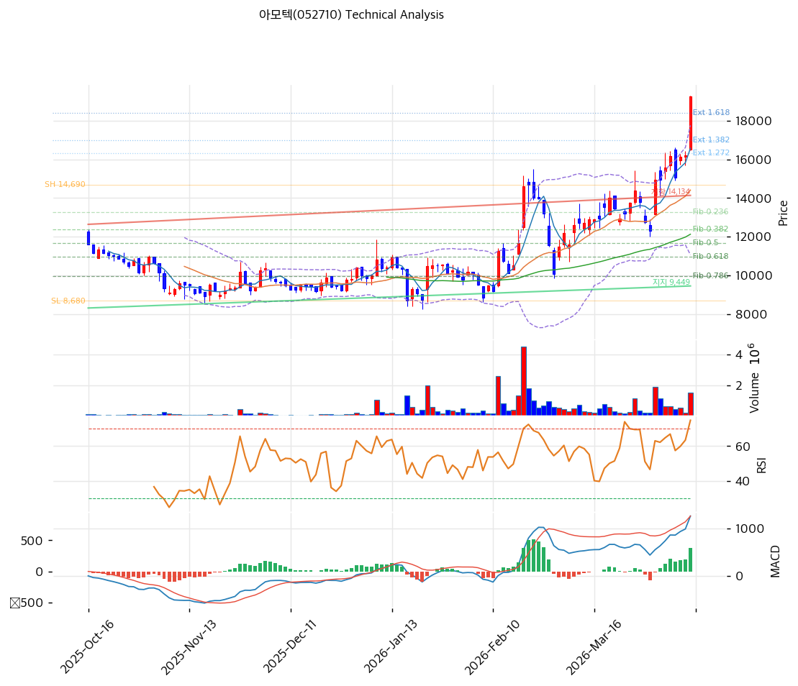

# 아모텍(052710) 기술적 분석

2026-04-10 | T2 Technical Analysis

---

## 차트

---

## 1. 가격 현황

| 항목 | 값 |
|------|-----|
| 현재가 | 19,260원 (+18.82%) |
| 52주 고가 | 19,260원 |
| 52주 저가 | 7,000원 |
| 52주 범위 위치 | 100.0% |
| 거래량 | 20일 평균 대비 2.81x |

---

## 2. 차트 패턴 분석

### 2.1 캔들스틱 패턴

| 패턴 | 위치 | 신뢰도 | 해석 |
|------|------|--------|------|
| 장대양봉 | 당일(2026-04-10) | 강 | +18.82% 급등 단일 양봉 — 단기 과열 신호이나 강한 매수 세력 진입 확인 |
| 상승갭 | 52주 신고가 돌파 | 중 | 직전 저항 돌파 갭 발생으로 지지 전환 가능성, 갭 되메움 주의 필요 |

※ 주요 캔들 패턴: 장대양봉, 상승갭, 유성형 경계

### 2.2 가격 구조 패턴

- **추세 상승 채널** (신뢰도: 중)
  2025년 하반기부터 저점을 높여가는 상승 추세 채널을 형성 중이다. 지지선은 현재 9,449원 (상승 기울기 9.59pt/일), 저항선은 14,134원 (기울기 12.58pt/일) 수준으로, 당일 19,260원은 채널 상단을 **크게 이탈한 급등** 상태다. 갭 되메움 또는 채널 내 재진입 여부가 관건.

- **52주 신고가 돌파** (신뢰도: 강)
  52주 고가(19,260원)와 현재가가 일치하며 사상(연중) 최고가 갱신. 상방 저항이 없는 구간이나 피보나치 확장 2.0(20,700원)이 다음 심리적 목표가가 된다. 신고가 돌파 후 조정 없이 추가 상승할 경우 단기 과열 후 급락 패턴 경계 필요.

### 2.3 다이버전스

- **RSI 하락 다이버전스 경계** (신뢰도: 중)
  RSI 72.6으로 과매수 구간 진입. 가격은 신고가 갱신 중이나 RSI가 이전 고점 대비 낮은 값을 기록할 경우 하락 다이버전스 형성 가능성 있음. 현재는 다이버전스 미확인 상태이나 단기 조정 경계 신호.

- **MACD 히스토그램 확대** (신뢰도: 중)
  MACD(1,264) > Signal(891), 히스토그램 +373으로 확대 중. 모멘텀 가속을 확인하며 히든 상승 다이버전스(추세 지속) 시사. 히스토그램이 수축 전환되는 시점이 매도 트리거.

### 2.4 패턴 종합 판단

당일 +18.82% 급등으로 52주 신고가를 갱신하며 강한 매수 세력 유입을 확인했다. MACD 히스토그램 확대는 모멘텀 지속을 지지하나, RSI 72.6 과매수와 스토캐스틱 K=93.7이 단기 과열을 경고한다. 볼린저밴드 상단(17,761원)을 현재가(19,260원)가 크게 초과하여 밴드 이탈 상태로, 단기적으로 갭 되메움 또는 17,000~18,400원대 조정이 올 경우 오히려 매수 기회가 될 수 있다.

---

## 3. 이동평균선 — 비정배열 (급등 과열)

| MA | 값 | 현재가 괴리율 | 위치 |
|----|-----|--------------|------|
| MA5 | 16,570원 | +16.2% | 위 |
| MA20 | 14,412원 | +33.6% | 위 |
| MA60 | 12,127원 | +58.8% | 위 |
| MA120 | 11,015원 | +74.8% | 위 |
| MA200 | 11,222원 | +71.6% | 위 |

**해석**: 현재가가 MA5~MA200 전부를 상회하며 강세 구조를 확인했으나, 비정배열 상태(MA5 < MA20 < MA60 < MA120)로 이동평균 정배열은 미완성이다. MA20 대비 +33.6%, MA200 대비 +71.6% 괴리는 역사적 과열 수준이며, 정상화 과정에서 MA20(14,412원)까지의 조정 가능성을 열어두어야 한다.

---

## 4. 보조 지표

### RSI(14) — 72.6 (과매수 🔴)

RSI 72.6으로 과매수 기준(70)을 상회했다. 단기 조정 압력이 높아진 구간이며, 70 아래로 재진입 시 매도 트리거로 활용 가능하다.

### MACD(12,26,9)

| 항목 | 값 |
|------|-----|
| MACD | 1,264 |
| Signal | 891 |
| Histogram | +373 |
| 크로스 상태 | 매수 구간 (확대 중) |

**해석**: MACD가 Signal을 상회하며 매수 구간 유지, 히스토그램이 +373으로 확대 중이어서 단기 모멘텀은 여전히 상승 방향이다. 히스토그램이 수축 전환되는 시점이 추세 둔화 신호.

### 볼린저밴드(20, 2σ)

| 항목 | 값 |
|------|-----|
| 상단 | 17,761원 |
| 중단 (MA20) | 14,412원 |
| 하단 | 11,062원 |
| 밴드 폭 | 46.5% |
| 현재 위치 | 상단 근접 (상단 초과) |

**해석**: 현재가(19,260원)가 볼린저밴드 상단(17,761원)을 1,499원 초과하여 밴드 이탈 상태다. 밴드 폭 46.5%는 충분히 확장되어 있어 스퀴즈 해소 이후 추세 가속을 뒷받침하나, 상단 이탈 상태의 지속은 통계적으로 단기 되돌림 확률이 높다.

### 스토캐스틱(14, 3, 3)

| 항목 | 값 |
|------|-----|
| Slow %K | 93.7 |
| Slow %D | 86.6 |
| 크로스 상태 | 골든크로스 |
| 판단 | 과매수 |

---

## 5. 지지/저항 — 추세선 · 피보나치 · PRZ 통합

### 5.1 피보나치 되돌림/확장

| 구분 | 비율 | 가격 | 현재가 대비 |
|------|------|------|-----------|
| Swing High | — | 14,690원 | — |
| 되돌림 | 0.236 | 13,272원 | -31.1% |
| 되돌림 | 0.382 | 12,394원 | -35.6% |
| 되돌림 | 0.5 | 11,685원 | -39.3% |
| 되돌림 | 0.618 | 10,976원 | -43.0% |
| 되돌림 | 0.786 | 9,966원 | -48.3% |
| Swing Low | — | 8,680원 | — |
| 확장 | 1.272 | 16,325원 | -15.2% |
| 확장 | 1.382 | 16,986원 | -11.8% |
| 확장 | 1.618 | 18,404원 | -4.4% |
| 확장 | 2.0 | 20,700원 | +7.5% |

※ 피보나치 기준: 상승 추세 (Swing Low 8,680원 → Swing High 14,690원)
※ 되돌림 = 직전 고점 대비 조정 시 지지 레벨, 확장 = 신고가 이후 목표가

현재가(19,260원)는 피보나치 1.618 확장(18,404원)을 상향 돌파하며 **확장 1.618~2.0 구간(18,404~20,700원)** 내에 위치한다. 피보나치 2.0 확장(20,700원)이 단기 상방 목표가이며, 하방 전환 시 1.618 확장(18,404원) → 1.382 확장(16,986원) 순서로 지지 여부 확인이 필요하다.

### 5.2 추세선

| 추세선 | 방향 | 현재 교차가 | 포인트 수 | 해석 |
|--------|------|-----------|---------|------|
| 지지선 | 상승 | 9,449원 | 6개 | 장기 상승 추세선. 기울기 9.59pt/일로 완만한 상승. 현재가에서 크게 하회하여 장기 지지 역할. 급락 시 궁극적 바닥 구간. |
| 저항선 | 상승 | 14,134원 | 6개 | 단기 저항선. 기울기 12.58pt/일로 상대적으로 가파름. 이미 현재가(19,260원)가 상향 돌파. 돌파 이후 지지선으로 전환 가능. |

### 5.3 PRZ (Potential Reversal Zone)

| 방향 | 가격 범위 | 신뢰도 | 근거 |
|------|---------|--------|------|
| 지지 | 16,325~16,570원 | 약 | 피보나치 1.272 확장(16,325원) + MA5(16,570원) 이중 겹침. 단기 되돌림 시 1차 지지 구간. |
| 지지 | 14,134~14,412원 | 약 | 추세선 저항(14,134원, 돌파 후 지지 전환) + MA20(14,412원) 이중 겹침. 중기 조정 시 강한 지지 예상. |

※ PRZ = 추세선·피보나치·피봇·MA 등 복수 지표가 겹치는 가격 구간. 겹치는 소스가 많을수록 반전 확률 상승.
※ 현재 두 PRZ 모두 신뢰도 '약'으로, 복수 지표 충분 겹침이 형성되기 전까지는 참고 수준으로 활용.

### 5.4 종합 지지/저항 테이블

| 구분 | 가격 | 근거 |
|------|------|------|
| 저항 | 20,700원 | 피보나치 2.0 확장, 차기 심리적 목표가 |
| 저항 | 20,220원 | 피봇 R1 |
| **현재가** | **19,260원** | — |
| 지지 | 18,404원 | 피보나치 1.618 확장 (최근 돌파한 레벨) |
| 지지 | 17,380원 | 피봇 S1 |
| 지지 | 16,325~16,570원 | PRZ (약) — 피보나치 1.272 확장 + MA5 |
| 지지 | 16,325원 | 피보나치 1.272 확장 |
| 지지 | 15,500원 | 피봇 S2 |
| 지지 | 14,134~14,412원 | PRZ (약) — 추세선 저항 돌파 전환 + MA20 |
| 지지 | 12,127원 | MA60 |
| 지지 | 9,449원 | 장기 추세선 지지 (상승) |

---

## 6. 시그널 종합

| 지표 | 내용 | 시그널 |
|------|------|--------|
| **차트 패턴** | 52주 신고가 갱신, 장대양봉, 볼린저 상단 이탈 | ⚪ (모멘텀 강하나 단기 과열) |
| 이동평균선 | 비정배열, MA20 +33.6% 괴리 과열 | 🔴 |
| RSI | 72.6 — 과매수 | 🔴 |
| MACD | 매수구간, 히스토그램 +373 확대 중 | 🟢 |
| 볼린저밴드 | 상단 이탈, 밴드 폭 46.5% 확장 | ⚪ |
| 스토캐스틱 | 골든크로스, K=93.7 과매수 | 🔴 |
| 거래량 | 2.81x — 강력 동반 | 🟢 |

**종합 판단**: 🟢 매수 2개 / 🔴 매도 3개 / ⚪ 중립 2개 → **매도우위**

+18.82% 급등으로 강한 매수 세력 유입과 신고가 갱신을 확인했으나, RSI 72.6·스토캐스틱 K=93.7·MA20 괴리 +33.6%가 중첩되며 단기 과열 신호가 우세하다. MACD 히스토그램 확대와 거래량 2.81배 동반이 모멘텀을 지지하므로, 추세 자체가 꺾인 것은 아니나 단기 차익 실현 압력이 높다. 피보나치 1.618 확장(18,404원) 또는 PRZ 16,325~16,570원대로 되돌림 시 기술적 매수 기회가 될 수 있다.

---

## 7. 전략 제안

### 보유 중인 경우
- **비중축소**
- 익절 라인: 20,220원 (피봇 R1 / 피보나치 2.0 확장 20,700원 직전)
- 손절 라인: 15,500원 (피봇 S2 — 주요 지지 이탈 시 추세 전환 확인)
- 리스크/리워드: 목표 +5.0% / 손절 -19.5% → R/R 약 1:4 (비중축소 권고)

### 진입 대기인 경우
- **관망**
- 1차 진입가: 17,380원 (피봇 S1 — 단기 급등 후 1차 조정 지지 구간)
- 2차 진입가: 14,412원 (PRZ 14,134~14,412원 — MA20 + 추세선 지지 전환 구간)
- 진입 조건: RSI 60 이하 복귀 및 거래량 감소 후 재상승 양봉 확인 시 진입. 지지선 이탈 확인 없이 추격 매수 금지.
