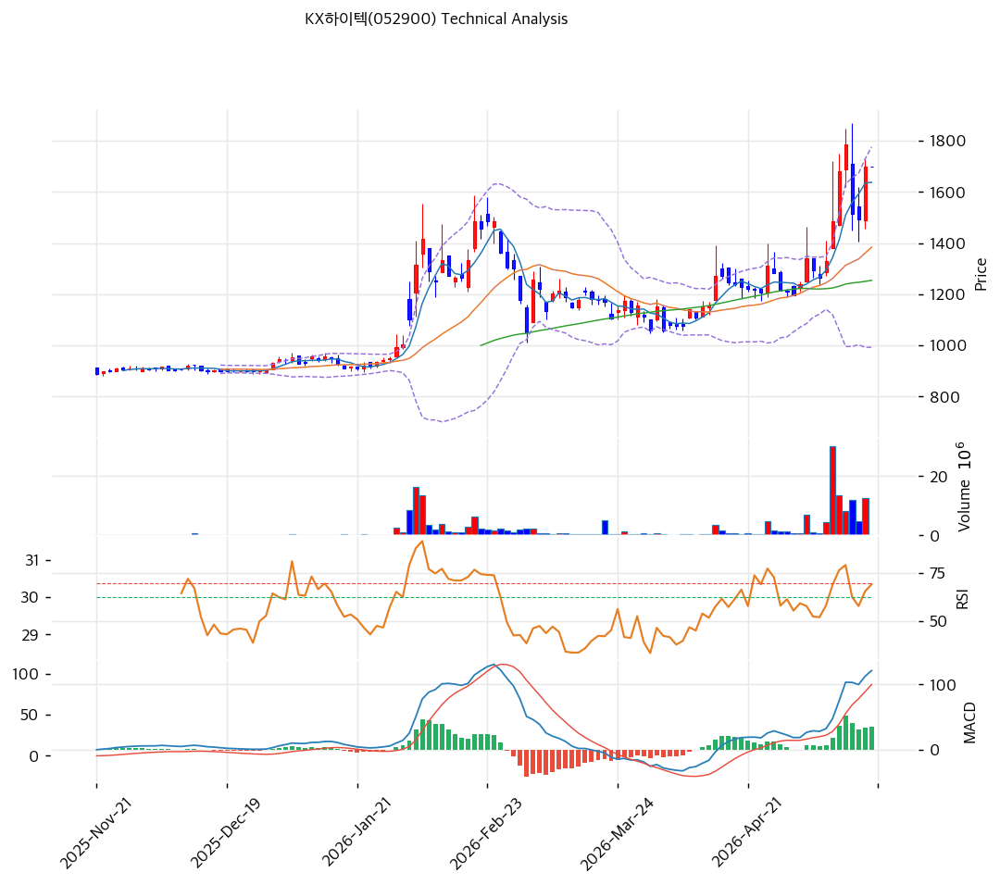

# KX하이텍(052900) 기술적 분석

2026-05-20 | T2 Technical Analysis

---

## 차트

---

## 1. 가격 현황

| 항목 | 값 |
|------|-----|
| 현재가 | 1,698원 (52주 90% 위치) |
| 52주 고가 | 1,786원 (당일) |
| 52주 저가 | 887원 |
| 52주 범위 위치 | 90% |
| 거래량 | 데이터 결손 (차트상 1월·5월 폭증) |

---

## 2. 차트 패턴 분석

### 2.1 캔들스틱 패턴

| 패턴 | 위치 | 신뢰도 | 해석 |
|------|------|--------|------|
| **장대양봉 (5월)** | 최근 1주 | 강 | 1,500→1,786원 거래량 동반 신고가 |
| **더블탑 + 재돌파** | 6개월 | 강 | 1차 정점 1,700원(2월) → 조정 → 재돌파 1,786원 |
| 음봉 일부 (-5%) | 당일 | 중 | 1,786원 정점 후 -5% 조정 (1,698원) |

### 2.2 가격 구조 패턴

- **더블탑 + 재돌파** (신뢰도: 강)
  2026-01~02 1차 정점 1,700원 → 2026-02~03 -30% 조정 (1,000원대 박스) → 2026-04~05 재돌파 + 신고가 1,786원. **2차 정점이 1차 초과 = Bullish 패턴**.

- **CB 행사가 1,391원 = MA20 일치** (신뢰도: 중)
  CB 행사가 1,391원 = MA20 1,384원 거의 일치 → **매물 흡수 지지선** 형성. 1,400원 이하 진입 시 CB 매물 압박 + MA20 지지의 양면.

### 2.3 다이버전스

- **RSI 65.3 중립** (신뢰도: 강)
  RSI 70 임계 미돌파. 1차 정점 (2월) RSI 80+ 대비 약화 — 단기 모멘텀 약함.

- **MACD 매수 + 히스토그램 확대** (신뢰도: 중)
  MACD 121 > Signal 87, 히스토그램 +35 확대. 매수 추세 유지.

### 2.4 패턴 종합 판단

더블탑 재돌파 + RSI 65 미과열 + MACD 매수 = **건전한 추세 가속**. 다만 BB 폭 56.6% 확장 + MA200 +61% 과열 누적 = **단기 -5~-10% 조정 후 재상승** 가능성. CB 행사가 1,391원이 매물 압박 + 지지선 양면 작용.

---

## 3. 이동평균선 — 정배열 (강세·과열)

| MA | 값 | 현재가 괴리율 | 위치 |
|----|-----|--------------|------|
| MA5 | 1,638원 | +3.7% | 위 |
| MA20 | 1,384원 | +22.7% | 위 |
| MA60 | 1,254원 | +35.4% | 위 |
| MA120 | (확인) | 약 +50% | 위 |
| MA200 | 1,053원 | **+61.3%** | 위 |

**해석**: 정배열 강세. MA200 +61.3% 과열 영역. **MA20 (1,384원) = CB 행사가 (1,391원) 일치 → 1차 강력 지지/매물 양면 영역**.

---

## 4. 보조 지표

### RSI(14) — 65.3 (중립)

70 임계 미돌파. 추가 상승 여지.

### MACD(12,26,9)

| 항목 | 값 |
|------|-----|
| MACD | 121 |
| Signal | 87 |
| Histogram | +35 |
| 크로스 상태 | 매수 (확대 중) |

**해석**: 골든크로스 이후 히스토그램 양 방향 확대. 매수 모멘텀 유지.

### 볼린저밴드(20, 2σ)

| 항목 | 값 |
|------|-----|
| 상단 | 1,776원 |
| 중단 (MA20) | 1,384원 |
| 하단 | 992원 |
| 밴드 폭 | **56.6%** |
| 현재 위치 | 중간 |

**해석**: 밴드 폭 56.6% 확장 — 변동성 매우 큼. 중간 위치 = 추가 상승·조정 양방향 가능.

### 스토캐스틱(14, 3, 3)

| 항목 | 값 |
|------|-----|
| Slow %K | 64.6 |
| Slow %D | 60.4 |
| 크로스 상태 | 골든크로스 |
| 판단 | 중립 |

---

## 5. 지지/저항

### 종합 지지/저항

| 구분 | 가격 | 근거 |
|------|------|------|
| 저항 | 2,000원 | 심리적 라운드넘버 |
| 저항 | 1,786원 | 52주 신고가 |
| 저항 | 1,776원 | BB 상단 |
| **현재가** | **1,698원** | — |
| 지지 | 1,638원 | MA5 (단기) |
| 지지 | 1,500원 | 박스권 (1차 정점 영역) |
| 지지 | 1,391~1,384원 | **CB 행사가 + MA20 + BB 중단 (매물·지지 양면 1차 강력)** |
| 지지 | 1,254원 | MA60 |
| 지지 | 1,053원 | MA200 |
| 지지 | 992원 | BB 하단 |
| 지지 | 887원 | 52주 저점 |

---

## 6. 시그널 종합

| 지표 | 시그널 |
|------|--------|
| 차트 패턴 (더블탑 재돌파) | 🟢 |
| 이동평균선 (정배열) | 🟢 |
| RSI 65.3 (중립) | ⚪ |
| MACD 매수 + 히스토그램 확대 | 🟢 |
| 볼린저밴드 중간 (BW 56.6% 확장) | ⚪ |
| 스토캐스틱 64.6 | ⚪ |
| 거래량 (5월 폭증) | 🟢 |

**종합 판단**: 🟢 매수 4 / 🔴 매도 0 / ⚪ 중립 3 → **매수우위**

추세 강세이나 BB 폭 56.6% + MA200 +61% 과열 누적. CB 매물 압박 임박이 단기 변동성 키울 가능성.

---

## 7. 전략 제안

### 보유 중
- **분할 익절 + 잔량 홀드**
- 1차 익절: 1,786원 (52주 고, +5%)
- 2차 익절: 2,000원 (심리적, +18%)
- 손절: 1,384원 (MA20 + CB 행사가 이탈, -18%)

### 진입 대기
- **평균회귀 대기 (CB 매물 흡수 후)**
- 1차 진입: 1,500원 (박스권 1차 정점 re-test, -12%)
- 2차 진입: 1,391원 (CB 행사가 = MA20, -18%) — **매물 흡수 후 강력 지지**
- 진입 조건: CB 행사 진행 + MA20 도달 + 양봉 + 거래량 회복
- **펀더멘털**: PBR 0.81x + 순현금 +260억 + 외인 매집 — CB 매물 흡수 후 진입 정합
