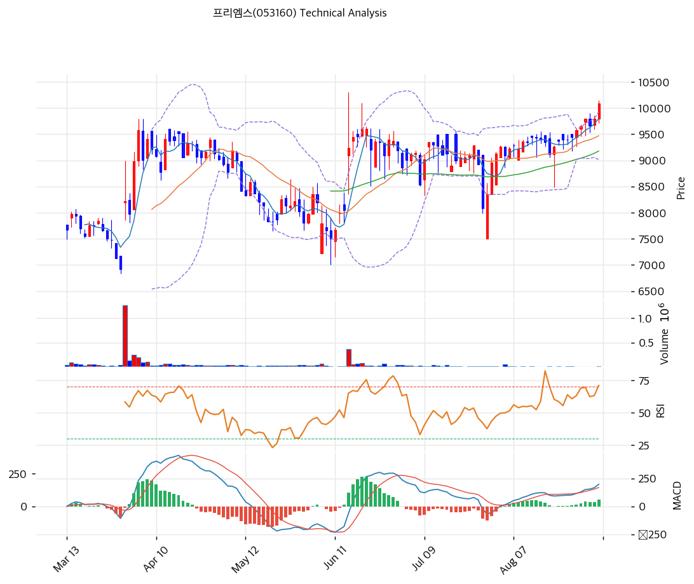

# 프리엠스(053160) 기술적 분석

2026-09-05 | T2 Technical Analysis

---

## 차트

---

## 가격 현황

| 항목 | 값 |
|------|-----|
| 현재가 | 10,090원 (+3.06%) |
| 52주 고가 | 10,310원 |
| 52주 저가 | 6,400원 |
| 52주 범위 위치 | 94.4% |
| 거래량 | 20일 평균 대비 1.56x |

9월 4일 종가 10,090원은 52주 고가 10,310원의 97.9% 수준이다. 2월 자사주 취득 시작 시점의 6,710원 대비 50.4% 올랐다.

---

## 차트 패턴 분석

### 캔들스틱 패턴

| 패턴 | 위치 | 신뢰도 | 해석 |
|------|------|--------|------|
| 장대 양봉 + 거래량 급증 | 9월 4일 | 강 | 매수. 시가 9,790원에서 고가 10,150원까지 밀어올려 10,090원 마감. 거래량 13,343주는 전일 4,231주의 3.2배 |
| 6거래일 연속 상승 | 8월 28일\~9월 4일 | 중 | 매수. 9,580 → 9,650 → 9,800 → 9,660 → 9,790 → 10,090원. 9월 2일 하루만 음봉 |
| 거래량 고갈 후 돌파 | 8월 21일\~8월 31일 | 중 | 매수. 8월 28일 2,331주, 8월 31일 1,840주로 거래가 말랐다가 이후 확대 |
| 적삼병 | 7월 30일\~8월 3일 | 강 | 매수. 급락 다음날 시가 7,500원(=저가)에서 반등해 3거래일 연속 양봉으로 8,350 → 8,960 → 9,130원 회복 |
| 장대 음봉 | 7월 29일 | — | 이미 소화됨. 9,100원 시가에서 7,990원까지 밀리며 -10.6% 마감. 다음 날 저점 7,500원이 최근 바닥 |

### 가격 구조 패턴

- **박스권 돌파** (신뢰도: 강)
  8월 10일부터 8월 27일까지 12거래일간 9,120\~9,450원 사이에서 횡보했다. 상단 9,500원대를 여러 차례 두드리다 8월 28일 9,580원으로 벗어났고, 9월 4일 10,090원으로 확장했다. 박스 높이 330원을 상단에 더한 1차 목표는 9,830원으로 이미 통과했다. 박스 상단 9,450원이 돌파 후 지지선으로 전환됐다.

- **V자 반등 후 신고가 경신** (신뢰도: 중)
  7월 29일과 30일 이틀 만에 9,290원에서 7,500원까지 19.3% 급락했다가 24거래일 만에 10,090원으로 올라섰다. 급락 구간을 전부 되돌리고 그 위로 나아간 형태다. 다만 반등 구간의 거래량이 급락 구간보다 작다. 7월 29일 19,747주, 7월 30일 8,464주였던 데 비해 8월 중순 이후 회복 구간은 대부분 5,000주 미만이었다.

- **볼린저밴드 상단 이탈** (신뢰도: 중)
  종가 10,090원이 밴드 상단 9,930원 위에 있다. 밴드를 타고 오르는 국면이면 추세 지속, 하루 이틀 내 밴드 안으로 되돌아오면 단기 과열 해소다. 밴드 폭이 9.7%로 넓지 않아 확장 여지는 남아 있다.

### 다이버전스

- **RSI 다이버전스: 확인되지 않음**
  7월 30일 저점에서 9월 4일 고점까지 가격이 계속 오르는 동안 RSI도 함께 68.5까지 올라왔다. 가격 신고가와 지표 저점 사이의 괴리가 관찰되지 않는다.

- **MACD 다이버전스: 확인되지 않음**
  MACD 197, 시그널 145로 히스토그램이 +53이며 확대 중이다. 가격 상승과 지표가 같은 방향으로 움직이고 있다.

### 패턴 종합 판단

캔들과 가격 구조는 모두 매수 방향을 가리킨다. 저거래량 수렴 후 거래량을 동반한 박스 돌파라는 교과서적 형태다. 다만 상승 구간 전체의 거래량이 하루 1만주를 넘긴 날이 손에 꼽는다. 거래대금 기준 하루 1억원대인 종목이라 소량 매수로도 호가가 크게 움직인다. 돌파의 형태는 강하지만 그것을 만든 자금의 크기는 작다는 뜻이다. 상충 신호는 스토캐스틱 하나로, K 90.6이 D 91.9를 아래로 뚫은 데드크로스가 과매수 구간에서 발생했다.

---

## 이동평균선: 정배열 (강세)

| MA | 값 | 현재가 괴리율 | 위치 |
|----|-----|--------------|------|
| MA5 | 9,798원 | +3.0% | 위 |
| MA20 | 9,471원 | +6.5% | 위 |
| MA60 | 9,178원 | +9.9% | 위 |
| MA120 | 8,796원 | +14.7% | 위 |
| MA200 | 8,085원 | +24.8% | 위 |

**해석**: MA5 > MA20 > MA60 > MA120 > MA200의 완전 정배열이다. 현재가가 5개 이동평균선 전부 위에 있다. MA20 괴리 +6.5%는 과열로 보기 어려운 수준이고, MA200 괴리 +24.8%는 장기 추세가 명확히 상향 전환됐음을 보여준다. MA20 9,471원이 1차 지지, MA60 9,178원이 2차 지지로 작동한다. 7월 29일 급락 때도 MA60 아래로 이틀만 머물다 회복했다.

---

## 보조 지표

### RSI(14): 68.5 (중립)

과매수 기준선 70에 1.5포인트 못 미친다. 상승 추세가 계속되면 곧 70을 넘어설 위치다. 현 수준 자체는 추세 지속을 방해하지 않는다.

### MACD(12,26,9)

| 항목 | 값 |
|------|-----|
| MACD | 197 |
| Signal | 145 |
| Histogram | +53 |
| 크로스 상태 | 매수 구간 (확대 중) |

**해석**: MACD가 시그널선 위에 있고 히스토그램이 +53으로 벌어지는 중이다. 상승 모멘텀이 아직 꺾이지 않았다.

### 볼린저밴드(20, 2σ)

| 항목 | 값 |
|------|-----|
| 상단 | 9,930원 |
| 중단 (MA20) | 9,471원 |
| 하단 | 9,012원 |
| 밴드 폭 | 9.7% |
| 현재 위치 | 상단 이탈 |

**해석**: 종가가 밴드 상단 9,930원을 160원 넘어섰다. 8월 중순 밴드 폭이 좁혀졌다가 9월 들어 다시 벌어지는 구간이다. 스퀴즈 후 확장의 초입에 해당한다. 밴드 폭 9.7%는 과거 대비 좁은 편이라 변동성 확대 여지가 있다.

### 스토캐스틱(14, 3, 3)

| 항목 | 값 |
|------|-----|
| Slow %K | 90.6 |
| Slow %D | 91.9 |
| 크로스 상태 | 데드크로스 |
| 판단 | 과매수 |

%K와 %D가 모두 90을 넘긴 과매수 구간이며 %K가 %D를 하향 돌파했다. 6개 지표 중 유일한 매도 신호다. 다만 강한 상승 추세에서 스토캐스틱은 과매수권에 오래 머무는 성질이 있어 단독 매도 근거로는 약하다.

---

## 지지/저항: 추세선 · 피보나치 · PRZ 통합

### 피보나치 되돌림/확장

| 구분 | 비율 | 가격 | 현재가 대비 |
|------|------|------|-----------|
| Swing High | — | 9,600원 | -4.9% |
| 되돌림 | 0.236 | 8,446원 | -16.3% |
| 되돌림 | 0.382 | 8,667원 | -14.1% |
| 되돌림 | 0.5 | 8,845원 | -12.3% |
| 되돌림 | 0.618 | 9,023원 | -10.6% |
| 되돌림 | 0.786 | 9,277원 | -8.1% |
| Swing Low | — | 8,090원 | -19.8% |
| 확장 | 1.272 | 7,679원 | -23.9% |
| 확장 | 1.382 | 7,513원 | -25.5% |
| 확장 | 1.618 | 7,157원 | -29.1% |
| 확장 | 2.0 | 6,580원 | -34.8% |

※ 피보나치 기준: 하락 추세 (Swing High 9,600원 → Swing Low 8,090원)
※ 현재가 10,090원이 Swing High 9,600원을 이미 4.9% 넘어섰다. 하락 되돌림 구도는 무효화됐고, 되돌림 레벨은 하방 지지선으로만 의미가 남는다

### 추세선

| 추세선 | 방향 | 현재 교차가 | 포인트 수 | 해석 |
|--------|------|-----------|---------|------|
| 지지선 | 상승 | 7,147원 | 6개 | 저점을 잇는 장기 상승 추세선. 현재가에서 29% 아래라 당장 작동하지 않는다 |
| 저항선 | 상승 | 10,119원 | 6개 | 고점을 잇는 상승 추세선. 현재가 10,090원 바로 위 29원 지점이다. 이번 주 최대 관문 |

### PRZ (Potential Reversal Zone)

| 방향 | 가격 범위 | 신뢰도 | 근거 |
|------|---------|--------|------|
| 저항 | 10,119\~10,423원 | 중 | 추세선 저항, 피봇 R1, 피봇 R2 |
| 지지 | 9,798\~9,817원 | 약 | MA5, 피봇 S1 |
| 지지 | 8,667\~9,543원 | 강 | 피보나치 0.382·0.5·0.618·0.786 되돌림, MA20, MA60, MA120, 피봇 S2 |
| 지지 | 7,513\~7,679원 | 약 | 피보나치 1.272·1.382 확장 |
| 지지 | 7,147\~7,157원 | 약 | 추세선 지지, 피보나치 1.618 확장 |

※ PRZ = 추세선·피보나치·피봇·MA 등 복수 지표가 겹치는 가격 구간. 겹치는 소스가 많을수록 반전 확률이 높다

8,667\~9,543원 구간에 8개 지표가 몰려 있다. 이 구간이 무너지지 않는 한 중기 상승 구조는 유지된다.

### 종합 지지/저항 테이블

| 구분 | 가격 | 근거 |
|------|------|------|
| 저항 | 10,423원 | 피봇 R2 |
| 저항 | 10,310원 | 52주 고가 |
| 저항 | 10,257원 | 피봇 R1 |
| 저항 | 10,119원 | 상승 추세선 저항 (6포인트), PRZ 중 |
| **현재가** | **10,090원** | — |
| 지지 | 9,930원 | 볼린저밴드 상단 (돌파 후 지지 전환 여부 확인) |
| 지지 | 9,817원 | 피봇 S1, PRZ 약 |
| 지지 | 9,543원 | 피봇 S2 |
| 지지 | 9,471원 | MA20, 볼린저 중단 |
| 지지 | 9,450원 | 8월 박스권 상단, 돌파 후 지지 전환 |
| 지지 | 9,178원 | MA60 |

---

## 시그널 종합

| 지표 | 내용 | 시그널 |
|------|------|--------|
| **차트 패턴** | 저거래량 수렴 후 거래량 동반 박스 돌파, 6거래일 연속 상승, 다이버전스 없음 | 🟢 |
| 이동평균선 | 완전 정배열, MA20 괴리 +6.5% | 🟢 |
| RSI | 68.5, 중립 (과매수 진입 직전) | ⚪ |
| MACD | 매수 구간, 히스토그램 +53 확대 | 🟢 |
| 볼린저밴드 | 상단 9,930원 이탈, 밴드 폭 9.7% | ⚪ |
| 스토캐스틱 | 데드크로스, K=90.6 과매수 | 🔴 |
| 거래량 | 1.56x, 보통 (절대량 13,343주로 얇음) | ⚪ |

**종합 판단**: 🟢 매수 2개 / 🔴 매도 1개 / ⚪ 중립 3개 → **매수우위**

지표 구성 자체는 상승 추세 초중반의 전형이다. 정배열, MACD 확대, 박스 돌파가 같은 방향을 가리키고 다이버전스는 없다. 바로 위 10,119원에 6포인트 상승 추세선 저항과 피봇 R1이 겹쳐 있어 여기를 거래량 동반으로 통과하는지가 첫 관문이다. 통과하면 52주 고가 10,310원, 이어 피봇 R2 10,423원이 다음 목표다.

기술적 지표와 별개로 이 종목의 수급에는 특수 변수가 있다. 회사가 6월 16일부터 9월 15일까지 50억원 규모 자사주를 장내 매수 중이며 1일 매수 한도가 60,000주다. 일평균 거래량이 1만주 안팎인 종목에서 이 프로그램이 가격을 떠받쳐 왔을 가능성이 높다. 9월 15일 종료 이후의 거래대금과 호가 흐름을 별도로 확인해야 한다.

---

## 전략 제안

### 보유 중인 경우

- **홀드**
- 익절 라인: 10,292원 (피봇 R1 10,257원과 추세선 저항 10,119원 상단 돌파 실패 시 1차 분할). 추세선 돌파에 성공하면 10,423원까지 연장
- 손절 라인: 9,543원 (피봇 S2. 이 아래는 MA20 9,471원과 박스권 상단 9,450원이 이어지므로 두 구간을 한 번에 잃는 자리)
- 리스크/리워드: 익절 +2.0% / 손절 -5.4%로 1:0.37. 현재 위치에서 신규 진입 관점의 손익비는 불리하다

### 진입 대기인 경우

- **관망**
- 1차 진입가: 9,817원 (피봇 S1, MA5와 겹치는 PRZ)
- 2차 진입가: 9,471원 (MA20, 볼린저 중단, 8월 박스 상단 9,450원과 인접)
- 진입 조건: 추세선 저항 10,119원을 거래량 2만주 이상 동반해 돌파하면 추격 진입도 유효하다. 반대로 9월 15일 자사주 취득 종료 후 일평균 거래대금이 5,000만원 아래로 줄면 진입 근거가 약해지므로 그 확인 전에는 신규 진입을 미룬다
