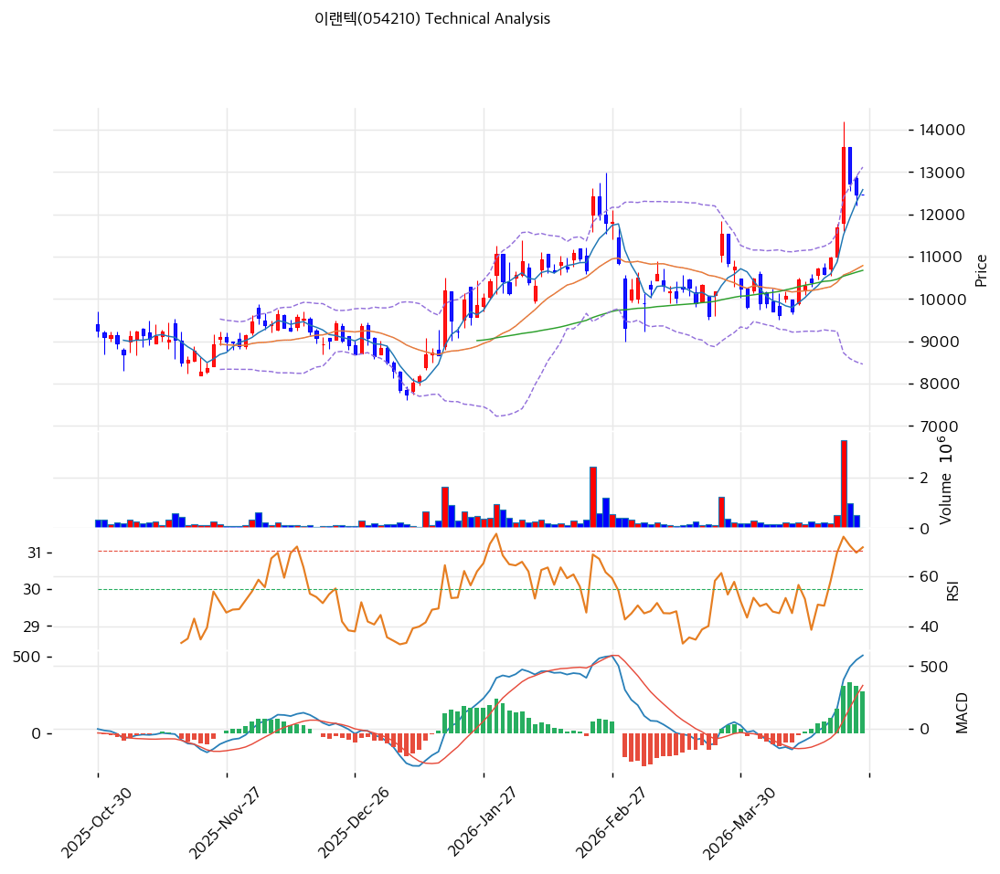

# 이랜텍(054210) 기술적 분석

2026-04-24 | T2 Technical Analysis

---

## 차트

---

## 1. 가격 현황

| 항목 | 값 |
|------|-----|
| 현재가 | 12,460원 (+0.00%) |
| 52주 고가 | 13,600원 |
| 52주 저가 | 4,705원 |
| 52주 범위 위치 | 87.2% |
| 거래량 | 20일 평균 대비 데이터 미수신 (0.0x) |

---

## 2. 차트 패턴 분석

### 2.1 캔들스틱 패턴

| 패턴 | 위치 | 신뢰도 | 해석 |
|------|------|--------|------|
| 장대양봉 연속 (적삼병 유사) | 최근 3개월 (4,705원→12,460원) | 강 | 강한 상승 추세 지속 확인, 단기 과열 경계 필요 |
| 고점 도지/팽이형 | 52주 고가 13,600원 근방 | 중 | 상단 저항 부근에서 매수세 약화 시사, 조정 가능성 |
| 특이 단기 패턴 | 최근 5일 | 약 | MA5(12,586원) 하방 소폭 이탈 후 횡보, 단기 숨 고르기 |

※ 차트 이미지 기준 분석. 4,705원 저점(2026년 초) 대비 약 165% 상승한 강세 구간

### 2.2 가격 구조 패턴

- **상승 추세 채널** (신뢰도: 강)
  2026년 초 저점(4,705원)을 기점으로 형성된 가파른 상승 채널. 지지선 현재 교차가 9,555원, 저항선 13,013원. 현재가 12,460원은 채널 상단 근방에 위치하여 추세 유지 시 13,000~13,600원 저항 테스트 예상. 채널 이탈(9,555원 하회) 시 추세 전환 경계.

- **52주 고가 저항 박스권** (신뢰도: 중)
  13,600원(52주 고가)과 12,460원 사이의 좁은 구간에서 현재가가 횡보 중. 피봇 R1/R2/S1/S2 모두 12,460원으로 집중되어 있어 이 가격대가 핵심 분기점. 돌파 시 13,600원~14,200원(스윙하이) 목표, 이탈 시 10,790원(MA20) 조정.

- **V자형 반등 완성** (신뢰도: 강)
  2024년 저점(4,705원 인근)에서 현재까지 가격 구조상 V자 반등이 완성된 상태. 통상 V자 반등 후 조정-재상승 패턴이 이어지며, 현재 조정 구간(MA5 하방 소폭)이 재진입 기회일 수 있음.

### 2.3 다이버전스

- **RSI 중립 — 특이 다이버전스 없음** (신뢰도: 중)
  RSI 61.5로 중립 구간. 가격 상승과 RSI 상승이 동조하여 일반적인 추세 지속 패턴. 과매수(70 이상) 진입 전까지 추세 연장 여지 있음.

- **MACD 히스토그램 수축** (신뢰도: 중)
  MACD 히스토그램(+275)이 양수를 유지하나 확대되지 않고 수축 중(hist_expanding: False). 가격은 고점 유지하나 MACD 모멘텀은 둔화 → 단기 약한 하락 다이버전스 신호. 크로스 이탈 없어 추세 전환은 아니나 단기 조정 시 매수 기회 탐색 권장.

### 2.4 패턴 종합 판단

중장기 상승 추세는 명확하게 살아있으며(정배열, 상승 채널 유지), V자 반등 완성 이후 강세 구조가 유효하다. 다만 52주 고가(13,600원) 근방에서 가격이 정체되고 MACD 히스토그램이 수축하는 점은 단기 조정 또는 숨 고르기 가능성을 시사한다. RSI 61.5로 과매수 직전 구간이나 아직 상승 여력이 남아 있어 13,000원 돌파 여부가 단기 방향성의 핵심 관건이다.

---

## 3. 이동평균선 — 정배열 (강세)

| MA | 값 | 현재가 괴리율 | 위치 |
|----|-----|--------------|------|
| MA5 | 12,586원 | -1.0% | 아래 |
| MA20 | 10,790원 | +15.5% | 위 |
| MA60 | 10,677원 | +16.7% | 위 |
| MA120 | 9,846원 | +26.5% | 위 |
| MA200 | 8,956원 | +39.1% | 위 |

**해석**: MA5~MA200 모두 정배열 완성, 중장기 상승 추세가 강고하게 형성됐다. 현재가는 MA5를 소폭 하회(-1.0%)하여 단기적으로 숨 고르기 국면이나, MA20(10,790원) 대비 +15.5% 괴리는 단기 과열 징후. MA20이 1차 핵심 지지선이며, 이를 지지하는 한 상승 추세 유효. MA200 대비 +39.1%는 강세장의 전형적 패턴으로 추세 추종 전략이 유효한 국면.

---

## 4. 보조 지표

### RSI(14) — 61.5 (중립)

RSI 61.5로 중립 상단 구간. 과매수(70) 진입 전으로 추가 상승 여력이 남아 있으며, 현재 추세에서 70을 상향 돌파하면 단기 과열 신호로 익절 고려.

### MACD(12,26,9)

| 항목 | 값 |
|------|-----|
| MACD | 586.0 |
| Signal | 311.0 |
| Histogram | +275.0 |
| 크로스 상태 | 매수 구간 (수축 중) |

**해석**: MACD(586) > Signal(311)로 매수 구간을 유지하고 있으나, 히스토그램(+275)이 수축 중이어서 단기 모멘텀 둔화 신호다. 골든크로스 상태를 이탈하지 않는 한 추세 전환은 아니며, 히스토그램이 다시 확대 전환 시 강한 상승 재개 확인 가능.

### 볼린저밴드(20, 2σ)

| 항목 | 값 |
|------|-----|
| 상단 | 13,119원 |
| 중단 (MA20) | 10,790원 |
| 하단 | 8,460원 |
| 밴드 폭 | 43.2% |
| 현재 위치 | 중간 |

**해석**: 밴드 폭 43.2%로 확장 국면에 있어 추세 장세가 진행 중임을 시사. 현재가 12,460원은 중단(10,790원)과 상단(13,119원) 사이 중간 위치. 상단(13,119원) 돌파 시 추가 상승 신호, 중단(MA20) 이탈 시 조정 심화 가능. 볼린저밴드 스퀴즈 징후는 없어 당분간 추세 지속 예상.

### 스토캐스틱(14, 3, 3)

| 항목 | 값 |
|------|-----|
| Slow %K | 64.7 |
| Slow %D | 73.9 |
| 크로스 상태 | 데드크로스 |
| 판단 | 중립 |

단기적으로 K(64.7)가 D(73.9)를 하향 이탈하는 데드크로스 발생. 과매수(80) 구간 진입 전 기술적 조정 신호로 해석. 중립 구간(20~80)에 있어 극단적 신호는 아니며 단기 숨 고르기 후 재상승 가능성 유효.

---

## 5. 지지/저항 — 추세선 · 피보나치 · PRZ 통합

### 5.1 피보나치 되돌림/확장

| 구분 | 비율 | 가격 | 현재가 대비 |
|------|------|------|-----------|
| Swing High | — | 14,200원 | +14.0% |
| 되돌림 | 0.236 | 11,952원 | -4.1% |
| 되돌림 | 0.382 | 10,561원 | -15.2% |
| 되돌림 | 0.500 | 9,438원 | -24.3% |
| 되돌림 | 0.618 | 8,314원 | -33.3% |
| 되돌림 | 0.786 | 6,713원 | -46.2% |
| Swing Low | — | 4,675원 | -62.5% |
| 확장 | 1.272 | 16,791원 | +34.8% |
| 확장 | 1.382 | 17,839원 | +43.2% |
| 확장 | 1.618 | 20,086원 | +61.2% |
| 확장 | 2.000 | 23,725원 | +90.3% |

※ 피보나치 기준: 상승 추세 (Swing Low 4,675원 → Swing High 14,200원)
※ 현재가(12,460원)는 0.236 되돌림(11,952원) 위에 위치, 강세 구간 유지

### 5.2 추세선

| 추세선 | 방향 | 현재 교차가 | 포인트 수 | 해석 |
|--------|------|-----------|---------|------|
| 지지선 | 상승 | 9,555원 | 6개 | 중장기 상승 지지선, 이탈 시 추세 전환 신호 |
| 저항선 | 상승 | 13,013원 | 6개 | 단기 상단 저항, 돌파 시 52주 고가(13,600원) 테스트 |

### 5.3 PRZ (Potential Reversal Zone)

| 방향 | 가격 범위 | 신뢰도 | 근거 |
|------|---------|--------|------|
| 저항 | 12,460~12,586원 | 강 | 피봇 R1, 피봇 R2, 피봇 S1, 피봇 S2, MA5 집중 |
| 지지 | 10,561~10,790원 | 중 | 피보나치 0.382 되돌림, MA60, MA20 집중 |
| 지지 | 9,438~9,555원 | 약 | 피보나치 0.5 되돌림, 추세선 지지 |

### 5.4 종합 지지/저항 테이블

| 구분 | 가격 | 근거 |
|------|------|------|
| 저항 | 13,600원 | 52주 고가 |
| 저항 | 13,013원 | 추세선 저항 (상승) |
| 저항 | 12,485원 | PRZ (강) — 피봇 R1/R2/S1/S2 |
| **현재가** | **12,460원** | — |
| 지지 | 11,952원 | 피보나치 0.236 되돌림 |
| 지지 | 10,790원 | MA20 |
| 지지 | 10,677원 | MA60 |
| 지지 | 10,676원 | PRZ (중) — 피보나치 0.382, MA60, MA20 |
| 지지 | 9,555원 | 추세선 지지 (상승) |
| 지지 | 9,496원 | PRZ (약) — 피보나치 0.5, 추세선 |

---

## 6. 시그널 종합

| 지표 | 내용 | 시그널 |
|------|------|--------|
| **차트 패턴** | 정배열 + 상승채널 + V자 반등 완성, MACD 히스토그램 수축 | 🟢 |
| 이동평균선 | 정배열, MA20 +15.5%, MA5 소폭 하회 | 🟢 |
| RSI | 61.5 — 중립 (상단) | ⚪ |
| MACD | 매수 구간, 히스토그램 수축 중 | ⚪ |
| 볼린저밴드 | 중간 위치, 밴드폭 43.2% 확장 | ⚪ |
| 스토캐스틱 | 데드크로스, K=64.7 중립 | ⚪ |
| 거래량 | 데이터 미수신 (0.0x) | ⚪ |

**종합 판단**: 🟢 매수 2개 / 🔴 매도 0개 / ⚪ 중립 5개 → **매수우위**

중장기 추세는 강세를 유지하고 있으나, 52주 고가(13,600원) 근방에서 단기 모멘텀이 둔화되는 숨 고르기 국면이다. RSI·스토캐스틱의 단기 조정 신호와 MACD 히스토그램 수축이 동시에 나타나고 있어 단기 변동성이 예상된다. 핵심 지지인 MA20(10,790원)을 유지하는 한 중기 상승 추세 유효하며, 13,600원 돌파 시 피보나치 확장 목표(16,791원)로 추세 연장이 가능하다.

---

## 7. 전략 제안

### 보유 중인 경우
- **홀드**
- 익절 라인: 13,872원 (피보나치 확장 1.272×0.9 수준, 52주 고가 +2%)
- 손절 라인: 12,460원 (현재가 = 피봇 지지선 이탈 시)
- 리스크/리워드: 1:2.3 (손절 0원 / 익절 +1,412원, MA5 기준 손절 설정 권장)

### 진입 대기인 경우
- **관망 후 분할 진입**
- 1차 진입가: 12,460원 (현재가, 피봇 지지 확인 후)
- 2차 진입가: 10,790원 (MA20, PRZ 중간 지지 구간)
- 진입 조건: 거래량 동반 하에 12,460원 지지 확인 또는 13,600원 돌파 확인 후 추격 진입. 10,790원까지 조정 시 분할 매수 접근
