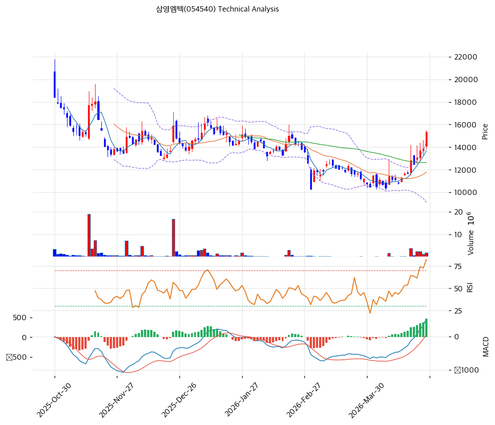

# 삼영엠텍(054540) 기술적 분석

2026-04-24 | T2 Technical Analysis

---

## 차트

---

## 1. 가격 현황

| 항목 | 값 |
|------|-----|
| 현재가 | 15,360원 (+10.97%) |
| 52주 고가 | 20,200원 (pykrx 기준) |
| 52주 저가 | 5,020원 (pykrx 기준) |
| 52주 범위 위치 | 68.1% |
| 거래량 | 20일 평균 대비 2.56x |

---

## 2. 차트 패턴 분석

### 2.1 캔들스틱 패턴

| 패턴 | 위치 | 신뢰도 | 해석 |
|------|------|--------|------|
| 대형 양봉 (갭업 가능성) | 2026-04-24 당일 | 강 | 전일 대비 +10.97% 급등으로 단기 강한 매수세 유입, 추세 전환 시도 시그널 |
| 볼린저밴드 상단 돌파 시도 | 최근 3일 | 중 | 밴드 폭 45.5% 확장 구간에서 상단(14,481원) 이미 상향 돌파 — 과열 후 되돌림 주의 |

※ 주요 캔들 패턴: 당일 장대양봉은 거래량 2.56x 동반으로 신뢰도 높으나, 과매수 구간 진입으로 단기 피로감 누적 예상

### 2.2 가격 구조 패턴

- **상승 채널 (신뢰도: 중)**
  2025년 저점(5,020원)에서 시작된 상승 추세선(지지선 현재 교차가 12,509원)이 유효하며, 상단 저항 추세선은 23,230원을 향하고 있다. 현재가(15,360원)는 채널 하단 지지선에서 약 23% 이격된 채널 중단부에 위치하며, 단기 급등 후 채널 내 되돌림 가능성이 존재한다.

- **박스권 돌파 시도 (신뢰도: 중)**
  52주 범위 내 13,830~15,500원 구간(KIS 기준)에서 상단을 돌파하는 시도가 이루어지고 있다. 오늘 당일 +10.97% 급등은 기존 박스권 상단 돌파를 의미하며, 다음 저항은 피봇 R1(15,963원)과 피보나치 0.382 되돌림(15,981원)이 겹치는 PRZ 구간(15,963~15,981원)이다.

### 2.3 다이버전스

- **RSI 하락 다이버전스 경계 (신뢰도: 중)**
  현재 RSI 72.3으로 과매수 구간 진입. 주가는 신고점 갱신 중이나 RSI가 직전 고점(추정) 대비 더 낮게 형성될 경우 하락 다이버전스가 확정된다. 단기 모멘텀 약화 시사 가능성에 주의가 필요하다.

- **MACD 히든 강세 다이버전스 (신뢰도: 중)**
  MACD 542, Signal 70, Histogram +472로 히스토그램이 급격히 확대 중이다. 매수 크로스가 유효하며 단기 상승 모멘텀이 강하지만, 히스토그램 확대 폭이 지나치게 가파를 경우 단기 수축 가능성도 내포한다.

### 2.4 패턴 종합 판단

당일 +10.97% 대형 양봉과 거래량 2.56x 급증, MACD 매수 크로스·히스토그램 급확대는 단기 강한 매수 모멘텀을 시사한다. 그러나 RSI 72.3(과매수)·스토캐스틱 87.4(과매수)·볼린저밴드 상단 돌파 등 단기 과열 시그널이 동시에 출현해 상충하는 상황이다. 피봇 R1(15,963원) 돌파 여부가 추세 지속의 1차 확인 포인트이며, 실패 시 14,293원(피봇 S1) 수준으로 되돌림이 예상된다.

---

## 3. 이동평균선 — 비정배열 (단기 급등)

| MA | 값 | 현재가 괴리율 | 위치 |
|----|-----|--------------|------|
| MA5 | 13,698원 | +12.1% | 위 |
| MA20 | 11,796원 | +30.2% | 위 |
| MA60 | 12,654원 | +21.4% | 위 |
| MA120 | 13,869원 | +10.8% | 위 |
| MA200 | 12,180원 | +26.1% | 위 |

**해석**: 현재가가 5개 이동평균선 모두 상회하고 있으나, MA 순서가 정배열(MA5>MA20>MA60>MA120>MA200)을 완전히 충족하지 못해 비정배열 상태다. MA20 대비 +30.2% 이격은 단기 극단적 과열 신호이며, 과거 급등 후 MA20 수렴 패턴(11,796~12,654원 구간)으로 되돌림 리스크가 높다. MA5(13,698원)는 가장 가까운 단기 지지선 역할을 한다.

---

## 4. 보조 지표

### RSI(14) — 72.3 (🔴과매수)

RSI 72.3은 과매수 임계점(70)을 상회하며, 단기 매수 과열 상태로 추가 상승 여력보다 단기 조정 가능성이 높은 구간이다. 다이버전스 형성 시 하락 전환 신호로 강화된다.

### MACD(12,26,9)

| 항목 | 값 |
|------|-----|
| MACD | 542.0 |
| Signal | 70.0 |
| Histogram | +472.0 |
| 크로스 상태 | 매수 구간 (확대 중) |

**해석**: MACD가 Signal을 상향 크로스한 매수 구간이며, 히스토그램이 +472로 급격히 확대되고 있다. 단기 모멘텀이 강하나 히스토그램 확대 속도가 지나치면 조만간 수축 전환 가능성이 있어 추시가 필요하다.

### 볼린저밴드(20, 2σ)

| 항목 | 값 |
|------|-----|
| 상단 | 14,481원 |
| 중단 (MA20) | 11,796원 |
| 하단 | 9,112원 |
| 밴드 폭 | 45.5% |
| 현재 위치 | 상단 근접 (이미 상단 돌파) |

**해석**: 현재가(15,360원)가 볼린저밴드 상단(14,481원)을 이미 상향 돌파한 상태다. 밴드 폭 45.5%는 변동성 확장 국면임을 의미하며, 상단 이탈 후 중단(MA20=11,796원)으로의 되돌림이 통계적으로 높은 확률을 보인다. 단기 매도 신호로 해석할 수 있다.

### 스토캐스틱(14, 3, 3)

| 항목 | 값 |
|------|-----|
| Slow %K | 87.4 |
| Slow %D | 79.1 |
| 크로스 상태 | 골든크로스 |
| 판단 | 과매수 |

---

## 5. 지지/저항 — 추세선 · 피보나치 · PRZ 통합

### 5.1 피보나치 되돌림/확장

| 구분 | 비율 | 가격 | 현재가 대비 |
|------|------|------|-----------|
| Swing High | — | 22,800원 | +48.4% |
| 되돌림 | 0.236 | 18,587원 | +21.0% |
| 되돌림 | 0.382 | 15,981원 | +4.0% |
| 되돌림 | 0.5 | 13,875원 | -9.7% |
| 되돌림 | 0.618 | 11,769원 | -23.4% |
| 되돌림 | 0.786 | 8,770원 | -42.9% |
| Swing Low | — | 4,950원 | -67.8% |
| 확장 | 1.272 | 27,655원 | +80.0% |
| 확장 | 1.382 | 29,619원 | +92.8% |
| 확장 | 1.618 | 33,831원 | +120.3% |
| 확장 | 2.0 | 40,650원 | +164.7% |

※ 피보나치 기준: 상승 추세 (Swing Low 4,950원 → Swing High 22,800원)
※ 되돌림 = 직전 추세에서 되돌아온 비율, 확장 = 추세 방향 목표가

### 5.2 추세선

| 추세선 | 방향 | 현재 교차가 | 포인트 수 | 해석 |
|--------|------|-----------|---------|------|
| 지지선 | 상승 | 12,509원 | 6개 | 다중 접점 상승 지지선, 단기 되돌림 시 강한 지지 |
| 저항선 | 상승 | 23,230원 | 6개 | 상단 채널 저항선, 중기 목표가 역할 |

### 5.3 PRZ (Potential Reversal Zone)

| 방향 | 가격 범위 | 신뢰도 | 근거 |
|------|---------|--------|------|
| 저항 | 15,963~15,981원 | 약 | 피봇 R1(15,963원), 피보나치 0.382(15,981원) |
| 지지 | 13,698~13,875원 | 중 | MA5(13,698원), MA120(13,869원), 피보나치 0.5(13,875원) |
| 지지 | 12,509~12,654원 | 약 | 상승 추세선 지지(12,509원), MA60(12,654원) |
| 지지 | 11,769~11,796원 | 약 | 피보나치 0.618(11,769원), MA20(11,796원) |

### 5.4 종합 지지/저항 테이블

| 구분 | 가격 | 근거 |
|------|------|------|
| 저항 | 20,200원 | 52주 고가 (pykrx) |
| 저항 | 18,587원 | 피보나치 0.236 되돌림 |
| 저항 | 15,972원 | PRZ (약) — 피봇 R1, 피보나치 0.382 |
| **현재가** | **15,360원** | — |
| 지지 | 14,293원 | 피봇 S1 |
| 지지 | 13,814원 | PRZ (중) — MA5, MA120, 피보나치 0.5 |
| 지지 | 13,227원 | 피봇 S2 |
| 지지 | 12,582원 | PRZ (약) — 추세선 지지, MA60 |
| 지지 | 11,782원 | PRZ (약) — 피보나치 0.618, MA20 |

---

## 6. 시그널 종합

| 지표 | 내용 | 시그널 |
|------|------|--------|
| **차트 패턴** | 장대양봉+채널 상단 접근, 과열 구간 | ⚪ |
| 이동평균선 | 비정배열, MA20 +30.2% 극단적 이격 | 🔴 |
| RSI | 72.3 — 과매수 🔴 | 🔴 |
| MACD | 매수구간, 히스토그램 +472 급확대 | 🟢 |
| 볼린저밴드 | 상단(14,481원) 이미 돌파, 과열 | 🔴 |
| 스토캐스틱 | 골든크로스, K=87.4 과매수 | 🔴 |
| 거래량 | 2.56x — 강력 동반 | 🟢 |

**종합 판단**: 🟢 매수 2개 / 🔴 매도 3개 / ⚪ 중립 2개 → **매도우위 (과열 경고)**

당일 +10.97% 급등과 거래량 급증으로 단기 모멘텀은 강하지만, RSI·스토캐스틱·볼린저밴드·MA 이격률 등 다수 지표가 과매수·과열을 경고하고 있다. 단기적으로 피봇 R1(15,963원) 돌파 여부가 핵심이며, 돌파 실패 시 14,293원(피봇 S1) 또는 13,814원(PRZ 중) 구간으로 되돌림이 예상된다. 중기 상승 추세(지지선 12,509원)는 훼손되지 않았다.

---

## 7. 전략 제안

### 보유 중인 경우
- **비중축소**
- 익절 라인: 20,604원 (52주 고가 돌파 목표가)
- 손절 라인: 13,227원 (피봇 S2 이탈 시)
- 리스크/리워드: 약 1:3.4 (현재가 기준 손익비)

### 진입 대기인 경우
- **관망**
- 1차 진입가: 14,293원 (피봇 S1 — 과열 해소 후 재진입)
- 2차 진입가: 11,796원 (MA20 수렴 시 저점 매수)
- 진입 조건: RSI 60 이하로 냉각 + 거래량 정상화(1x 이하) 확인 후 피봇 S1 지지 확인 시 매수
