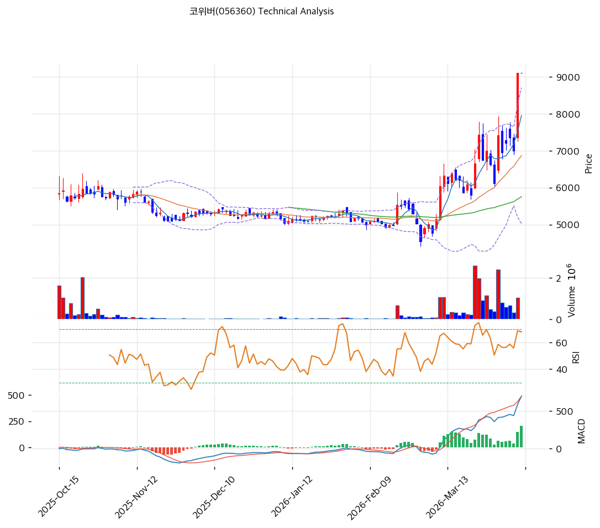

# 코위버(056360) 기술적 분석

2026-04-09 | T2 Technical Analysis

---

## 차트

---

## 1. 가격 현황

| 항목 | 값 |
|------|-----|
| 현재가 | 9,100원 (0.00%) |
| 52주 고가 | 9,100원 |
| 52주 저가 | 4,540원 |
| 52주 범위 위치 | 100.0% |
| 거래량 | 20일 평균 대비 0.0x |

---

## 2. 차트 패턴 분석

### 2.1 캔들스틱 패턴

| 패턴 | 위치 | 신뢰도 | 해석 |
|------|------|--------|------|
| 52주 신고가 도달 | 2026-04-09 현재가 | 강 | 상단 저항 부재 구간 진입. 매도 압력 불확실 — 추가 모멘텀 vs 단기 차익실현 교차 구간. |
| 상승 추세 지속 | 4,540원 저점 이후 | 강 | 저점 4,540원 대비 현재가 +100.4% 상승. 장기 추세선 유효. |

※ 일봉 차트 기준. 거래량 데이터(0.0x)로 인해 캔들 패턴 세부 판단 제한.

### 2.2 가격 구조 패턴

- **상승 추세 채널** (신뢰도: 강)
  52주 저점 4,540원에서 현재가 9,100원까지 약 100% 상승한 강한 상승 추세가 형성되어 있다. MA5(7,952원)·MA20(6,868원)·MA60(5,755원)·MA120(5,613원)·MA200(5,523원)의 완전 정배열이 추세의 견고함을 뒷받침한다. 현재가가 52주 고가에 위치하여 역사적 저항이 없는 구간이나, 볼린저밴드 상단(8,708원)을 상향 돌파한 상태로 단기 과열 가능성 존재.

- **볼린저밴드 상단 이탈** (신뢰도: 중)
  현재가(9,100원)가 볼린저밴드 상단(8,708원)을 상회하는 위치로, 통계적으로 상위 2σ 구간을 벗어난 상태다. 밴드 폭 53.6%로 이미 충분히 확장된 상태이므로 추가 밴드 확장보다는 중단(MA20, 6,868원)으로의 회귀 압력이 높아질 수 있다.

### 2.3 다이버전스

- **RSI 중립 구간 유지** (신뢰도: 중)
  RSI(14) = 69.4로 과매수 경계선(70) 직전에 위치. 가격이 52주 신고가를 기록 중임에도 RSI가 70을 하회하는 것은 모멘텀이 절정에 이르지 않았다는 점에서 **히든 강세** 가능성을 내포. 단, 추가 상승 시 RSI가 70 돌파하면 과매수권 진입 확인.

- **MACD 히스토그램 확대** (신뢰도: 강)
  MACD(696) > Signal(490), 히스토그램 +206으로 확대 중. 매수 모멘텀이 강화되고 있음을 확인. 다이버전스는 미관찰.

### 2.4 패턴 종합 판단

현재 차트는 강한 상승 추세 속에서 52주 고가에 위치한 강세 구조를 보이고 있다. MACD 히스토그램 확대와 완전 정배열이 추세 지속 가능성을 지지하는 반면, 볼린저밴드 상단 이탈과 스토캐스틱 과매수(K=86.1)는 단기 조정 리스크를 경고한다. 거래량 데이터가 0.0x로 집계되어 거래량 확인이 불가능한 점이 신뢰도 제약 요인이다.

---

## 3. 이동평균선 — 정배열 (강세)

| MA | 값 | 현재가 괴리율 | 위치 |
|----|-----|--------------|------|
| MA5 | 7,952원 | +14.4% | 위 |
| MA20 | 6,868원 | +32.5% | 위 |
| MA60 | 5,755원 | +58.1% | 위 |
| MA120 | 5,613원 | +62.1% | 위 |
| MA200 | 5,523원 | +64.8% | 위 |

**해석**: MA5~MA200 모두 현재가 아래에 위치한 완전 정배열 구조로 중장기 강세 추세가 확립되어 있다. 단, 현재가가 MA20 대비 +32.5%, MA200 대비 +64.8% 이격하는 극단적 과열 상태다. MA20(6,868원)이 1차 핵심 지지선이며, 조정 시 이 수준으로의 회귀 가능성이 높다.

---

## 4. 보조 지표

### RSI(14) — 69.4 (중립)

RSI 69.4는 과매수 경계선(70) 직전에 위치하며, 70 돌파 여부가 단기 추세 지속의 분기점이 될 것이다. 현재는 중립 구간으로 분류되나 상승 모멘텀이 강한 상태다.

### MACD(12,26,9)

| 항목 | 값 |
|------|-----|
| MACD | 696 |
| Signal | 490 |
| Histogram | +206 |
| 크로스 상태 | 매수 구간 (확대 중) |

**해석**: MACD > Signal로 매수 구간을 유지하며 히스토그램이 확대 중으로 매수 모멘텀이 가속화되고 있다.

### 볼린저밴드(20, 2σ)

| 항목 | 값 |
|------|-----|
| 상단 | 8,708원 |
| 중단 (MA20) | 6,868원 |
| 하단 | 5,027원 |
| 밴드 폭 | 53.6% |
| 현재 위치 | 상단 근접 (초과) |

**해석**: 현재가(9,100원)가 상단(8,708원)을 상회하는 상단 이탈 상태다. 밴드 폭 53.6%는 이미 충분히 확장된 수준으로, 추가 확장보다는 수축 국면 전환 가능성이 높다. 중단(MA20, 6,868원)으로의 회귀 압력을 감안한 리스크 관리가 필요하다.

### 스토캐스틱(14, 3, 3)

| 항목 | 값 |
|------|-----|
| Slow %K | 86.1 |
| Slow %D | 76.7 |
| 크로스 상태 | 골든크로스 |
| 판단 | 과매수 |

---

## 5. 지지/저항

| 구분 | 가격 | 근거 |
|------|------|------|
| 저항 | 9,100원 | 52주 고가 / 현재가 = 상단 저항 없는 구간 |
| 저항 | 8,708원 | 볼린저밴드 상단 (이미 돌파) |
| **현재가** | **9,100원** | — |
| 지지 | 7,952원 | MA5 |
| 지지 | 6,868원 | MA20 / 볼린저밴드 중단 |
| 지지 | 5,755원 | MA60 |
| 지지 | 5,027원 | 볼린저밴드 하단 |

---

## 6. 시그널 종합

| 지표 | 내용 | 시그널 |
|------|------|--------|
| **차트 패턴** | 완전 정배열·52주 고가, 볼린저밴드 상단 이탈 | 🟢 (추세) / 🔴 (단기 과열) |
| 이동평균선 | 정배열, MA20 +32.5% 이격 — 과열 | 🟢 |
| RSI | 69.4 — 과매수 경계 직전 | ⚪ |
| MACD | 매수구간, 히스토그램 +206 확대 중 | 🟢 |
| 볼린저밴드 | 상단 이탈, 밴드 폭 53.6% | ⚪ |
| 스토캐스틱 | 골든크로스 유지, K=86.1 과매수 | 🔴 |
| 거래량 | 0.0x — 데이터 미집계 | ⚪ |

**종합 판단**: 🟢 매수 2개 / 🔴 매도 2개 / ⚪ 중립 3개 → **중립 (단기 과열 경고)**

중장기 차트 구조는 강한 상승 추세 속 완전 정배열로 긍정적이다. 그러나 단기적으로는 볼린저밴드 상단 이탈, 스토캐스틱 과매수(K=86.1), MA20 대비 +32.5% 이격 등 복수의 과열 지표가 동시에 경고 신호를 보내고 있다. 52주 고가에 위치하여 새로운 저항선이 없다는 점은 긍정적이나, 단기 차익실현 매도 압력이 나타날 경우 MA20(6,868원) 수준까지의 조정이 기술적으로 자연스러운 흐름이다.

---

## 7. 전략 제안

### 보유 중인 경우
- **홀드 (단기 조정 대비 손절선 설정 권고)**
- 익절 라인: 추가 신고가 갱신 시 추적 매도 적용 (저항 없는 구간이므로 목표가 설정 어려움)
- 손절 라인: 7,952원 (MA5 하향 이탈 시) — 추세 약화 신호
- 리스크/리워드: 하방 7,952원(-12.6%) vs 상방 미확정

### 진입 대기인 경우
- **관망 (단기 과열로 신규 진입 비권고)**
- 1차 진입가: 7,952원 (MA5 지지 확인 후 반등 시)
- 2차 진입가: 6,868원 (MA20 / 볼린저밴드 중단 지지 확인 시)
- 진입 조건: 스토캐스틱 과매수 해소(K < 80) + 거래량 동반 지지 확인 후 재진입 검토
