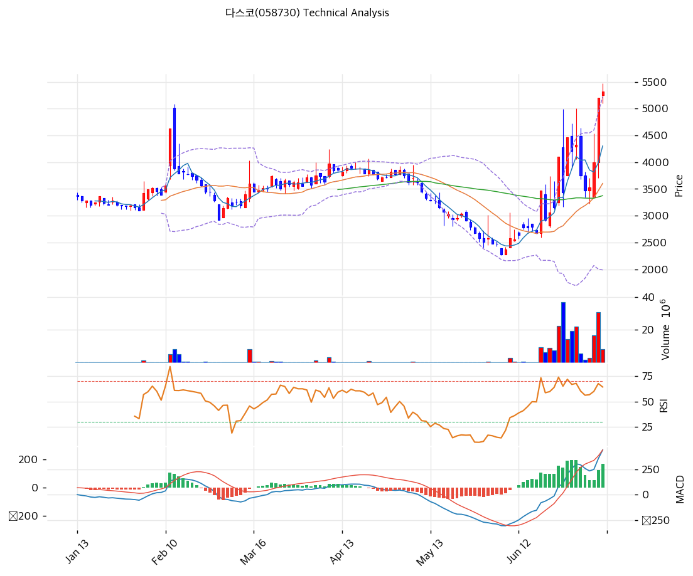

# 다스코(058730) 기술적 분석

2026-07-09 | T2 Technical Analysis

---

## 차트

---

## 1. 가격 현황

| 항목 | 값 |
|------|-----|
| 현재가 | 5,330원 (+2.50%) |
| 52주 고가 | 5,330원 |
| 52주 저가 | 2,275원 |
| 52주 범위 위치 | 100.0% |
| 거래량 | 20일 평균 대비 0.79x |

---

## 2. 차트 패턴 분석

### 2.1 캔들스틱 패턴

| 패턴 | 위치 | 신뢰도 | 해석 |
|------|------|--------|------|
| 유성형(장대음봉) 반전 | 2월 초 급등 스파이크 고점 | 강 | 단기 급등(고가 약 5,000원대) 직후 긴 위꼬리를 동반한 대형 음봉이 출현, 고점 매물 소화로 단기 천장을 형성 |
| 망치형 | 5월 하순 52주 저가(2,275원) 부근 | 중 | 하락 추세 막바지 긴 아래꼬리 캔들로 저가 매수세 유입 확인, 이후 바닥 다지기를 거쳐 반등 출발점이 됨 |
| 스피닝탑/도지성 캔들 | 최근 1거래일(현재 캔들) | 약 | 전일 장대양봉 상단에서 짧은 몸통과 위꼬리로 매수·매도 힘겨루기, 단기 숨고르기 가능성을 시사 |

※ 주요 캔들 패턴: 망치형, 역망치형, 장악형(상승/하락), 도지, 샛별/석별, 적삼병/흑삼병, 하라미, 유성형, 교수형 등

### 2.2 가격 구조 패턴

- **박스권 → 급등 스파이크 → 되돌림 조정** (신뢰도: 중)
  1월 중순\~2월 초 3,200\~3,450원 박스권 횡보 후 2월 초 단기 스파이크(고가 약 5,000원대)가 출현했으나 즉시 반락했다. 이후 3\~5월 약 3개월간 되돌림성 하락 조정(고점 3,975원 → 저점 2,275원)이 이어졌고, 스파이크 고점은 상당 기간 유효한 상단 저항으로 작용했다.

- **원형 바닥 / 단기 저점 다지기** (신뢰도: 중)
  5월 하순 2,275\~2,700원대에서 약 2주간 저점을 다지는 바닥권을 형성했다. 이 구간에서 RSI가 28선까지 진입하며 과매도 국면을 기록한 뒤 반등이 시작됐고, 바닥권 이탈과 함께 거래량이 급증하며 추세 전환 신호가 발생했다.

- **상승 돌파 랠리 / 밴드워킹** (신뢰도: 강)
  6월 중순 상승 추세선 저항(현재 환산가 5,158원)을 거래량 급증과 함께 상향 돌파, 약 3주 만에 저점 대비 +80%대 급등했다. 볼린저밴드가 스퀴즈 이후 급격히 확장되며(밴드 폭 89.8%) 주가가 상단 밴드를 웃도는 밴드워킹 구간에 진입한 상태다.

※ 주요 구조 패턴: 이중천정/바닥, 헤드앤숄더(정/역), 삼각수렴(대칭/상승/하락), 쐐기형(상승/하락), 깃발형, 페넌트, 컵앤핸들, 박스권 등

### 2.3 다이버전스

- **RSI 하락(약세) 다이버전스 조짐** (신뢰도: 약)
  주가는 최근 거래일 52주 신고가(5,330원)를 경신했으나 RSI는 6월 중순 고점(70선 근접) 대비 현재 68.5로 소폭 낮아진 상태다. 모멘텀 지표가 가격 상승 속도를 완전히 따라가지 못하는 초기 약세 다이버전스 조짐으로, 뚜렷한 반전 신호로 보기엔 이르나 단기 상승 탄력 둔화 가능성에 유의할 필요가 있다.

- **MACD — 뚜렷한 다이버전스 없음(가격·모멘텀 동행)** (신뢰도: —)
  MACD 히스토그램은 6월 초 저점 이후 지속 확대되고 있으며 현재까지도 확장세를 유지해 가격 상승과 궤를 같이하고 있다. 아직 모멘텀 약화 신호는 관찰되지 않는다.

※ RSI·MACD 기반 | 상승 다이버전스 = 가격↓ 지표↑ (반등 시사), 하락 다이버전스 = 가격↑ 지표↓ (하락 시사), 히든 다이버전스 = 기존 추세 지속 시사

### 2.4 패턴 종합 판단

캔들스틱·가격구조·다이버전스를 종합하면, 5월 저점(망치형) 이후 거래량을 동반한 강한 추세 전환 랠리가 진행 중이며 구조적으로는 여전히 강세가 우위다. 다만 최근 캔들이 스피닝탑 형태로 상단에서 힘겨루기 양상을 보이고 RSI에서 미약한 약세 다이버전스 조짐이 감지되는 만큼, 단기적으로는 5,130\~5,500원 구간에서 숨고르기 또는 얕은 조정이 나타날 가능성을 배제할 수 없다.

---

## 3. 이동평균선 — 비정배열 (강세)

| MA | 값 | 현재가 괴리율 | 위치 |
|----|-----|--------------|------|
| MA5 | 4,305원 | +23.8% | 위 |
| MA20 | 3,604원 | +47.9% | 위 |
| MA60 | 3,375원 | +57.9% | 위 |
| MA120 | 3,432원 | +55.3% | 위 |
| MA200 | 3,272원 | +62.9% | 위 |

**해석**: 현재가가 MA5~MA200 전 구간을 23.8%\~62.9%까지 상회하는 강한 단기 과열 국면이다. 다만 MA60(3,375원)이 MA120(3,432원)보다 낮게 위치하는 등 기간별로 완전한 정배열(단기>중기>장기) 순서를 이루지 못한 비정배열 상태인데, 이는 2월 스파이크와 3\~5월 급락이 60일 구간에 혼입된 결과로 해석된다. 모든 이동평균선이 현재가 대비 큰 폭 아래에 위치해 있어 단기 조정 시 MA5(4,305원)부터 순차적으로 지지력을 테스트할 가능성이 높다.

---

## 4. 보조 지표

### RSI(14) — 68.5 (중립)

과매수 기준선(70)에 근접했으나 아직 도달하지 않은 강세 중립 구간이다. 5월 말 저점(28선) 대비 큰 폭 반등해 상승 모멘텀은 여전히 유효하나, 추가 상승 여력은 점차 축소되는 국면으로 판단된다. 다이버전스 해석은 2.3 참조.

### MACD(12,26,9)

| 항목 | 값 |
|------|-----|
| MACD | 442.0 |
| Signal | 270.0 |
| Histogram | +172.0 |
| 크로스 상태 | 매수 구간 (확대 중) |

**해석**: 골든크로스 이후 매수 구간을 유지 중이며 히스토그램이 지속 확대되고 있어 단기 상승 모멘텀이 아직 살아있음을 시사한다. 다이버전스 해석은 2.3 참조.

### 볼린저밴드(20, 2σ)

| 항목 | 값 |
|------|-----|
| 상단 | 5,221원 |
| 중단 (MA20) | 3,604원 |
| 하단 | 1,987원 |
| 밴드 폭 | 89.8% |
| 현재 위치 | 상단 근접(이탈) |

**해석**: 현재가(5,330원)가 이미 상단 밴드(5,221원)를 소폭 상회한 밴드워킹 구간이다. 스퀴즈 이후 변동성이 급격히 확대(밴드 폭 89.8%)된 강한 추세 국면임을 보여주며, 밴드 상단 이탈은 추세 지속을 시사하는 동시에 단기 과열 리스크도 동반한다.

### 스토캐스틱(14, 3, 3)

| 항목 | 값 |
|------|-----|
| Slow %K | 84.4 |
| Slow %D | 65.0 |
| 크로스 상태 | 골든크로스 |
| 판단 | 과매수 |

---

## 5. 지지/저항 — 추세선 · 피보나치 · PRZ 통합

### 5.1 피보나치 되돌림/확장

| 구분 | 비율 | 가격 | 현재가 대비 |
|------|------|------|-----------|
| Swing High | — | 3,975원 | -25.4% |
| 되돌림 | 0.236 | 2,676원 | -49.8% |
| 되돌림 | 0.382 | 2,924원 | -45.1% |
| 되돌림 | 0.5 | 3,125원 | -41.4% |
| 되돌림 | 0.618 | 3,326원 | -37.6% |
| 되돌림 | 0.786 | 3,611원 | -32.3% |
| Swing Low | — | 2,275원 | -57.3% |
| 확장 | 1.272 | 1,813원 | -66.0% |
| 확장 | 1.382 | 1,626원 | -69.5% |
| 확장 | 1.618 | 1,224원 | -77.0% |
| 확장 | 2.0 | 575원 | -89.2% |

※ 피보나치 기준: 하락 추세 (Swing Low 2,275원 → Swing High 3,975원)
※ 되돌림 = 직전 추세에서 되돌아온 비율, 확장 = 추세 방향 목표가
※ 6월 이후 급등 랠리로 주가가 Swing High(3,975원)를 이미 25%가량 상회한 상태 — 위 되돌림/확장 구간은 현재가 대비 전부 하방에 위치해 단기 지지선이라기보다 장기 하방 안전마진 참고용으로 해석함

### 5.2 추세선

| 추세선 | 방향 | 현재 교차가 | 포인트 수 | 해석 |
|--------|------|-----------|---------|------|
| 지지선 | 하락 | 2,615원 | 6개 | 3\~5월 하락 국면의 저점들을 연결한 추세선. 현재가 대비 -51% 괴리돼 있어 실질적 지지력은 상실, 참고용 |
| 저항선 | 상승 | 5,158원 | 6개 | 6월 급등 초입 고점들을 연결한 저항선을 이미 상향 돌파. 이탈 이후 지지선으로 역할이 전환되는 리테스트 구간 |

### 5.3 PRZ (Potential Reversal Zone)

| 방향 | 가격 범위 | 신뢰도 | 근거 |
|------|---------|--------|------|
| 지지 | 5,130\~5,158원 | 약 | 피봇 S1, 추세선 저항(역할 전환) |

※ PRZ = 추세선 · 피보나치 · 피봇 · MA 등 복수 지표가 겹치는 가격 구간. 겹치는 소스가 많을수록 반전 확률 상승.

### 5.4 종합 지지/저항 테이블

| 구분 | 가격 | 근거 |
|------|------|------|
| 저항 | 5,670원 | 피봇 R2 |
| 저항 | 5,500원 | 피봇 R1 |
| **현재가** | **5,330원** | — |
| 지지 | 5,130원 | 피봇 S1 / PRZ 하단 |
| 지지 | 4,930원 | 피봇 S2 |
| 지지 | 3,604원 | MA20 |

---

## 6. 시그널 종합

| 지표 | 내용 | 시그널 |
|------|------|--------|
| **차트 패턴** | 5월 망치형 저점 이후 거래량 동반 돌파 랠리(구조상 강세) + 상단 스피닝탑·RSI 약세 다이버전스 조짐(단기 숨고르기 경계) | ⚪ |
| 이동평균선 | 비정배열, 전 구간 MA 대비 +23.8%~+62.9% 큰 폭 상회(단기 과열) | 🔴 |
| RSI | 68.5 — 중립(과매수 근접) | ⚪ |
| MACD | 매수구간, 히스토그램 확대 중 | 🟢 |
| 볼린저밴드 | 상단 밴드(5,221원) 이탈, 밴드 폭 89.8% | ⚪ |
| 스토캐스틱 | 골든크로스, K=84.4 — 과매수 | 🔴 |
| 거래량 | 0.79x — 약함 | ⚪ |

**종합 판단**: 🟢 매수 1개 / 🔴 매도 2개 / ⚪ 중립 4개 → **매도우위**

강한 추세 전환 랠리(MACD·거래량 급증)는 유효하나, 스토캐스틱 과매수와 이동평균선 대비 과도한 괴리(단기 과열)가 매도 우위 판정을 이끌었다. 중기 추세 자체는 살아있으나 단기적으로는 5,130\~5,500원 구간에서 눌림목 또는 숨고르기 가능성에 무게가 실린다.

---

## 7. 전략 제안

### 보유 중인 경우
- **비중축소**
- 익절 라인: 5,437원 (피봇 R1(5,500원) 인근 저항권 목표)
- 손절 라인: 4,930원 (피봇 S2)
- 리스크/리워드: 익절폭 +107원 대비 손절폭 -400원으로 약 1:0.27 — 비우호적인 손익비로, 신규 비중 확대보다는 일부 이익 실현이 합리적

### 진입 대기인 경우
- **관망**
- 1차 진입가: 5,130원 (피봇 S1 / PRZ 하단 지지 확인 시)
- 2차 진입가: 3,604원 (MA20까지 조정 시)
- 진입 조건: 1차는 5,130원 지지 확인 후 거래량 동반 여부를 보며 분할 진입, 2차는 MA20(3,604원)까지 밀릴 경우 추세 유효성을 재점검한 뒤 진입 검토
