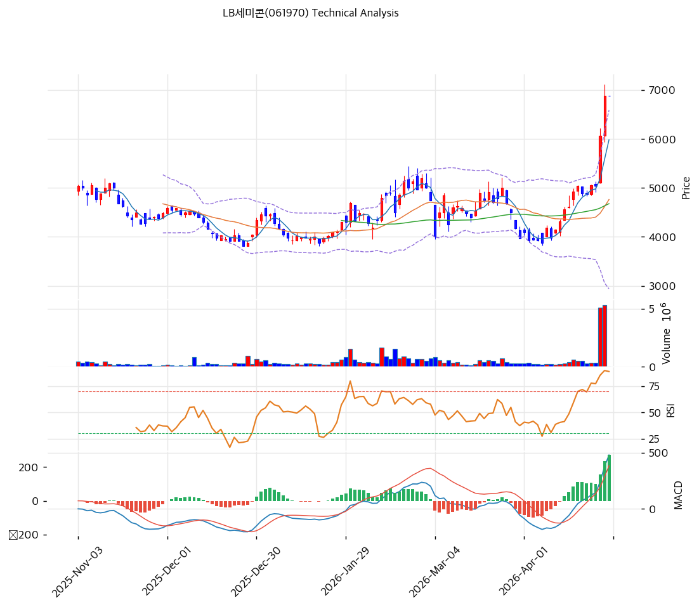

# LB세미콘(061970) 기술적 분석

2026-04-28 | T2 Technical Analysis

---

## 차트

---

## 1. 가격 현황

| 항목 | 값 |
|------|-----|
| 현재가 | 6,880원 (+0.00%) |
| 52주 고가 | 6,880원 |
| 52주 저가 | 3,135원 |
| 52주 범위 위치 | 100.0% (연고점) |
| 거래량 | 20일 평균 대비 데이터 미확인 |

---

## 2. 차트 패턴 분석

### 2.1 캔들스틱 패턴

| 패턴 | 위치 | 신뢰도 | 해석 |
|------|------|--------|------|
| 도지/스피닝톱 | 최근 1~3일 | 중 | 52주 고점 부근에서 매수·매도 균형 — 단기 방향 불확실, 상단 돌파 실패 시 되돌림 가능 |
| 장대양봉 연속 | 최근 2~4주 | 강 | 3,135원 저점 이후 강한 상승 추진력. 120일선(4,507원) 돌파 후 추세 가속 |
| 상단 저항 형성 | 6,880원 | 강 | 현재가 = 52주 고가 = 피봇 R1 = PRZ(강) 완전 일치 — 강력한 매도 구간 진입 |

※ 52주 고점(6,880원)에서 캔들이 꼬리를 달거나 거래량 감소 시 단기 천장 신호

### 2.2 가격 구조 패턴

- **상승 추세 채널 (신뢰도: 강)**
  3,135원(저점)에서 출발한 강한 상승 추세. 추세선 지지선 3,995원, 추세선 저항선 5,461원을 연달아 상향 돌파하며 현재 6,880원에 도달. 채널 상단 돌파 후 과매수 구간에 진입. 조정 시 1차 지지는 피보나치 0.236(6,167원), 2차 지지는 MA20(4,763원).

- **박스권 돌파 후 상단 저항 (신뢰도: 강)**
  6,880원 = 52주 고가 = 피봇 R1 = PRZ(강) 3중 일치 구간. 이 레벨에서 강한 매도 압력이 예상되며, 돌파 시 상방 확장(피보나치 1.272 확장: 8,219원) 가능하나 현재 지표 과열 수준에서는 확률이 낮다.

### 2.3 다이버전스

- **RSI 하락 다이버전스 (신뢰도: 중)**
  RSI 79.8로 과매수 구간에 진입. 만약 주가가 현재 레벨(6,880원)을 유지하거나 소폭 상승 시 RSI가 하락한다면 약세 다이버전스 형성 가능. 현재 고점 부근에서 RSI 80 돌파 실패 여부 모니터링 필요.

- **스토캐스틱 데드크로스 (신뢰도: 중)**
  K=92.9, D=93.7로 극단적 과매수 구간. %K가 %D 아래로 데드크로스 발생 — 단기 상승 에너지 소진 신호. 과거 동 수준에서 5~15% 단기 조정이 발생한 패턴 다수.

### 2.4 패턴 종합 판단

캔들스틱은 52주 고점 부근 소강 상태, 가격구조는 강한 상승 추세 유지이나 현재가가 PRZ(강) 저항 구간과 완전히 겹친다. 스토캐스틱 데드크로스와 RSI 과매수가 동시 발생 중으로, **단기 조정 압력이 구조적 상승 추세보다 우선**할 가능성이 높다. 거래량 수반 없이 6,880원 돌파가 어렵다면 단기 천장 가능성이 상존한다.

---

## 3. 이동평균선 — 정배열 (강세)

| MA | 값 | 현재가 괴리율 | 위치 |
|----|-----|--------------|------|
| MA5 | 5,984원 | +15.0% | 위 |
| MA20 | 4,763원 | +44.4% | 위 |
| MA60 | 4,678원 | +47.1% | 위 |
| MA120 | 4,507원 | +52.7% | 위 |
| MA200 | 4,445원 | +54.8% | 위 |

**해석**: 5개 이동평균선 모두 현재가 아래 — 완전 정배열 강세 구조. 그러나 MA20 괴리율 +44.4%, MA200 괴리율 +54.8%는 극단적 과열 수준이다. 역사적으로 이 정도 괴리율은 단기 평균회귀 압력이 강함을 시사. MA20(4,763원)까지 조정은 현재 대비 -30.8% 하락에 해당하므로, 단기 고점 형성 후 평균 회귀 시 낙폭이 상당할 수 있다.

---

## 4. 보조 지표

### RSI(14) — 79.8 (🔴과매수)

RSI 79.8은 과매수 기준선(70)을 크게 상회하며, 단기 상승 에너지가 소진 단계에 진입했음을 시사한다. 이 수준에서의 매수는 모멘텀 추종이지만 단기 되돌림 위험이 매우 높다.

### MACD(12,26,9)

| 항목 | 값 |
|------|-----|
| MACD | 480.0 |
| Signal | 209.0 |
| Histogram | +271.0 |
| 크로스 상태 | 매수 구간 (확대 중) |

**해석**: MACD는 매수 크로스 유지 중이며 히스토그램이 양수 확대 — 추세 자체는 상승. 그러나 MACD 상승폭이 가파를수록 이후 수렴 시 되돌림도 크다는 점 주의.

### 볼린저밴드(20, 2σ)

| 항목 | 값 |
|------|-----|
| 상단 | 6,588원 |
| 중단 (MA20) | 4,763원 |
| 하단 | 2,938원 |
| 밴드 폭 | 76.6% |
| 현재 위치 | 상단 초과 (밴드 상단: 6,588원 < 현재가: 6,880원) |

**해석**: 현재가(6,880원)가 볼린저밴드 상단(6,588원)을 +4.4% 초과 — 이른바 "밴드 워킹" 또는 단기 과열 돌파 구간. 밴드 폭 76.6%는 이미 충분히 확장된 상태로, 추가 확장보다 수렴(중단 복귀) 가능성이 높다.

### 스토캐스틱(14, 3, 3)

| 항목 | 값 |
|------|-----|
| Slow %K | 92.9 |
| Slow %D | 93.7 |
| 크로스 상태 | 데드크로스 |
| 판단 | 과매수 |

---

## 5. 지지/저항 — 추세선 · 피보나치 · PRZ 통합

### 5.1 피보나치 되돌림/확장

| 구분 | 비율 | 가격 | 현재가 대비 |
|------|------|------|-----------|
| Swing High | — | 6,880원 | — |
| 되돌림 | 0.236 | 6,167원 | -10.4% |
| 되돌림 | 0.382 | 5,577원 | -18.9% |
| 되돌림 | 0.5 | 5,100원 | -25.9% |
| 되돌림 | 0.618 | 4,623원 | -32.8% |
| 되돌림 | 0.786 | 3,945원 | -42.7% |
| Swing Low | — | 3,135원 | — |
| 확장 | 1.272 | 8,219원 | +19.5% |
| 확장 | 1.382 | 8,663원 | +25.9% |
| 확장 | 1.618 | — | — |
| 확장 | 2.0 | — | — |

※ 피보나치 기준: 상승 추세 (Swing Low 3,135원 → Swing High 6,880원)

### 5.2 추세선

| 추세선 | 방향 | 현재 교차가 | 포인트 수 | 해석 |
|--------|------|-----------|---------|------|
| 지지선 | 상승 | 3,995원 | 3개+ | 저점 연결 상승 지지선 — 현재 하방 3,995원 |
| 저항선 | 상승 | 5,461원 | 2개+ | 고점 연결 저항선 — 이미 상향 돌파 완료 |

### 5.3 PRZ (Potential Reversal Zone)

| 방향 | 가격 범위 | 신뢰도 | 근거 |
|------|---------|--------|------|
| 저항 | 6,880원 | 강 | 피봇 R1, 피봇 R2, 피봇 S1, 52주 고가 완전 일치 |
| 지지 | 5,461~5,577원 | 약 | 추세선 저항(돌파 후 지지 전환), 피보나치 0.382 |

### 5.4 종합 지지/저항 테이블

| 구분 | 가격 | 근거 |
|------|------|------|
| 저항 | 8,219원 | 피보나치 1.272 확장 |
| 저항 | 8,663원 | 피보나치 1.382 확장 |
| **현재가** | **6,880원** | — |
| 지지 (강) | 6,167원 | 피보나치 0.236 되돌림 |
| 지지 (중) | 5,577원 | 피보나치 0.382 + 추세선 PRZ |
| 지지 (강) | 4,763원 | MA20 |
| 지지 (강) | 4,678원 | MA60 |
| 지지 (중) | 4,507원 | MA120 |
| 지지 | 3,995원 | 추세선 지지선 |

---

## 6. 시그널 종합

| 지표 | 내용 | 시그널 |
|------|------|--------|
| **차트 패턴** | 52주 고점 PRZ 진입, 스토캐스틱 데드크로스, 과매수 구간 | 🔴 |
| 이동평균선 | 완전 정배열, MA20 괴리 +44.4% 극단적 과열 | ⚪ |
| RSI | 79.8 — 🔴과매수 | 🔴 |
| MACD | 매수 크로스 유지, 히스토그램 +271 확대 | 🟢 |
| 볼린저밴드 | 상단(6,588원) 초과 — 단기 과열 | 🔴 |
| 스토캐스틱 | K=92.9, D=93.7 데드크로스 — 과매수 | 🔴 |
| 거래량 | 데이터 미확인 | ⚪ |

**종합 판단**: 🟢 매수 1개 / 🔴 매도 4개 / ⚪ 중립 2개 → **매도우위**

52주 고점(6,880원)에서 RSI 과매수 + 스토캐스틱 데드크로스 + 볼린저밴드 상단 초과가 동시 발생 — 단기 조정 리스크가 매우 높다. MACD만 강세 신호를 유지하고 있으나, 이미 히스토그램이 극단적으로 확장된 상태라 향후 수렴 시 단기 하방 압력이 예상된다. 구조적 상승 추세는 유효하나, **현재 레벨은 신규 매수보다 차익 실현 구간**으로 판단된다.

---

## 7. 전략 제안

### 보유 중인 경우
- **비중축소 (단기 차익 실현)**
- 익절 라인: 6,880원 (현재가 = 52주 고가 = PRZ 저항)
- 손절 라인: 5,977원 (MA5 5,984원 하향 이탈 시, 약 -13%)
- 리스크/리워드: 상방 목표 8,219원(+19.5%) vs 하방 지지 6,167원(-10.4%) → 단기 R/R 1.9:1이나 지표 과열로 실현 가능성 낮음

### 진입 대기인 경우
- **관망 (현재 레벨 신규 매수 비추천)**
- 1차 진입가: 6,167원 (피보나치 0.236 되돌림, 단기 조정 후 반등 확인)
- 2차 진입가: 4,763원 (MA20, 중기 지지선)
- 진입 조건: RSI 60 이하 복귀 + 거래량 감소 후 재상승 신호 + CB 오버행 물량 소화 확인
