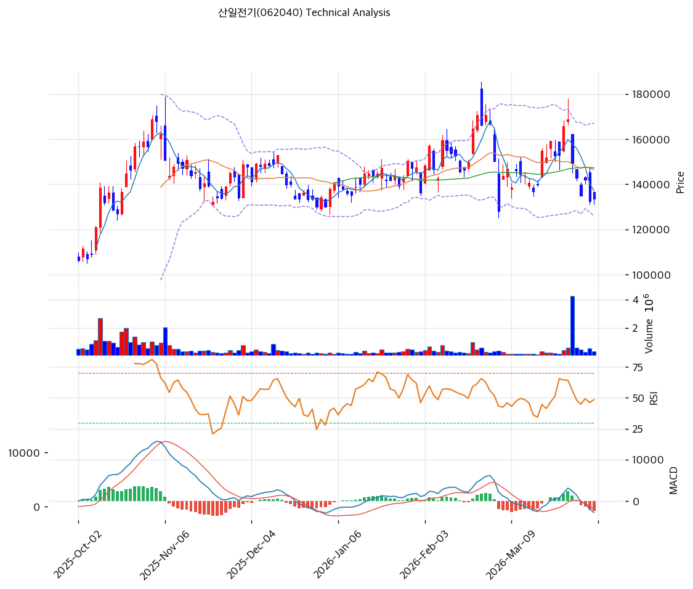

# 산일전기(062040) 기술적 분석

2026-04-05 | T2 Technical Analysis

---

## 차트

---

## 1. 가격 현황

| 항목 | 값 |
|------|-----|
| 현재가 | 133,600원 (+0.83%) |
| 52주 고가 | 170,700원 |
| 52주 저가 | 44,500원 |
| 52주 범위 위치 | 70.6% |
| 거래량 | 20일 평균 대비 0.73x |

---

## 2. 차트 패턴 분석

### 2.1 캔들스틱 패턴

| 패턴 | 위치 | 신뢰도 | 해석 |
|------|------|--------|------|
| 음봉 연속(3연음봉) | 최근 3~5일 | 중 | 매도 시그널 — 3월 말~4월 초 연속 음봉으로 하락 모멘텀 지속 중 |
| 망치형(Hammer) | 4/3 저점 부근 | 중 | 매수 시그널 — 131,000원 부근에서 긴 아래꼬리 형성, 하방 지지 시도 |
| 소형 양봉(Small White) | 4/3(직전일) | 약 | 중립 시그널 — 몸통이 짧은 양봉으로 매수·매도 세력 균형 상태, 추세 전환 확인 필요 |

※ 주요 캔들 패턴: 망치형, 역망치형, 장악형(상승/하락), 도지, 샛별/석별, 적삼병/흑삼병, 하라미, 유성형, 교수형 등

### 2.2 가격 구조 패턴

- **이중천정(Double Top)** (신뢰도: 강)
  2025년 10월 고점 ~170,000원과 2026년 2월 고점 ~185,000원에서 두 차례 고점을 형성한 후 하락 전환. 넥라인(약 140,000원)을 하향 돌파하며 이중천정 패턴이 완성됨. 이론적 목표가는 넥라인에서 고점까지 폭(약 40,000원)을 넥라인에서 차감한 100,000원 부근이나, MA200(127,672원) 지지가 우선 테스트 중.

- **하락 쐐기형(Falling Wedge) 초기** (신뢰도: 약)
  3월 중순 이후 고점과 저점이 모두 낮아지며 수렴하는 초기 형태가 관찰됨. 아직 완성되지 않았으나, 하락 쐐기형이 완성될 경우 반등 가능성을 시사. 거래량 감소와 함께 진행 중이어서 패턴 완성 여부 추가 관찰 필요.

※ 주요 구조 패턴: 이중천정/바닥, 헤드앤숄더(정/역), 삼각수렴(대칭/상승/하락), 쐐기형(상승/하락), 깃발형, 페넌트, 컵앤핸들, 박스권 등

### 2.3 다이버전스

- **RSI 하락 다이버전스** (신뢰도: 강)
  2025년 10월 고점(~170,000원)과 2026년 2월 고점(~185,000원)에서 가격은 더 높은 고점을 형성했으나, RSI는 유사하거나 오히려 낮은 수준을 기록. 전형적인 하락 다이버전스로, 이후 실제 급락이 발생하여 시그널이 유효했음을 확인.

- **MACD 하락 다이버전스** (신뢰도: 중)
  같은 구간에서 MACD 히스토그램 역시 2월 고점에서 10월 대비 약한 모멘텀을 보여 하락 다이버전스를 동반. 현재 MACD가 시그널선 하방에 위치하며 히스토그램 음전환이 확대되고 있어 하락 추세 지속을 시사.

※ RSI·MACD 기반 | 상승 다이버전스 = 가격↓ 지표↑ (반등 시사), 하락 다이버전스 = 가격↑ 지표↓ (하락 시사), 히든 다이버전스 = 기존 추세 지속 시사

### 2.4 패턴 종합 판단

이중천정 패턴이 완성되어 중기적 하락 압력이 우세하며, RSI·MACD 하락 다이버전스가 선행 확인된 이후 실제 급락이 발생하였다. 다만 131,000원 부근에서 망치형 캔들이 출현하고 스토캐스틱이 과매도 구간에 진입하면서 단기 기술적 반등 가능성은 존재한다. 그러나 거래량이 평균 이하로 줄어든 상태에서의 반등은 신뢰도가 낮으며, 추세 전환 확인을 위해 MA5(137,180원) 돌파 여부를 관찰해야 한다.

---

## 3. 이동평균선 — 비정배열 (약세)

| MA | 값 | 현재가 괴리율 | 위치 |
|----|-----|--------------|------|
| MA5 | 137,180원 | -2.6% | 아래 |
| MA20 | 146,510원 | -8.8% | 아래 |
| MA60 | 147,275원 | -9.3% | 아래 |
| MA120 | 143,909원 | -7.2% | 아래 |
| MA200 | 127,672원 | +4.6% | 위 |

**해석**: 현재가가 MA5/20/60/120을 모두 하회하는 전형적인 약세 구간에 놓여 있다. 유일하게 MA200(127,672원)만 상방에서 장기 지지선 역할을 하고 있으나, MA20(-8.8%)과 MA60(-9.3%)의 큰 괴리율은 단기적으로 과매도 상태를 시사한다. MA5~MA120이 수렴해 있어(137,000~147,000원 밴드) 이 구간을 재돌파할 경우 추세 반전 가능성이 있으나, 현 시점에서는 역배열 상태로 약세가 우세하다.

---

## 4. 보조 지표

### RSI(14) — 42.6 (중립)

RSI가 42.6으로 과매도(30 이하)에는 도달하지 않았으나 50선 하방에 위치하여 하락 모멘텀이 우세한 상태. 2월 고점 이후 지속적으로 하락 중이며, 30선 접근 시 기술적 반등 시도를 주시할 필요가 있다.

### MACD(12,26,9)

| 항목 | 값 |
|------|-----|
| MACD | -2,748 |
| Signal | -466 |
| Histogram | -2,282 |
| 크로스 상태 | 매도 구간 (확대 중) |

**해석**: MACD가 시그널선을 하향 돌파한 매도 구간에서 히스토그램이 음(-2,282)으로 확대되고 있어 하락 모멘텀이 강화되는 국면. 히스토그램 수축이 나타나기 전까지 추세 반전을 기대하기 어렵다.

### 볼린저밴드(20, 2σ)

| 항목 | 값 |
|------|-----|
| 상단 | 166,986원 |
| 중단 (MA20) | 146,510원 |
| 하단 | 126,034원 |
| 밴드 폭 | 28.0% |
| 현재 위치 | 중간 |

**해석**: 밴드 폭 28.0%로 비교적 넓은 상태를 유지하고 있어 변동성이 큰 구간. 현재가(133,600원)는 하단(126,034원)과 중단(146,510원) 사이의 하위권에 위치하여, 하단 이탈 시 추가 하락 가능성이 있으나 하단 부근 지지 반등도 가능한 영역이다.

### 스토캐스틱(14, 3, 3)

| 항목 | 값 |
|------|-----|
| Slow %K | 8.6 |
| Slow %D | 9.4 |
| 크로스 상태 | 데드크로스 |
| 판단 | 과매도 |

---

## 5. 지지/저항

| 구분 | 가격 | 근거 |
|------|------|------|
| 저항 | 170,700원 | 52주 고가 |
| 저항 | 146,510원 | MA20 / BB 중단 |
| 저항 | 139,733원 | 피봇 R2 |
| 저항 | 137,180원 | MA5 (단기 저항) |
| 저항 | 136,667원 | 피봇 R1 |
| **현재가** | **133,600원** | — |
| 지지 | 130,767원 | 피봇 S1 |
| 지지 | 127,933원 | 피봇 S2 |
| 지지 | 127,672원 | MA200 (장기 지지) |
| 지지 | 126,034원 | BB 하단 |

---

## 6. 시그널 종합

| 지표 | 내용 | 시그널 |
|------|------|--------|
| **차트 패턴** | 이중천정 완성 + RSI/MACD 하락 다이버전스 확인, 단기 망치형 출현 | 🔴 |
| 이동평균선 | 비정배열, MA20 -8.8% | ⚪ |
| RSI | 42.6 — 중립 | ⚪ |
| MACD | 매도구간, 히스토그램 확대 중 | 🔴 |
| 볼린저밴드 | 중간, 밴드 폭 28.0% | ⚪ |
| 스토캐스틱 | 데드크로스, K=8.6 과매도 | 🟢 |
| 거래량 | 0.73x — 약함 | ⚪ |

**종합 판단**: 🟢 매수 1개 / 🔴 매도 2개 / ⚪ 중립 4개 → **약세 우위(중립~매도)**

이중천정 패턴 완성과 MACD 매도 구간 확대가 중기 하락 추세를 지지하고 있으나, 스토캐스틱 과매도(K=8.6)와 MA200 지지 근접이 단기 기술적 반등 가능성을 열어두고 있다. 다만 거래량이 평균 이하(0.73x)인 상태에서의 반등은 추세 전환보다 데드캣 바운스에 그칠 가능성이 높다. MA5(137,180원) 회복 여부가 단기 방향성의 핵심 분기점이다.

---

## 7. 전략 제안

### 보유 중인 경우
- **비중축소**
- 익절 라인: 146,510원 (MA20 / BB 중단 — 기술적 반등 시 저항 구간)
- 손절 라인: 127,933원 (피봇 S2, MA200 하방 이탈 시 추가 하락 가능)
- 리스크/리워드: 1 : 2.3 (손절 5,667원 vs 익절 12,910원)

### 진입 대기인 경우
- **관망**
- 1차 진입가: 130,767원 (피봇 S1 — 지지 확인 후 반등 시 진입)
- 2차 진입가: 127,672원 (MA200 — 장기 지지선 테스트 후 반등 시 진입)
- 진입 조건: 스토캐스틱 골든크로스 전환 + 거래량 1.5x 이상 동반 반등, 또는 MA5(137,180원) 거래량 동반 돌파 시 추세 전환 확인 후 진입
