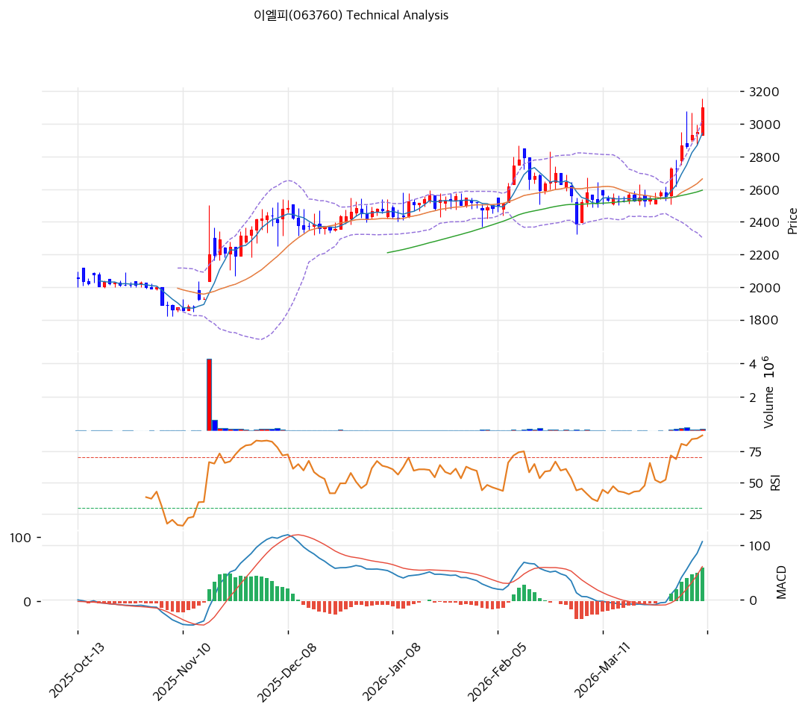

# 이엘피(063760) 기술적 분석

2026-04-07 | T2 Technical Analysis

---

## 차트

---

## 1. 가격 현황

| 항목 | 값 |
|------|-----|
| 현재가 | 3,100원 (+5.08%) |
| 52주 고가 | 3,100원 |
| 52주 저가 | 1,856원 |
| 52주 범위 위치 | 100.0% |
| 거래량 | 20일 평균 대비 2.70x |

---

## 2. 차트 패턴 분석

### 2.1 캔들스틱 패턴

| 패턴 | 위치 | 신뢰도 | 해석 |
|------|------|--------|------|
| 장대양봉 | 당일 (2026-04-07) | 강 | 전일 대비 +5.08% 급등, 거래량 2.7배 동반으로 강한 매수세 확인 — 단기 상승 모멘텀 시그널 |
| 상승 추세 캔들 연속 | 최근 5거래일 | 중 | MA5(2,943원) 위로 가격이 상승하며 단기 상승 기조 유지 |

※ 주요 캔들 패턴: 망치형, 역망치형, 장악형(상승/하락), 도지, 샛별/석별, 적삼병/흑삼병, 하라미, 유성형, 교수형 등

### 2.2 가격 구조 패턴

- **52주 신고가 돌파 시도** (신뢰도: 강)
  현재가 3,100원이 52주 고가(3,100원)에 동시 도달, 즉 신고가 터치 상황이다. 거래량 2.7배 동반 돌파는 매수 지속 의지를 반영하며, 3,193원(피봇 R1) 이상으로 종가 안착 시 추가 상승 가속 구간 진입 가능성이 높다. 다만 신고가 도달 후 반락하는 '이중 천정' 실패 패턴으로 전환될 리스크도 내포한다.

- **장기 상승 추세** (신뢰도: 강)
  52주 저가 1,856원 대비 현재가 3,100원으로 +67% 상승. 모든 이동평균선(MA5~MA200) 위에 주가가 위치하며 완전 정배열 상태로, 중기 상승 추세가 견고하다.

### 2.3 다이버전스

- **RSI 하락 다이버전스 주의** (신뢰도: 중)
  RSI 79.5로 과매수 영역에 진입. 주가가 신고가를 갱신하는 과정에서 RSI가 추가 상승 여력보다 과열 수준에 머물고 있어, 단기 조정 시 RSI-가격 간 하락 다이버전스 형성 가능성에 주목해야 한다.

- **MACD 상승 다이버전스 지속** (신뢰도: 강)
  MACD(107) > Signal(54), 히스토그램 +53으로 확대 중. 가격 상승과 MACD 모멘텀이 동반 강화되어 추세 지속 시사. 히스토그램이 수축으로 전환되는 시점이 모멘텀 피크 신호가 될 것이다.

### 2.4 패턴 종합 판단

52주 신고가 도달+거래량 급증+완전 정배열이라는 세 가지 강세 시그널이 동시에 확인된다. MACD 히스토그램 확대와 거래량 2.7배 동반은 상승 추세의 강도를 뒷받침한다. 다만 RSI 79.5의 과매수와 스토캐스틱 K=81.3이 이미 과매수권에 진입해 있어, 단기적으로 3,193원(피봇 R1) 저항 돌파 실패 시 피봇 S1(2,968원) 수준으로의 단기 되돌림 가능성을 배제할 수 없다. 중기 추세는 강세, 단기는 과열 주의 국면이다.

---

## 3. 이동평균선 — 정배열 (강세)

| MA | 값 | 현재가 괴리율 | 위치 |
|----|-----|--------------|------|
| MA5 | 2,943원 | +5.3% | 위 |
| MA20 | 2,663원 | +16.4% | 위 |
| MA60 | 2,594원 | +19.5% | 위 |
| MA120 | 2,402원 | +29.1% | 위 |
| MA200 | 2,277원 | +36.1% | 위 |

**해석**: MA5→MA20→MA60→MA120→MA200 순서로 완전 정배열 상태이며, 현재가가 모든 이동평균선 위에 위치한다. MA20 대비 +16.4% 괴리는 단기 과열을 시사하나, MA60(2,594원)과 MA120(2,402원)이 강력한 중기 지지선으로 작동 중이다. 단기 조정 시 MA20(2,663원)이 1차 지지선 역할을 할 가능성이 높다.

---

## 4. 보조 지표

### RSI(14) — 79.5 (🔴 과매수)

RSI 79.5로 과매수 기준선(70)을 명확히 상회하는 과열 구간에 진입했으며, 추가 상승 시 단기 피크 형성 및 되돌림 압력이 높아질 수 있다.

### MACD(12,26,9)

| 항목 | 값 |
|------|-----|
| MACD | 107.0 |
| Signal | 54.0 |
| Histogram | +53 |
| 크로스 상태 | 매수 구간 (확대 중) |

**해석**: MACD(107)가 Signal(54)을 상회하는 골든크로스 매수 구간이며, 히스토그램 +53으로 확대 중이어서 단기 상승 모멘텀이 지속되고 있다.

### 볼린저밴드(20, 2σ)

| 항목 | 값 |
|------|-----|
| 상단 | 3,024원 |
| 중단 (MA20) | 2,663원 |
| 하단 | 2,302원 |
| 밴드 폭 | 27.1% |
| 현재 위치 | 상단 근접 |

**해석**: 현재가 3,100원이 볼린저밴드 상단(3,024원)을 상향 이탈한 상태다. 밴드 폭 27.1%는 변동성이 이미 충분히 확대된 구간임을 나타내며, 추가 스퀴즈보다는 밴드 내 되돌림 가능성을 염두에 둬야 한다.

### 스토캐스틱(14, 3, 3)

| 항목 | 값 |
|------|-----|
| Slow %K | 81.3 |
| Slow %D | 75.5 |
| 크로스 상태 | 골든크로스 |
| 판단 | 과매수 |

---

## 5. 지지/저항

| 구분 | 가격 | 근거 |
|------|------|------|
| 저항 | 3,193원 | 피봇 R1 |
| 저항 | 3,287원 | 피봇 R2 |
| **현재가** | **3,100원** | — |
| 지지 | 2,968원 | 피봇 S1 |
| 지지 | 2,837원 | 피봇 S2 |
| 지지 | 2,663원 | MA20 |
| 지지 | 2,594원 | MA60 |

---

## 6. 시그널 종합

| 지표 | 내용 | 시그널 |
|------|------|--------|
| **차트 패턴** | 52주 신고가 + 정배열 + MACD 히스토그램 확대 | 🟢 |
| 이동평균선 | 완전 정배열, MA20 +16.4% | 🟢 |
| RSI | 79.5 — 과매수 | 🔴 |
| MACD | 매수 구간, 히스토그램 +53 확대 | 🟢 |
| 볼린저밴드 | 상단 이탈, 밴드 폭 27.1% | ⚪ |
| 스토캐스틱 | 골든크로스, K=81.3 과매수 | 🔴 |
| 거래량 | 2.70x — 강력 동반 | 🟢 |

**종합 판단**: 🟢 매수 4개 / 🔴 매도 2개 / ⚪ 중립 1개 → **매수우위**

이동평균 정배열+MACD 강세+거래량 급증이라는 세 가지 강세 지표가 동시에 확인되어 중기 추세는 매수 우위다. 다만 RSI 79.5·스토캐스틱 81.3 동반 과매수와 볼린저밴드 상단 이탈은 단기 과열을 경고한다. 52주 신고가 돌파 여부가 단기 방향성의 핵심 분기점으로, 3,100원 종가 안착 확인 후 피봇 R1(3,193원)까지의 추가 상승 여력이 있으나 피봇 S1(2,968원) 이탈 시 단기 조정 전환에 유의해야 한다.

---

## 7. 전략 제안

### 보유 중인 경우
- **홀드**
- 익절 라인: 3,193원 (피봇 R1 — 52주 신고가 이후 1차 저항)
- 손절 라인: 2,837원 (피봇 S2 — 정배열 하단 지지선)
- 리스크/리워드: +3.0% / -8.5% ≈ 1:2.8

### 진입 대기인 경우
- **관망 후 조건부 진입**
- 1차 진입가: 2,968원 (피봇 S1 — 과매수 조정 후 재진입 구간)
- 2차 진입가: 2,663원 (MA20 — 중기 추세선 지지 확인 진입)
- 진입 조건: 현재 RSI 과매수 상태로 즉각 추격매수는 부담. 피봇 S1(2,968원) 이하로 눌림목 조정 시, 거래량 감소를 동반한 지지 확인 후 진입 권장. 또는 3,193원(피봇 R1) 거래량 동반 돌파 확인 후 추격 진입도 고려 가능.
