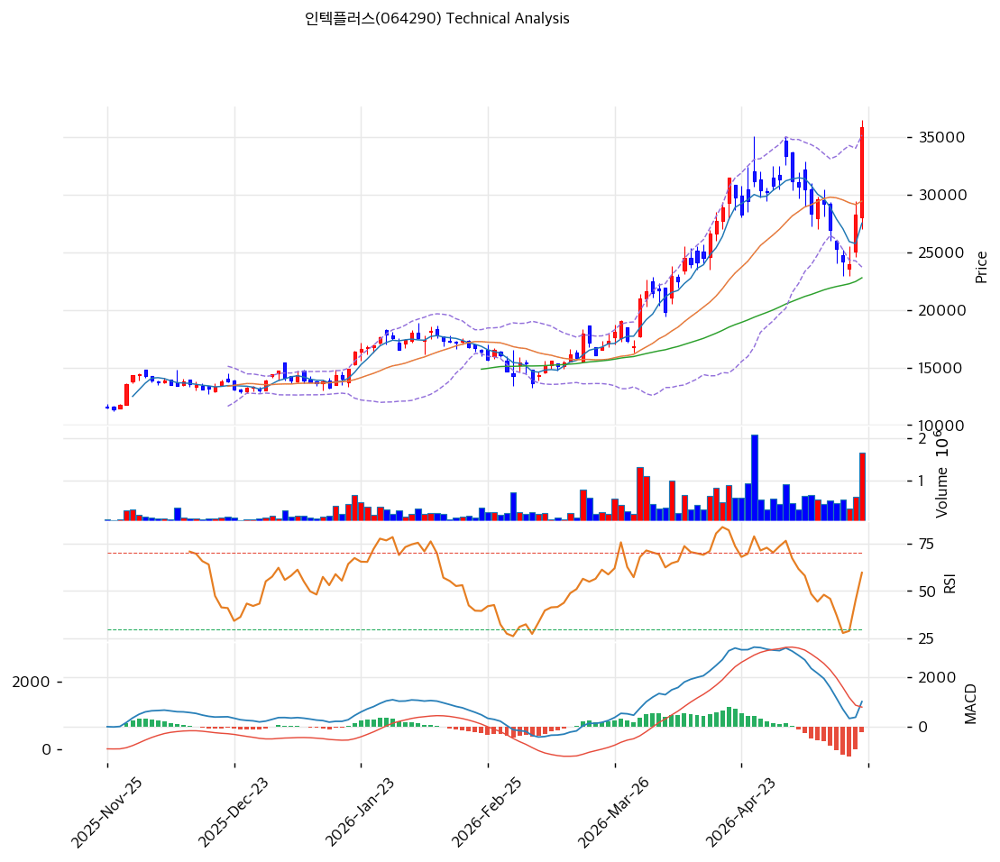

# 인텍플러스(064290) 기술적 분석

2026-05-24 | T2 Technical Analysis

---

## 차트

---

## 1. 가격 현황

| 항목 | 값 |
|------|-----|
| 현재가 | 35,850원 (+26.68%) |
| 52주 고가 | 36,500원 |
| 52주 저가 | 27,000원 |
| 52주 범위 위치 | 100.0% |
| 거래량 | 20일 평균 대비 2.69x |

---

## 2. 차트 패턴 분석

### 2.1 캔들스틱 패턴

| 패턴 | 위치 | 신뢰도 | 해석 |
|------|------|--------|------|
| 갭상승 장대양봉 | 당일 (2026-05-24) | 강 | 직전 종가 28,300원대 → 35,850원 +26.68% 점프, BB 상단 돌파 — 강력 매수 시그널이나 단기 과열 동반 |
| 단기 V자 반등 | 최근 5일 | 중 | 직전 저점 24,500원대(피보 0.382 부근)에서 5일만에 +46% 급반등 — 추세 복귀 신호 |
| 흑운형/장대음봉 군집 | 5월 초~중순 | 중 | 4월 말 고점(34,000원대) → 5월 중순 저점(24,500원대) 약 -28% 조정, 이후 반등으로 단기 바닥 확인 |

### 2.2 가격 구조 패턴

- **상승 추세 지속형 (Continuation Uptrend)** (신뢰도: 강)
  2025년 11월 ~ 2026년 4월까지 12,000원대 → 34,000원대까지 약 +180% 상승 추세 형성. MA200(16,742원) 위에 안정 안착 후 MA60(22,786원)도 상승 추세선 지지. 5월 조정은 정상 되돌림 범위(피보 0.236~0.382) 내에서 마감 후 신고가 돌파 — 추세 지속 시사.

- **단기 컵 패턴 (Cup Formation)** (신뢰도: 중)
  4월 고점 34,000원 → 5월 저점 24,500원 → 5월 24일 35,850원 신고가. U자형 회복으로 컵 형성 완성, 핸들(2~3일 횡보) 없이 즉시 돌파 — 강한 모멘텀이나 추격매수 리스크 상존. 컵 깊이 기준 측정치 약 45,000원대 목표 가능.

- **BB 상단 돌파 (Breakout)** (신뢰도: 중)
  BB 상단 35,180원을 종가 35,850원으로 돌파. 밴드 폭 38.9%로 이미 확장 상태에서 추가 이탈 — 단기 과열이며 BB 회귀 압력 누적.

### 2.3 다이버전스

- **MACD 하락 다이버전스** (신뢰도: 강)
  가격은 4월 고점(34,000원대) 대비 5월 24일 신고가(35,850원) 갱신했으나 MACD는 4월 대비 크게 하락(현재 1,017 vs 4월 피크 추정 2,000대) — 매도 크로스 상태(MACD 1,017 < Signal 1,245, 히스토그램 -228) 유지. 가격 상승 모멘텀이 지표상 약화되고 있음을 시사하는 전형적 하락 다이버전스.

- **RSI 하락 다이버전스** (신뢰도: 중)
  4월 고점 시 RSI 78~80 부근까지 도달했으나, 가격이 신고가를 갱신한 현재 RSI는 67.3에 머묾 — 모멘텀 약화 신호. 다만 현재 RSI는 중립권으로 즉각 조정보다는 추가 상승 여력 일부 잔존.

### 2.4 패턴 종합 판단

캔들 차트는 갭상승 장대양봉 + 컵 패턴 완성 + BB 상단 돌파로 **단기 강력 매수 모멘텀**을 보이지만, MACD 강 하락 다이버전스 + RSI 모멘텀 약화 + 거래량 2.69x 과열로 **추격매수 시 단기 조정 리스크 높음**. 상승 추세 자체는 유효하나 +26.68% 단일 캔들 점프 후 BB 회귀 수순 가능 — 현재가 매수보다 BB 중단(MA20 29,448원)/피봇 S1(29,733원) PRZ 복귀 시 분할 진입이 합리적.

---

## 3. 이동평균선 — 정배열 (강세 + 극단 과열)

| MA | 값 | 현재가 괴리율 | 위치 |
|----|-----|--------------|------|
| MA5 | 27,530원 | +30.2% | 위 |
| MA20 | 29,448원 | +21.7% | 위 |
| MA60 | 22,786원 | +57.3% | 위 |
| MA120 | 18,818원 | +90.5% | 위 |
| MA200 | 16,742원 | +114.1% | 위 |

**해석**: MA5 < MA20 < MA60 < MA120 < MA200 완전 정배열 — 중장기 상승 추세 견고. 그러나 MA20 대비 +21.7%, MA60 대비 +57.3%, MA200 대비 +114.1%로 모든 이평선과의 괴리율이 극단적 과열 구간 — 통계상 MA20 +20% 이상 괴리는 단기 평균 회귀 압력 강함. MA20(29,448원)이 1차 지지, MA60(22,786원)이 중기 지지선으로 작동 예상.

---

## 4. 보조 지표

### RSI(14) — 67.3 (중립)

70 과매수 임계치 아래 위치하나 +26.68% 급등 직후 수준치고는 낮음 — 4월 고점(80 부근) 대비 모멘텀 약화 다이버전스 동반. 추가 상승 시 70 진입 가능성 높고, 조정 시 50선(중립축) 빠르게 이탈 가능. 다이버전스 해석은 2.3 참조.

### MACD(12,26,9)

| 항목 | 값 |
|------|-----|
| MACD | 1,017 |
| Signal | 1,245 |
| Histogram | -228 |
| 크로스 상태 | 매도 구간 (수축 중) |

**해석**: 매도 크로스(MACD < Signal) 상태이나 히스토그램 음의 절대값 축소 중 — 골든크로스 임박 가능성 있음. 다만 가격 신고가 갱신 대비 MACD 절대 레벨이 4월 대비 절반 수준으로 강 하락 다이버전스 (2.3 참조).

### 볼린저밴드(20, 2σ)

| 항목 | 값 |
|------|-----|
| 상단 | 35,180원 |
| 중단 (MA20) | 29,448원 |
| 하단 | 23,715원 |
| 밴드 폭 | 38.9% |
| 현재 위치 | 상단 돌파 |

**해석**: 종가 35,850원이 BB 상단 35,180원을 돌파 — 통계상 ±2σ 외 영역으로 단기 평균 회귀 압력 강함. 밴드 폭 38.9%는 이미 강한 변동성 확장 상태로 추가 확장보다 스퀴즈/회귀 사이클 진입 가능성 높음.

### 스토캐스틱(14, 3, 3)

| 항목 | 값 |
|------|-----|
| Slow %K | 49.3 |
| Slow %D | 26.8 |
| 크로스 상태 | 골든크로스 |
| 판단 | 중립 |

---

## 5. 지지/저항 — 추세선 · 피보나치 · PRZ 통합

### 5.1 피보나치 되돌림/확장

| 구분 | 비율 | 가격 | 현재가 대비 |
|------|------|------|-----------|
| Swing High | — | 35,850원 | 0.0% |
| 되돌림 | 0.236 | 29,816원 | -16.8% |
| 되돌림 | 0.382 | 25,682원 | -28.4% |
| 되돌림 | 0.5 | 22,340원 | -37.7% |
| 되돌림 | 0.618 | 18,998원 | -47.0% |
| 되돌림 | 0.786 | 14,240원 | -60.3% |
| Swing Low | — | 8,270원 | -76.9% |
| 확장 | 1.272 | 44,203원 | +23.3% |
| 확장 | 1.382 | — | — |
| 확장 | 1.618 | — | — |
| 확장 | 2.0 | — | — |

※ 피보나치 기준: 상승 추세 (Swing Low 8,270원 → Swing High 35,850원, +333%)
※ 되돌림 = 직전 추세에서 되돌아온 비율, 확장 = 추세 방향 목표가

### 5.2 추세선

| 추세선 | 방향 | 현재 교차가 | 포인트 수 | 해석 |
|--------|------|-----------|---------|------|
| 지지선 | 상승 | 14,170원 | 4+ | 1년 상승 채널 하단, 현재가 대비 -60% — 장기 지지 |
| 저항선 | 상승 | 30,204원 | 3+ | 1년 상승 채널 상단, 이미 돌파 — 돌파 후 지지로 역할 전환 |

### 5.3 PRZ (Potential Reversal Zone)

| 방향 | 가격 범위 | 신뢰도 | 근거 |
|------|---------|--------|------|
| 지지 | 29,448~29,816원 | 강 | MA20 + 피봇 S1 + 피보나치 0.236 되돌림 3중 겹침 (PRZ 강) |
| 지지 | 22,786~23,715원 | 중 | MA60 + BB 하단 + 피봇 S2 |
| 저항 | 39,233~44,203원 | 중 | 피봇 R1 + 피보나치 1.272 확장 |

※ PRZ = 추세선 · 피보나치 · 피봇 · MA 등 복수 지표가 겹치는 가격 구간. 겹치는 소스가 많을수록 반전 확률 상승.

### 5.4 종합 지지/저항 테이블

| 구분 | 가격 | 근거 |
|------|------|------|
| 저항 | 44,203원 | 피보나치 1.272 확장 (중기 목표가) |
| 저항 | 39,233원 | 피봇 R1 (단기 저항) |
| **현재가** | **35,850원** | — |
| 지지 | 30,204원 | 추세선 저항(이전) → 돌파 후 지지 |
| 지지 | 29,800원 | **PRZ 강** (MA20 29,448 + 피봇 S1 29,733 + 피보 0.236 29,816) |
| 지지 | 25,682원 | 피보나치 0.382 되돌림 (5월 저점 부근) |
| 지지 | 22,786원 | MA60 + 피봇 S2 23,617 (중기 지지) |

---

## 6. 시그널 종합

| 지표 | 내용 | 시그널 |
|------|------|--------|
| **차트 패턴** | 갭상승 장대양봉 + 컵 돌파 vs MACD/RSI 하락 다이버전스 + BB 상단 이탈 — 강한 모멘텀이나 단기 과열 | ⚪ |
| 이동평균선 | 완전 정배열 (MA200 +114%) — 추세 강세이나 극단 괴리 | 🟢 |
| RSI | 67.3 중립 — 신고가 대비 모멘텀 약화 다이버전스 | ⚪ |
| MACD | 매도 크로스 (-228) — 히스토그램 수축으로 골크 임박 가능 | 🔴 |
| 볼린저밴드 | 상단 35,180원 돌파 — 평균 회귀 압력 강함 | 🔴 |
| 스토캐스틱 | %K 49.3 / %D 26.8 골든크로스 중립권 | 🟢 |
| 거래량 | 2.69x — 강력 동반 (기관 +1.22M 매집) | 🟢 |

**종합 판단**: 🟢 매수 3개 / 🔴 매도 2개 / ⚪ 중립 2개 → **약매수우위 (단기 과열 동반)**

추세 강도와 거래량은 상승을 지지하나, BB 이탈 + MACD 다이버전스 + MA 괴리 극단으로 **단기 BB 회귀/평균 회귀 압력**이 누적. 신고가 추격매수는 R:R 비대칭으로 비권장 — 차트 패턴 시사대로 PRZ 강(29,800원) 복귀 시 분할 진입이 단기 1~2주 관점에서 합리적. 중장기 추세는 +114% MA200 괴리에도 정배열 유지로 컵 패턴 측정치 45,000원대까지 여력 유효.

---

## 7. 전략 제안

### 보유 중인 경우
- **홀드 (일부 비중축소 가능)**
- 익절 라인: 39,200원 (피봇 R1) / 44,200원 (피보 1.272 확장)
- 손절 라인: 29,400원 (PRZ 강 이탈 시 MA20 붕괴)
- 리스크/리워드: 익절 +9.3% / 손절 -18.0% → **R:R 0.52** (불리) — 일부 차익실현 + 잔여 보유 추천

### 진입 대기인 경우
- **관망 (추격매수 비권장)**
- 1차 진입가: 29,800원 (PRZ 강 — MA20 + 피봇 S1 + 피보 0.236 3중 겹침)
- 2차 진입가: 25,700원 (피보 0.382 되돌림 + 5월 저점 부근)
- 진입 조건: BB 회귀 후 양봉 마감 + 거래량 평균 이상 동반 시 1차 진입, MACD 골든크로스 확인 후 비중 확대
