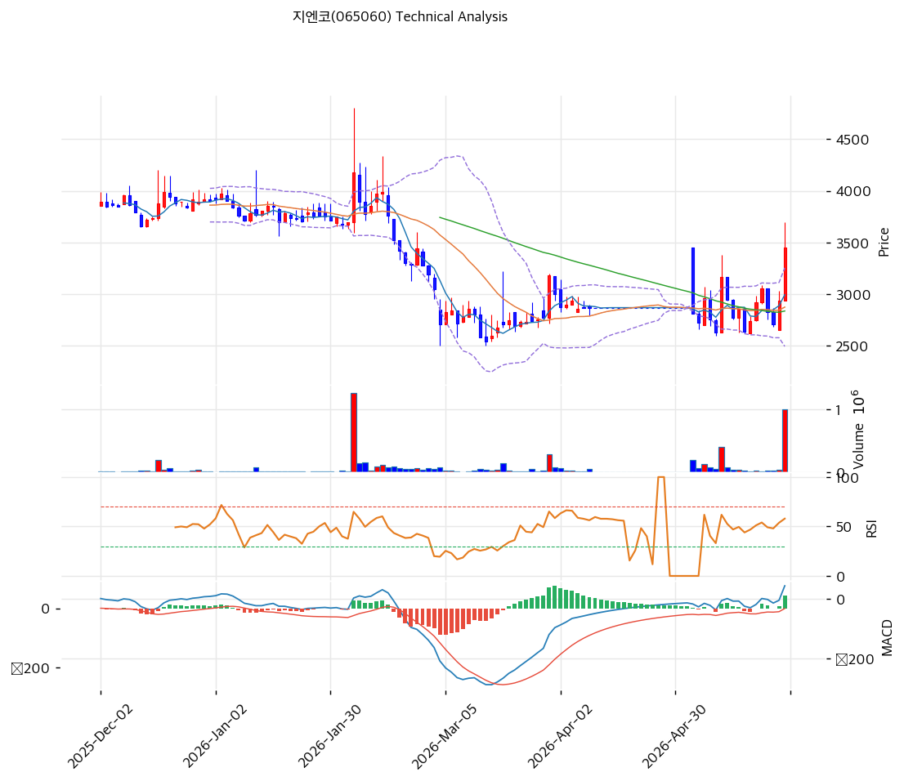

# 지엔코(065060) 기술적 분석 보고서

---

## 가격 위치

현재가 **3,450원** (+17.55%) — 52주 위치 **11.9%** (고가 10,125 / 저가 2,545). 52주 고가 대비 **-66% 하락** 상태에서 오늘 반등. **거래량 16.49배 폭증** — 크레오에스지(큐로그룹)와 동반 테마 급등. 외국인 -7,690 + 기관 -17,609 매도(개인 주도). 펀더멘털 무관 투기적 반등.

## 이동평균선 / 모멘텀

MA5 2,995 / MA20 2,875 / MA60 2,838 / MA120 3,290 / MA200 3,662 — 현재가가 단기 MA(5/20/60) 위(+15\~22%), 장기 MA(120/200)는 MA60 위 = **하락 후 단기 반등 구조**. MA200(3,662)이 현재가 위(-5.8%) = 장기 하락 추세 미회복.

**RSI 63.0 (중립)** — 반등으로 중립. MACD 42 / 시그널 -1 / 히스토 43 = **매수 시그널 + 확장** (단기 반등). 스토캐 K=44.6 / D=34.5 골든크로스 중립. **거래량 16.49배 폭증** = 투기적 급등 + BB 상단 근접.

## 시그널 종합 / S&R

매수 2 / 매도 0 / 중립 4 → **매수우위(약)**. 단기 반등이나 장기 하락 추세 미회복.

- 저항: **3,562원(추세선 저항)** / 3,788원(피봇 R1) / 4,860원(피보 0.236) / 10,125원(52주 고가, 멀음)
- 지지: **3,023원(PRZ 약: MA5·피봇 S1)** / 2,875원(MA20) / 2,856원(PRZ 약: MA20·MA60) / 2,597원(피봇 S2)
- 급락 지지: 2,545원(52주 저가) / 2,249원(추세선)

전략: **추격 매수 강력 비추 — TP 10,328원(과대) / SL 2,597원**. WAIT(관망) e1=3,023원 / e2=2,875원. 거래량 16배 + 동반 테마 급등은 **투기적 반등** — 펀더멘털(만성 적자 + CB 49% 희석) 무관. 52주 -66% 하락 후 데드캣 바운스 가능성. **신규 진입 강력 비추**, MA20 2,875원 이탈 시 급락. CB 49% 희석 + 유증 6건 구조적 하방.
