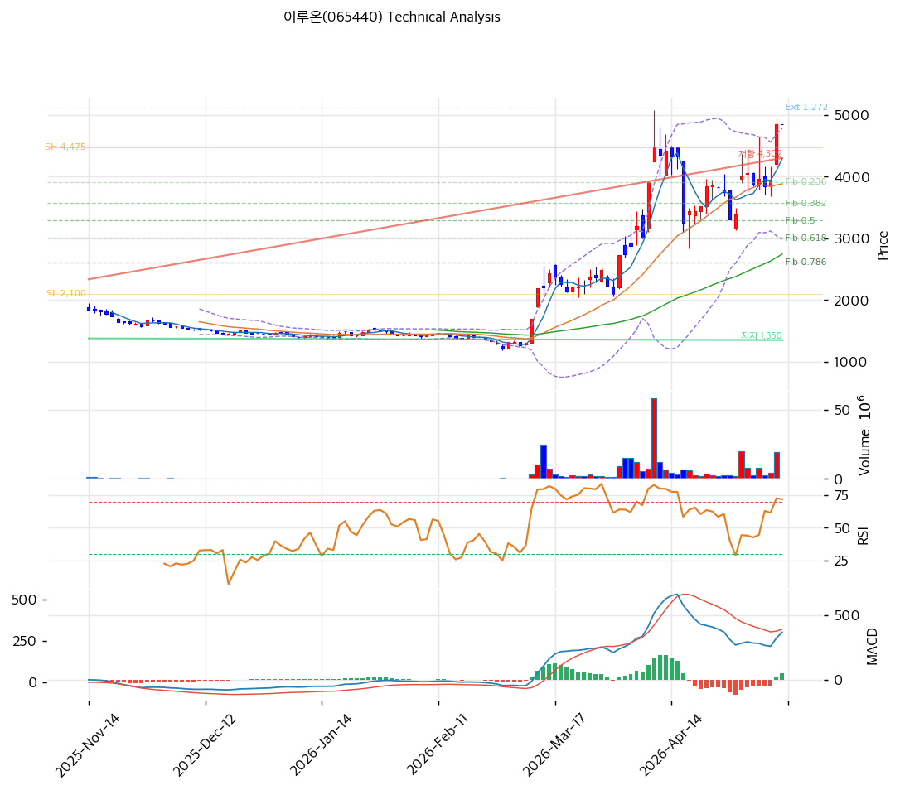

# 기술적분석

2026-05-13 | T2 Technical Analysis

***

## 차트

***

## 1. 가격 현황

| 항목        | 값                |
| --------- | ---------------- |
| 현재가       | 4,845원 (0.0%)    |
| 52주 고가    | 4,845원 (당일 갱신)   |
| 52주 저가    | 1,207원 (4.0배 상승) |
| 52주 범위 위치 | 100.0%           |
| 거래량       | 차트상 폭증 동반        |

***

## 2. 차트 패턴 분석

### 2.1 캔들스틱 패턴

| 패턴          | 위치       | 신뢰도 | 해석                           |
| ----------- | -------- | --- | ---------------------------- |
| 장기 박스 상향 가속 | 3월 중순 이후 | 강   | 1,400원 박스 → 4,845원 +246% 폭증  |
| 거래량 동반 양봉   | 3\~5월    | 강   | 박스 돌파 시 거래량 폭증               |
| 단기 횡보 정상화   | 5월 초     | 중   | 3,500\~4,500원 박스 형성 후 신고가 갱신 |

### 2.2 가격 구조 패턴

* **장기 박스권 상향 돌파 후 가속 + 횡보 후 재돌파** (신뢰도: 강) 2025-11~~2026-02 약 1,200~~1,800원 박스 → 3월 거래량 동반 +200% 가속. 4월 중순 4,475원 1차 고점 → 단기 조정 → 5월 신고가 4,845원 갱신. 박스 측정 타깃 충족 후 추가 모멘텀.

### 2.3 다이버전스

* **RSI 다이버전스 미관찰** — RSI 69.4 중립
* **MACD 매수 유지** — MACD 369 > Signal 320, 히스토그램 +49 약한 확대

### 2.4 패턴 종합 판단

신고가 갱신 + 거래량 동반 + MACD 매수 정렬. 다만 **MA20 +24.7% 과열 신호** 동반. RSI 69.4는 중립이나 70 임계 근접.

***

## 3. 이동평균선 — 정배열 (강세, 일부 과열)

| MA    | 값      | 현재가 괴리율    |
| ----- | ------ | ---------- |
| MA5   | 4,291원 | +12.9%     |
| MA20  | 3,884원 | **+24.7%** |
| MA60  | 2,745원 | +76.5%     |
| MA120 | 2,132원 | +127.3%    |
| MA200 | 1,951원 | +148.4%    |

**해석**: 정배열, MA200 +148.4% 누적 상승 — 6개월 +246% 폭등 영향. MA20 +24.7%는 임계(+20%) 초과. 평균회귀 1차 MA5(4,291원, -11.4%), 2차 MA20(3,884원, -19.8%).

***

## 4. 보조 지표

### RSI(14) — 69.4 (중립, 70 임계 근접)

70 미만 중립이나 단기 매수 부담.

### MACD(12,26,9)

| 항목        | 값          |
| --------- | ---------- |
| MACD      | 369        |
| Signal    | 320        |
| Histogram | +49        |
| 크로스       | 매수 (약한 확대) |

매수 유지, 추세 가속 둔화.

### 볼린저밴드

| 항목   | 값           |
| ---- | ----------- |
| 상단   | 4,783원      |
| 중단   | 3,884원      |
| 하단   | 2,985원      |
| 밴드 폭 | 46.3% (확장)  |
| 위치   | 상단 +1.3% 이탈 |

상단 이탈 + 밴드폭 확장 — 평균회귀 압력.

### 스토캐스틱

| 항목  | 값       |
| --- | ------- |
| %K  | 80.9    |
| %D  | 68.8    |
| 크로스 | 골든크로스   |
| 판단  | **과매수** |

K 80+ 과매수, 단기 매도 시그널.

***

## 5. 지지/저항

| 구분      | 가격         | 근거              |
| ------- | ---------- | --------------- |
| 저항      | 5,121원     | 피보 1.272 확장     |
| 저항      | 5,382원     | 피보 1.382 확장     |
| **현재가** | **4,845원** | 52주 신고가         |
| 지지      | 4,475원     | 직전 1차 고가        |
| 지지      | 4,291원     | MA5             |
| 지지      | 3,914원     | 피보 0.236 되돌림    |
| 지지      | 3,884원     | MA20 (1차 매수 영역) |
| 지지      | 3,568원     | 피보 0.382        |
| 지지      | 3,288원     | 피보 0.5          |

***

## 6. 시그널 종합

| 지표        | 내용                | 시그널               |
| --------- | ----------------- | ----------------- |
| **차트 패턴** | 신고가 + 박스 돌파 가속    | 🟢 (추세) / 🔴 (과열) |
| 이동평균선     | 정배열, MA20 +24.7%  | 🟢 (추세) / 🔴 (과열) |
| RSI       | 69.4 — 중립 (70 근접) | ⚪                 |
| MACD      | 매수, 히스토그램 확대      | 🟢                |
| 볼린저밴드     | 상단 이탈, 폭 46.3%    | ⚪                 |
| 스토캐스틱     | K=80.9 과매수        | 🔴                |
| 거래량       | 차트 폭증 동반          | ⚪                 |

**종합 판단**: 🟢 매수 2 / 🔴 매도 2 / ⚪ 중립 3 → **중립 (과열 일부 동반)**

추세는 강하나 단기 과열 신호. **신규 진입은 평균회귀 후 권장**.

***

## 7. 전략 제안

### 보유 중인 경우

* **홀드 / 부분 차익실현**
* 익절 라인: 4,942원 (피봇 R1 직전)
* 손절 라인: 3,884원 (MA20 이탈, -19.8%)
* 리스크/리워드: 0.05 (매우 불리) → 분할 익절

### 진입 대기인 경우

* **관망 → 평균회귀 후 분할 진입**
* 1차 진입가: 3,914원 (피보 0.236, -19.2%)
* 2차 진입가: 3,288원 (피보 0.5, -32.1%)
* 진입 조건: RSI 50대 + MA20 평균회귀 + 양봉 반등
* **펀더멘털 (5G 특화망·AI 통신·CB/BW 0건) 양호** — 조정은 매수 기회
