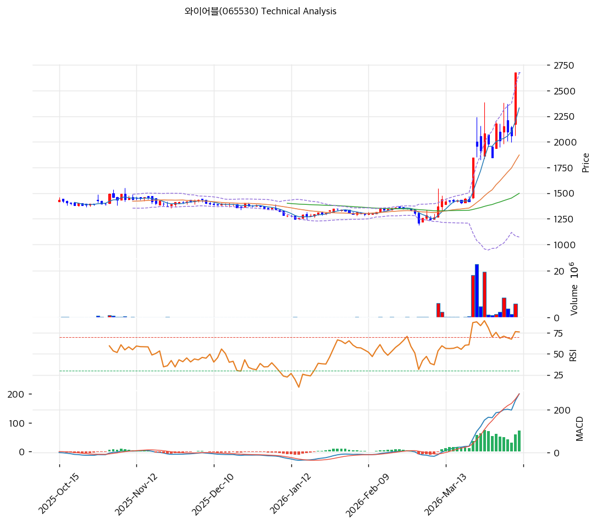

# 와이어블(065530) 기술적 분석

2026-04-09 | T2 Technical Analysis

---

## 차트

---

## 1. 가격 현황

| 항목 | 값 |
|------|-----|
| 현재가 | 2,675원 (0.0%) |
| 52주 고가 | 2,675원 |
| 52주 저가 | 1,176원 |
| 52주 범위 위치 | 100.0% |
| 거래량 | 20일 평균 대비 0.0x (데이터 미수집) |

---

## 2. 차트 패턴 분석

### 2.1 캔들스틱 패턴

| 패턴 | 위치 | 신뢰도 | 해석 |
|------|------|--------|------|
| 52주 신고가 도달 | 최근 (2026-04-09) | 강 | 강세 모멘텀 지속 확인. 신고가 경신 자체가 추세 지속 시그널이나 상단 저항 부재 구간 진입으로 차익 실현 물량 경계 필요 |
| 과매수 구간 진입 | 현재 | 중 | RSI 76, 스토캐스틱 K=88.9로 단기 과매수 상태. 도지·음봉 출현 시 단기 조정 신호로 해석해야 함 |

※ 주요 캔들 패턴: 현재가가 52주 신고가와 동일(2,675원)로 직전 고가 돌파 여부 추가 확인 필요

### 2.2 가격 구조 패턴

- **강력한 상승 추세 (신뢰도: 강)**
  52주 저점 1,176원에서 현재가 2,675원까지 약 127% 상승. MA5(2,332원)·MA20(1,873원)·MA60(1,499원)·MA120(1,450원)·MA200(1,405원)이 모두 현재가 아래에 위치하는 완전 정배열 구조다. 현재가가 MA20 대비 +42.8%, MA200 대비 +90.4% 괴리로 과열 영역이지만 추세 자체는 훼손되지 않았다. 의미 있는 지지선은 MA20(1,873원)과 MA60(1,499원)으로, 단기 조정 시 첫 번째 되돌림 목표대는 MA20 부근이다.

- **52주 신고가 돌파 (신뢰도: 중)**
  현재가 2,675원이 곧 52주 고가로, 과거 저항대 부재 구간에 진입했음을 의미한다. 피봇 포인트(R1, R2)가 모두 2,675원으로 수렴되어 있어 전통적 피봇 분석의 참고 가치가 제한적이다. 신고가 돌파 이후 실질 저항은 심리적 라운드 넘버(3,000원, 3,500원 상한가 2배 기준)에서 형성될 가능성이 높다.

### 2.3 다이버전스

- **RSI 하락 다이버전스 경계 (신뢰도: 중)**
  RSI 76으로 과매수 영역에 진입해 있다. 가격이 추가 신고가를 경신하는 과정에서 RSI가 76을 하회하며 동반하지 못할 경우 하락 다이버전스가 형성되며 단기 조정 위험이 높아진다. 현 시점에서 다이버전스가 확정된 것은 아니나 모니터링이 필요한 구간이다.

- **MACD 히스토그램 확대 (신뢰도: 강)**
  MACD(273)가 Signal(200)을 상회하며 히스토그램(+73)이 확대 중이다. 이는 상승 추세의 가속을 시사하는 강세 신호로, 히든 상승 다이버전스와 유사한 의미를 갖는다. 히스토그램이 수축(양수→축소)으로 전환되는 시점이 단기 매도 시그널이 될 것이다.

### 2.4 패턴 종합 판단

완전 정배열 + 52주 신고가라는 강세 구조가 유지되고 있으나, RSI 76·스토캐스틱 K=88.9로 단기 과매수 상태다. MACD 히스토그램 확대가 추세 가속을 뒷받침하지만, 볼린저밴드 상단(2,673원)과 현재가(2,675원)가 거의 일치해 상단 밴드 이탈 직전 구간에 위치한다. 추세 추종 입장에서는 매수 신호가 유효하나, 단기 차익 실현 압력과 과매수 조정 가능성을 동시에 염두에 두어야 하는 양면적 구간이다.

---

## 3. 이동평균선 — 정배열 (강세)

| MA | 값 | 현재가 괴리율 | 위치 |
|----|-----|--------------|------|
| MA5 | 2,332원 | +14.7% | 위 |
| MA20 | 1,873원 | +42.8% | 위 |
| MA60 | 1,499원 | +78.5% | 위 |
| MA120 | 1,450원 | +84.5% | 위 |
| MA200 | 1,405원 | +90.4% | 위 |

**해석**: 5·20·60·120·200일 이동평균선 전체가 현재가 아래에 위치하는 완전 정배열 상태로, 단·중·장기 모든 추세가 상승 방향이다. 현재가와 MA20의 괴리율 +42.8%, MA200과의 괴리율 +90.4%는 역사적으로 단기 과열 수준에 해당하며, 추세는 유효하나 신규 매수 시 진입 타이밍에 주의가 필요하다. MA20(1,873원)이 첫 번째 지지선, MA60(1,499원)이 중기 지지선 역할을 할 것이다.

---

## 4. 보조 지표

### RSI(14) — 76.0 (🔴 과매수)

RSI 76으로 과매수 기준선(70)을 상회 중이다. 단기 모멘텀이 강하나 과매수 구간에서의 추가 상승은 지속성이 제한적이며, RSI가 70선 아래로 하락 전환될 경우 단기 조정 신호로 해석할 수 있다.

### MACD(12,26,9)

| 항목 | 값 |
|------|-----|
| MACD | 273 |
| Signal | 200 |
| Histogram | +73 |
| 크로스 상태 | 매수 구간 (히스토그램 확대 중) |

**해석**: MACD가 Signal을 상회하는 매수 구간이며, 히스토그램이 +73으로 확대 중이어서 상승 모멘텀이 강화되고 있다. 히스토그램이 축소 전환되는 시점을 단기 매도 경계로 설정할 수 있다.

### 볼린저밴드(20, 2σ)

| 항목 | 값 |
|------|-----|
| 상단 | 2,673원 |
| 중단 (MA20) | 1,873원 |
| 하단 | 1,072원 |
| 밴드 폭 | 85.5% |
| 현재 위치 | 상단 근접 |

**해석**: 밴드 폭 85.5%로 밴드가 매우 넓게 확장된 상태다. 현재가(2,675원)가 상단(2,673원)에 거의 밀착되어 있어, 상단 이탈 후 복귀하는 'W-bottom 상단 돌파' 패턴인지 아니면 상단 저항 후 되돌림인지를 추후 확인해야 한다. 밴드 폭이 이미 충분히 확장된 만큼 추가 확장보다는 수렴 가능성에 무게를 둔다.

### 스토캐스틱(14, 3, 3)

| 항목 | 값 |
|------|-----|
| Slow %K | 88.9 |
| Slow %D | 79.7 |
| 크로스 상태 | 골든크로스 |
| 판단 | 과매수 |

---

## 5. 지지/저항

| 구분 | 가격 | 근거 |
|------|------|------|
| 저항 | 3,000원 | 심리적 라운드 넘버 (신고가 이후 오버행 부재 구간) |
| 저항 | 2,675원 | 현재가 = 52주 신고가, 피봇 R1/R2 수렴 |
| **현재가** | **2,675원** | — |
| 지지 | 2,332원 | MA5 |
| 지지 | 1,873원 | MA20 (볼린저 중단) |
| 지지 | 1,499원 | MA60 |

---

## 6. 시그널 종합

| 지표 | 내용 | 시그널 |
|------|------|--------|
| **차트 패턴** | 완전 정배열 + 52주 신고가, 과매수 경계 | 🟢 |
| 이동평균선 | 완전 정배열, MA200 대비 +90.4% 과열 | 🔴 |
| RSI | 76.0 — 과매수 | 🔴 |
| MACD | 매수구간, 히스토그램 +73 확대 중 | 🟢 |
| 볼린저밴드 | 상단 밀착(2,673원), 밴드폭 85.5% 확장 | ⚪ |
| 스토캐스틱 | 골든크로스, K=88.9 과매수 | 🔴 |
| 거래량 | 0.0x — 데이터 미수집 | ⚪ |

**종합 판단**: 🟢 매수 2개 / 🔴 매도 3개 / ⚪ 중립 2개 → **단기 과매수 경계, 중기 추세는 강세 유지**

완전 정배열과 52주 신고가라는 중기 강세 구조는 유효하나, 단기적으로는 RSI 76·스토캐스틱 88.9·볼린저 상단 밀착이 동시에 과매수를 경고하고 있다. MACD 히스토그램 확대가 유일한 단기 강세 지속 근거이며, MA200 대비 90% 이상 괴리는 역사적으로 단기 되돌림 이후 재상승 패턴과 일치하는 경우가 많다. 단기 조정 시 MA20(1,873원) 부근까지의 되돌림이 건강한 눌림목 구간으로 작동할 가능성이 높다.

---

## 7. 전략 제안

### 보유 중인 경우
- **홀드 (단기 과열 경계, 추세 유효)**
- 익절 라인: 3,000원 (심리적 라운드 넘버, 신고가 이후 차익 실현 목표)
- 손절 라인: 1,873원 (MA20 하향 이탈 시 — 중기 추세 훼손)
- 리스크/리워드: (3,000-2,675) / (2,675-1,873) = 약 0.41 (단기 기준, 불리)

### 진입 대기인 경우
- **관망 (과매수 조정 후 눌림목 진입 권장)**
- 1차 진입가: 1,873원 (MA20 지지 확인 후 반등 시)
- 2차 진입가: 1,499원 (MA60 지지 확인 후 반등 시)
- 진입 조건: RSI 50~60 구간 복귀 + 거래량 감소 후 반등 캔들 확인. 현재가에서 즉시 진입은 손익비 불리 — 최소 -10~15% 조정 후 MA20 지지 확인이 선행되어야 유리한 진입 구간 확보 가능
