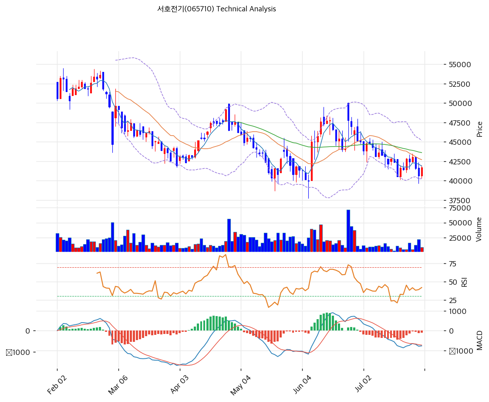

# 서호전기(065710) 기술적 분석

2026-07-30 | T2 Technical Analysis

---

## 차트

---

## 1. 가격 현황

| 항목 | 값 |
|------|-----|
| 현재가 | 41,700원 (**+2.58%**) |
| 52주 고가 | 58,600원 |
| 52주 저가 | 35,600원 |
| 52주 범위 위치 | **26.5%** |
| 거래량 | 20일 평균 대비 0.89x |

**52주 고가(58,600원) 대비 -28.8%, 저가(35,600원) 대비 +17.1%** 위치다. 고점에서 3분의 1 가까이 조정받은 뒤 저점권에서 반등을 시도하는 국면이다.

---

## 2. 차트 패턴 분석

### 2.1 캔들스틱 패턴

| 패턴 | 위치 | 신뢰도 | 해석 |
|------|------|--------|------|
| 반등 양봉 | 금일 | 중 | +2.58%로 MA5(41,890원)에 근접 — 다만 거래량 0.89배로 뒷받침 부족 |
| 저점권 지지 시도 | 40,000원대 | 중 | 볼린저 하단(40,236원)·피봇 S1(40,667원) 부근에서 반등 |

### 2.2 가격 구조 패턴

- **중기 조정 후 바닥 다지기** (신뢰도: 중)
  52주 고가 58,600원에서 35,600원까지 -39% 하락한 뒤 41,700원까지 회복했다. 현재는 MA5(41,890)·MA20(42,702) 바로 아래에서 등락하는 횡보 구간이다.

- **비정배열 — 모든 이평이 위에 있다** (신뢰도: 강)
  MA5(41,890) · MA20(42,702) · MA60(43,618) · MA120(45,591) · MA200(46,230) 순으로 정렬돼 현재가가 최하단이다. 다만 **MA5와의 괴리가 -0.5%에 불과**해 단기 이평 회복이 임박한 자리이며, MA200과의 괴리도 -9.8%로 크지 않다.

- **볼린저 밴드 폭 11.6% — 안정 구간** (신뢰도: 중)
  상단 45,169원·하단 40,236원으로 밴드 폭이 11.6%다. 정상 범위(5\~15%) 안에 있어 변동성이 진정된 상태이며, 앞서 다룬 종목들(오텍 45.1%, 유니켐 33.7%)과 달리 **가격이 안정적으로 형성되고 있음**을 보여준다.

### 2.3 다이버전스

- **MACD 매도 구간 — 다만 히스토그램 축소** (신뢰도: 중)
  MACD -770 vs 시그널 -682로 매도 구간이나 히스토그램(-88)이 확대되지 않고 있다. 하락 모멘텀이 소진되는 국면으로 읽힌다.

- **RSI 44.5 — 중립 하단** (신뢰도: 약)
  과매도(30)에는 이르지 않았고 중립선(50)에 근접해 있다. 방향성 정보가 제한적이다.

- **스토캐스틱 29.4 데드크로스** (신뢰도: 중)
  %K 29.4 / %D 35.9로 과매도 경계(20\~30) 부근이며 데드크로스 상태다. 단기 하방 압력이 남아 있음을 시사한다.

### 2.4 패턴 종합 판단

**기술적으로는 조정의 마무리 국면에 가깝지만 아직 전환 신호는 없다.** 모든 이평이 위에 있는 비정배열이고 MACD·스토캐스틱이 매도·데드크로스이지만, ① MA5와의 괴리가 -0.5%로 좁고 ② 볼린저 밴드 폭이 11.6%로 안정적이며 ③ MACD 히스토그램이 확대되지 않는다는 점에서 하락 압력은 약해지고 있다.

**중요한 것은 차트가 6월 24일 신규 수주(1,078.7억, 연 매출의 92.5%)를 아직 반영하지 못했다는 점이다.** 주가는 52주 고점(58,600원)에서 2026Q1 매출 감소(-23.7%)를 반영해 내려왔는데, 그 이후 발표된 대형 수주는 2028년까지의 매출 가시성을 만들었다. **펀더멘털과 가격의 시차가 존재할 가능성**이 이 종목 기술적 분석의 핵심 관전 포인트다.

---

## 3. 이동평균선 — 비정배열, 그러나 괴리는 좁다

| MA | 값 | 현재가 괴리율 | 위치 |
|----|-----|--------------|------|
| MA5 | 41,890원 | **-0.5%** | 아래 |
| MA20 | 42,702원 | -2.3% | 아래 |
| MA60 | 43,618원 | -4.4% | 아래 |
| MA120 | 45,591원 | -8.5% | 아래 |
| MA200 | 46,230원 | -9.8% | 아래 |

**해석**: 비정배열이지만 **괴리율이 -0.5%에서 -9.8% 사이로 촘촘하다.** 급락 종목의 전형(MA60 대비 -20\~30%)과 달리 이평들이 41,890\~46,230원의 좁은 범위에 모여 있어, **완만한 조정이 진행됐음**을 보여준다.

1차 관문은 MA5(41,890원)와 MA20(42,702원)이 겹치는 41,890\~42,702원 구간이며, 이를 넘으면 MA60(43,618원)·MA120·MA200(45,591\~46,230원)이 순차 저항으로 대기한다.

---

## 4. 보조 지표

### RSI(14) — 44.5 (중립 하단)

중립선(50)을 소폭 밑돌지만 과매도 영역과는 거리가 있다. 매수·매도 어느 쪽으로도 치우치지 않은 균형 상태다.

### MACD(12,26,9)

| 항목 | 값 |
|------|-----|
| MACD | -770.0 |
| Signal | -682.0 |
| Histogram | -88.0 (확대 없음) |
| 크로스 상태 | **매도 구간** |

**해석**: 음수 영역의 매도 구간이지만 히스토그램이 -88에서 확대되지 않고 있다. 시그널선(-682) 상향 돌파가 반등 전환의 첫 확인점이 된다.

### 볼린저밴드(20, 2σ)

| 항목 | 값 |
|------|-----|
| 상단 | 45,169원 |
| 중단 (MA20) | 42,702원 |
| 하단 | 40,236원 |
| 밴드 폭 | **11.6%** (정상 범위) |
| 현재 위치 | 중간 (중단선 아래) |

**해석**: 밴드 폭 11.6%는 정상 범위로, 가격이 안정적으로 형성되고 있음을 뜻한다. 현재가(41,700원)는 하단(40,236원)과 중단(42,702원) 사이에 있다. **하단 40,236원이 1차 지지선**이며, 중단선 회복 시 상단 45,169원까지 열린다.

### 스토캐스틱(14, 3, 3)

| 항목 | 값 |
|------|-----|
| Slow %K | 29.4 |
| Slow %D | 35.9 |
| 크로스 상태 | **데드크로스** |
| 판단 | 과매도 경계 부근 — 단기 하방 압력 잔존 |

---

## 5. 지지/저항 — 추세선 · 피보나치 · PRZ 통합

### 5.1 피보나치 되돌림

| 구분 | 비율 | 가격 | 현재가 대비 |
|------|------|------|-----------|
| Swing High | — | 47,750원 | +14.5% |
| 되돌림 | 0.236 | 45,909원 | +10.1% |
| 되돌림 | 0.382 | 44,770원 | +7.4% |
| 되돌림 | 0.5 | 43,850원 | +5.2% |
| 되돌림 | 0.618 | 42,930원 | +2.9% |
| 되돌림 | 0.786 | 41,619원 | **-0.2%** |
| Swing Low | — | 39,950원 | -4.2% |

※ 직전 스윙(39,950 → 47,750원) 기준. **현재가 41,700원이 0.786 되돌림(41,619원) 바로 위**에 있다 — 되돌림이 거의 완료된 자리이며, 이 레벨을 지키는지가 관건

**피보나치 확장 (반등 시 목표)**

| 비율 | 가격 | 현재가 대비 |
|------|------|-----------|
| 1.272 | 49,872원 | +19.6% |
| 1.382 | 50,730원 | +21.7% |
| 1.618 | 52,570원 | +26.1% |

### 5.2 추세선

| 추세선 | 방향 | 현재 교차가 | 포인트 수 | 해석 |
|--------|------|-----------|---------|------|
| 지지선 | 하락 | 41,067원 | 6개 | 기울기 -19.05 — 현재가 바로 아래, 1차 방어선 |
| 저항선 | **상승** | 53,027원 | 6개 | 기울기 +24.75 — 장기 상승 채널 상단 |

**저항선이 상승 방향(기울기 +24.75)이라는 점이 시사적이다.** 장기 고점이 우상향해 왔다는 뜻으로, 중장기 추세 자체는 살아 있음을 보여준다.

### 5.3 PRZ (Potential Reversal Zone)

| 방향 | 가격 범위 | 신뢰도 | 근거 |
|------|---------|--------|------|
| 저항 | **40,667\~43,850원** | **강** | 피봇 S1·R1·R2 + MA5 + MA20 + MA60 + 추세선 지지 + 피보나치 0.5·0.618·0.786 (**10개 지표 중첩**) |
| 저항 | **44,770\~46,230원** | **강** | 피보나치 0.236·0.382 + MA120 + MA200 |
| 저항 | 52,570\~53,027원 | 약 | 피보나치 1.618 확장 + 추세선 저항 |

※ PRZ = 추세선 · 피보나치 · 피봇 · MA 등 복수 지표가 겹치는 가격 구간

**첫 번째 PRZ(40,667\~43,850원)에 10개 지표가 몰려 있다.** 현재가가 이 구간 안에 있다는 뜻이며, **이 밀집 구간을 위로 벗어나는지 아래로 이탈하는지가 방향을 결정한다.** 지표가 이렇게 겹치는 구간은 통상 강한 지지·저항으로 작동하며, 돌파 시 움직임이 커진다.

### 5.4 종합 지지/저항 테이블

| 구분 | 가격 | 근거 |
|------|------|------|
| 저항 | 53,027원 | 추세선 저항(상승 채널 상단) |
| 저항 | 52,570원 | 피보나치 1.618 확장 |
| 저항 | 49,872원 | 피보나치 1.272 확장 |
| 저항 | **44,770\~46,230원** | **PRZ(강) — 피보나치 0.236·0.382 + MA120 + MA200** |
| 저항 | 45,169원 | 볼린저 상단 |
| 저항 | 43,618원 | MA60 |
| 저항 | 42,702원 | MA20 · 볼린저 중단 |
| 저항 | 41,890원 | MA5 — **최근접 관문** |
| **현재가** | **41,700원** | PRZ(강) 40,667\~43,850원 내부 |
| 지지 | 41,619원 | 피보나치 0.786 |
| 지지 | 41,067원 | 하락 추세선 |
| 지지 | 40,667원 | 피봇 S1 |
| 지지 | 40,236원 | 볼린저 하단 |
| 지지 | 39,950원 | 직전 Swing Low |
| 지지 | 39,633원 | 피봇 S2 |
| 지지 | 35,600원 | 52주 저가 |

---

## 6. 시그널 종합

| 지표 | 내용 | 시그널 |
|------|------|--------|
| 차트 패턴 | 조정 후 바닥 다지기, 볼린저 폭 11.6% 안정 | ⚪ |
| 이동평균선 | 비정배열, MA20 -2.3% (괴리 좁음) | ⚪ |
| RSI | 44.5 — 중립 하단 | ⚪ |
| **MACD** | **매도 구간** (히스토그램 확대 없음) | 🔴 |
| 볼린저밴드 | 중간, 밴드 폭 11.6% | ⚪ |
| 스토캐스틱 | 데드크로스, K=29.4 | ⚪ |
| 거래량 | 0.89x — 약함 | ⚪ |

**종합 판단**: 🟢 매수 0개 / 🔴 매도 1개 / ⚪ 중립 5개 → **매도우위 (조정 마무리 국면, 전환 신호 대기)**

기술적으로는 아직 매수 신호가 없다. MACD가 매도 구간이고 스토캐스틱은 데드크로스이며 거래량도 붙지 않았다. 다만 **하락 압력이 약해지는 징후**는 뚜렷하다 — MA5와의 괴리 -0.5%, 볼린저 폭 11.6%(안정), MACD 히스토그램 정체, 피보나치 0.786 되돌림 지지.

**차트만으로는 매수 근거가 부족하지만, 이 종목의 경우 차트가 펀더멘털을 아직 반영하지 못했을 가능성을 함께 봐야 한다.** 주가는 2026Q1 매출 감소(-23.7%)를 반영해 조정받았는데, 그 이후 6월 24일 ZPMC와 1,078.7억(연 매출의 92.5%) 규모 계약을 체결해 2028년까지의 일감을 확보했다. 여기에 배당수익률 14.4%(DPS 6,000원 기준)가 하방을 지지한다.

---

## 7. 전략 제안

### 보유 중인 경우
- **홀드 (배당 감안 시 보유 유지 근거 충분)**
- 익절 라인: 44,770\~46,230원 1차 (PRZ 강 — 피보나치 0.236·0.382 + MA120·MA200 밀집), 돌파 시 49,872원(피보나치 1.272 확장)
- 손절 라인: 39,950원 (직전 Swing Low·볼린저 하단 동반 이탈 = 조정 재개)
- 리스크/리워드: 약 1.7 (+3,070 / -1,750) — 1차 목표 기준. **여기에 배당수익률 14.4%가 더해지므로 보유 유지의 실질 기대수익은 더 높다**

### 진입 대기인 경우
- **분할 접근 가능 (배당 + 수주 가시성 근거)**
- 1차 진입가: 40,236\~40,667원 (볼린저 하단 + 피봇 S1)
- 2차 진입가: 39,950원 (직전 Swing Low)
- 3차 진입가: 35,600\~37,000원 (52주 저가 재시험 시 — 확률 낮으나 발생 시 강한 기회)
- 진입 조건: 기술적 시그널은 아직 매도우위(매수 0/매도 1)이지만, **MA5 회복(41,890원)과 MACD 시그널선 상향 돌파가 확인되면 추종 가능**하다. 펀더멘털 측면에서는 ① 6월 ZPMC 수주 1,078.7억으로 2028년까지 매출 가시성 확보 ② 무차입·순현금 449억 ③ 배당수익률 14.4%라는 세 가지 하방 근거가 있어, **급락을 기다리기보다 현 구간에서 분할 매수하는 접근도 정당화된다.**

  단 두 가지를 유의할 것 — **유통주식이 약 195만주(37.9%)에 불과해 변동성이 크고**, 자사주 PRS 처분분 514,485주(기준가 51,100원)가 시장에 나올 수 있다. 또한 8월 반기보고서에서 ZPMC 물량의 매출 인식 개시 여부를 확인하는 것이 순서상 안전하다
