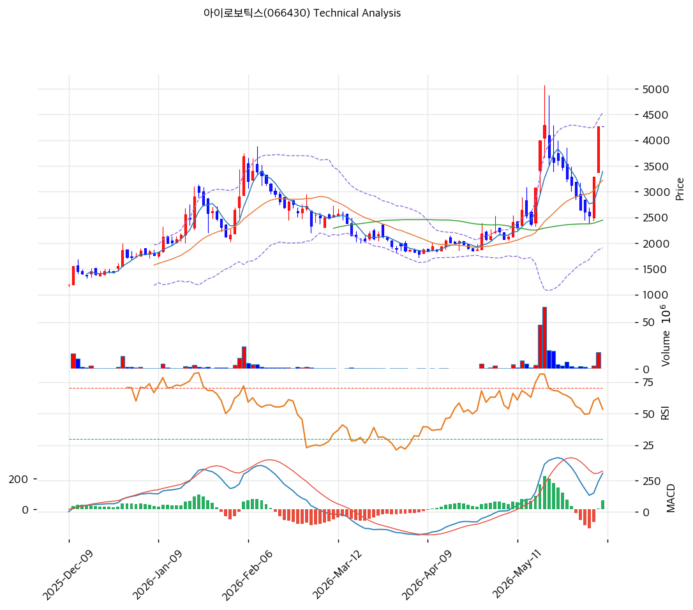

# 기술적분석

***

## 가격 위치

현재가 **4,270원** (보합) — **52주 신고가권**, 52주 위치 99.2% (고가 4,295원 / 저가 1,025원). 1년 **+317%** (1,025→4,270). 로보틱스 사명변경 신사업 기대 테마 급등. 외국인 20일 -28.3만주 매도. RSI 67.9 중립(과매수 직전). BB 폭 81.6%로 변동성 극대 — 테마성 변동.

## 이동평균선

| 이평선   |      값 |     이격도 |  위치 |
| ----- | -----: | ------: | :-: |
| MA5   | 3,392원 |  +25.9% |  위  |
| MA20  | 3,222원 |  +32.5% |  위  |
| MA60  | 2,445원 |  +74.6% |  위  |
| MA120 | 2,366원 |  +80.4% |  위  |
| MA200 | 1,964원 | +117.4% |  위  |

**완전 정배열 True**. MA200 대비 +117.4%, MA20 대비 +32.5% 극단 이격. 1년 +317% 급등으로 이격 극단 — 단기 급등 정점. 이평선과의 괴리가 매우 커 변동성 위험.

## 모멘텀 지표

* **RSI 67.9 (중립)** — 70 직전, 과매수 근접
* **MACD 309 / 시그널 251 / 히스토 +58** — 매수 + 확장 진행(급등 모멘텀)
* **스토캐스틱 K=58.2 / D=37.7** — 골든크로스, 중립
* **볼린저밴드** — 상단 4,536 / 중심 3,222 / 하단 1,907, 폭 **81.6% 극단**, 중간. 변동성 폭발(테마성)
* **거래량비** — 당일 데이터 공백(보합)

## 피보나치 되돌림 (스윙 1,787 / 4,295)

| 레벨    |     가격 | 성격               |
| ----- | -----: | ---------------- |
| 0.236 | 3,703원 | 1차 지지 (MA5 위)    |
| 0.382 | 3,337원 | 2차 지지 (MA20 근접)  |
| 0.5   | 3,041원 | 중기 지지            |
| 0.618 | 2,745원 | 깊은 조정            |
| 0.786 | 2,324원 | 추가 조정 (MA120 근접) |

## 지지/저항 (S\&R)

* **저항**: 4,295원(52주 고가) / 4,381원(전략 TP) / 4,977원(피보 1.272 확장) |
* **지지**: 3,703원(피보 0.236·MA5) / **3,337원(피보 0.382)·3,222원(MA20)** / 3,041원(피보 0.5) / 2,445원(MA60)

## 종합 시그널 & 전략

**시그널: 매수 2 / 매도 1 / 중립 4 → 매수우위** (급등 모멘텀, 단 테마 의존·이격 극단)

* **전략**: HOLD(홀드) — **TP 4,381원 / SL 4,270원**. WAIT(관망) e1 4,270원 / e2 3,222원
* **눌림목 매수**: 1년 +317% + MA200 +117% + BB 81.6% 극단으로 **신고가 추격 강력 비추**. 본업(PE 필름·저마진)·유상증자 6건 희석 대비 테마 과열. 조정 시 **MA20 3,222원 \~ 피보 0.382 3,337원 분할(투기적)**, 깊은 조정 시 MA60 2,445원
* **상방**: 52주 고가 4,295원 돌파 시 피보 1.272 확장 4,977원. 로보틱스 신사업 실체·테마 모멘텀이 유일 동력
* **하방**: MA20 3,222원 이탈 시 3,041원(피보 0.5) → 2,745원(0.618). 테마 소멸·증자 희석 시 급락 위험 큼
* **변곡점**: 로보틱스 신사업 실체 가시화 + 유상증자 종료가 추세 핵심. 펀더멘털(저마진 PE) 대비 테마 급등으로 비중·손절 엄격, 투기적 접근
