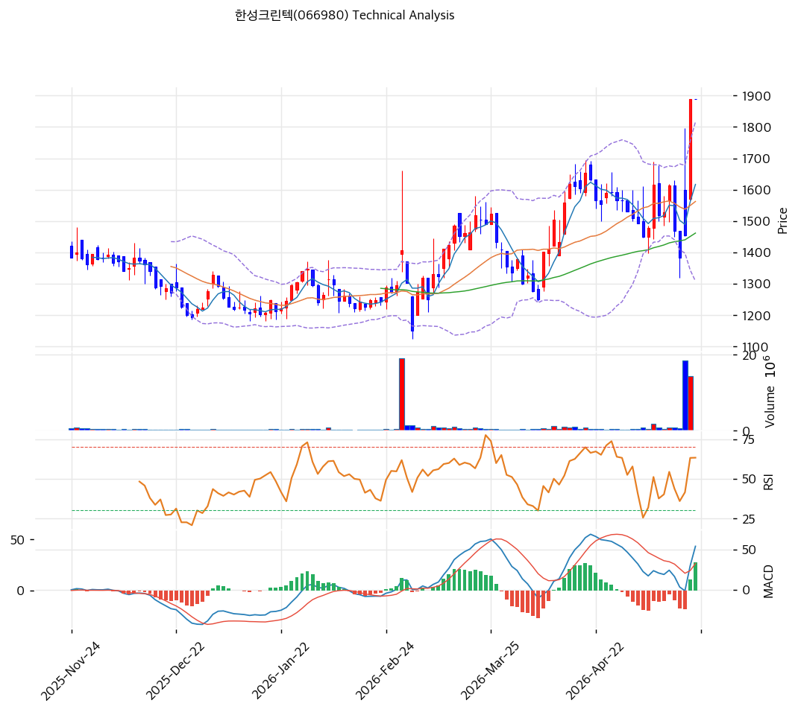

# 한성크린텍(066980) 기술적 분석

2026-05-21 | T2 Technical Analysis

---

## 차트

---

## 1. 가격 현황

| 항목 | 값 |
|------|-----|
| 현재가 | 1,890원 (52주 신고가) |
| 52주 고가 | 1,890원 (당일) |
| 52주 저가 | 1,127원 |
| 52주 범위 위치 | 100.0% |
| 거래량 | 데이터 결손 (차트상 2월·5월 거래량 폭증) |

---

## 2. 차트 패턴 분석

### 2.1 캔들스틱 패턴

| 패턴 | 위치 | 신뢰도 | 해석 |
|------|------|--------|------|
| **장대양봉 (당일 신고가)** | 당일 | 강 | 1,500→1,890원 단일봉 +26%, 거래량 폭증 동반 |
| 적삼병 | 최근 3~5일 | 중 | 양봉 누적 |
| **박스권 돌파** | 2026-05 | 강 | 1,500~1,700원 박스 → 1,890원 신고가 |

### 2.2 가격 구조 패턴

- **박스권 돌파 + 거래량 폭증** (신뢰도: 강)
  2026-02 거래량 폭증 + 1,500원 1차 돌파 → 2026-02~04 1,400~1,700원 박스권 → 2026-05 거래량 재폭증 + 1,890원 2차 돌파. **단계적 박스권 돌파 + 가격 + 거래량 정합**.

- **52주 신고가 갱신** (신뢰도: 강)
  1,890원 = 52주 최고 + BB 상단 1,817원 이탈. 단기 일부 조정 가능하나 추세 강세.

### 2.3 다이버전스

- **RSI 66.5 중립** (신뢰도: 강)
  RSI 70 미돌파. 추가 상승 여지.

- **MACD 매수 + 히스토그램 확대** (신뢰도: 중)
  MACD 54 > Signal 26, 히스토그램 +28 확대. 매수 추세 강세.

### 2.4 패턴 종합 판단

박스권 돌파 + 거래량 폭증 + RSI 66 미과열 + MACD 매수 확대 = **건전한 추세 가속**. 다만 BB 상단 +4% 이탈 + Stoch K 76 = 단기 조정 가능. 펀더멘털 (V자 흑전·반도체 EPC 슈퍼사이클) 정합.

---

## 3. 이동평균선 — 정배열 (강세)

| MA | 값 | 현재가 괴리율 | 위치 |
|----|-----|--------------|------|
| MA5 | 1,617원 | +16.9% | 위 |
| MA20 | 1,562원 | +21.0% | 위 |
| MA60 | 1,462원 | +29.3% | 위 |
| MA120 | (확인) | 약 +35% | 위 |
| MA200 | 1,351원 | **+39.9%** | 위 |

**해석**: 완벽한 정배열. MA20 +21% 추세 영역. MA200 +40% 회복 추세 누적. **MA20 (1,562원)을 1차 지지로 인식**.

---

## 4. 보조 지표

### RSI(14) — 66.5 (중립)

70 임계 미돌파. 추가 상승 여지.

### MACD(12,26,9)

| 항목 | 값 |
|------|-----|
| MACD | 54 |
| Signal | 26 |
| Histogram | +28 |
| 크로스 상태 | 매수 (확대 중) |

**해석**: 골든크로스 이후 히스토그램 확대. 매수 모멘텀 강력.

### 볼린저밴드(20, 2σ)

| 항목 | 값 |
|------|-----|
| 상단 | 1,817원 |
| 중단 (MA20) | 1,562원 |
| 하단 | 1,308원 |
| 밴드 폭 | 32.5% |
| 현재 위치 | 상단 +4.0% 이탈 |

**해석**: 밴드 폭 32.5% 확장 — 변동성 큼. 상단 이탈 = 1~3봉 내 안쪽 회귀 가능.

### 스토캐스틱(14, 3, 3)

| 항목 | 값 |
|------|-----|
| Slow %K | 76.1 |
| Slow %D | 49.1 |
| 크로스 상태 | 골든크로스 |
| 판단 | 중립 |

---

## 5. 지지/저항

### 종합 지지/저항

| 구분 | 가격 | 근거 |
|------|------|------|
| 저항 | 2,500원 | 피보 1.272 확장 (단기 목표) |
| 저항 | 2,000원 | 심리적 라운드넘버 |
| 저항 | 1,890원 | 52주 신고가 (당일) |
| **현재가** | **1,890원** | — |
| 지지 | 1,817원 | BB 상단 (re-test) |
| 지지 | 1,700원 | 박스권 상단 (이전 박스) |
| 지지 | 1,617원 | MA5 |
| 지지 | 1,562원 | **MA20 (1차 강력 지지)** |
| 지지 | 1,462원 | MA60 |
| 지지 | 1,351원 | MA200 |
| 지지 | 1,308원 | BB 하단 |
| 지지 | 1,127원 | 52주 저점 |

---

## 6. 시그널 종합

| 지표 | 시그널 |
|------|--------|
| 차트 패턴 (박스권 돌파 + 거래량 폭증) | 🟢 |
| 이동평균선 (정배열) | 🟢 |
| RSI 66.5 (중립) | ⚪ |
| MACD 매수 + 히스토그램 확대 | 🟢 |
| 볼린저밴드 상단 이탈 | 🔴 |
| 스토캐스틱 76 | ⚪ |
| 거래량 (당일 폭증) | 🟢 |

**종합 판단**: 🟢 매수 4 / 🔴 매도 1 / ⚪ 중립 2 → **매수우위**

박스권 돌파 + 거래량 폭증 + RSI 미과열 = 건전한 추세 가속. BB 상단 이탈만 단기 조정 시그널.

---

## 7. 전략 제안

### 보유 중
- **분할 익절 + 잔량 홀드**
- 1차 익절: 2,000원 (심리적, +6%)
- 2차 익절: 2,500원 (피보 1.272 확장, +32%)
- 손절: 1,562원 (MA20, -17%)

### 진입 대기
- **분할 매수 권장**
- 1차 진입: 1,817원 (BB 상단 re-test, -4%)
- 2차 진입: 1,562원 (MA20, -17%)
- 3차 진입: 1,308원 (BB 하단, -31%)
- 진입 조건: BB 상단 re-test 시 양봉 + 거래량 회복
- **펀더멘털 정합**: PBR 1.63x + V자 흑전 + 반도체 초순수 EPC 슈퍼사이클 — 분할 매수 권장. 다만 외인 -71.76만주 이탈은 단기 변동성 가능.
