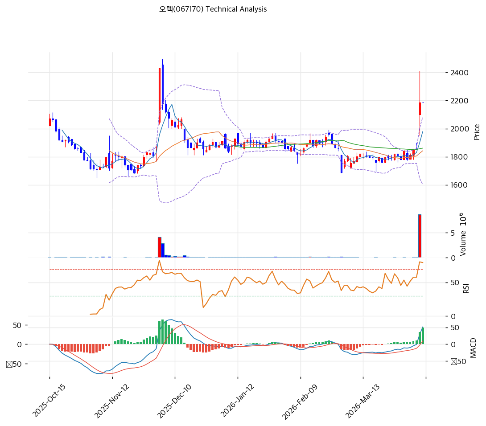

# 오텍(067170) 기술적 분석

2026-04-09 | T2 Technical Analysis

---

## 차트

---

## 1. 가격 현황

| 항목 | 값 |
|------|-----|
| 현재가 | 2,185원 (±0.00%) |
| 52주 고가 | 3,004원 |
| 52주 저가 | 1,684원 |
| 52주 범위 위치 | 38.0% |
| 거래량 | 20일 평균 대비 0.0x (데이터 미수신) |

---

## 2. 차트 패턴 분석

### 2.1 캔들스틱 패턴

| 패턴 | 위치 | 신뢰도 | 해석 |
|------|------|--------|------|
| 상승 추세 지속 | 최근 20일 | 중 | 1,684원 저점 이후 현재가(2,185원)까지 약 30% 반등하며 단기 상승 모멘텀이 유효 |
| 볼린저 상단 돌파 | 현재 | 중 | 현재가 2,185원이 BB상단(2,082원)을 상회 중 — 단기 과열 신호이나 추세 추종 가능성 병존 |

※ 장중 거래량 데이터 0 (비장중 조회)으로 캔들 세부 패턴 식별 제한

### 2.2 가격 구조 패턴

- **52주 하단 반등 후 회복 국면** (신뢰도: 중)
  2026년 초 1,684원(52주 저가) 이후 현재 2,185원까지 약 29.7% 상승. 전저점 대비 반등 강도는 의미 있으나 52주 고가(3,004원) 대비로는 여전히 27.3% 하단에 위치. 중기 추세 회복 여부는 3,000원대 저항 돌파 여부가 관건이다.

- **MA 집합 구간 이탈 및 상방 이격 확대** (신뢰도: 중)
  MA20(1,842원)·MA60(1,861원)·MA120(1,867원)·MA200(1,978원)이 1,840~1,980원대에 밀집한 상태에서 현재가가 이 밴드를 10~19% 상회 중. 단기 이격 과도 후 조정 가능성이 있으나, 이 MA 집합 구간이 강한 지지 매물대로 전환되는 시나리오도 유효하다.

### 2.3 다이버전스

- **RSI 과매수 경고** (신뢰도: 중)
  RSI(14) = 76.0으로 과매수 구간(70 이상) 진입. 가격 상승 속도에 비해 RSI가 급등했고 추가 상승 시 하락 다이버전스 형성 위험이 있다. 단기 조정 또는 횡보 후 눌림목 매수 구간 탐색이 바람직하다.

- **MACD 매수 다이버전스 유지** (신뢰도: 중)
  MACD(51) > Signal(8), 히스토그램 +43으로 확대 중. 추세 추종 측면에서는 강세 신호가 유효하나 RSI 과매수와 상충하는 시그널로 신중한 해석이 필요하다.

### 2.4 패턴 종합 판단

현재 차트는 **단기 과매수 상태의 추세 상승 국면**으로 요약된다. MACD는 강세 지속을 시사하지만 RSI 76은 단기 조정 위험을 경고하고 있어 상충 신호가 공존한다. 52주 범위 위치 38%는 고가 대비 여전히 낮은 위치로 중기 상승 여력이 있으나, 단기적으로는 볼린저 상단(2,082원) 이탈 후 MA20(1,842원) 구간까지 되돌림 가능성을 열어둬야 한다.

---

## 3. 이동평균선 — 비정배열 (중립)

| MA | 값 | 현재가 괴리율 | 위치 |
|----|-----|--------------|------|
| MA5 | 1,979원 | +10.4% | 위 |
| MA20 | 1,842원 | +18.6% | 위 |
| MA60 | 1,861원 | +17.4% | 위 |
| MA120 | 1,867원 | +17.0% | 위 |
| MA200 | 1,978원 | +10.5% | 위 |

**해석**: 현재가가 전 이동평균선 위에 위치하여 단기·중기 모두 가격이 상회 중이나, MA5(1,979원) < MA20(1,842원) 순서로 단기 MA가 장기 MA보다 낮은 **비정배열** 상태다. 이는 반등이 이루어졌으나 장기 추세 전환은 아직 미완성임을 뜻한다. MA5~MA200이 1,840~1,980원 밴드에 밀집해 있어 현재가 2,185원과의 이격(10~19%)이 크다 — 평균 회귀 시 강한 지지 역할을 기대할 수 있다.

---

## 4. 보조 지표

### RSI(14) — 76.0 (🔴과매수)

RSI 76.0은 과매수 구간으로 단기 급등 후 숨 고르기 국면이 도래할 가능성이 높다. 추가 상승 시 가격 상승 대비 RSI 정체(하락 다이버전스) 발생 여부를 집중 모니터링해야 한다.

### MACD(12,26,9)

| 항목 | 값 |
|------|-----|
| MACD | 51 |
| Signal | 8 |
| Histogram | +43 |
| 크로스 상태 | 매수 구간 (확대 중) |

**해석**: MACD가 Signal을 상회하고 히스토그램이 +43으로 확대 중이며, 이는 추세 상승 모멘텀이 강화되고 있음을 시사한다. 히스토그램이 정점을 찍고 수축으로 전환되는 시점이 단기 고점 경고 신호가 될 것이다.

### 볼린저밴드(20, 2σ)

| 항목 | 값 |
|------|-----|
| 상단 | 2,082원 |
| 중단 (MA20) | 1,842원 |
| 하단 | 1,602원 |
| 밴드 폭 | 26.1% |
| 현재 위치 | 상단 근접(돌파) |

**해석**: 현재가(2,185원)가 BB상단(2,082원)을 이미 돌파한 상태로 단기 과열 구간이다. 밴드 폭 26.1%는 변동성이 확대된 국면을 반영하며, 볼린저 워킹(상단을 따라 이동) 또는 평균 회귀(중단 1,842원 방향) 중 하나를 선택하는 분기점에 있다.

### 스토캐스틱(14, 3, 3)

| 항목 | 값 |
|------|-----|
| Slow %K | 70.1 |
| Slow %D | 78.9 |
| 크로스 상태 | 데드크로스 |
| 판단 | 중립 |

---

## 5. 지지/저항

| 구분 | 가격 | 근거 |
|------|------|------|
| 저항 | 3,004원 | 52주 고가 |
| 저항 | 2,500~2,600원 | 직전 하락 구간 매물대(추정) |
| **현재가** | **2,185원** | — |
| 지지 | 2,082원 | 볼린저밴드 상단 |
| 지지 | 1,979원 | MA5 |
| 지지 | 1,861~1,867원 | MA60·MA120 집합 구간 |
| 지지 | 1,842원 | MA20(볼린저 중단) |
| 지지 | 1,684원 | 52주 저가 |

---

## 6. 시그널 종합

| 지표 | 내용 | 시그널 |
|------|------|--------|
| **차트 패턴** | 52주 저점 반등, MA 상단 이탈, 볼린저 돌파 | ⚪ |
| 이동평균선 | 비정배열, 전 MA 상회 (+10~19%), 강한 지지대 형성 | ⚪ |
| RSI | 76.0 — 과매수 🔴 | 🔴 |
| MACD | 매수구간, 히스토그램 +43 확대 중 | 🟢 |
| 볼린저밴드 | 상단 돌파(2,185 > 2,082), 밴드 폭 26.1% 확대 | ⚪ |
| 스토캐스틱 | 데드크로스, K=70.1 중립 구간 | ⚪ |
| 거래량 | 0.0x — 데이터 미수신 | ⚪ |

**종합 판단**: 🟢 매수 1개 / 🔴 매도 1개 / ⚪ 중립 5개 → **중립**

단기 추세는 상승이지만 RSI 과매수(76.0)와 볼린저 상단 돌파가 단기 과열을 경고한다. MACD 강세와 MA 전면 상회는 중기 방향성이 긍정적임을 시사하나, 비정배열 구조와 시총 소규모(527억) 특성상 거래량 없는 급등은 지속성을 담보하기 어렵다. 단기적으로는 MA20(1,842원) 또는 볼린저 상단(2,082원) 구간으로의 되돌림 후 재진입 여부를 확인하는 전략이 리스크 대비 유리하다.

---

## 7. 전략 제안

### 보유 중인 경우
- **홀드** (단기 과열 구간, 익절 검토)
- 익절 라인: 3,004원 (52주 고가 / 직전 저항)
- 손절 라인: 1,842원 (MA20 이탈 시 — 볼린저 중단 및 중기 지지 붕괴 신호)
- 리스크/리워드: 목표 +37.5% vs 손절 -15.7% → 약 2.4:1

### 진입 대기인 경우
- **관망** (현 구간은 단기 과매수로 신규 진입 불리)
- 1차 진입가: 2,082원 (볼린저 상단 — 되돌림 후 지지 확인 시)
- 2차 진입가: 1,842~1,870원 (MA20·MA60 집합 구간 지지 확인 시)
- 진입 조건: 거래량 동반 반등 + RSI 60 이하 재진입 + 양봉 확인. 유상증자 일정·발행가 확정 후 희석 충격 소화 여부 반드시 확인
