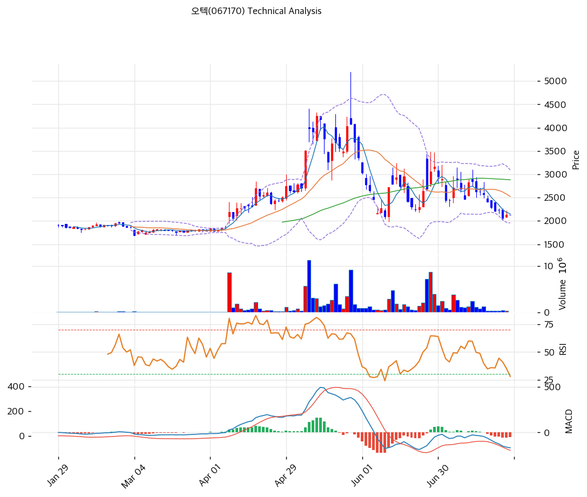

# 오텍(067170) 기술적 분석

2026-07-28 | T2 Technical Analysis

---

## 차트

---

## 1. 가격 현황

| 항목 | 값 |
|------|-----|
| 현재가 | 2,135원 (2026-07-27 종가) |
| 52주 고가 | 4,250원 |
| 52주 저가 | 1,684원 |
| 52주 범위 위치 | **17.6%** |
| 거래량 | 데이터 미갱신 (당일 장 시작 전 수집) |

⚠️ **데이터 수집 시점 유의**: 본 분석은 2026년 7월 28일 오전 장 시작 전에 수집된 데이터를 기준으로 하며, 가격은 직전 거래일(7/27) 종가다. 피봇 포인트(P·R1·R2·S1·S2가 모두 2,135원)와 거래량 비율은 당일 데이터 부재로 산출되지 않아 **이번 분석에서는 사용하지 않는다.** 이동평균·RSI·MACD·볼린저·피보나치는 과거 일봉 기준으로 정상 산출됐다.

**52주 고가 4,250원 대비 현재가는 -49.8%다.** 고점에서 정확히 반토막 난 자리이며, 52주 저가(1,684원)와의 거리는 +26.8%다.

---

## 2. 차트 패턴 분석

### 2.1 캔들스틱 패턴

| 패턴 | 위치 | 신뢰도 | 해석 |
|------|------|--------|------|
| 저점권 횡보 | 최근 | 중 | MA5(2,154원)와 현재가가 -0.9% 이내로 밀착 — 단기 방향성 소실 |
| 고점 대비 반토막 | 2,135원 vs 4,250원 | 강 | 테마 급등분의 되돌림이 대부분 진행된 상태 |

### 2.2 가격 구조 패턴

- **완전 역배열 — 중기 하락 추세** (신뢰도: 강)
  MA5(2,154) · MA20(2,524) · MA60(2,881) · MA120(2,427) · MA200(2,213)이 모두 현재가 위에 있다. 특히 **MA60 대비 -25.9%, MA20 대비 -15.4%**로 최근 3개월 사이 급락했음을 보여준다.

- **MA200 근접 — 마지막 지지선 시험** (신뢰도: 중)
  MA200이 2,213원으로 현재가와 -3.5% 거리다. 5개 이평 중 가장 가까이 있으며, 장기 추세선이라는 점에서 여기서 지지되는지가 중기 방향을 가른다.

- **볼린저 밴드 폭 45.1% — 극단적 변동성** (신뢰도: 강)
  상단 3,093원·하단 1,955원으로 밴드 폭이 45.1%다. 정상 범위(5\~15%)의 3배가 넘는 수치로, **최근 몇 달간 이 종목이 테마 급등과 급락을 오갔다는 사실이 그대로 나타난다.** 이런 구간에서는 밴드가 지지·저항으로 잘 작동하지 않는다.

### 2.3 다이버전스

- **MACD 매도 구간 유지** (신뢰도: 중)
  MACD -168 vs 시그널 -118로 매도 구간이고 히스토그램 -50은 확대되지 않고 있다. 하락 모멘텀이 유지되나 가속되지는 않는 상태다.

- **스토캐스틱 7.3 — 극단적 과매도에서 골든크로스** (신뢰도: 중)
  %K 7.3 / %D 5.7로 과매도 영역(20 이하)의 바닥권이며 골든크로스가 발생했다. **이 종목에서 유일한 매수 신호**이며, 단기 기술적 반등 가능성을 시사한다. 다만 과매도 반등은 추세 전환과 다르다.

### 2.4 패턴 종합 판단

**기술적으로는 하락 추세의 후반부에 가깝다.** 5개 이평이 모두 위에 있는 완전 역배열이고 MACD는 매도 구간이지만, 스토캐스틱이 7.3까지 내려가 과매도 골든크로스가 나왔고 RSI도 39.8로 하단권이다. 52주 위치 17.6%는 이미 상당한 하락이 진행됐음을 뜻한다.

**핵심 관전 포인트는 MA200(2,213원)이다.** 현재가가 이 선 바로 아래(-3.5%)에 있는데, 회복하면 단기 반등의 발판이 되고 이탈이 굳어지면 52주 저가(1,684원)까지 열린다.

다만 기술적 반등 여부와 별개로 **BW 잔량 521만주(발행주식의 19.0%)가 행사가 1,881원에 걸려 있다는 점이 상단을 제약한다.** 현재가 2,135원은 행사가보다 13.5% 높아 신주인수권 행사가 계속 이뤄지고 있으며, 반등할수록 물량이 늘어나는 구조다.

---

## 3. 이동평균선 — 완전 역배열

| MA | 값 | 현재가 괴리율 | 위치 |
|----|-----|--------------|------|
| MA5 | 2,154원 | -0.9% | 아래 |
| MA20 | 2,524원 | **-15.4%** | 아래 |
| MA60 | 2,881원 | **-25.9%** | 아래 |
| MA120 | 2,427원 | -12.0% | 아래 |
| MA200 | 2,213원 | **-3.5%** | 아래 |

**해석**: MA60(2,881원)이 가장 멀고 MA200(2,213원)이 가장 가깝다는 배열이 시사적이다. 3개월 전(MA60 구간)에 주가가 2,900원대였고 그 이후 급락해 200일 평균선까지 내려왔다는 뜻이다. **MA120(2,427원)이 MA60보다 낮은 것은 1년 전에도 현재와 비슷한 가격대였음을 의미**하며, 테마 급등 이전 수준으로 회귀했다고 볼 수 있다.

1차 회복 목표는 MA200(2,213원), 그다음이 MA120(2,427원)·MA20(2,524원)이 겹치는 2,430\~2,520원 구간이다.

---

## 4. 보조 지표

### RSI(14) — 39.8 (중립 하단)

과매도(30)까지는 여유가 있으나 중립선(50)을 크게 밑돈다. 매도 압력이 우세하되 극단적 투매 국면은 아닌 상태다.

### MACD(12,26,9)

| 항목 | 값 |
|------|-----|
| MACD | -168.0 |
| Signal | -118.0 |
| Histogram | -50.0 (확대 없음) |
| 크로스 상태 | **매도 구간** |

**해석**: 매도 구간이지만 히스토그램이 확대되지 않아 하락 가속은 멈춘 상태다. 시그널선(-118) 상향 돌파가 단기 반등의 첫 확인점이 된다.

### 볼린저밴드(20, 2σ)

| 항목 | 값 |
|------|-----|
| 상단 | 3,093원 |
| 중단 (MA20) | 2,524원 |
| 하단 | 1,955원 |
| 밴드 폭 | **45.1%** (극단 확장) |
| 현재 위치 | 중간~하단 |

**해석**: 밴드 폭 45.1%는 정상 범위의 3배 이상으로, 테마 급등·급락의 흔적이다. 현재가(2,135원)는 하단(1,955원)과 중단(2,524원) 사이 하단부에 있다. **하단 1,955원이 심리적 지지선**으로 작동할 가능성이 있으며, 변동성이 이 정도인 구간에서는 포지션 규모를 평소보다 줄이는 것이 원칙이다.

### 스토캐스틱(14, 3, 3)

| 항목 | 값 |
|------|-----|
| Slow %K | **7.3** |
| Slow %D | **5.7** |
| 크로스 상태 | **골든크로스** |
| 판단 | **극단적 과매도 (20 이하)** — 단기 반등 신호 |

%K 7.3은 거의 바닥값이다. 이 수준에서의 골든크로스는 단기 기술적 반등의 표준 신호이며, 이 종목에서 유일한 매수 시그널이다.

---

## 5. 지지/저항 — 추세선 · 피보나치 통합

### 5.1 피보나치 되돌림

| 구분 | 비율 | 가격 | 현재가 대비 |
|------|------|------|-----------|
| Swing High | — | 3,160원 | +48.0% |
| 되돌림 | 0.236 | 2,909원 | +36.3% |
| 되돌림 | 0.382 | 2,753원 | +28.9% |
| 되돌림 | 0.5 | 2,628원 | +23.1% |
| 되돌림 | 0.618 | 2,502원 | +17.2% |
| 되돌림 | 0.786 | 2,323원 | +8.8% |
| Swing Low | — | 2,095원 | -1.9% |

※ 직전 스윙(2,095 → 3,160원) 기준. **현재가 2,135원은 Swing Low(2,095원) 바로 위**로, 되돌림이 사실상 100% 진행된 상태다. 이 저점을 지키는지가 1차 관문이며, 첫 반등 목표는 0.786(2,323원)이다

### 5.2 추세선

| 추세선 | 방향 | 현재 교차가 | 포인트 수 | 해석 |
|--------|------|-----------|---------|------|
| 지지선 | 하락 | 1,785원 | 6개 | 기울기 -0.14 — 완만한 하락, 하방 여유 |
| 저항선 | 상승 | 4,476원 | 6개 | 기울기 +15.87 — 원거리, 실효성 낮음 |

### 5.3 PRZ (Potential Reversal Zone)

| 방향 | 가격 범위 | 신뢰도 | 근거 |
|------|---------|--------|------|
| 저항 | 2,502\~2,524원 | 약 | 피보나치 0.618 + MA20 |

※ 자동 산출된 PRZ 중 2,135\~2,154원 구간(피봇 R1·R2·S1·S2 + MA5)은 **당일 데이터 부재로 피봇이 모두 동일값이 된 계산 결과**여서 유효한 지지·저항으로 보지 않는다

### 5.4 종합 지지/저항 테이블

| 구분 | 가격 | 근거 |
|------|------|------|
| 저항 | 2,881원 | MA60 |
| 저항 | 2,753원 | 피보나치 0.382 |
| 저항 | 2,628원 | 피보나치 0.5 |
| 저항 | 2,502\~2,524원 | PRZ(약) — 피보나치 0.618 + MA20 |
| 저항 | 2,427원 | MA120 |
| 저항 | 2,323원 | 피보나치 0.786 — **1차 반등 목표** |
| 저항 | 2,213원 | **MA200 — 최근접 관문** |
| 저항 | 2,154원 | MA5 |
| **현재가** | **2,135원** | 52주 위치 17.6% |
| 지지 | 2,095원 | 직전 Swing Low |
| 지지 | 1,955원 | 볼린저 하단 |
| 지지 | **1,881원** | **BW 행사가 — 심리적 지지** |
| 지지 | 1,785원 | 하락 추세선 |
| 지지 | 1,684원 | 52주 저가 |

**1,881원의 특수성**: BW 신주인수권 행사가로, 이 가격 아래로 내려가면 신주인수권이 아웃-오브-더-머니가 되어 행사가 멈춘다. 희석 압력이 사라진다는 점에서는 긍정적이지만, 동시에 사채권자가 2027년 7월 풋옵션(98.05억) 행사로 방향을 틀 수 있다는 뜻이기도 하다.

---

## 6. 시그널 종합

| 지표 | 내용 | 시그널 |
|------|------|--------|
| 차트 패턴 | 완전 역배열, 고점 대비 -49.8% | ⚪ |
| 이동평균선 | 비정배열, MA20 -15.4% | ⚪ |
| RSI | 39.8 — 중립 하단 | ⚪ |
| MACD | **매도 구간** | 🔴 |
| 볼린저밴드 | 중간~하단, 폭 45.1% | ⚪ |
| **스토캐스틱** | **골든크로스, K=7.3 극단 과매도** | 🟢 |
| 거래량 | 데이터 미갱신 — 판단 제외 | — |

**종합 판단**: 🟢 매수 1개 / 🔴 매도 1개 / ⚪ 중립 4개 → **중립 (하락 추세 후반 + 과매도 반등 신호)**

방향을 확정할 수 없는 구간이다. 추세 지표(역배열·MACD 매도)는 하락을, 과매도 지표(스토캐스틱 7.3 골든크로스·52주 위치 17.6%)는 단기 반등을 가리킨다. **MA200(2,213원) 회복 여부가 실질적 분기점**이며, 회복하면 2,323원(피보나치 0.786)·2,427원(MA120)까지, 이탈이 굳어지면 1,955원(볼린저 하단)·1,881원(BW 행사가)이 다음 지지대다.

기술적 신호와 별개로 이 종목은 **8월 반기보고서(2분기 성수기 실적)라는 확정된 이벤트**를 앞두고 있어, 그 결과가 차트보다 큰 변수가 될 가능성이 높다.

---

## 7. 전략 제안

### 보유 중인 경우
- **홀드 (MA200 회복 여부 확인)**
- 익절 라인: 2,323원(피보나치 0.786) 1차, 2,427\~2,524원(MA120·MA20) 2차 — 역배열 구간의 반등은 짧게 대응
- 손절 라인: 1,955원 (볼린저 하단 이탈 = 52주 저가 재시험 국면 진입)
- 리스크/리워드: 약 1.0 (+188 / -180) — 1차 목표 기준. **BW 521만주가 1,881원에 걸려 반등마다 물량이 나오는 구조**라 목표를 짧게 잡는 것이 안전하다

### 진입 대기인 경우
- **8월 반기 실적 확인 후 판단**
- 1차 진입가: 1,955원 (볼린저 하단)
- 2차 진입가: 1,881원 이하 (BW 행사가 — 이 아래에서는 신주인수권 행사가 멈춰 희석 압력이 사라짐)
- 진입 조건: 스토캐스틱 7.3의 과매도 골든크로스는 단기 반등 신호이지만, **완전 역배열에 MACD 매도 구간이라 추세 매수 근거로는 부족하다.** 여기에 순차입금 1,568억(시가총액의 2.7배)과 BW 잔량 19.0%라는 구조적 부담이 있어, 기술적 반등을 노린 단기 매매가 아니라면 **8월 중순 반기보고서에서 2분기 성수기 영업이익이 전년(30억) 수준 이상으로 나오는지 확인한 뒤 접근하는 것이 합리적**이다. 포지션은 볼린저 폭 45.1%의 변동성을 감안해 축소 운용할 것
