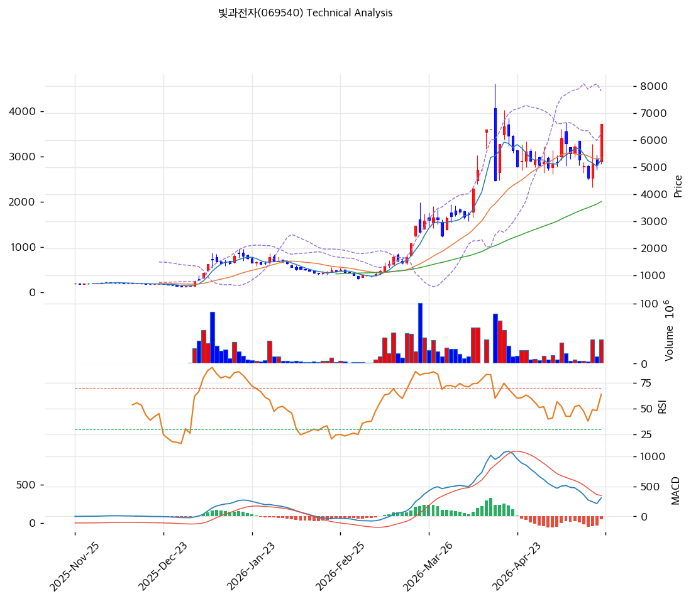

# 기술적분석

2026-05-24 | T2 Technical Analysis

## 1. 가격 현황

| 항목      | 값                                  |
| ------- | ---------------------------------- |
| 현재가     | 6,610원 (+29.86%)                   |
| 52주 고/저 | 6,610 / 592원 (위치 100%, 1년 +1,016%) |
| 거래량     | 20일 평균 대비 3.15x                    |

## 2. 차트 패턴 분석

### 2.1 캔들스틱

| 패턴   | 위치            | 신뢰도 | 해석                               |
| ---- | ------------- | --- | -------------------------------- |
| 장대양봉 | 당일            | 강   | 거래량 3.15x +29.86% 신고가 돌파, 추격 리스크 |
| 유성형  | 4월 중순 7,000원대 | 강   | 단기 천정 압력 (조정 완료)                 |

### 2.2 가격 구조

* **컵앤핸들 완성 (중)**: 4월 7,000원 → 5월 초 4,500원 → 5월 중하순 5,200\~5,500원 핸들 → 당일 6,610원 돌파. 목표 8,000원대.
* **상승 추세선 돌파 (강)**: 12월 형성 6포인트 추세선(현 5,514원) 위 +20% 이격, 신고가 갱신.

### 2.3 다이버전스

* **MACD 하락 다이버전스 (강)**: 4월 1,000대 → 당일 307 (-70%), 가격은 신고가. 모멘텀 급둔화.
* **RSI 약한 하락 다이버전스 (중)**: 4월 75 → 당일 63.3, 가격 신고가에도 RSI 미달.

### 2.4 종합 판단

당일 장대양봉으로 단기 강세 명확하나 **MACD 다이버전스 + MA200 +269% 이격 + BB 상단 이탈** 동시 작동하는 상충 구간. 컵앤핸들 완성 시 8,051원 가능, 5,623원 이탈 시 추세 훼손.

## 3. 이동평균선 — 정배열 (강세, 극단 과열)

| MA           | 값              | 괴리율              |
| ------------ | -------------- | ---------------- |
| MA5 / MA20   | 5,300 / 5,350원 | +24.7% / +23.6%  |
| MA60 / MA120 | 3,733 / 2,396원 | +77.1% / +175.9% |
| MA200        | 1,791원         | **+269.2%**      |

**해석**: 정배열 강세이나 **MA200 +269% 이격은 평균회귀 압력 극단** (+50% 이상은 단기 조정 트리거). MA20(5,350) 1차 지지, 이탈 시 MA60(3,733)까지 -44% 갭 위험.

## 4. 보조 지표

**RSI(14) — 63.3 (중립 중상단)**: 70 미달이나 4월 75 대비 가격 신고가에도 RSI 더 낮음 → 하락 다이버전스 시사.

**MACD(12,26,9)**: 307 / Signal 357 / Histogram -49. 매도 크로스 (히스토그램 음수 수축). 4월 정점 대비 -70% 둔화, 모멘텀 약화.

**볼린저밴드(20, 2σ)**: 상단 6,249 / 중단 5,350 / 하단 4,450원, 폭 33.6%. **상단 이탈** (6,610 > 6,249) — 2σ 통계적 과열, BB 중단(5,350)까지 평균회귀 가능성.

**스토캐스틱(14,3,3)**: K=56.5 / D=33.2, 골든크로스, 중립 (과매수 80 미달).

## 5. 지지/저항 — 통합

### 5.1 피보나치 (Swing 891 → 6,520원, +632%)

| 비율                      | 가격                     | 대비                       |
| ----------------------- | ---------------------- | ------------------------ |
| 되돌림 0.236 / 0.382 / 0.5 | 5,192 / 4,370 / 3,706원 | -21.5% / -33.9% / -43.9% |
| 되돌림 0.618 / 0.786       | 3,041 / 2,096원         | -54.0% / -68.3%          |
| 확장 1.272 / 1.618        | 8,051 / 9,999원         | +21.8% / +51.3%          |

※ Swing High 상회 → 확장 1.272(8,051원)이 1차 목표.

### 5.2 추세선 & PRZ

* 상승 저항선(6포인트, 현 5,514원): 저항→지지 전환, 이탈 시 추세 훼손
* **PRZ 약 (5,514\~5,623원)**: 추세선 저항 + 피봇 S1
* **PRZ 중 (5,192\~5,350원)**: 피보나치 0.236 + MA5 + MA20 (3중)

### 5.3 종합 지지/저항

| 구분      | 가격         | 근거                 |
| ------- | ---------- | ------------------ |
| 저항      | 8,051원     | 피보나치 1.272 (1차 목표) |
| 저항      | 7,103원     | 피봇 R1              |
| **현재가** | **6,610원** | 52주 고가 도달          |
| 지지      | 5,623원     | 피봇 S1 + PRZ(약)     |
| 지지      | 5,281원     | PRZ(중) — 3중 지지     |
| 지지      | 4,637원     | 피봇 S2              |
| 지지      | 3,733원     | MA60 (중기)          |

## 6. 시그널 종합

| 지표        | 내용                     | 시그널 |
| --------- | ---------------------- | --- |
| **차트 패턴** | 컵앤핸들 + 신고가, MACD 다이버전스 | ⚪   |
| 이동평균선     | 정배열, MA200 +269% 극단    | ⚪   |
| RSI       | 63.3 중립, 하락 다이버전스      | ⚪   |
| MACD      | 307/357 매도 크로스 수축      | 🔴  |
| 볼린저밴드     | 상단 이탈, 폭 33.6% 확장      | 🔴  |
| 스토캐스틱     | K=56.5/D=33.2 골든크로스    | 🟢  |
| 거래량       | 3.15x 강력               | 🟢  |

**종합 판단**: 🟢 매수 2 / 🔴 매도 2 / ⚪ 중립 3 → **혼조 (매도우위 잔존)**

당일 거래량 3.15x 장대양봉으로 단기 추세 재개는 강하나 **MACD 다이버전스 + BB 상단 이탈 + MA200 +269% 이격** 동시 작동하는 통계적 과열. 8,051원 시도 가능하나 5,623원 이탈 시 5,281원 → 4,637원까지 -30% 갭 위험.

## 7. 전략 제안

**보유 중**: 부분 익절 + 홀드(비중축소) | TP 8,051원(피보 1.272, +21.8%) / SL 5,623원(피봇 S1, -14.9%) / 손익비 1:1.46

**진입 대기**: 관망 (추격 금지) | 1차 5,623원(피봇 S1+PRZ 약) / 2차 5,281원(PRZ 중 3중 지지) | 조건: PRZ 도달 + 거래량 1.5x + (MACD 골든크로스 회복 또는 RSI 40\~50 재진입) 3개 중 2개 충족
