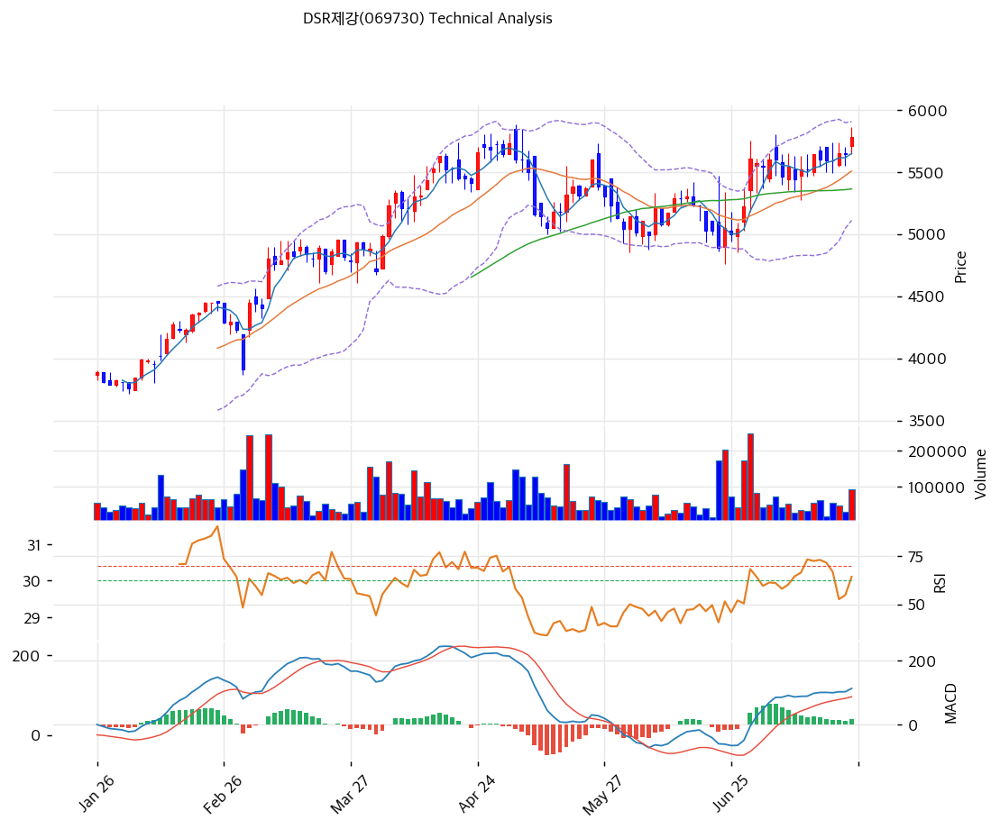

# DSR제강(069730) 기술적 분석

2026-07-24 | T2 Technical Analysis

---

## 차트

---

## 1. 가격 현황

| 항목 | 값 |
|------|-----|
| 현재가 | 5,780원 (+2.48%) |
| 52주 고가 | 5,780원 (**금일 신고가**) |
| 52주 저가 | 3,325원 |
| 52주 범위 위치 | 100.0% |
| 거래량 | 20일 평균 대비 1.30x |

---

## 2. 차트 패턴 분석

### 2.1 캔들스틱 패턴

| 패턴 | 위치 | 신뢰도 | 해석 |
|------|------|--------|------|
| 신고가 양봉 | 금일 | 중 | 4월 고점(5,730원) 돌파 — 과도한 갭 없이 완만한 경신 |
| 저점 높이는 양봉 우위 | 6월 말\~7월 | 중 | 조정 마무리 후 매수 우위 재개 |

### 2.2 가격 구조 패턴

- **컵 패턴 완성 (4월 고점 재돌파)** (신뢰도: 강)
  4월 고점 5,730원 → 5\~6월 조정 4,900원대(MA200 지지) → 7월 재돌파. 3개월 컵의 완성으로 목표가는 컵 깊이(약 800원)를 더한 6,500원 부근.

- **계단식 상승 추세** (신뢰도: 강)
  1월 3,800원부터 저점·고점을 함께 높이는 6개월 상승 — 급등 없이 MA20을 타고 오르는 건전한 기울기 (MA20 괴리 +4.9%).

- **볼린저 폭 14.4% — 과열 아님** (신뢰도: 중)
  같은 날 신고가를 쓴 KINX·가비아와 달리 밴드 폭·괴리율 모두 정상 범위 — 수급 이벤트가 아닌 추세형 신고가.

### 2.3 다이버전스

- **다이버전스 없음 — 동행 상승** (신뢰도: —)
  RSI 65.6·MACD 확대 모두 가격과 같은 방향. 과매수(70) 이전 구간이라 추세 여력 잔존.

### 2.4 패턴 종합 판단

컵 완성 + 계단식 추세 + 정상 범위의 지표 — 교과서적인 추세 지속형 신고가다. 4\~6월 조정에서 MA200(4,492원)이 지지로 확인됐고, 이번 돌파는 거래량 1.3x의 무리 없는 수준. 실적(2026Q1 증익)과 배당(7.4%)이 받치는 펀더멘털 동행형이라, 눌림이 나와도 얕게(5,400\~5,500원) 소화될 가능성이 높은 구도다.

---

## 3. 이동평균선 — 정배열 (건전한 강세)

| MA | 값 | 현재가 괴리율 | 위치 |
|----|-----|--------------|------|
| MA5 | 5,650원 | +2.3% | 위 |
| MA20 | 5,508원 | +4.9% | 위 |
| MA60 | 5,363원 | +7.8% | 위 |
| MA120 | 5,008원 | +15.4% | 위 |
| MA200 | 4,492원 | +28.7% | 위 |

**해석**: 완전 정배열에 MA20 괴리 +4.9% — 과열 없이 추세를 타는 이상적 배열이다. 단기 이평(MA5·20)이 촘촘히 따라붙어 눌림 시 지지 후보가 가깝다.

---

## 4. 보조 지표

### RSI(14) — 65.6 (중립 상단)

과매수(70) 직전 — 신고가 돌파 국면의 자연스러운 수준. 70 돌파 자체는 추세 강화 신호로 해석 가능.

### MACD(12,26,9)

| 항목 | 값 |
|------|-----|
| MACD | 112.0 |
| Signal | 96.0 |
| Histogram | +17.0 |
| 크로스 상태 | 매수 구간 (확대 중) |

**해석**: 7월 초 골든크로스 후 완만한 확대 — 급하지 않은 모멘텀이 오히려 지속성의 근거.

### 볼린저밴드(20, 2σ)

| 항목 | 값 |
|------|-----|
| 상단 | 5,905원 |
| 중단 (MA20) | 5,508원 |
| 하단 | 5,110원 |
| 밴드 폭 | 14.4% |
| 현재 위치 | 중간~상단 |

**해석**: 상단(5,905원)까지 여유가 있는 위치 — 상단 도달 전까지 추가 상승 여지, 상단 밀착 후에는 기간 조정 확률.

### 스토캐스틱(14, 3, 3)

| 항목 | 값 |
|------|-----|
| Slow %K | 76.0 |
| Slow %D | 71.8 |
| 크로스 상태 | 골든크로스 |
| 판단 | 중립 (과매수 접근) |

---

## 5. 지지/저항 — 추세선 · 피보나치 · PRZ 통합

### 5.1 피보나치 되돌림/확장

| 구분 | 비율 | 가격 | 현재가 대비 |
|------|------|------|-----------|
| Swing High | — | 5,730원 | -0.9% |
| 되돌림 | 0.786 | 5,550원 | -4.0% |
| 되돌림 | 0.618 | 5,409원 | -6.4% |
| 되돌림 | 0.5 | 5,310원 | -8.1% |
| 되돌림 | 0.382 | 5,211원 | -9.8% |
| 되돌림 | 0.236 | 5,088원 | -12.0% |
| Swing Low | — | 4,890원 | -15.4% |

※ 피보나치 기준: 직전 스윙(5,730→4,890원) — 신고가 돌파로 전 레벨이 하방 지지로 전환

### 5.2 추세선

| 추세선 | 방향 | 현재 교차가 | 포인트 수 | 해석 |
|--------|------|-----------|---------|------|
| 지지선 | 상승 | 5,184원 | 6개 | 1월 저점발 상승 추세선 — 중기 추세 유지선 |
| 저항선 | 상승 | 5,762원 | 6개 | 상승 채널 상단 — 금일 종가가 상단 소폭 돌파 |

### 5.3 PRZ (Potential Reversal Zone)

| 방향 | 가격 범위 | 신뢰도 | 근거 |
|------|---------|--------|------|
| 저항 | 5,880\~5,980원 | 약 | 피봇 R1·R2 |
| 지지 | 5,300\~5,550원 | **강** | MA20·MA60 + 피보나치 0.5/0.618/0.786 + 피봇 S1·S2 밀집 |
| 지지 | 4,492\~4,662원 | 중 | MA200 + 피보나치 확장 — 추세 붕괴 방어선 |

※ PRZ = 추세선 · 피보나치 · 피봇 · MA 등 복수 지표가 겹치는 가격 구간

### 5.4 종합 지지/저항 테이블

| 구분 | 가격 | 근거 |
|------|------|------|
| 저항 | 6,500원 | 컵 패턴 목표가 (측정치) |
| 저항 | 5,880\~5,980원 | PRZ(약) — 피봇 R1·R2 + 볼린저 상단 |
| **현재가** | **5,780원** | 신고가 — 상방 매물대 없음 |
| 지지 | 5,650원 | MA5 |
| 지지 | 5,508\~5,550원 | MA20 + 피보나치 0.786 |
| 지지 | 5,300\~5,410원 | PRZ(강) — MA60 + 피보나치 0.5/0.618 |
| 지지 | 5,184원 | 상승 추세선 |
| 지지 | 4,492\~4,662원 | PRZ(중) — MA200 (최후 방어선) |

---

## 6. 시그널 종합

| 지표 | 내용 | 시그널 |
|------|------|--------|
| **차트 패턴** | 컵 완성 + 계단식 추세 신고가 | 🟢 |
| 이동평균선 | 정배열, MA20 +4.9% (건전) | 🟢 |
| RSI | 65.6 — 중립 상단 | ⚪ |
| MACD | 매수 구간, 히스토그램 확대 | 🟢 |
| 볼린저밴드 | 중간~상단, 폭 14.4% | ⚪ |
| 스토캐스틱 | 골든크로스, K=76.0 | ⚪ |
| 거래량 | 1.30x — 무난한 동반 | ⚪ |

**종합 판단**: 🟢 매수 2개 / 🔴 매도 0개 / ⚪ 중립 4개 → **매수우위 (과열 없는 추세형 신고가)**

지표 구성이 이상적이다 — 추세는 정배열·컵 돌파로 확인되고, 과열 신호(RSI·괴리율·밴드)는 어디에도 없다. 배당 7.4%·PER 3.4x라는 펀더멘털 닻까지 감안하면 눌림의 깊이가 제한되는 구조로, 5,500원대 눌림은 매수 기회, 5,880\~5,980원(피봇 저항) 돌파 시 컵 목표가 6,500원이 다음 좌표다.

---

## 7. 전략 제안

### 보유 중인 경우
- **홀드 (추세 추종)**
- 익절 라인: 6,500원 (컵 패턴 목표가 — 분할 익절 시작점)
- 손절 라인: 5,180원 (상승 추세선 이탈 = 6개월 추세 훼손)
- 리스크/리워드: 약 1.2 (+720 / -600) — 배당 7.4%가 실질 하방 쿠션

### 진입 대기인 경우
- **눌림 분할 매수 우선**
- 1차 진입가: 5,500\~5,550원 (MA20 + 피보나치 0.786 — 통상 눌림 하단)
- 2차 진입가: 5,300\~5,410원 (PRZ 강 — MA60·피보나치 중첩)
- 진입 조건: 신고가 직후라 소폭 눌림 대기가 기본. 배당락(연말) 전 매집 관점이면 현재가 부분 진입도 수익률(7.4%)로 정당화 가능 — 5,880원 거래량 돌파 시 추세 추종 추가
