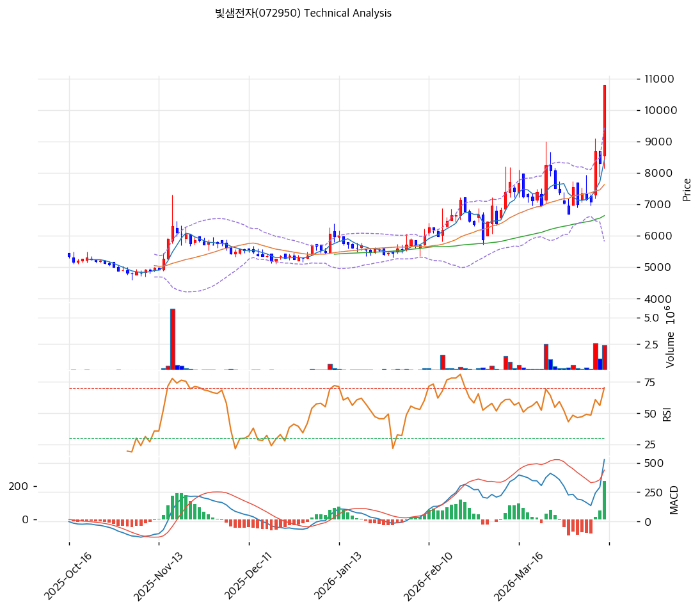

# 빛샘전자(072950) 기술적 분석

2026-04-10 | T2 Technical Analysis

---

## 차트

---

## 1. 가격 현황

| 항목 | 값 |
|------|-----|
| 현재가 | 10,790원 (+30.00%) |
| 52주 고가 | 10,790원 |
| 52주 저가 | 3,960원 |
| 52주 범위 위치 | 100.0% |
| 거래량 | 20일 평균 대비 4.32x |

---

## 2. 차트 패턴 분석

### 2.1 캔들스틱 패턴

| 패턴 | 위치 | 신뢰도 | 해석 |
|------|------|--------|------|
| 장대양봉 (상승 장악형) | 최근 1일 (2026-04-10) | 강 | 당일 상한가(+30%) 달성, 강력한 매수세 유입 시그널이나 단기 과열 주의 |
| 갭업 돌파 | 최근 1일 | 강 | 52주 신고가 갱신과 동시에 상한가, 추세 전환 또는 테마 수급 유입 가능성 시사 |

※ 주요 캔들 패턴: 망치형, 역망치형, 장악형(상승/하락), 도지, 샛별/석별, 적삼병/흑삼병, 하라미, 유성형, 교수형 등

### 2.2 가격 구조 패턴

- **52주 신고가 돌파 / 박스권 상단 이탈** (신뢰도: 강)
  현재가 10,790원이 52주 고가와 동일하며 상한가 달성으로 기존 저항선을 상향 돌파했다. 52주 저가(3,960원) 대비 172% 상승 구간에서의 신고가 돌파는 강한 추세 전환 신호이지만, 이전 고점 저항이 없는 영역이므로 다음 저항은 피봇 R1(11,670원) 및 R2(12,550원)가 된다.

- **가격 급등 이후 단기 변동성 확대 예상** (신뢰도: 강)
  상한가 달성 직후에는 차익 실현 매물과 추격 매수가 교차하는 구간이 형성된다. 피봇 S1(9,030원)과 MA20(7,626원)이 주요 되돌림 지지선으로 작동할 가능성이 높다.

### 2.3 다이버전스

- **RSI 상승 다이버전스 → 현재 과매수 구간 진입** (신뢰도: 중)
  직전 가격 저점 대비 RSI가 동반 상승하며 추세 전환을 선행했으나, 현재 RSI 71.3으로 과매수 구간에 진입해 단기 조정 압력이 잠재한다.

- **MACD 히스토그램 확대 지속** (신뢰도: 강)
  MACD(527) > Signal(296), 히스토그램 +230으로 매수 구간이 확대 중이다. 추세 지속 가능성을 지지하지만 히스토그램이 최고점에 가까울수록 모멘텀 둔화 가능성도 내포한다.

### 2.4 패턴 종합 판단

52주 신고가 상한가 달성이라는 강력한 상승 패턴이 형성됐으나, RSI 71.3 과매수와 볼린저밴드 상단 밀착이 단기 조정 신호를 동시에 내고 있다. MACD 히스토그램 확대와 4.32x 거래량 급등은 추세 지속을 지지하는 반면, 스토캐스틱 K=83.4의 과매수 구간 진입은 단기 차익 실현 압력으로 작용할 수 있다. 상충하는 시그널이 공존하는 구간으로, 추격 매수보다 되돌림 후 지지 확인이 전략적으로 유효하다.

---

## 3. 이동평균선 — 정배열 (강세)

| MA | 값 | 현재가 괴리율 | 위치 |
|----|-----|--------------|------|
| MA5 | 8,404원 | +28.4% | 위 |
| MA20 | 7,626원 | +41.5% | 위 |
| MA60 | 6,639원 | +62.5% | 위 |
| MA120 | 6,026원 | +79.1% | 위 |
| MA200 | 5,731원 | +88.3% | 위 |

**해석**: MA5→MA200 완전 정배열이 형성됐으며 현재가가 모든 이동평균선 위에 위치한다. 다만 MA5 대비 +28.4%, MA20 대비 +41.5% 괴리율은 단기 과열 수준이다. MA20(7,626원)과 MA60(6,639원)이 중기 조정 시 핵심 지지선으로 작동할 수 있다.

---

## 4. 보조 지표

### RSI(14) — 71.3 (🔴 과매수)

RSI 71.3으로 과매수 기준선(70)을 소폭 상회하고 있으며, 상한가 달성에 따른 추가 상승 압력과 단기 되돌림 압력이 교차하는 임계 구간이다.

### MACD(12,26,9)

| 항목 | 값 |
|------|-----|
| MACD | 527 |
| Signal | 296 |
| Histogram | +230 |
| 크로스 상태 | 매수 구간 (확대 중) |

**해석**: MACD가 시그널을 상회하며 히스토그램이 확대 중으로 단기 추세 모멘텀은 강하다. 다만 히스토그램이 고점 수준에 근접함에 따라 추가 확대 여력을 확인해야 한다.

### 볼린저밴드(20, 2σ)

| 항목 | 값 |
|------|-----|
| 상단 | 9,432원 |
| 중단 (MA20) | 7,626원 |
| 하단 | 5,820원 |
| 밴드 폭 | 47.4% |
| 현재 위치 | 상단 근접 (상단 대비 +14.4%) |

**해석**: 현재가 10,790원은 볼린저밴드 상단(9,432원)을 이탈해 밴드 외부에 위치한다. 밴드 폭 47.4%는 이미 확장 국면으로, 스퀴즈 이후 방향성 돌파가 진행 중이다. 밴드 상단 이탈은 강한 모멘텀의 신호이지만 단기 과열을 동반한다.

### 스토캐스틱(14, 3, 3)

| 항목 | 값 |
|------|-----|
| Slow %K | 83.4 |
| Slow %D | 59.6 |
| 크로스 상태 | 골든크로스 |
| 판단 | 과매수 |

---

## 5. 지지/저항

| 구분 | 가격 | 근거 |
|------|------|------|
| 저항 | 12,550원 | 피봇 R2 |
| 저항 | 11,670원 | 피봇 R1 |
| **현재가** | **10,790원** | 52주 신고가 = 현재가 |
| 지지 | 9,030원 | 피봇 S1 |
| 지지 | 8,404원 | MA5 |
| 지지 | 7,626원 | 피봇 중심(MA20) |
| 지지 | 7,270원 | 피봇 S2 |

---

## 6. 시그널 종합

| 지표 | 내용 | 시그널 |
|------|------|--------|
| **차트 패턴** | 52주 신고가 상한가, 강력 돌파 / 단기 과열 공존 | ⚪ |
| 이동평균선 | 완전 정배열, MA20 +41.5% 괴리 | 🟢 |
| RSI | 71.3 — 과매수 | 🔴 |
| MACD | 매수 구간, 히스토그램 확대 중 | 🟢 |
| 볼린저밴드 | 밴드 상단 이탈, 밴드 폭 47.4% 확장 | ⚪ |
| 스토캐스틱 | 골든크로스, K=83.4 과매수 | 🔴 |
| 거래량 | 4.32x — 강력 동반 | 🟢 |

**종합 판단**: 🟢 매수 3개 / 🔴 매도 3개 / ⚪ 중립 2개 → **중립 (단기 과열 경계)**

상한가+신고가 달성이라는 강력한 추세 신호에도 불구하고, RSI 과매수·스토캐스틱 과매수·볼린저밴드 상단 이탈이 동시에 발생해 단기 되돌림 리스크가 존재한다. MACD 매수 확대와 4.32배 거래량은 추세의 유효성을 지지하므로, 중기 관점에서는 매수 우위이나 당일 추격 진입은 리스크 대비 효율이 낮다. 되돌림 시 피봇 S1(9,030원)~MA5(8,404원) 구간의 지지 여부가 다음 상승 추세 지속의 핵심 확인 포인트다.

---

## 7. 전략 제안

### 보유 중인 경우
- **홀드**
- 익절 라인: 11,670원 (피봇 R1, 약 +8.2% 추가 여지)
- 손절 라인: 7,270원 (피봇 S2 이탈 시, -32.6%)
- 리스크/리워드: 1 : 0.25 (단기 추격 기준, 비효율적) → 기존 보유자는 홀드 유지

### 진입 대기인 경우
- **관망** (현재가 기준 추격 매수 비권장)
- 1차 진입가: 9,030원 (피봇 S1 지지 확인 후 — 되돌림 매수)
- 2차 진입가: 7,626원 (MA20 지지 확인 후 — 중기 매수)
- 진입 조건: 거래량 동반 하락 후 지지선 이탈 없이 반등 캔들 확인, 또는 상한가 이후 3~5일 안정화 후 재돌파 시 추격 진입 검토
