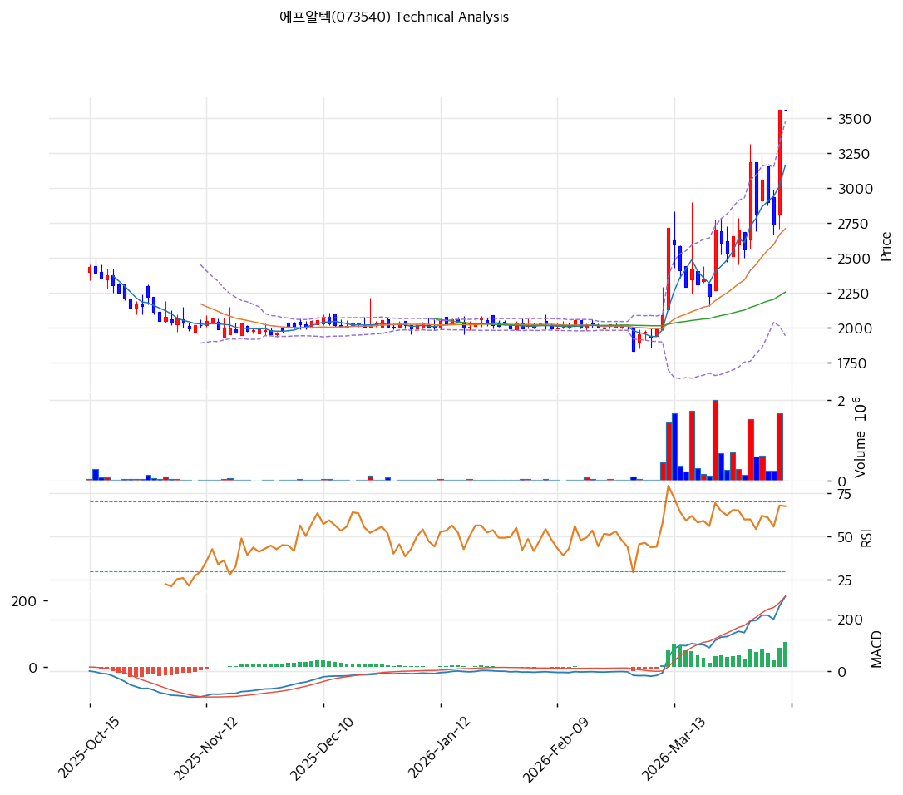

# 에프알텍(073540) 기술적 분석

2026-04-09 | T2 Technical Analysis

---

## 차트

---

## 1. 가격 현황

| 항목 | 값 |
|------|-----|
| 현재가 | 3,560원 (0.00%) |
| 52주 고가 | 3,560원 |
| 52주 저가 | 1,350원 |
| 52주 범위 위치 | 100.0% |
| 거래량 | 20일 평균 대비 0.0x (데이터 없음) |

---

## 2. 차트 패턴 분석

### 2.1 캔들스틱 패턴

| 패턴 | 위치 | 신뢰도 | 해석 |
|------|------|--------|------|
| 52주 신고가 돌파 | 최근 1일 | 강 | 상방 저항선 부재 — 추세 가속 시그널이나 과열 경계 동시 발생 |
| 상승 추세 지속 | 최근 20거래일 | 중 | MA5~MA200 전 구간 위 유지, 정배열 완성 |

※ 현재가가 52주 고가와 동일(3,560원) — 신고가 구간으로 전통적 저항선 데이터 없음

### 2.2 가격 구조 패턴

- **52주 신고가 구간 돌파 (신뢰도: 강)**
  현재가 3,560원은 52주 고가와 동일하여 기술적 저항선이 없는 상태다. 1,350원(52주 저가)에서 3,560원까지 +164% 상승한 추세가 진행 중이며, 명확한 상방 목표가를 기술적으로 산출하기 어렵다. 이전 고점(2021~2022년 구간) 데이터 및 피봇 분석이 필요하며, 피봇 포인트는 현재가와 동일하게 집계되어 실질적 저항 정보를 제공하지 못한다.

- **가파른 상승 채널 (신뢰도: 중)**
  MA20(2,711원) 대비 현재가 괴리율 +31.3%, MA60(2,257원) 대비 +57.7%는 단기 과열 구간 진입을 시사한다. 이동평균 수렴 시 2,711원(MA20) 지지 여부가 조정 깊이의 핵심 변수가 된다.

### 2.3 다이버전스

- **RSI 중립권 유지 (다이버전스 없음)** (신뢰도: 중)
  RSI(14) = 67.0으로 과매수(70) 직전 수준. 가격과 RSI가 동반 상승 중으로 현재까지 하락 다이버전스 미발생. 단, 70 돌파 후 가격 신고가 갱신에도 RSI가 하락하면 하락 다이버전스 경계 필요.

- **MACD 히스토그램 확대 (추세 지속 시사)** (신뢰도: 강)
  MACD(289) > Signal(213), 히스토그램 +76으로 확대 중. 추세 지속을 지지하는 구조이며 매수 모멘텀이 현재 감소 신호 없음.

### 2.4 패턴 종합 판단

캔들스틱(52주 신고가), 가격구조(정배열 상승 채널), MACD(히스토그램 확대)는 모두 추세 지속을 지지한다. 그러나 스토캐스틱 과매수(K=83.4)와 볼린저밴드 상단 밀착(현재가 3,560원 > 상단 3,478원)은 단기 과열 신호다. 상충하는 시그널이 공존하는 상황으로, 추가 상승보다 단기 조정 후 재진입 기회를 노리는 전략이 리스크 대비 효율적이다.

---

## 3. 이동평균선 — 정배열 (강세)

| MA | 값 | 현재가 괴리율 | 위치 |
|----|-----|--------------|------|
| MA5 | 3,165원 | +12.5% | 위 |
| MA20 | 2,711원 | +31.3% | 위 |
| MA60 | 2,257원 | +57.7% | 위 |
| MA120 | 2,162원 | +64.7% | 위 |
| MA200 | 2,148원 | +65.8% | 위 |

**해석**: MA5 → MA20 → MA60 → MA120 → MA200 완전 정배열 달성. 단기~장기 모든 이동평균선 위에서 거래되며 추세 강도는 강하다. 다만 MA20 괴리율 +31.3%는 단기 과열 수준으로, 통상 평균 회귀(mean reversion) 압력이 발생하는 구간이다. MA20(2,711원)은 1차 지지선, MA60(2,257원)은 중기 지지선으로 기능할 전망이다.

---

## 4. 보조 지표

### RSI(14) — 67.0 (중립)

RSI 67.0은 과매수 경계(70) 직전으로 상승 모멘텀이 강하게 유지되는 구간이다. 현재 중립으로 분류되나 70 돌파 시 과매수권 진입 경계가 필요하며, 추세 지속 시 RSI 70~80 구간의 강한 상승 속행도 가능하다.

### MACD(12,26,9)

| 항목 | 값 |
|------|-----|
| MACD | 289 |
| Signal | 213 |
| Histogram | +76 |
| 크로스 상태 | 매수 구간 (확대 중) |

**해석**: MACD가 Signal 위에 위치하며 히스토그램이 양수이고 확대 중. 매수 모멘텀이 강화되는 구조로 추세 지속을 지지한다.

### 볼린저밴드(20, 2σ)

| 항목 | 값 |
|------|-----|
| 상단 | 3,478원 |
| 중단 (MA20) | 2,711원 |
| 하단 | 1,944원 |
| 밴드 폭 | 56.6% |
| 현재 위치 | 상단 돌파 |

**해석**: 현재가 3,560원이 볼린저밴드 상단(3,478원)을 돌파한 상태다. 밴드 폭 56.6%는 이미 확장된 수준으로 추가 확장보다는 수축 가능성이 있다. 상단 돌파는 단기 강세 시그널이지만 중단(MA20 = 2,711원)으로의 되돌림 가능성을 내포한다.

### 스토캐스틱(14, 3, 3)

| 항목 | 값 |
|------|-----|
| Slow %K | 83.4 |
| Slow %D | 73.0 |
| 크로스 상태 | 골든크로스 |
| 판단 | 과매수 |

---

## 5. 지지/저항

| 구분 | 가격 | 근거 |
|------|------|------|
| 저항 | 3,560원 | 52주 고가 / 현재가 (신고가 구간, 기술적 저항 없음) |
| 저항 | 4,000원 | 심리적 라운드 넘버 저항 (추정) |
| **현재가** | **3,560원** | — |
| 지지 | 3,165원 | MA5 |
| 지지 | 2,711원 | MA20 / 볼린저밴드 중단 |
| 지지 | 2,257원 | MA60 |
| 지지 | 2,162원 | MA120 |

---

## 6. 시그널 종합

| 지표 | 내용 | 시그널 |
|------|------|--------|
| **차트 패턴** | 52주 신고가, 정배열 완성, MACD 히스토그램 확대 | 🟢 |
| 이동평균선 | 완전 정배열, MA20 괴리 +31.3% (과열 경계) | 🟢 |
| RSI | 67.0 — 과매수 직전 중립 | ⚪ |
| MACD | 매수구간, 히스토그램 +76 확대 | 🟢 |
| 볼린저밴드 | 상단 돌파(3,560 > 3,478), 밴드 폭 56.6% | ⚪ |
| 스토캐스틱 | 골든크로스, K=83.4 과매수 | 🔴 |
| 거래량 | 0.0x — 데이터 없음 | ⚪ |

**종합 판단**: 🟢 매수 3개 / 🔴 매도 1개 / ⚪ 중립 3개 → **매수 우위 (단기 과열 주의)**

현재 차트는 완전 정배열과 MACD 매수 구조로 중기 상승 추세가 유효하다. 단, 52주 신고가 구간에서 볼린저밴드 상단 돌파와 스토캐스틱 과매수가 동시에 발생하여 단기 조정 가능성이 있다. 거래량 데이터가 없어 돌파의 신뢰도 검증이 제한적인 점은 주의 요소다. 신규 진입보다 MA20(2,711원) 부근 되돌림 구간에서의 매수가 리스크 대비 효율적이다.

---

## 7. 전략 제안

### 보유 중인 경우

- **홀드 (부분 익절 고려)**
- 익절 라인: 4,000원 (심리적 라운드 넘버, 현재가 대비 +12.4%)
- 손절 라인: 3,165원 (MA5 이탈 시, 현재가 대비 -11.1%)
- 리스크/리워드: 1 : 1.1 (단기 기준) — 중기 보유 시 MA20(2,711원) 기준 R/R 개선

### 진입 대기인 경우

- **관망 후 조정 시 진입**
- 1차 진입가: 3,165원 (MA5 수렴 시, 현재가 대비 -11.1%)
- 2차 진입가: 2,711원 (MA20 지지 확인 시, 현재가 대비 -23.8%)
- 진입 조건: 거래량 동반 여부 확인 필수. 신고가 구간에서 거래량 없는 상승은 신뢰도 낮음. V사 수주 공시 또는 실적 개선 뉴스 동반 시 돌파 매수 가능
