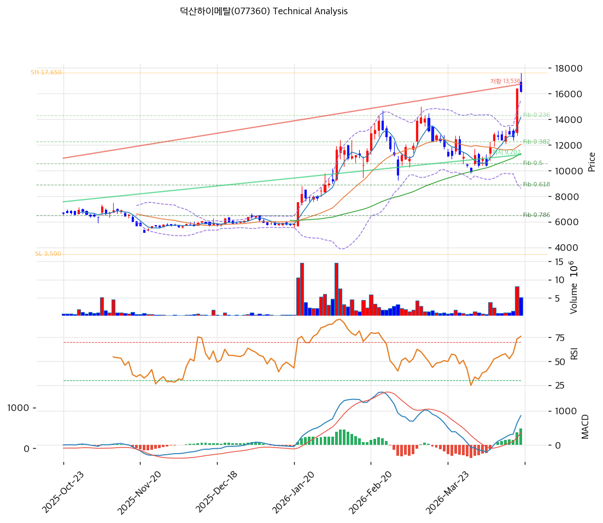

# 덕산하이메탈(077360) 기술적 분석

2026-04-17 | T2 Technical Analysis

---

## 차트

---

## 1. 가격 현황

| 항목 | 값 |
|------|-----|
| 현재가 | 16,180원 (-1.40%) |
| 52주 고가 | 16,410원 |
| 52주 저가 | 3,580원 |
| 52주 범위 위치 | 98.2% |
| 거래량 | 20일 평균 대비 3.45x |

---

## 2. 차트 패턴 분석

### 2.1 캔들스틱 패턴

| 패턴 | 위치 | 신뢰도 | 해석 |
|------|------|--------|------|
| 음봉 출현 | 최근 1일 (2026-04-17) | 약 | 52주 고가(16,410원) 근접 구간에서 단기 매도 압력 출현, 단독으로는 추세 전환 근거 미흡 |
| 고점권 장대양봉 연속 | 최근 5일 | 중 | 강한 상승 모멘텀 유지 중이나 거래량 3.45x 동반으로 단기 과열 주의 |

※ 주요 캔들 패턴: 52주 고가 대비 -1.4% 음봉으로 고점 저항 확인 가능성

### 2.2 가격 구조 패턴

- **상승 채널 — 52주 저점(3,580원) → 고점(16,410원) 급등** (신뢰도: 강)
  연간 기준 3,580원에서 16,410원까지 +358.4% 급등 후 현재 고점 권역에 위치. 52주 고가(16,410원)가 강한 저항선으로 작용 중이며, 이를 돌파하면 피보나치 확장 목표가(21,499원~23,055원)가 다음 저항이 된다. 현재 52주 고가에서 불과 -1.4% 하락한 상태로 돌파 시도가 진행 중이다.

- **볼린저밴드 상단 밀착 (신뢰도: 중)**
  현재가 16,180원이 볼린저 상단(15,491원)을 돌파하여 상단 위에 위치. 밴드 폭 57.2%로 이미 확장 국면이며, 추가 확장 시 강세 지속, 수렴 전환 시 단기 조정 신호.

### 2.3 다이버전스

- **RSI 상승 다이버전스 없음 — 현재 68.8로 가격 상승과 동조 중** (신뢰도: 해당없음)
  RSI 68.8로 가격 상승과 함께 동반 상승 중이며 다이버전스는 미발생. 70선 돌파 시 과매수 경계 구간 진입.

- **MACD 히스토그램 확대 — 상승 모멘텀 가속** (신뢰도: 중)
  MACD(859) > Signal(379), 히스토그램 +480으로 확대 중이며 하락 다이버전스 미발생. 모멘텀이 가속화되고 있으나 히스토그램이 수축 전환 시 주의.

### 2.4 패턴 종합 판단

현재 차트는 강한 상승 추세 내에서 52주 고가(16,410원) 저항 구간에 도달한 상황이다. 캔들스틱은 소폭 음봉으로 단기 저항을 확인 중이며, 가격 구조는 볼린저 상단 돌파 상태로 과열 신호가 혼재된다. MACD 히스토그램 확대와 정배열 이동평균은 중기 상승 추세를 지지하나, 스토캐스틱 과매수(K=86.3)와 52주 고가 저항이 단기 조정 가능성을 시사한다.

---

## 3. 이동평균선 — 정배열 (강세)

| MA | 값 | 현재가 괴리율 | 위치 |
|----|-----|--------------|------|
| MA5 | 14,160원 | +14.3% | 위 |
| MA20 | 12,048원 | +34.3% | 위 |
| MA60 | 11,330원 | +42.8% | 위 |
| MA120 | 8,720원 | +85.5% | 위 |
| MA200 | 7,228원 | +123.8% | 위 |

**해석**: 모든 이동평균선이 완전 정배열 상태로, 단기~장기 모두 강세 추세를 확인한다. 현재가가 MA200 대비 +123.8%로 과열 수준이나, 추세 상승 국면에서 MA가 이격 후 수렴하는 구조다. MA5(14,160원)가 가장 가까운 이동평균 지지선이며, MA20(12,048원)이 중기 지지로 기능하고 있다.

---

## 4. 보조 지표

### RSI(14) — 68.8 (중립)

RSI 68.8로 과매수 경계(70)에 근접하고 있으나, 아직 중립 구간 내에 있으며 추가 상승 여력이 소폭 남아 있다. 70 돌파 시 과매수 신호로 전환되며 단기 조정 가능성이 높아진다.

### MACD(12,26,9)

| 항목 | 값 |
|------|-----|
| MACD | 859 |
| Signal | 379 |
| Histogram | +480 |
| 크로스 상태 | 매수 구간 (확대 중) |

**해석**: MACD가 Signal 위에 위치하며 매수 구간이 유지되고 있고, 히스토그램이 +480으로 확대 중이어서 상승 모멘텀이 강화되고 있다. 히스토그램이 수축 전환되기 전까지 추세는 유효하다.

### 볼린저밴드(20, 2σ)

| 항목 | 값 |
|------|-----|
| 상단 | 15,491원 |
| 중단 (MA20) | 12,048원 |
| 하단 | 8,606원 |
| 밴드 폭 | 57.2% |
| 현재 위치 | 상단 근접 (상단 돌파) |

**해석**: 현재가(16,180원)가 볼린저 상단(15,491원)을 상향 돌파한 상태로, 강한 상승 모멘텀을 나타낸다. 밴드 폭 57.2%로 이미 충분히 확장된 상태이며, 과열 구간에서 스퀴즈 수렴 시 단기 되돌림 가능성이 있다.

### 스토캐스틱(14, 3, 3)

| 항목 | 값 |
|------|-----|
| Slow %K | 86.3 |
| Slow %D | 85.4 |
| 크로스 상태 | 골든크로스 |
| 판단 | 과매수 |

---

## 5. 지지/저항 — 추세선 · 피보나치 · PRZ 통합

### 5.1 피보나치 되돌림/확장

| 구분 | 비율 | 가격 | 현재가 대비 |
|------|------|------|-----------|
| Swing High | — | 17,650원 | — |
| 되돌림 | 0.236 | 14,311원 | -11.5% |
| 되돌림 | 0.382 | 12,245원 | -24.3% |
| 되돌림 | 0.5 | 10,575원 | -34.6% |
| 되돌림 | 0.618 | 8,905원 | -44.9% |
| 되돌림 | 0.786 | 6,528원 | -59.7% |
| Swing Low | — | 3,500원 | — |
| 확장 | 1.272 | 21,499원 | +32.9% |
| 확장 | 1.382 | 23,055원 | +42.5% |
| 확장 | 1.618 | 26,395원 | +63.1% |
| 확장 | 2.0 | 31,800원 | +96.5% |

※ 피보나치 기준: 상승 추세 (Swing Low 3,500원 → Swing High 17,650원)
※ 되돌림 = 직전 추세에서 되돌아온 비율, 확장 = 추세 방향 목표가

### 5.2 추세선

| 추세선 | 방향 | 현재 교차가 | 포인트 수 | 해석 |
|--------|------|-----------|---------|------|
| 지지선 | 상승 | 9,202원 | 6개 | 장기 상승 추세선. 현재가와의 괴리가 커서 즉각적 지지 역할보다는 추세 방향 확인용 |
| 저항선 | 상승 | 13,536원 | 6개 | 현재 현재가(16,180원)가 이미 저항선 상향 돌파 상태로 과거 저항이 지지로 전환 가능 |

### 5.3 PRZ (Potential Reversal Zone)

| 방향 | 가격 범위 | 신뢰도 | 근거 |
|------|---------|--------|------|
| 지지 | 14,160~14,311원 | 약 | MA5(14,160원) + 피보나치 0.236 되돌림(14,311원) |
| 지지 | 12,048~12,245원 | 약 | MA20(12,048원) + 피보나치 0.382 되돌림(12,245원) |

※ PRZ = 추세선 · 피보나치 · 피봇 · MA 등 복수 지표가 겹치는 가격 구간. 현재 PRZ는 모두 지지 방향으로 현재가 하방에 위치

### 5.4 종합 지지/저항 테이블

| 구분 | 가격 | 근거 |
|------|------|------|
| 저항 | 16,410원 | 52주 고가 — 강한 심리적 저항 |
| 저항 | 17,187원 | 피봇 R1 |
| **현재가** | **16,180원** | — |
| 지지 | 15,637원 | 피봇 S1 |
| 지지 | 15,093원 | 피봇 S2 |
| 지지 | 14,236원 | PRZ (약) — MA5 + 피보나치 0.236 되돌림 |
| 지지 | 13,536원 | 상승 저항선 돌파 후 지지 전환 |
| 지지 | 12,048원 | MA20 / PRZ (약) — MA20 + 피보나치 0.382 |
| 지지 | 11,330원 | MA60 |
| 지지 | 9,202원 | 상승 추세선 지지 (장기) |

---

## 6. 시그널 종합

| 지표 | 내용 | 시그널 |
|------|------|--------|
| **차트 패턴** | 52주 고가 돌파 시도 중, 볼린저 상단 돌파, 강한 상승 채널 | 🟢 |
| 이동평균선 | 완전 정배열, MA200 대비 +123.8% — 과열 경고 | 🔴 |
| RSI | 68.8 — 과매수 경계 근접, 아직 중립 | ⚪ |
| MACD | 매수구간, 히스토그램 +480 확대 중 | 🟢 |
| 볼린저밴드 | 상단 돌파, 밴드 폭 57.2% 확장 상태 | ⚪ |
| 스토캐스틱 | K=86.3, 골든크로스 — 과매수 | 🔴 |
| 거래량 | 3.45x — 강력 동반 | 🟢 |

**종합 판단**: 🟢 매수 3개 / 🔴 매도 2개 / ⚪ 중립 2개 → **매수우위**

현재 차트는 강한 상승 추세가 유지되고 있으나, 52주 고가(16,410원) 저항 구간에서 단기 소화 국면이 진행 중이다. MACD와 거래량은 강세를 지지하지만, 이동평균 과열과 스토캐스틱 과매수가 단기 조정 리스크를 나타낸다. 52주 고가 돌파 성공 시 다음 저항은 피봇 R1(17,187원) → 피보나치 확장 1.272(21,499원) 순이며, 돌파 실패 시 피봇 S1(15,637원) ~ PRZ(14,236원) 구간으로 조정 예상된다.

---

## 7. 전략 제안

### 보유 중인 경우
- **홀드**
- 익절 라인: 16,738원 (피봇 R1 17,187원 부근 또는 52주 고가 돌파 확인 후 추가 목표 설정)
- 손절 라인: 15,093원 (피봇 S2, 현재가 대비 -6.7%)
- 리스크/리워드: 익절(+3.4%) / 손절(-6.7%) = 약 0.5:1 (단기 기준)

### 진입 대기인 경우
- **관망** (현재 52주 고가 저항 구간, 단기 과열)
- 1차 진입가: 15,637원 (피봇 S1 — 52주 고가 돌파 실패 후 눌림목)
- 2차 진입가: 12,048원 (MA20 / PRZ 지지 구간 — 중기 추세 지지)
- 진입 조건: 52주 고가(16,410원) 거래량 동반 돌파 확인 시 신규 매수, 또는 피봇 S1 지지 확인 후 반등 시 진입
