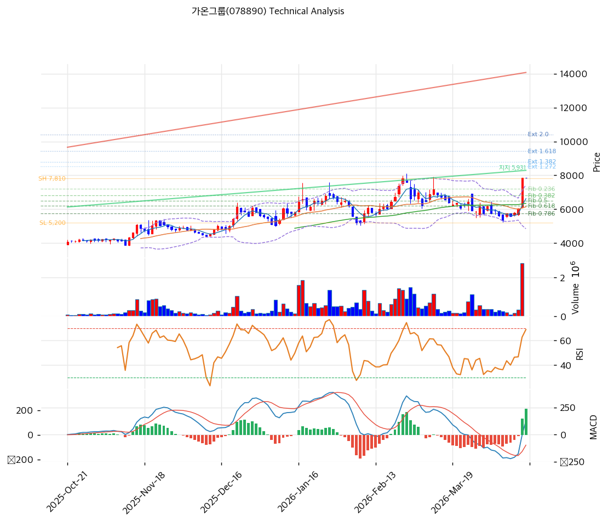

# 가온그룹(078890) 기술적 분석

2026-04-15 | T2 Technical Analysis

---

## 차트

---

## 1. 가격 현황

| 항목 | 값 |
|------|-----|
| 현재가 | 7,850원 (0.0%) |
| 52주 고가 | 7,850원 |
| 52주 저가 | 2,600원 |
| 52주 범위 위치 | 100.0% |
| 거래량 | 20일 평균 대비 데이터 미산출 |

---

## 2. 차트 패턴 분석

### 2.1 캔들스틱 패턴

| 패턴 | 위치 | 신뢰도 | 해석 |
|------|------|--------|------|
| 52주 신고가 갱신 | 2026-04-15 | 강 | 상승 모멘텀 지속 시그널 — 52주 저가(2,600원) 대비 약 3배 급등한 신고가 갱신으로 강한 매수세 확인 |
| 상단 밴드 밀착 | 최근 5일 | 중 | 볼린저밴드 상단(7,438원) 상방 이탈 구간 — 단기 과열 가능성, 되돌림 경계 |

※ 거래량 데이터 미수집으로 캔들 패턴 신뢰도 제한

### 2.2 가격 구조 패턴

- **상승 추세 채널** (신뢰도: 강)
  상승 지지선(현재 교차가 5,931원, 기울기 18.19)과 상승 저항선(9,253원, 기울기 37.09) 사이에서 6개 접촉점으로 형성된 상승 채널이 확인된다. 현재가(7,850원)는 채널 중단부에 위치하며 상단 저항선(9,253원)까지 약 17.9% 상승 여력이 남아 있다. 채널 하단(5,931원) 이탈 시 추세 약화 신호로 해석한다.

- **52주 신고가 돌파 후 저항→지지 전환 대기** (신뢰도: 중)
  현재가(7,850원)가 52주 고가와 일치하여 기존 저항이 지지로 전환되는 구간이다. 신고가 돌파가 거래량 동반 없이 이루어졌을 경우 일시적 되돌림 후 재도전 패턴이 나타날 수 있다.

### 2.3 다이버전스

- **RSI 상승 다이버전스 미확인** (신뢰도: 해당 없음)
  현재 RSI 66.7로 중립 구간이며, 52주 최고점 갱신과 RSI가 동반 상승 중이어서 명확한 하락 다이버전스는 감지되지 않는다.

- **MACD 강세 지속** (신뢰도: 중)
  MACD 127 > Signal -84, 히스토그램 +211로 강한 매수 구간에 있으며 히스토그램이 확대 중이다. 추세 지속성을 지지하는 시그널이나, 히스토그램 확대 속도가 둔화될 경우 매수세 약화의 조기 신호가 될 수 있다.

### 2.4 패턴 종합 판단

상승 채널 내 위치, MACD 매수 구간, 52주 신고가 갱신이 중단기 상승 추세를 지지한다. 다만 스토캐스틱이 과매수(K=82.5) 구간에 진입했고, 볼린저밴드 상단을 밀착·돌파한 상태여서 단기 되돌림(7,194~6,813원 피보나치 지지대) 가능성이 병존한다. 거래량 데이터가 없어 신고가 돌파의 신뢰도 판단에 한계가 있다.

---

## 3. 이동평균선 — 비정배열 (강세·단기 과열)

| MA | 값 | 현재가 괴리율 | 위치 |
|----|-----|--------------|------|
| MA5 | 6,624원 | +18.5% | 위 |
| MA20 | 6,143원 | +27.8% | 위 |
| MA60 | 6,346원 | +23.7% | 위 |
| MA120 | 5,611원 | +39.9% | 위 |
| MA200 | 4,778원 | +64.3% | 위 |

**해석**: 현재가가 5개 이동평균선 모두 위에 위치한 강세 배열이지만, **MA5 > MA60 > MA20 순서로 단기·중기선이 비정배열** 상태다. 현재가와 MA20의 괴리율이 +27.8%로 단기 과열 경계선에 도달해 있으며, MA200 대비 +64.3%의 극단적 괴리는 중기 되돌림 시 낙폭이 클 수 있음을 시사한다. MA20(6,143원)과 MA60(6,346원)이 주요 지지선으로 기능할 전망이다.

---

## 4. 보조 지표

### RSI(14) — 66.7 (중립)

RSI 66.7로 과매수(70) 직전 중립 구간에 위치하며, 단기 상승세가 지속되고 있으나 과매수 전환 직전의 경계 수준이다.

### MACD(12,26,9)

| 항목 | 값 |
|------|-----|
| MACD | 127 |
| Signal | -84 |
| Histogram | +211 |
| 크로스 상태 | 매수 구간 (확대 중) |

**해석**: MACD가 Signal을 상향 돌파한 매수 구간이며 히스토그램이 +211로 확대 중이어서 단기 상승 모멘텀이 유효하다.

### 볼린저밴드(20, 2σ)

| 항목 | 값 |
|------|-----|
| 상단 | 7,438원 |
| 중단 (MA20) | 6,143원 |
| 하단 | 4,848원 |
| 밴드 폭 | 42.1% |
| 현재 위치 | 상단 초과 |

**해석**: 현재가(7,850원)가 볼린저밴드 상단(7,438원)을 상방 이탈한 상태다. 밴드 폭 42.1%로 이미 확장 국면이며, 상단 이탈 후 중단(6,143원) 회귀 패턴이 발생할 수 있다.

### 스토캐스틱(14, 3, 3)

| 항목 | 값 |
|------|-----|
| Slow %K | 82.5 |
| Slow %D | 59.0 |
| 크로스 상태 | 골든크로스 |
| 판단 | 과매수 진입 |

---

## 5. 지지/저항 — 추세선 · 피보나치 · PRZ 통합

### 5.1 피보나치 되돌림/확장

| 구분 | 비율 | 가격 | 현재가 대비 |
|------|------|------|-----------|
| Swing High | — | 7,810원 | — |
| 되돌림 | 0.236 | 7,194원 | -8.4% |
| 되돌림 | 0.382 | 6,813원 | -13.3% |
| 되돌림 | 0.5 | 6,505원 | -17.1% |
| 되돌림 | 0.618 | 6,197원 | -21.1% |
| 되돌림 | 0.786 | 5,759원 | -26.6% |
| Swing Low | — | 5,200원 | — |
| 확장 | 1.272 | 8,520원 | +8.5% |
| 확장 | 1.382 | 8,807원 | +12.2% |
| 확장 | 1.618 | 9,423원 | +20.0% |
| 확장 | 2.0 | 10,420원 | +32.7% |

※ 피보나치 기준: 상승 추세 (Swing Low 5,200원 → Swing High 7,810원)
※ 되돌림 = 직전 추세에서 되돌아온 비율, 확장 = 추세 방향 목표가

### 5.2 추세선

| 추세선 | 방향 | 현재 교차가 | 포인트 수 | 해석 |
|--------|------|-----------|---------|------|
| 지지선 | 상승 | 5,931원 | 6개 | 장기 상승 채널 하단 — 이탈 시 중기 추세 약화 |
| 저항선 | 상승 | 9,253원 | 6개 | 장기 상승 채널 상단 — 돌파 시 목표가 상향 |

### 5.3 PRZ (Potential Reversal Zone)

| 방향 | 가격 범위 | 신뢰도 | 근거 |
|------|---------|--------|------|
| 지지 | 7,850원 | 강 | 피봇 R1·R2·S1·S2 집중 (현재가 = 52주 신고가) |
| 지지 | 6,505~6,624원 | 약 | 피보나치 0.5 되돌림 + MA5 |
| 지지 | 6,143~6,346원 | 중 | MA20 + 피보나치 0.618 + MA60 |
| 지지 | 5,611~5,759원 | 약 | MA120 + 피보나치 0.786 되돌림 |

### 5.4 종합 지지/저항 테이블

| 구분 | 가격 | 근거 |
|------|------|------|
| 저항 | 9,423원 | 피보나치 1.618 확장 / 추세선 저항 근접 |
| 저항 | 9,253원 | 상승 추세선 저항 (6접촉점) |
| 저항 | 8,807원 | 피보나치 1.382 확장 |
| 저항 | 8,520원 | 피보나치 1.272 확장 |
| **현재가** | **7,850원** | — (52주 신고가) |
| 지지 | 7,194원 | 피보나치 0.236 되돌림 |
| 지지 | 6,813원 | 피보나치 0.382 되돌림 |
| 지지 | 6,229원 | PRZ (중) — MA20 + 피보나치 0.618 + MA60 |
| 지지 | 5,931원 | 상승 추세선 지지 (6접촉점) |
| 지지 | 5,685원 | PRZ (약) — MA120 + 피보나치 0.786 |

---

## 6. 시그널 종합

| 지표 | 내용 | 시그널 |
|------|------|--------|
| **차트 패턴** | 상승 채널 내 신고가 갱신, 볼린저밴드 상단 돌파 | ⚪ |
| 이동평균선 | 비정배열 — 5선 전부 하방, MA20 괴리 +27.8% | 🟢 (추세) / 🔴 (과열) |
| RSI | 66.7 — 중립 (과매수 경계) | ⚪ |
| MACD | 매수 구간, 히스토그램 +211 확대 중 | 🟢 |
| 볼린저밴드 | 상단(7,438원) 초과, 밴드 폭 42.1% | ⚪ |
| 스토캐스틱 | 골든크로스, K=82.5 과매수 | 🔴 |
| 거래량 | 데이터 미수집 | ⚪ |

**종합 판단**: 🟢 매수 1개 / 🔴 매도 2개 / ⚪ 중립 4개 → **매도우위 (단기 과열)**

중기 상승 추세는 유효하나 단기 기술적 지표가 과열을 경고하고 있다. 스토캐스틱 과매수, 볼린저밴드 상단 이탈, MA20 대비 +27.8% 괴리가 겹쳐 단기 조정 리스크가 높다. 7,194~6,813원(피보나치 0.236~0.382 되돌림) 구간이 1차 되돌림 지지대이며, 중기 추세를 유지하려면 5,931원(상승 추세선) 위에서 매수세가 재유입되어야 한다.

---

## 7. 전략 제안

### 보유 중인 경우
- **비중축소 검토**
- 익절 라인: 8,520원 (피보나치 1.272 확장 / 단기 저항)
- 손절 라인: 7,194원 (피보나치 0.236 되돌림 이탈 시)
- 리스크/리워드: 약 1:0.84 (단기 과열로 비대칭 불리)

### 진입 대기인 경우
- **관망 → 조정 시 분할 진입**
- 1차 진입가: 7,194원 (피보나치 0.236 지지 + PRZ 확인 후)
- 2차 진입가: 6,229원 (PRZ 중 — MA20·피보나치 0.618·MA60 집중)
- 진입 조건: 거래량 동반 반등 확인, 스토캐스틱 과매수 해소 후
