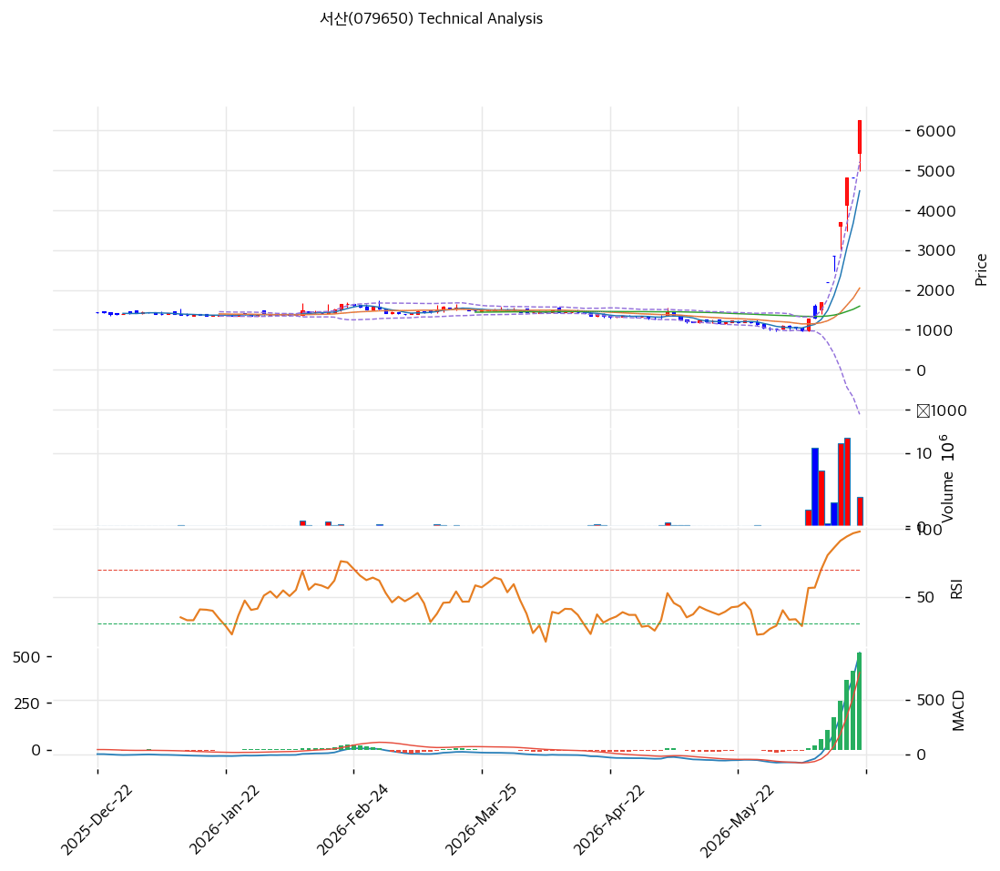

# 서산(079650) 기술적 분석

2026-06-22 | T2 Technical Analysis

---

## 차트

---

## 1. 가격 현황

| 항목 | 값 |
|------|-----|
| 현재가 | 6,250원 (+29.80%, 상한가) |
| 52주 고가 | 6,250원 (당일 = 신고가) |
| 52주 저가 | 979원 |
| 52주 범위 위치 | 100% (저점 대비 6.4배) |
| 거래량비 | 1.68x |
| RSI | **95.8 (극단 과매수 🔴🔴)** |

> 🚨 저점(979원)에서 **약 6.4배 수직 폭등**, 당일 +29.8% 상한가로 52주 신고가. **MA20 대비 +205%·MA200 대비 +302%·RSI 95.8·스토캐 K=100**의 사실상 측정 한계치 과열. 7거래일 중 6일 상한가의 포물선(parabolic) 블로우오프. 펀더 무관·투자경고·거래정지 이력. **기술적으로 가장 위험한 국면.**

---

## 2. 차트 패턴 분석

### 2.1 구조·캔들

| 패턴 | 위치 | 신뢰도 | 해석 |
|------|------|--------|------|
| 수직 포물선 급등 | 979→6,250 | 높음 | 블로우오프 톱 |
| 연속 상한가(점상) | 6일/7거래일 | 높음 | 세력성 수급 |
| 극단 이격 | MA200 +302% | 높음 | 붕괴 시 낙폭 거대 |

- **블로우오프 톱(parabolic blow-off)** (신뢰도: 높음): 수직 급등은 통계적으로 급락으로 종결되는 경우가 많다. 이격(MA20 +205%)이 극단.
- **품절주 점상 상한가** (신뢰도: 높음): 유통물량 극소로 적은 매수에 점상 상한가, 반대로 매도 전환 시 연속 하한가 위험.

### 2.2 다이버전스

- **극단 과매수 — 반락 임박 신호** (신뢰도: 중상): RSI 95.8·스토캐 100/100(데드크로스). 가격은 신고가이나 지표가 한계치 → 단기 반락 위험 매우 높음.

---

## 3. 이동평균선 — 측정 한계 수준의 이격

| MA | 값 | 괴리율 | 위치 |
|----|-----|--------|------|
| MA5 | 4,487 | +39.3% | 위 |
| MA20 | 2,048 | +205.3% | 위 |
| MA60 | 1,594 | +292.0% | 위 |
| MA120 | 1,518 | +311.6% | 위 |
| MA200 | 1,555 | +302.0% | 위 |

**해석**: 🚨 현재가가 MA20 대비 +205%, MA200 대비 +302%로 **정상 범위를 한참 벗어난 극단 이격**이다. 불과 20일 전 주가가 \~2,000원이었다(현재 6,250원). 이런 이격은 평균회귀(mean reversion) 압력이 극단적으로 강하며, **이론적 되돌림 목표(MA20 2,048원)는 현재가 대비 -67%**다. 정배열(aligned)도 깨진 수직 급등.

---

## 4. 보조 지표

### RSI(14) — 95.8 (극단 과매수 🔴🔴)
거의 측정 상한. 역사적으로 RSI 95+는 급락 직전 신호인 경우가 많다.

### MACD(12,26,9)
| MACD | Signal | Hist | 크로스 |
|---|---|---|---|
| 931 | 412 | +519 | 매수(확산) |

급등으로 매수·확산이나, 급등 막바지의 과열 수치. 모멘텀 꺾임 시 급반전.

### 볼린저밴드(20,2σ)
| 상단 | 중단 | 하단 | 밴드폭 |
|---|---|---|---|
| 5,217 | 2,048 | -1,122 | **309.5%** |

밴드폭 309.5%(하단이 음수)는 변동성이 통계적으로 폭발했음을 의미. 현재가는 상단(5,217)마저 돌파. 정상 밴드로 수렴 시 중단(2,048) 방향 되돌림.

### 스토캐스틱
| %K | %D | 판단 |
|---|---|---|
| 100.0 | 100.0 | 극단 과매수(데드크로스) |

측정 상한(100). 데드크로스로 단기 반락 신호.

---

## 5. 지지/저항

| 구분 | 가격 | 근거 |
|------|------|------|
| 저항 | 7,691 | 피보 1.272 확장 |
| 저항 | 6,677 | 피봇 R1 |
| **현재가** | **6,250** | 상한가·신고가 |
| 지지 | 5,397 | 피봇 S1 |
| 지지 | 5,000 | 피보 0.236 |
| 지지 | 4,543 | 피봇 S2·전략 SL |
| 지지 | 4,226 | 피보 0.382 |
| 지지 | 3,601 | 피보 0.5 |
| 지지 | 2,976 | 피보 0.618 |
| 지지 | 2,086 | 피보 0.786 |
| 지지 | 2,048 | MA20 |
| 지지 | 1,594 | MA60 |

> 위쪽은 측정 불가(신고가·매물 공백), 아래쪽 지지는 멀고 성기다. 급락 시 피보 0.5(3,601)·0.618(2,976)·MA20(2,048)까지 단계적으로 열린다 — 즉 **하방 잠재 낙폭이 -42%~-67%**에 이른다.

---

## 6. 시그널 종합

| 지표 | 내용 | 시그널 |
|------|------|--------|
| 차트 패턴 | 수직 블로우오프 | 🔴 |
| 이동평균선 | 극단 이격(+302%) | 🔴 |
| RSI | 95.8 극단 과매수 | 🔴 |
| MACD | 매수(확산) | 🟢 |
| 볼린저밴드 | 상단 돌파·밴드폭 310% | 🔴 |
| 스토캐스틱 | 100/100 과매수 | ⚪ |
| 거래량 | 1.68x | ⚪ |

**종합 판단**: 🟢 매수 1개 / 🔴 매도 3개(극단 과열) / ⚪ 중립 3개 → **매도 우위 (블로우오프 톱)**

🚨 모든 추세 지표가 측정 한계의 과열을 가리킨다. RSI 95.8·MA200 +302%·스토캐 100·밴드폭 310%는 **포물선 급등의 정점**에서 나타나는 전형적 패턴이다. MACD 매수는 급등의 후행일 뿐이다. 펀더 무관·투자경고·거래정지·회사 "사유 없음" 공시까지 겹쳐, **기술적으로 추격은 극히 위험**하다. 보유자는 비중 축소, 신규는 절대 추격 금지.

---

## 7. 전략 제안

### 보유 중인 경우
- **비중 축소 (블로우오프 대응)**
- 급등주 정점에서는 분할 익절·트레일링 스톱이 원칙. 음봉·상한가 풀림 시 즉시 비중 축소.
- 손절: 4,543원(피봇 S2) 이탈 시. 연속 하한가 시 유동성 부족으로 탈출 곤란 유의.

### 진입 대기인 경우
- **추격 금지 (회피)**
- 🚨 RSI 95.8·MA200 +302%·투자경고·거래정지 구간에서 신규 진입은 권장하지 않음.
- 굳이 본다면: 급등이 완전히 진정되고(상한가 풀림·거래 정상화) 펀더(1Q 흑전 지속·실적)가 확인된 뒤, 자산가치(BPS 3,495원)에 근접한 깊은 조정에서만 검토. 그 전까지 관망.
