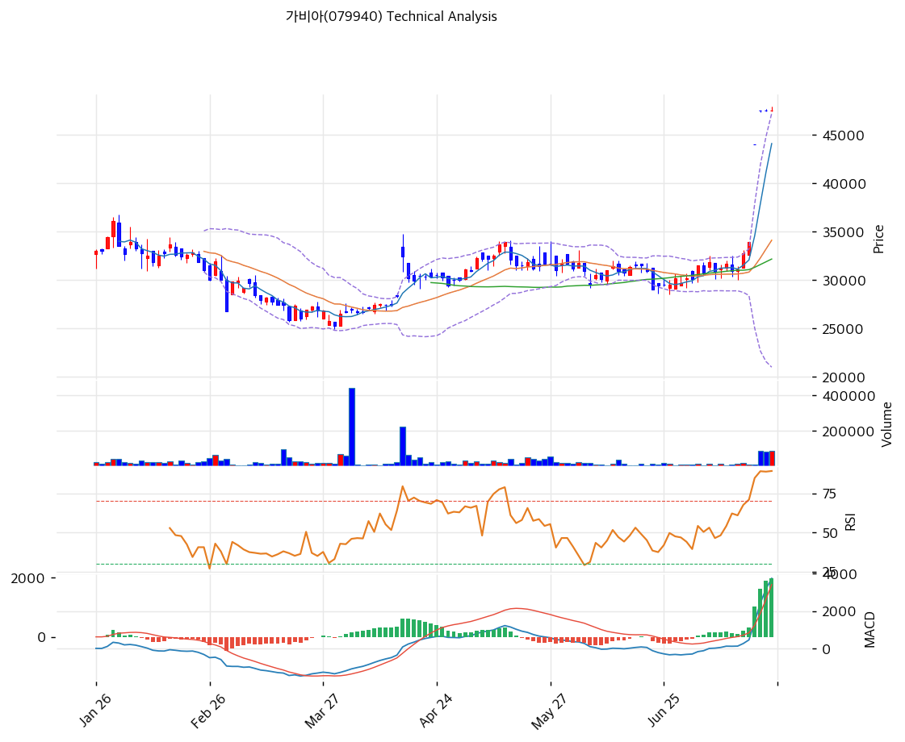

# 가비아(079940) 기술적 분석

2026-07-24 | T2 Technical Analysis

---

## 차트

---

## 1. 가격 현황

| 항목 | 값 |
|------|-----|
| 현재가 | 47,550원 (+0.11%) |
| 52주 고가 | 47,550원 (**신고가 — 최근 3거래일 약 +50% 급등**) |
| 52주 저가 | 22,750원 |
| 52주 범위 위치 | 100.0% |
| 거래량 | 20일 평균 대비 4.66x |

---

## 2. 차트 패턴 분석

### 2.1 캔들스틱 패턴

| 패턴 | 위치 | 신뢰도 | 해석 |
|------|------|--------|------|
| 3연속 장대양봉 (수직 급등) | 최근 3거래일 | 강 | 30,000원대 박스를 단숨에 이탈 — 적삼병 형태이나 기울기가 지속 불가능한 수준 |
| 금일 소폭 양봉 (+0.11%) | 당일 | 중 | 급등 후 첫 숨고르기 — 상승 정체 신호 |

### 2.2 가격 구조 패턴

- **6개월 박스권 상방 이탈** (신뢰도: 강)
  4\~7월 30,000\~33,000원 박스를 거래량 4.66x와 함께 돌파 — 구조적으로는 유효한 돌파. 다만 돌파 후 되돌림 없이 3일 만에 +50%를 간 것이 문제로, 돌파선(33,000원)과 현재가의 갭이 과도하다.

- **수직 급등(파라볼릭) 국면** (신뢰도: 강)
  일봉이 볼린저 상단(47,223원) 밖에서 형성 — 파라볼릭 구간은 추세가 아니라 이벤트(수급) 국면으로, 기울기 유지가 불가능해 시간·가격 조정이 필연이다.

### 2.3 다이버전스

- **다이버전스 없음 — 지표 총동원 상승** (신뢰도: —)
  RSI 86.4·스토캐스틱 99 — 측정 가능한 최상단. 다이버전스를 논할 단계가 아니라 과매수 해소가 선결 과제인 구간.

### 2.4 패턴 종합 판단

'유효한 박스 돌파'와 '지속 불가능한 기울기'가 공존한다. KINX 신고가 랠리(자회사 지분가치)와 외국인 집중 매수가 만든 이벤트성 수직 상승으로, 기술적 관점의 관심사는 방향이 아니라 **되돌림의 깊이**다 — 1차 되돌림 목표는 피보나치 0.236(41,847원), 건전한 조정의 하단은 0.382\~0.5(38,102\~35,075원)이며, 돌파선(33,000원 부근)까지 밀리면 돌파 자체가 무효화된다.

---

## 3. 이동평균선 — 정배열 (극단 과열)

| MA | 값 | 현재가 괴리율 | 위치 |
|----|-----|--------------|------|
| MA5 | 44,100원 | +7.8% | 위 |
| MA20 | 34,115원 | +39.4% | 위 |
| MA60 | 32,175원 | +47.8% | 위 |
| MA120 | 30,958원 | +53.6% | 위 |
| MA200 | 30,426원 | +56.3% | 위 |

**해석**: 정배열이지만 MA20 괴리 +39.4%는 통계적 극단값 — 과열 기준(20%)의 2배다. 이 갭은 시간(횡보) 또는 가격(하락)으로 반드시 수렴하며, 급등주의 경험칙상 MA5(44,100원) 이탈이 단기 피크아웃의 첫 신호가 된다.

---

## 4. 보조 지표

### RSI(14) — 86.4 (🔴 과매수)

극단 과매수 — 80 이상은 연중 최고 수준. 추세 강도의 증거인 동시에 신규 진입 금지 신호.

### MACD(12,26,9)

| 항목 | 값 |
|------|-----|
| MACD | 3,749 |
| Signal | 1,770 |
| Histogram | +1,979 |
| 크로스 상태 | 매수 구간 (확대 중) |

**해석**: 급등을 그대로 반영한 확대 — 모멘텀 자체는 살아 있으나 히스토그램 피크아웃 여부를 매일 확인해야 하는 구간.

### 볼린저밴드(20, 2σ)

| 항목 | 값 |
|------|-----|
| 상단 | 47,223원 |
| 중단 (MA20) | 34,115원 |
| 하단 | 21,007원 |
| 밴드 폭 | 76.8% |
| 현재 위치 | 상단 밖 |

**해석**: 밴드 폭 76.8%로 폭발적 확장 — 상단 밖 가격은 통계적 이상 상태로 수일 내 밴드 안 복귀(눌림)가 정상 경로다.

### 스토캐스틱(14, 3, 3)

| 항목 | 값 |
|------|-----|
| Slow %K | 99.0 |
| Slow %D | 99.4 |
| 크로스 상태 | 데드크로스 (최상단에서) |
| 판단 | 과매수 — 단기 하락 전환 신호 |

---

## 5. 지지/저항 — 추세선 · 피보나치 · PRZ 통합

### 5.1 피보나치 되돌림/확장

| 구분 | 비율 | 가격 | 현재가 대비 |
|------|------|------|-----------|
| Swing High | — | 47,900원 | +0.7% |
| 되돌림 | 0.236 | 41,847원 | -12.0% |
| 되돌림 | 0.382 | 38,102원 | -19.9% |
| 되돌림 | 0.5 | 35,075원 | -26.2% |
| 되돌림 | 0.618 | 32,048원 | -32.6% |
| 되돌림 | 0.786 | 27,739원 | -41.7% |
| Swing Low | — | 22,250원 | -53.2% |
| 확장 | 1.272 | 54,877원 | +15.4% |
| 확장 | 1.382 | 57,698원 | +21.3% |
| 확장 | 1.618 | 63,752원 | +34.1% |

※ 피보나치 기준: 상승 추세 (Swing Low 22,250원 → Swing High 47,900원)

### 5.2 추세선

| 추세선 | 방향 | 현재 교차가 | 포인트 수 | 해석 |
|--------|------|-----------|---------|------|
| 지지선 | 상승 | 28,196원 | 6개 | 3월 저점발 — 중기 추세의 마지노선 (원거리) |
| 저항선 | 상승 | 36,183원 | 6개 | 급등으로 채널 상단을 +31% 이탈 — 채널 복귀가 곧 조정 |

### 5.3 PRZ (Potential Reversal Zone)

| 방향 | 가격 범위 | 신뢰도 | 근거 |
|------|---------|--------|------|
| 저항 | 47,183\~48,083원 | 강 | 피봇 4개 밀집 — 현재가 정체 구간 |
| 지지 | 41,847원 | 참고 | 피보나치 0.236 — 1차 되돌림 목표 |
| 지지 | 34,115\~35,075원 | 참고 | MA20 + 피보나치 0.5 — 건전 조정의 하단 |

※ PRZ = 추세선 · 피보나치 · 피봇 · MA 등 복수 지표가 겹치는 가격 구간

### 5.4 종합 지지/저항 테이블

| 구분 | 가격 | 근거 |
|------|------|------|
| 저항 | 54,877원 | 피보나치 1.272 확장 (급등 연장 시 1차 목표) |
| 저항 | 47,900\~48,083원 | 스윙 고점 + 피봇 R2 |
| **현재가** | **47,550원** | 신고가 — 상방 매물대 없음 |
| 지지 | 44,100원 | MA5 (단기 추세 유지선) |
| 지지 | 41,847원 | 피보나치 0.236 |
| 지지 | 38,102원 | 피보나치 0.382 |
| 지지 | 34,115\~35,075원 | MA20 + 피보나치 0.5 |
| 지지 | 32,048\~33,000원 | 피보나치 0.618 + 박스 상단 (돌파 무효화선) |

---

## 6. 시그널 종합

| 지표 | 내용 | 시그널 |
|------|------|--------|
| **차트 패턴** | 박스 돌파 유효 + 파라볼릭 과열 | 🟢 (구조) / 🔴 (과열) |
| 이동평균선 | 정배열, MA20 +39.4% | 🟢 (추세) / 🔴 (과열) |
| RSI | 86.4 — 과매수 | 🔴 |
| MACD | 매수 구간, 확대 | 🟢 |
| 볼린저밴드 | 상단 밖, 폭 76.8% | ⚪ |
| 스토캐스틱 | 최상단 데드크로스, K=99.0 | 🔴 |
| 거래량 | 4.66x — 강력 동반 | 🟢 |

**종합 판단**: 🟢 매수 3개 / 🔴 매도 3개 / ⚪ 중립 1개 → **중립 (강한 추세 vs 극단 과열의 충돌)**

구조(박스 돌파·정배열·거래량)는 강세, 상태(RSI 86·스토캐스틱 99·MA20 +39%)는 위험 — 전형적인 급등 정점권의 신호 충돌이다. 이런 구간의 규율은 단순하다: **신규 매수는 금지, 보유자는 MA5(44,100원) 이탈을 1차 경계선으로 트레일링.** 되돌림이 피보나치 0.382\~0.5(38,100\~35,100원)에서 멈추고 거래량이 마르면 그때가 두 번째 기회다.

---

## 7. 전략 제안

### 보유 중인 경우
- **트레일링 스탑 (추격 익절)**
- 익절 라인: 54,877원 (피보나치 1.272 확장 — 급등 연장 시), MA5(44,100원) 이탈 시 절반 익절
- 손절 라인: 41,800원 (피보나치 0.236 이탈 = 급등분 완전 반납 개시)
- 리스크/리워드: 급등 정점권 — 신규 리스크 대비 잔여 리워드 불리

### 진입 대기인 경우
- **관망 (파라볼릭 추격 절대 금지)**
- 1차 진입가: 38,100\~41,800원 (피보나치 0.236\~0.382 되돌림 + 거래량 소강 확인)
- 2차 진입가: 34,100\~35,100원 (MA20 + 피보나치 0.5 — 건전 조정 완성 구간)
- 진입 조건: 되돌림 후 외국인 순매수 재개 + KINX 주가의 동반 지지 확인. 33,000원(박스 상단) 이탈 시 진입 논리 자체를 폐기
