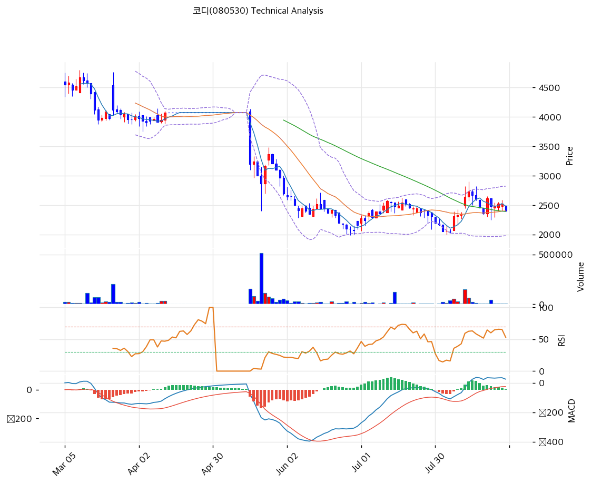

# 코디(080530) 기술적 분석

## 차트

⚠️ **이 차트를 읽을 때 두 가지를 먼저 알아야 한다.**

**첫째, 2026년 4월 16일에 액면병합(5:1)이 있었다.** 아래 모든 가격은 병합 후 기준으로 소급 조정된 값이다. 2025년 8월의 6,895원은 당시 실제로는 1,379원이었다.

**둘째, 2026년 4월 14일부터 5월 15일까지 22거래일간 매매거래가 정지됐다.** 이 구간은 거래량 0에 4,075원이 그대로 채워져 있으므로, 아래 모든 지표는 **거래량이 0보다 큰 날만 골라 다시 계산했다.**

## 가격 현황

| 항목 | 값 |
|---|---|
| 현재가 | **2,400원** (**-4.95%**) |
| 당일 시가 / 고가 / 저가 | 2,495 / 2,495 / 2,395원 |
| 52주 고 / 저 | **6,895원** (2025-08-28) / **1,995원** (2026-06-26) |
| **52주 위치** | **8.3%** |
| 고점 대비 | **-65.2%** |
| RSI(14) | 47.7 (중립) |
| MACD | 25 / 21 / **+3** (전 +14, 축소) |
| Stochastic | K=32.0 D=48.2 (데드크로스) |
| 볼린저(20) | 상단 2,824 / 중단 2,403 / 하단 1,983, 폭 **35.0%** |
| **거래량** | **6,500주** (20일 평균 대비 **0.25배**) |
| 회전율 | **0.059%** (20일 평균 0.234%) |

## 수익률

| 기간 | 수익률 | 당시 가격 |
|---|--:|--:|
| 1개월 | **+2.8%** | 2,335원 |
| 3개월 | **-22.6%** | 3,100원 |
| 6개월 | **-52.8%** | 5,080원 |
| **1년** | **-72.7%** | **8,805원** |
| **2년** | **-75.0%** | **9,585원** |

⚠️ **2년간 75% 빠졌다.** 이 구간에 액면병합이 있었으므로 병합 후 기준으로 환산한 값이다.

## 이동평균선

| MA | 가격(원) | 갭 | 위치 |
|---|--:|--:|---|
| MA5 | 2,485 | -3.4% | 아래 |
| **MA20** | **2,403** | **-0.1%** | 아래 |
| **MA60** | **2,394** | **+0.3%** | 위 |
| MA120 | 3,331 | **-28.0%** | 아래 |
| MA200 | 4,234 | **-43.3%** | 아래 |

→ **MA20(2,403)과 MA60(2,394)이 9원 차이로 붙어 있고 현재가가 그 위에 걸쳐 있다.** 단기·중기선은 수렴했으나 MA120·MA200은 각각 28.0%·43.3% 위에 있다.

**단기는 바닥을 다지고 있으나 장기 추세는 여전히 하락**이라는 뜻이다.

## 주가 경로

| 일자 | 종가 | 등락 | 거래량 | 비고 |
|---|--:|--:|--:|---|
| **2025-08-28** | 6,895원(장중) | | | **52주 최고** |
| 2026-04-13 | 4,075원 | | 33,547 | 병합 전 마지막 거래일 |
| 2026-04-14 ~ 05-15 | — | | **0** | **매매거래정지 (22거래일)** |
| **2026-05-18** | **3,200원** | **-21.5%** | **155,133** | **변경상장 첫날** |
| 2026-05-21 | 2,870원 | | 512,204 | |
| **2026-06-26** | **1,995원(장중)** | | | **52주 최저 · 자사주 소각일** |
| 2026-08-03 | 2,055원 | | 24,749 | 8월 저점 |
| 2026-08-10 | 2,350원 | | 8,858 | **제17회 BW 전액 상환 공시** |
| **2026-08-11** | **2,640원** | **+12.3%** | **150,914** | **20일 평균의 6배** |
| 2026-08-12 | 2,730원 | +3.4% | 62,909 | **장중 2,900원** |
| 2026-08-21 | 2,485원 | -5.2% | 46,078 | |
| 2026-08-27 | **2,400원** | **-4.95%** | 6,500 | |

**세 가지가 눈에 띈다.**

**① 변경상장 첫날 21.5% 빠졌다.** 병합 전 마지막 거래일 종가 4,075원에서 재개 첫날 3,200원으로 시작했다. 액면병합의 목적이 "적정 유통주식수 유지를 통한 주가안정화"였는데 결과는 반대였다.

**② 52주 최저 1,995원이 자사주 소각일(6/26)에 나왔다.** 소각 규모가 발행주식의 0.27%에 그쳐 재료가 되지 못했다.

**③ 8월 11일 +12.3%는 BW 전액 상환 공시 다음날이다.** 8월 10일 제17회 BW 잔액이 0원이 됐다는 공시가 나왔고, 다음 거래일 거래량이 150,914주로 20일 평균의 6배가 됐다. 오버행 소멸이 유일하게 시장이 반응한 재료였다.

다만 8월 12일 장중 2,900원을 찍은 뒤 다시 내려와 지금 2,400원이다. **재료의 수명이 이틀이었다.**

## 유동성

| 항목 | 수치 |
|---|--:|
| 8/27 거래량 | **6,500주** |
| 8/27 거래대금 | **약 1,560만원** |
| 20일 평균 거래량 | **25,853주** |
| 20일 평균 거래대금 | **약 6,400만원** |
| 발행주식수 | 11,071,684주 |
| **20일 평균 회전율** | **0.234%** |
| 외국인 20일 순매수 | **-17,900주** |
| **기관 20일 순매수** | **0주** |

⚠️ **하루 거래대금이 6,400만원이다.** 1,000만원어치를 사려면 그날 거래의 15%를 혼자 차지해야 한다.

**기관 20일 순매수가 정확히 0주다.** 20거래일 동안 기관이 사지도 팔지도 않았다는 뜻이다. 외국인은 17,900주를 팔았다.

## 시그널 종합

| 구분 | 카운트 |
|---|--:|
| 매수 | 0 |
| 매도 | 0 |
| 중립 | 6 |
| **결론** | **방향성 없음** |

- ⚪ **이동평균** MA20·MA60에 걸쳐 있으나 MA120·MA200은 멀리 위에 있다
- ⚪ **RSI 47.7** 중립
- ⚪ **MACD** 25 > 시그널 21이나 히스토그램이 +14에서 **+3**으로 축소 중
- ⚪ **볼린저** 중단(2,403) 근처. 밴드 폭 35.0%로 여전히 넓다
- ⚪ **스토캐스틱** 데드크로스, K=32.0
- 🔴 **거래량 0.25배** 20일 평균의 4분의 1

**여섯 개 지표가 모두 중립이다.** 위로도 아래로도 힘이 없는 상태이며, 8월 11\~12일의 반등이 소멸한 뒤 거래량이 다시 말랐다.

## 지지·저항

| 구분 | 가격(원) | 근거 |
|---|--:|---|
| 저항 | 3,280 | 당일 상한가 |
| 저항 | **3,044** | **피보나치 0.786 되돌림** |
| 저항 | **2,900** | **8/12 장중 고가** |
| 저항 | 2,824 | 볼린저 상단 |
| 저항 | 2,530 | 피봇 R2 |
| 저항 | 2,485 | MA5 / 피봇 R1(2,465) |
| **현재가** | **2,400** | |
| **지지** | **2,394\~2,403** | **MA60 · MA20 (9원 차)** |
| 지지 | 2,365 | 피봇 S1 |
| 지지 | 2,330 | 피봇 S2 |
| **강 지지** | **1,983\~2,055** | **볼린저 하단 · 8월 저점** |
| **최종 지지** | **1,995** | **52주 최저 (2026-06-26)** |
| 참고 | **2,885** | **주당 순유동자산 (현재가의 1.20배)** |

※ 피보나치는 하락 추세 기준(고점 6,895원 → 저점 1,995원). 0.236 되돌림이 5,739원, 0.5가 4,445원으로 현재가에서 너무 멀어 실용성이 낮다

⚠️ **MA20(2,403)과 MA60(2,394)이 사실상 한 줄이다.** 이 자리를 지키면 바닥 다지기가 이어지고, 깨지면 2,055원(8월 저점)과 1,995원(52주 최저)까지 지지가 비어 있다.

**주당 순유동자산 2,885원**은 기술적 저항이 아니라 밸류에이션 기준선이지만, 현재가보다 20% 높다는 점에서 참고할 만하다.

## 전략

| 시나리오 | 액션 |
|---|---|
| 보유자 | **홀드** (SL 2,330원 피봇 S2 이탈) |
| 신규 진입 | **대기.** 현재가 진입 근거 부족 |
| 진입 검토 구간 | **1,995\~2,100원** (52주 저점, -13\~17%) |
| 반등 확인 조건 | **2,900원 돌파 + 거래량 5만주 이상** |
| 손절 기준 | 1,995원 이탈 |
| 이벤트 | **11월 중순 3분기 보고서** |

⚠️ **어떤 매매든 분할 지정가여야 한다.** 20일 평균 거래대금이 6,400만원이므로 시장가 주문은 호가를 크게 밀어낸다.

## 핵심 판단

차트가 말하는 것은 **하락이 끝났는지 확인되지 않은 바닥권 횡보**다.

52주 위치 8.3%, 고점 대비 -65.2%, 1년 -72.7%다. 하락 폭 자체는 충분히 크지만 그것이 바닥의 근거는 아니다.

**긍정 신호는 두 가지다.** MA20(2,403)과 MA60(2,394)이 수렴해 현재가가 그 위에 걸쳐 있고, 8월 3일 저점 2,055원이 6월 26일 저점 1,995원보다 높다. 저점이 조금씩 올라오고 있다.

**부정 신호는 세 가지다.** MA120(3,331)과 MA200(4,234)이 28.0%·43.3% 위에 있어 장기 추세는 여전히 아래를 향한다. MACD 히스토그램이 +14에서 +3으로 줄어 8월 반등의 힘이 빠졌다. 그리고 거래량이 20일 평균의 0.25배로 말랐다.

**8월 11\~12일 반등이 이 종목의 성격을 보여준다.** 제17회 BW 전액 상환이라는 명확한 재료에 거래량이 20일 평균의 6배로 터졌고 이틀간 16.2% 올랐다. 그리고 이틀 만에 되돌려졌다. **재료가 있으면 움직이지만 유지할 물량이 없다.**

**핵심은 유동성이다.** 20일 평균 거래대금 6,400만원, 기관 20일 순매수 0주다. 이 종목의 자산가치(주당 순유동자산 2,885원)가 시장가격(2,400원)보다 높다는 사실은 계산상 명백하지만, 그것을 사줄 매수 주체가 시장에 없다.

**보유자는 홀드, 신규는 대기가 맞다.** 진입한다면 1,995\~2,100원 구간이 손익비에 맞고, 반등을 확인하려면 8월 12일 장중 고가 2,900원을 거래량 5만주 이상으로 넘어야 한다. 2,330원(피봇 S2)이 깨지면 52주 저점 재테스트로 봐야 한다.
